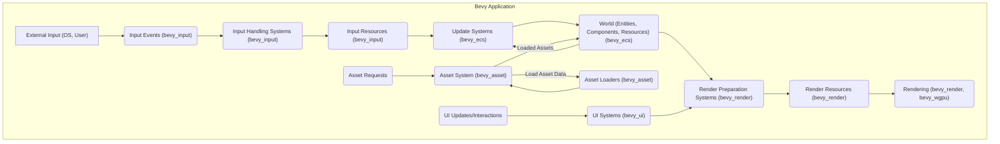
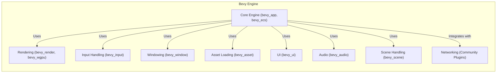
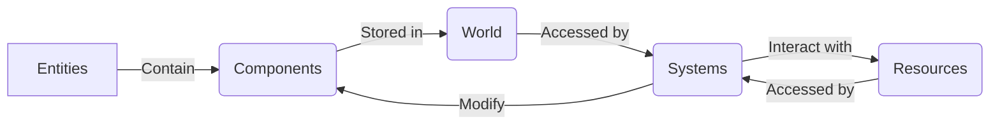

## Project Design Document: Bevy Engine

**Version:** 1.1
**Date:** October 26, 2023
**Author:** AI Software Architect

### 1. Introduction

This document provides a detailed architectural design overview of the Bevy game engine. Its purpose is to clearly articulate the system's components, their interactions, and the flow of data. This detailed design will serve as the foundation for subsequent threat modeling activities, enabling a comprehensive security analysis of the Bevy engine.

### 2. Project Overview

Bevy is a modern, data-driven game engine built using the Rust programming language. It emphasizes simplicity, performance, and modularity, making it suitable for a wide range of game development projects. Bevy's core design is based on the Entity Component System (ECS) architecture, which promotes flexible and maintainable game logic through composition.

### 3. Goals

* **High Performance:** Achieve optimal performance through efficient use of system resources and leveraging Rust's performance characteristics.
* **Extensible Modularity:** Design a highly modular architecture, allowing developers to select and integrate only the necessary features for their projects.
* **Data-Oriented Design:** Fully embrace the ECS paradigm for creating flexible, scalable, and maintainable game logic.
* **Developer Ergonomics:** Provide a user-friendly and intuitive API and development experience for game creators.
* **Cross-Platform Compatibility:** Support deployment across various platforms, including desktop, web (via WebAssembly), and potentially mobile.

### 4. Target Audience

The primary target audience for Bevy comprises game developers of all skill levels, from hobbyists to industry professionals, who seek a performant, modern, and data-driven game engine for their projects. This includes programmers, designers, and artists involved in game creation.

### 5. Architecture Overview

Bevy's architecture is fundamentally structured around the Entity Component System (ECS). The core engine provides the foundational ECS framework, while distinct, loosely coupled modules (implemented as Rust crates) extend its capabilities with specific functionalities. This modular design allows developers to tailor the engine to their needs, including only the required features. The engine's architecture promotes separation of concerns, making it easier to understand, maintain, and reason about its security aspects.

### 6. Key Components

* **Core Engine (`bevy_app`, `bevy_ecs`):**
    * **App Builder (`bevy_app`):**  Provides the entry point for constructing and managing the game application instance. It handles the game loop lifecycle, plugin registration, and global resource management.
    * **World (`bevy_ecs`):** The central repository for all game data, containing entities, their associated components, and global resources. It acts as the single source of truth for the game state.
    * **Entity (`bevy_ecs`):** A unique identifier representing a game object. Entities are lightweight and serve as containers for components.
    * **Component (`bevy_ecs`):** Data associated with an entity, defining its attributes and properties. Components are simple data structures without behavior.
    * **System (`bevy_ecs`):** Functions that operate on entities based on their component composition. Systems implement the game's logic and can modify components, create/destroy entities, and interact with resources.
    * **Resource (`bevy_ecs`):** Singleton data instances accessible by systems. Resources represent global state, configuration settings, or shared data.
    * **Schedule (`bevy_app`):** Defines the execution order of systems within the game loop stages, ensuring predictable and controlled execution flow.
    * **Event System (`bevy_app`, `bevy_ecs`):** A mechanism for decoupled communication between systems, allowing them to broadcast and react to events without direct dependencies.

* **Rendering (`bevy_render`, `bevy_wgpu`, `bevy_core_pipeline`):**
    * **Render Graph (`bevy_render`):** A declarative system for defining the rendering pipeline, specifying the sequence of rendering passes and their dependencies.
    * **Render Resources (`bevy_render`):** Manages GPU-accessible data like buffers, textures, and samplers used during rendering.
    * **Render Systems (`bevy_render`):** Systems responsible for preparing and submitting rendering commands to the GPU based on the game state.
    * **WGPU Integration (`bevy_wgpu`):** Utilizes the `wgpu` crate as a platform-agnostic abstraction layer for interacting with the GPU's graphics API (Vulkan, Metal, DirectX, Browser WebGPU).
    * **Shader Handling (`bevy_render`):** Manages the loading, compilation, and management of shader programs written in WGSL (WebGPU Shading Language).
    * **Core Pipeline (`bevy_core_pipeline`):** Provides a set of commonly used rendering passes and functionalities, such as forward rendering, deferred rendering (potentially), and post-processing effects.

* **Input Handling (`bevy_input`):**
    * **Input Events (`bevy_input`):** Captures and processes raw user input events from various sources like keyboard, mouse, touch, and gamepads.
    * **Input States (`bevy_input`):** Tracks the current state of input devices, such as key presses, mouse cursor position, and gamepad button states.
    * **Input Maps (`bevy_input`):** Allows developers to define mappings between raw input events and abstract game actions, providing a layer of indirection.

* **Windowing (`bevy_window`):**
    * **Window Creation and Management (`bevy_window`):** Provides functionalities for creating, configuring, and managing application windows.
    * **Window Events (`bevy_window`):** Handles operating system-level window events, such as resizing, focus changes, and close requests.

* **Asset Loading (`bevy_asset`):**
    * **Asset System (`bevy_asset`):** Manages the loading, caching, and hot-reloading of various game assets, including textures, models, audio files, and scenes.
    * **Asset Loaders (`bevy_asset`):** Implementations for parsing and loading specific asset file formats (e.g., PNG, glTF, WAV).
    * **Asset Caching (`bevy_asset`):** Stores loaded assets in memory to avoid redundant loading and improve performance.

* **UI (`bevy_ui`):**
    * **UI Tree (`bevy_ui`):**  Manages the hierarchical structure of UI elements.
    * **Layout System (`bevy_ui`):**  Calculates the position and size of UI elements based on layout properties.
    * **Styling (`bevy_ui`):**  Allows applying visual styles to UI elements using a CSS-like syntax.
    * **Interaction Handling (`bevy_ui`):**  Manages user interactions with UI elements, such as clicks and hovers.

* **Audio (`bevy_audio`):**
    * **Audio Playback (`bevy_audio`):** Provides functionalities for playing and controlling audio sources.
    * **Audio Resources (`bevy_audio`):** Manages loaded audio assets and audio output devices.

* **Scene Handling (`bevy_scene`):**
    * **Scene Serialization and Deserialization (`bevy_scene`):** Enables saving and loading the state of the game world (entities and their components) to and from files.
    * **Scene Spawning (`bevy_scene`):** Instantiates entities and their associated components from scene data.

* **Networking (Typically via Community Plugins):**
    * While not a core module, networking capabilities are often added through community-developed plugins. These plugins handle network connections, data serialization/deserialization, and communication protocols (e.g., TCP, UDP, WebSockets).

### 7. Data Flow

The fundamental data flow within Bevy is driven by the ECS architecture and the game loop:

* **Initialization:** The application starts, core engine components are initialized, global resources are loaded, and initial entities and components are created, often based on loaded scenes or initial game setup.
* **Game Loop Execution:** The engine enters its main loop, which iterates through defined stages:
    * **Event Processing:**  Operating system events (window events, input events) and application-specific events are processed and dispatched.
    * **Input Handling Stage:** Input events are processed by input systems, updating input resources with the current state of input devices.
    * **Update Stage:**  The core of the game logic execution. Systems are executed in the order defined by the schedule. Systems query the `World` for entities matching specific component combinations. They then perform operations on these entities and their components, potentially modifying component data, creating or deleting entities, and interacting with global resources.
    * **Render Stage:** Systems prepare data for rendering based on the current state of entities and components. This involves calculating transformation matrices, updating mesh data, and preparing rendering resources.
    * **Rendering Submission:** The `bevy_render` module utilizes the render graph to orchestrate the rendering process. Render systems submit rendering commands to the GPU via the `wgpu` abstraction layer.
    * **Post-Processing (Optional):**  Rendering passes can be added to perform post-processing effects on the rendered image.
* **Asset Loading Flow:** When an asset is requested by a system or resource, the `bevy_asset` system checks its internal cache. If the asset is not cached, the appropriate asset loader is invoked to load the asset data from its source (e.g., disk, network). The loaded asset is then stored in the cache for future use.
* **UI Data Flow:** Changes in the game state or user interactions trigger updates in the UI system. The layout system recalculates the positions and sizes of UI elements. The rendering system then uses this information to draw the UI.

### 8. Security Considerations

This section outlines potential security considerations based on Bevy's architecture. This serves as an initial assessment for more in-depth threat modeling.

* **Asset Loading (`bevy_asset`):**
    * **Malicious Assets:** Loading assets from untrusted sources poses a significant risk. Exploitable vulnerabilities in asset loaders (e.g., image parsers, model loaders) could lead to:
        * **Code Execution:**  Crafted assets could exploit vulnerabilities to execute arbitrary code within the engine's process.
        * **Buffer Overflows:**  Maliciously sized or structured asset data could cause buffer overflows, leading to crashes or potential code execution.
        * **Denial of Service:**  Loading extremely large or complex assets could exhaust system resources (memory, CPU), leading to application crashes or unresponsiveness.
    * **Supply Chain Attacks:** Compromised asset repositories or build pipelines could introduce malicious assets into the development process.

* **Input Handling (`bevy_input`):**
    * **Input Injection:** Vulnerabilities in input handling could allow attackers to inject malicious input events, potentially leading to:
        * **Exploitation of Game Logic:** Triggering unintended game actions or bypassing intended mechanics.
        * **Denial of Service:**  Flooding the engine with excessive input events, causing performance degradation or crashes.

* **Rendering (`bevy_render`, `bevy_wgpu`):**
    * **Shader Exploits:** Maliciously crafted shader code (WGSL) could potentially:
        * **Crash the Application:**  Exploiting driver bugs or causing GPU errors.
        * **Information Disclosure:**  Reading data from unintended memory locations on the GPU (though generally mitigated by GPU memory management).
        * **Denial of Service:**  Overloading the GPU with computationally intensive shaders.
    * **Resource Exhaustion:**  Submitting excessive or improperly sized rendering resources could lead to GPU memory exhaustion and crashes.

* **Networking (Community Plugins):**
    * **Data Tampering:** If networking is involved, insecure communication channels could allow attackers to intercept and modify network traffic.
    * **Unauthorized Access:** Lack of proper authentication and authorization mechanisms could allow unauthorized clients to connect and interact with game servers.
    * **Denial of Service:** Network-based attacks (e.g., SYN floods) could overwhelm server resources and disrupt gameplay.
    * **Man-in-the-Middle Attacks:**  Without secure communication protocols, attackers could intercept and potentially modify communication between clients and servers.

* **Plugin System (Potential Future Risk):**
    * **Malicious Plugins:** If Bevy were to formally support external plugins, untrusted plugins could introduce vulnerabilities or malicious code into the engine.

* **Resource Management (`bevy_ecs`, `bevy_render`, etc.):**
    * **Resource Exhaustion:**  Bugs or vulnerabilities in resource management could lead to memory leaks or excessive resource consumption, resulting in denial of service.

* **Dependencies:**
    * **Vulnerable Dependencies:** Bevy relies on numerous third-party Rust crates. Security vulnerabilities in these dependencies could indirectly impact Bevy's security. Regular dependency audits and updates are crucial.

### 9. Technologies Used

* **Rust:** The primary programming language, providing memory safety and performance.
* **WGPU:** A safe and portable GPU abstraction library implementing the WebGPU standard.
* **Cargo:** Rust's build system and package manager for dependency management.
* **WGSL (WebGPU Shading Language):** The shading language used for GPU programming in Bevy.
* **Various Rust Crates:** Bevy leverages a rich ecosystem of Rust libraries for various functionalities, including but not limited to: `winit` (window creation), `raw-window-handle` (low-level window access), `bytemuck` (safe memory transmutation), and many more.

### 10. Deployment Model

Bevy is primarily used as a library that game developers integrate into their Rust projects. The final game application is compiled and distributed for the target platform. For web deployments, Bevy applications can be compiled to WebAssembly using tools like `wasm-pack`.

### 11. Diagrams

#### 11.1. High-Level Component Architecture

#### 11.2. Simplified ECS Data Flow

### 12. Future Considerations

* **Granular Component Security Analysis:** A more detailed security analysis of individual components within each module could reveal specific vulnerabilities.
* **Formal Plugin Security Model:** If a formal plugin system is developed, a robust security model will be crucial, including mechanisms for plugin verification and sandboxing.
* **Network Security Best Practices:** As networking becomes more integrated, adhering to established network security best practices will be essential.
* **Regular Security Audits:** Periodic security audits and penetration testing can help identify and address potential vulnerabilities.
* **Security-Focused Development Practices:** Incorporating security considerations throughout the development lifecycle, including secure coding practices and threat modeling for new features.
