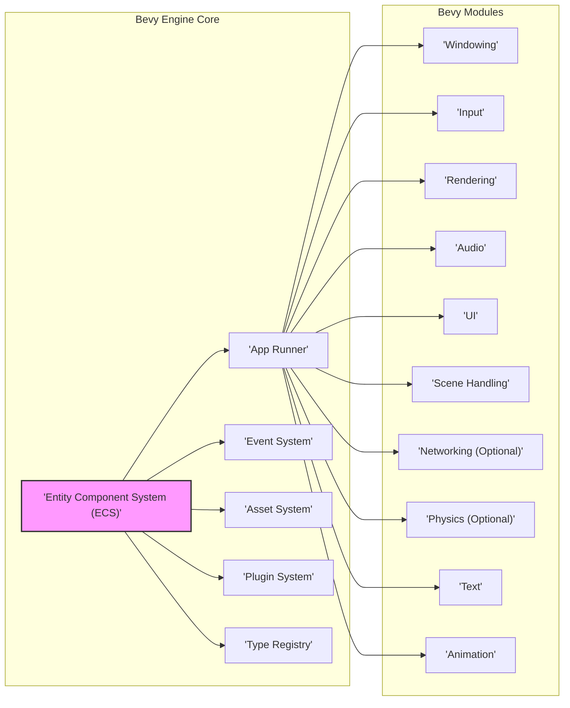
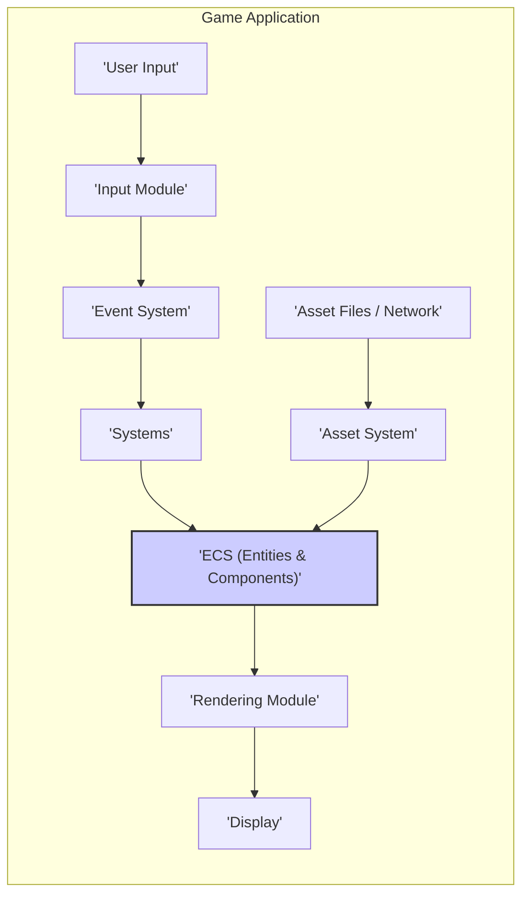
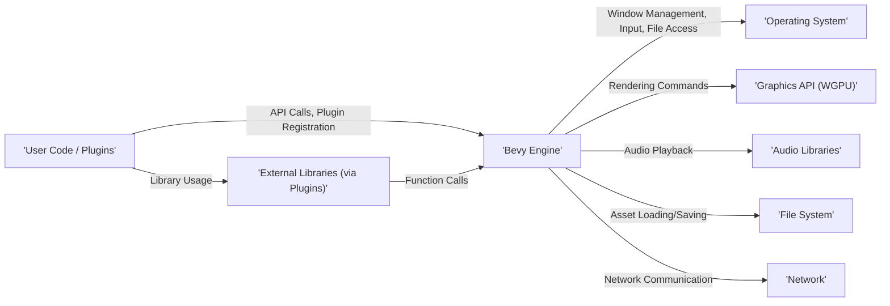

# Project Design Document: Bevy Engine

**Version:** 1.1
**Date:** October 26, 2023
**Author:** AI Software Architect

## 1. Introduction

This document provides an enhanced, high-level design overview of the Bevy game engine. Bevy is a refreshingly simple data-driven game engine built in Rust, emphasizing clarity and performance. This document details the key architectural components, data flow, and external interactions of Bevy to facilitate comprehensive threat modeling activities. It aims to provide a robust understanding of the system's structure and functionalities, creating a solid foundation for identifying potential security vulnerabilities.

## 2. Goals and Objectives

The overarching goals of the Bevy engine are to be:

* **Data-Driven:**  Fundamentally built upon an Entity Component System (ECS) architecture, promoting flexibility, composition, and performance.
* **Modular:** Designed with a strong emphasis on independent, reusable modules, allowing for targeted functionality and easier maintenance.
* **Performant:**  Leveraging the speed and memory safety of Rust to deliver efficient and reliable game execution.
* **Ergonomic:** Offering a developer-friendly and intuitive API that simplifies the game development process.
* **Community-Driven:** Fostering an active and collaborative open-source community to drive innovation and growth.

For the specific purpose of this design document and subsequent threat modeling, the primary objective is to thoroughly delineate the system's boundaries, data flow pathways, and interaction points with both internal and external entities. This detailed understanding is crucial for the effective identification and mitigation of potential security risks.

## 3. System Architecture

Bevy's architecture is fundamentally organized around the Entity Component System (ECS) pattern. This paradigm structures game data into three primary concepts:

* **Entities:** Unique identifiers that represent distinct game objects or concepts within the application.
* **Components:** Data structures associated with entities, defining their specific attributes, properties, and state.
* **Systems:** Functions that operate on collections of entities based on the presence or absence of specific components, orchestrating game logic and behavior.

Beyond the core ECS framework, Bevy incorporates a set of well-defined modules, each responsible for managing specific aspects of game development functionality.

### 3.1. Key Components

* **Entity Component System (ECS):** The central data management and processing mechanism of Bevy.
    * **Entity Management:** Responsible for the creation, modification, and deletion of entities, ensuring unique identification and efficient tracking.
    * **Component Storage:** Stores and retrieves component data associated with entities, optimized for fast access and iteration by systems.
    * **System Scheduling:**  Orchestrates the execution of systems, managing dependencies and ensuring efficient parallelization where possible.
* **App Runner:**  Manages the main application lifecycle and execution loop.
    * **Loop Management:** Controls the game loop, including updating game state, rendering frames, and handling events.
    * **Stage Management:** Defines distinct stages within the game loop (e.g., update, pre-render, render) to control the order of system execution.
* **Event System:**  Provides a decoupled communication mechanism between different parts of the engine and user-defined code.
    * **Event Dispatching:** Allows systems and other components to publish events that signal occurrences within the application.
    * **Event Handling:** Enables systems to subscribe to specific event types and react accordingly when those events are dispatched.
* **Asset System:**  Manages the loading, caching, and handling of various game assets.
    * **Asset Loading:**  Responsible for fetching assets from different sources (local files, potentially network locations).
    * **Asset Caching:**  Implements caching mechanisms to avoid redundant loading of frequently used assets.
    * **Asset Management:** Provides tools for managing asset lifecycles, including unloading and reloading.
* **Plugin System:**  A modular architecture for extending Bevy's functionality.
    * **Plugin Registration:** Allows external crates and user code to register plugins that add new systems, resources, and functionalities.
    * **Engine Extension:** Provides a controlled way to modify and extend the engine's behavior without directly altering core engine code.
* **Type Registry:**  A runtime reflection system for discovering and manipulating data types.
    * **Reflection:** Enables introspection of data structures at runtime, crucial for serialization, deserialization, and editor integration.
    * **Serialization/Deserialization:** Facilitates the conversion of data to and from persistent storage formats.
* **Windowing:**  Provides an abstraction layer for creating and managing application windows across different platforms.
    * **Window Creation:**  Handles the platform-specific details of creating and configuring application windows.
    * **Window Events:**  Provides access to window-related events, such as resize, focus changes, and close requests.
* **Input:**  Manages user input from various devices.
    * **Device Handling:**  Abstracts over different input devices like keyboards, mice, gamepads, and touchscreens.
    * **Input Events:**  Generates events representing user actions, such as key presses, mouse movements, and button clicks.
* **Rendering:**  Responsible for drawing the game scene to the screen.
    * **Render Graph:**  Defines a declarative way to describe the rendering pipeline.
    * **Rendering Backend (WGPU):**  Utilizes the WGPU library to interact with platform-specific graphics APIs (Vulkan, Metal, DirectX).
    * **Resource Management:**  Manages graphics resources like textures, buffers, and shaders.
* **Audio:**  Manages audio playback and spatialization.
    * **Audio Playback:**  Provides functionality for playing sound effects and background music.
    * **Spatial Audio:**  Allows positioning audio sources in 3D space for a more immersive experience.
* **UI:**  Provides tools for creating user interfaces.
    * **Layout Management:**  Offers mechanisms for arranging UI elements.
    * **Interaction Handling:**  Manages user interaction with UI elements (e.g., button clicks, text input).
* **Scene Handling:**  Allows loading, saving, and managing game scenes.
    * **Scene Serialization:**  Enables saving the current game state to persistent storage.
    * **Scene Deserialization:**  Allows loading previously saved game states.
* **Networking (Optional):**  Provides networking capabilities for multiplayer games (often implemented through community plugins or custom solutions).
    * **Network Communication:**  Facilitates sending and receiving data over a network.
    * **Protocol Handling:**  May involve implementing network protocols for game-specific communication.
* **Physics (Optional):**  Integrates with physics engines for realistic object interactions (frequently through community plugins).
    * **Physics Simulation:**  Handles the simulation of physical forces and collisions.
    * **Collision Detection:**  Detects when objects in the game world collide.
* **Text:**  Provides functionality for rendering and managing text.
    * **Font Handling:**  Loads and manages font assets.
    * **Text Rendering:**  Renders text to the screen.
* **Animation:**  Enables animating properties of entities.
    * **Animation Blending:**  Allows smooth transitions between different animations.
    * **Keyframe Animation:**  Supports animating properties based on keyframes.

## 4. Data Flow

The primary data flow within Bevy is centered around the ECS, with events playing a crucial role in inter-module communication.

1. **Input Capture:** User input events are captured by the Input module, translating raw device input into engine-level events.
2. **Event Dispatch:** Input events, along with other internal events, are dispatched through the Event System, making them available to interested systems.
3. **System Execution:** Systems, the workhorses of Bevy, react to specific events and operate on entities based on their component composition. This is where game logic is primarily executed.
4. **Component Modification:** Systems modify component data associated with entities, updating the game state based on input, game rules, and other factors.
5. **Rendering Preparation:** The Rendering module queries component data (e.g., transform, mesh, material) to prepare the scene for rendering.
6. **Rendering Submission:**  The Rendering module submits rendering commands to the graphics API (via WGPU).
7. **Asset Loading:** The Asset System loads data from files or potentially network sources, populating resources and components with asset data.
8. **State Updates:** Changes in component data, driven by system execution, directly reflect updates to the game's overall state.

## 5. External Interactions

Bevy interacts with a variety of external systems to provide its functionality:

* **Operating System:**  Fundamental interactions for window management (creation, resizing, closing), input handling (keyboard, mouse, gamepad events), file system access (reading assets, saving data), and potentially network operations (if networking features are used).
* **Graphics API (WGPU):**  A crucial intermediary for rendering operations. Bevy uses WGPU to abstract over platform-specific graphics APIs such as Vulkan, Metal, and DirectX, allowing for cross-platform rendering.
* **Audio Libraries:**  For audio playback functionality. Bevy may utilize platform-specific audio APIs or cross-platform libraries like `kira` or `miniaudio` to play sound effects and music.
* **File System:**  Essential for loading various game assets (textures, models, audio files, configuration files) and potentially saving game data (save files, player preferences).
* **Network (Optional):** When networking features are employed, Bevy interacts with network infrastructure to communicate with other clients and servers, enabling multiplayer functionality. This interaction involves network protocols and potentially external network services.
* **User Code/Plugins:**  Developers interact extensively with Bevy through its public API. They can also extend Bevy's functionality by creating and integrating custom plugins, which can interact deeply with the engine's internals.
* **External Libraries (via Plugins):** Plugins can introduce dependencies on other external libraries, expanding Bevy's capabilities but also introducing potential security considerations related to those libraries.

## 6. Security Considerations (Detailed)

This section provides a more detailed examination of potential security concerns, expanding on the preliminary considerations.

* **Asset Loading:**
    * **Malicious Assets:** Loading assets from untrusted sources could introduce vulnerabilities. For example, specially crafted image files could exploit vulnerabilities in image decoding libraries, leading to arbitrary code execution. Malformed model files could cause crashes or denial-of-service.
    * **Supply Chain Attacks:** If asset dependencies are managed through external sources, those sources could be compromised, leading to the introduction of malicious assets.
* **Plugin System:**
    * **Malicious Plugins:** Plugins have significant access to Bevy's internals. A malicious plugin could bypass security measures, access sensitive data, or execute arbitrary code.
    * **Vulnerable Plugins:** Even well-intentioned plugins might contain security vulnerabilities that could be exploited.
    * **Untrusted Sources:** Installing plugins from untrusted sources poses a significant risk.
* **Network Communication (Optional):**
    * **Man-in-the-Middle Attacks:** If network communication is not properly secured (e.g., using TLS/SSL), attackers could intercept and modify data exchanged between clients and servers.
    * **Denial of Service (DoS):**  Networked applications are susceptible to DoS attacks, where attackers flood the server with requests, making it unavailable to legitimate users.
    * **Data Injection:** Improperly validated network input could lead to data injection vulnerabilities, allowing attackers to manipulate game state or execute commands.
* **Input Handling:**
    * **Input Injection:**  If user input is not properly sanitized and validated, attackers might be able to inject malicious commands or data, potentially leading to unexpected behavior or exploits. This is particularly relevant for text input fields.
* **External Libraries:**
    * **Known Vulnerabilities:** Dependencies on external libraries introduce the risk of inheriting known vulnerabilities present in those libraries. Regular updates and security audits of dependencies are crucial.
    * **Supply Chain Attacks:**  Compromised external libraries could introduce malicious code into the Bevy application.
* **Data Serialization/Deserialization:**
    * **Deserialization of Untrusted Data:** Deserializing data from untrusted sources can be a significant security risk. Maliciously crafted serialized data could exploit vulnerabilities in deserialization libraries, leading to arbitrary code execution.
    * **Data Tampering:** If save files or other persistent data are not properly protected, attackers could tamper with them to gain an unfair advantage or cause other issues.

## 7. Technology Stack

* **Primary Programming Language:** Rust (ensuring memory safety and performance)
* **Graphics API Abstraction Layer:** WGPU (providing cross-platform graphics support via WebGPU API)
* **Windowing and Input Handling:** `winit` crate (a platform-agnostic window creation and event handling library)
* **Asynchronous Runtime:** `Tokio` (commonly used for asynchronous operations, especially in networking and asset loading)
* **Scene Graph:** Bevy's ECS acts as its inherent scene graph
* **Audio Backend:**  Potentially platform-specific APIs or cross-platform crates like `kira`, `miniaudio`, or `cpal`
* **Image Loading:** Crates like `image` for decoding various image formats
* **Model Loading:**  Crates like `gltf` for loading glTF models
* **Text Rendering:**  Bevy's built-in text rendering capabilities, potentially leveraging libraries like `fontdue` or `rusttype`
* **User Interface:** Bevy's built-in UI system
* **Build System and Package Manager:** Cargo (the standard Rust build tool and package manager)

## 8. Deployment

Bevy applications can be deployed in various ways, each with its own security considerations:

* **Desktop Applications:** Compiled into platform-specific executables (e.g., `.exe` for Windows, `.app` for macOS, and executables for Linux). Distribution typically involves packaging the executable along with necessary assets. Security considerations include code signing to verify the application's authenticity and protecting assets from unauthorized modification.
* **WebAssembly (WASM):**  Bevy applications can be compiled to WebAssembly, allowing them to run in web browsers. Deployment involves serving the WASM module and associated assets via a web server. Security considerations are paramount in this environment, focusing on sandboxing provided by the browser, secure communication (HTTPS), and preventing cross-site scripting (XSS) attacks.
* **Mobile Applications (Emerging):** While still under development, Bevy has experimental support for mobile platforms. Deployment would involve packaging the application for specific mobile operating systems (Android, iOS). Security considerations align with typical mobile application security practices.
* **Distribution Platforms (e.g., Steam, Itch.io):**  Deploying through these platforms offers some level of built-in security and update mechanisms. Adhering to platform-specific security guidelines is essential.

## 9. Future Considerations

Future development directions for Bevy that could have security implications include:

* **Enhanced Networking Capabilities:**  More sophisticated networking features, such as authoritative server implementations or peer-to-peer networking, will require careful consideration of network security protocols and potential vulnerabilities.
* **Advanced Scripting Integration:**  Integrating scripting languages could introduce security risks if scripts from untrusted sources are executed. Sandboxing and secure scripting environments would be necessary.
* **Editor Tooling:**  Developing in-editor tools could introduce vulnerabilities if the editor itself is not secure, potentially allowing attackers to modify game data or inject malicious code during the development process.
* **Broader Platform Support:** Expanding support to new platforms might introduce new security challenges specific to those environments.
* **Integration with Cloud Services:**  If Bevy applications begin to integrate more deeply with cloud services (e.g., for backend services or data storage), securing those interactions will be crucial.

This enhanced design document provides a more detailed and comprehensive understanding of the Bevy engine's architecture, data flow, and external interactions. This information will be invaluable for conducting thorough threat modeling and identifying potential security vulnerabilities.