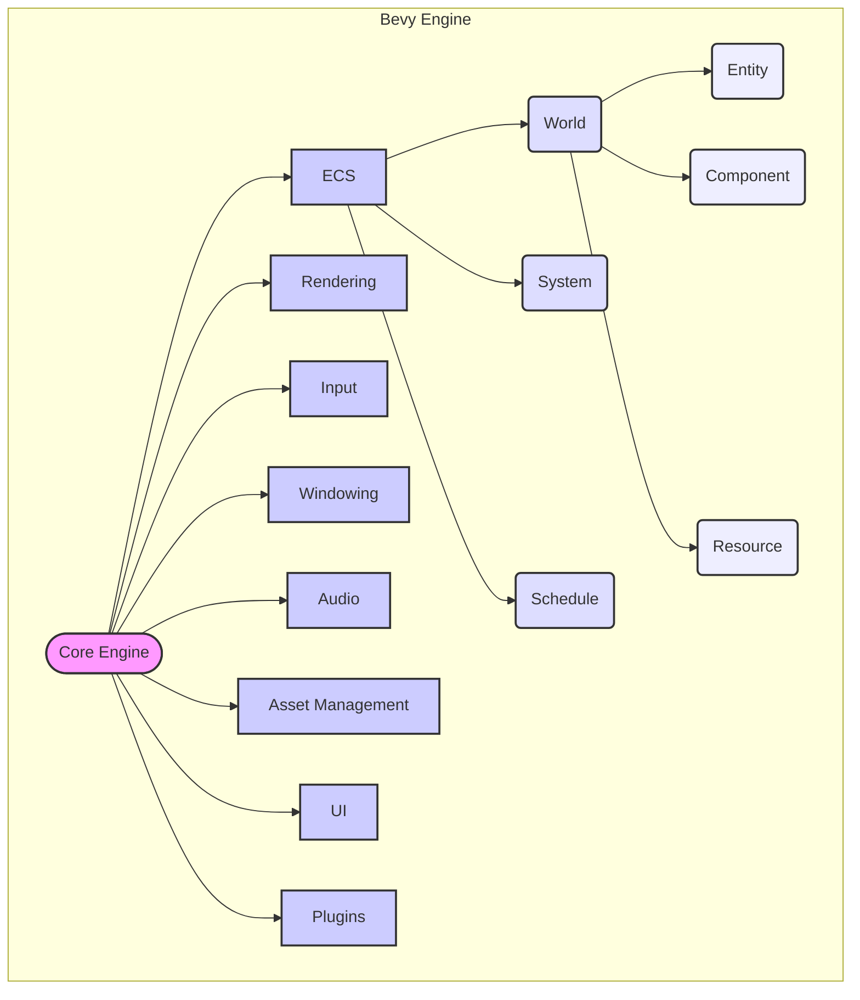
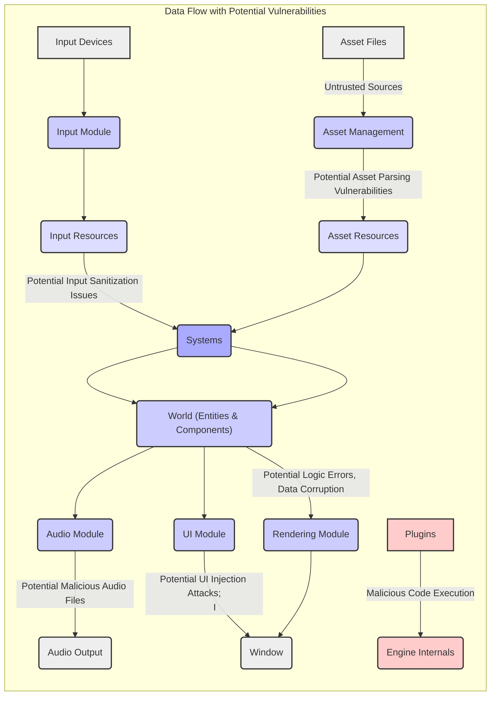

## Project Design Document: Bevy Engine (For Threat Modeling)

**1. Introduction**

This document provides a detailed architectural overview of the Bevy game engine, an open-source, data-driven game engine built in Rust. This document is specifically designed to serve as a foundation for threat modeling activities. Understanding the system's architecture, components, and data flows is crucial for identifying potential security vulnerabilities and designing appropriate mitigation strategies.

**2. Project Overview**

Bevy is a refreshingly simple data-driven game engine built in Rust. It emphasizes modularity, performance, and ease of use, leveraging the Entity Component System (ECS) architecture. Bevy aims to provide a comprehensive and extensible platform for creating 2D and 3D games.

**3. Goals and Objectives**

* Deliver a high-performance and resource-efficient game engine.
* Offer a developer-friendly and intuitive Application Programming Interface (API).
* Capitalize on Rust's memory safety and performance characteristics.
* Cultivate a vibrant and supportive community of contributors and users.
* Achieve cross-platform compatibility across various operating systems and devices.
* Facilitate rapid game prototyping and iterative development.

**4. Target Audience**

* Game developers with varying levels of experience.
* Independent game creators and hobbyists.
* Developers interested in exploring game development with Rust.
* Researchers and educators in the field of game engine technology.

**5. System Architecture**

Bevy's architecture is fundamentally based on the Entity Component System (ECS) pattern. The core engine provides the essential framework, and various modules (typically implemented as separate Rust crates) extend its capabilities.

* **Core Engine:**
    * Manages the central game loop, including update and render cycles.
    * Provides the foundational implementation of the ECS.
    * Handles application lifecycle events (startup, shutdown, etc.).
    * Responsible for scheduling and executing systems.
    * Manages core resources like time and application state.
* **ECS (Entity Component System):**
    * **World:** The central repository containing all entities, their associated components, and global resources.
    * **Entity:** A unique identifier representing a game object or concept. Entities themselves contain no data.
    * **Component:** Data associated with an entity, defining its attributes and state (e.g., `Transform`, `Sprite`, `Velocity`).
    * **System:** Functions that operate on entities based on their component composition. Systems encapsulate game logic and behavior.
    * **Resource:** Global data accessible by systems, representing singleton data or services (e.g., `Time`, `Input`, `AssetServer`).
    * **Schedule:** Defines the order and grouping of system execution, allowing for parallelization and dependency management.
* **Rendering:**
    * Manages the graphics rendering pipeline, responsible for drawing visuals to the screen.
    * Supports both 2D and 3D rendering techniques.
    * Likely utilizes a rendering backend abstraction layer, such as `wgpu`, for cross-platform compatibility.
    * Handles camera management, lighting calculations, and material rendering.
    * Responsible for submitting render commands to the graphics API.
* **Input:**
    * Captures and processes user input from various sources, including keyboard, mouse, gamepad, and touchscreens.
    * Translates raw input events into engine-level input actions and states.
    * Provides mechanisms for querying input state within systems.
* **Windowing:**
    * Creates and manages application windows and their associated contexts.
    * Handles window-related events, such as resizing, closing, and focus changes.
    * Provides an interface to the underlying operating system's windowing system.
* **Audio:**
    * Manages audio playback, including sound effects and music.
    * Supports spatial audio and audio effects.
    * Handles loading and decoding audio assets.
* **Asset Management:**
    * Responsible for loading and managing game assets, such as textures, models, audio files, and configuration data.
    * Provides mechanisms for asynchronous asset loading and caching.
    * May involve asset processing and format conversion.
* **UI (User Interface):**
    * Provides tools and components for creating in-game user interfaces.
    * Handles UI layout, event handling, and rendering.
    * Often built on top of the rendering module.
* **Networking (Optional/Future):**
    * Functionality for network communication in multiplayer games.
    * May include features for client-server architecture, data serialization, and network protocols.
    * Currently not a core feature but can be implemented via plugins or future core development.
* **Editor (Optional/Future):**
    * A visual editor for creating and managing game scenes, assets, and game logic.
    * Would likely interact with the core engine and other modules.
    * Not a core component at present.
* **Plugins:**
    * A powerful mechanism for extending Bevy's functionality in a modular way.
    * Allow developers to add custom systems, resources, components, and integrations without modifying the core engine.
    * Plugins have access to the engine's APIs and can interact with other modules.

**6. Data Flow (Focus on Potential Vulnerabilities)**

The primary data flow within Bevy centers around the ECS, with potential security implications at various stages.

* **Input Processing:**
    * Raw input events from devices are captured by the "Input Module".
    * These events are processed and translated into engine-level input states and actions, stored as "Input Resources".
    * **Potential Vulnerability:** Malicious or unexpected input sequences could potentially cause unexpected behavior or even crashes if not properly sanitized or validated.
* **System Execution:**
    * "Systems" query the "World" for entities possessing specific "Components".
    * Systems access and modify component data and "Resources" based on game logic.
    * **Potential Vulnerability:**  Logic errors within systems could lead to unintended data manipulation or state corruption. If systems rely on external data sources (e.g., configuration files), vulnerabilities in those sources could be exploited.
* **Rendering:**
    * The "Rendering Module" accesses component data (e.g., `Transform`, `Mesh`, `Material`) from the "World".
    * This data is used to generate render commands for the graphics API.
    * **Potential Vulnerability:**  If component data related to rendering is maliciously manipulated, it could potentially lead to rendering glitches, denial-of-service (by overwhelming the rendering pipeline), or even exploits in the underlying rendering backend.
* **Audio Playback:**
    * The "Audio Module" uses component data (e.g., audio source, spatial position) to play sounds.
    * Audio assets are loaded and decoded.
    * **Potential Vulnerability:**  Maliciously crafted audio files could potentially exploit vulnerabilities in the audio decoding libraries.
* **Asset Loading:**
    * The "Asset Management" module loads assets from disk or network locations.
    * Loaded assets are stored as "Asset Resources".
    * **Potential Vulnerability:**  Loading assets from untrusted sources poses a significant risk. Malicious assets could contain exploits that are triggered during the loading or processing phase. This includes vulnerabilities in image decoders, model parsers, and other asset processing logic.
* **Plugin Interaction:**
    * "Plugins" can register new systems, resources, and components, extending the engine's functionality and data flow.
    * **Potential Vulnerability:**  Plugins represent a significant attack surface. Malicious plugins could have full access to the engine's internals and could perform arbitrary actions, including data exfiltration, system compromise, or denial-of-service.

**7. Security Considerations (Detailed)**

This section provides a more detailed breakdown of potential security concerns, categorized for clarity.

* **Plugin Security:**
    * **Threat:** Malicious plugins could be introduced by users or through compromised repositories.
    * **Impact:** Full access to engine internals allows for arbitrary code execution, data exfiltration, memory corruption, and denial-of-service.
    * **Mitigation:** Implement plugin sandboxing or permission systems (if feasible). Encourage code review and community vetting of plugins.
* **Asset Security:**
    * **Threat:** Loading assets from untrusted sources could lead to vulnerabilities in asset parsing libraries (e.g., image decoders, model loaders).
    * **Impact:** Remote code execution, denial-of-service, or unexpected game behavior.
    * **Mitigation:** Implement robust asset validation and sanitization. Use well-vetted and secure asset loading libraries. Consider content security policies for loaded assets.
* **Input Handling:**
    * **Threat:** Improper handling of user input could lead to injection attacks (though less likely due to Rust's memory safety) or unexpected game behavior.
    * **Impact:**  Potential for logic errors or unintended state changes.
    * **Mitigation:**  Sanitize and validate user input where necessary. Leverage the type safety of Rust to prevent common injection vulnerabilities.
* **Dependency Management:**
    * **Threat:** Bevy relies on external Rust crates. Vulnerabilities in these dependencies could be exploited.
    * **Impact:**  The impact depends on the vulnerability in the dependency. Could range from denial-of-service to remote code execution.
    * **Mitigation:** Regularly audit dependencies for known vulnerabilities using tools like `cargo audit`. Keep dependencies updated.
* **Networking (If Implemented):**
    * **Threats:** Standard network security concerns apply, such as eavesdropping, data manipulation, replay attacks, and denial-of-service attacks.
    * **Impact:** Compromised game state, cheating, data breaches (if sensitive data is transmitted).
    * **Mitigation:** Use secure network protocols (e.g., TLS). Implement proper authentication and authorization. Sanitize network inputs.
* **Memory Safety:**
    * **Threat:** While Rust's memory safety features mitigate many common vulnerabilities, `unsafe` code blocks or logic errors could still introduce memory safety issues.
    * **Impact:** Crashes, memory corruption, potential for exploitation.
    * **Mitigation:** Minimize the use of `unsafe` code. Thoroughly review and test any `unsafe` code blocks. Utilize memory safety analysis tools.
* **Build Process:**
    * **Threat:** Compromised build environments or supply chain attacks could introduce malicious code into Bevy binaries.
    * **Impact:** Distribution of compromised engine versions leading to widespread vulnerabilities in games built with Bevy.
    * **Mitigation:** Secure build pipelines. Use trusted build environments. Implement supply chain security measures.

**8. Technologies Used**

* **Programming Language:** Rust
* **Build System:** Cargo
* **Rendering Backend (Likely):** `wgpu` (WebGPU implementation)
* **Windowing (Likely):** `winit`
* **Audio (Likely):**  Potentially `kira`, `cpal`, or other Rust audio libraries
* **UI (Likely):**  May utilize libraries like `egui` or custom UI rendering.
* **Other Dependencies:** A wide range of Rust crates for various functionalities (e.g., math, image loading, serialization).

**9. Deployment Model**

* Bevy is distributed as a collection of Rust crates that developers integrate into their game projects.
* Games built with Bevy are compiled into platform-specific executables using the Rust toolchain.
* The engine source code is open-source and hosted on platforms like GitHub.

**10. Future Considerations (Impacting Security)**

* **Expansion of Editor Functionality:** Introducing a visual editor could introduce new attack surfaces related to file handling, serialization, and user input within the editor.
* **Integration of More Advanced Networking Features:**  Adding built-in networking capabilities will necessitate careful consideration of network security best practices.
* **Support for Scripting Languages:** Integrating scripting languages could introduce vulnerabilities if the scripting engine is not properly sandboxed or if the API between the engine and the scripting language is not secure.
* **WebAssembly Support:** Compiling Bevy applications to WebAssembly for web deployment introduces new security considerations related to the browser environment and web security models.

This document provides a comprehensive architectural overview of the Bevy engine, specifically tailored for threat modeling purposes. It highlights potential areas of security concern that should be further investigated to ensure the development of secure and robust games using the Bevy engine.