Okay, let's create a design document for the Bevy game engine, focusing on aspects relevant to threat modeling.

# BUSINESS POSTURE

Bevy is an open-source game engine built in Rust. Its primary goal is to provide a data-driven, user-friendly, and performant alternative to existing game engines.  The project prioritizes ease of use, fast iteration times for developers, and a modular, extensible architecture.  It's important to note that Bevy is relatively young and rapidly evolving.

Business Priorities:

*   Attract and retain a large community of users and contributors.
*   Provide a stable and reliable platform for game development.
*   Maintain a high level of performance and efficiency.
*   Offer a compelling alternative to established game engines (Unity, Unreal, Godot).
*   Enable the creation of a wide variety of game genres and styles.

Business Goals:

*   Increase the number of games built with Bevy.
*   Grow the number of contributors to the Bevy project.
*   Establish Bevy as a viable option for both hobbyist and professional game developers.
*   Secure funding and/or partnerships to support long-term development.

Most Important Business Risks:

*   Failure to attract a critical mass of users and contributors, leading to project stagnation.
*   Major security vulnerabilities or performance issues that damage the engine's reputation.
*   Inability to keep pace with the rapid evolution of the game development landscape.
*   Competition from established, well-funded game engine providers.
*   Lack of sufficient documentation, tutorials, and community support, hindering adoption.
*   Legal issues related to licensing or intellectual property.

# SECURITY POSTURE

Bevy, being an open-source project, relies heavily on community contributions and scrutiny for security. The use of Rust as the primary language provides inherent memory safety benefits.

Existing Security Controls:

*   security control: Memory Safety: Rust's ownership and borrowing system helps prevent common memory-related vulnerabilities like buffer overflows and dangling pointers. (Implemented in the Rust language itself).
*   security control: Code Reviews: Contributions to the Bevy repository are subject to code review by maintainers and other contributors. (Described in the Bevy contribution guidelines).
*   security control: Static Analysis: The project likely uses Rust's built-in linting tools (clippy) and potentially other static analysis tools to identify potential issues. (Implied by Rust best practices and visible in CI workflows).
*   security control: Dependency Management: Cargo (Rust's package manager) manages dependencies and allows for auditing of third-party libraries. (Standard Rust tooling).
*   security control: Community Vulnerability Reporting: The open-source nature of the project encourages community members to report security vulnerabilities. (Implicit in open-source best practices).

Accepted Risks:

*   accepted risk: Reliance on Third-Party Libraries: Bevy, like any complex project, depends on numerous third-party libraries. Vulnerabilities in these libraries could impact Bevy's security.
*   accepted risk: Rapid Development Pace: The fast-paced development and frequent updates could introduce new vulnerabilities or regressions.
*   accepted risk: Limited Security Expertise: While the Bevy community includes skilled developers, there may not be dedicated security experts actively auditing the codebase.
*   accepted risk: User-Generated Content: Games built with Bevy may handle user-generated content (e.g., custom levels, mods), which could introduce security risks if not handled carefully. This is primarily the responsibility of game developers using Bevy, but the engine should provide tools and guidance to mitigate these risks.

Recommended Security Controls:

*   security control: Fuzzing: Implement fuzzing to test Bevy's components and APIs for unexpected inputs and potential vulnerabilities.
*   security control: Security Audits: Conduct regular security audits, either internally or by engaging external security experts.
*   security control: Static Application Security Testing (SAST): Integrate SAST tools into the CI/CD pipeline to automatically scan for vulnerabilities.
*   security control: Software Composition Analysis (SCA): Use SCA tools to identify and track known vulnerabilities in third-party dependencies.
*   security control: Security Training: Provide security training and resources for Bevy contributors and maintainers.
*   security control: Vulnerability Disclosure Program: Establish a formal vulnerability disclosure program to encourage responsible reporting of security issues.

Security Requirements:

*   Authentication: Not directly applicable to the engine itself, but Bevy should provide tools and guidance for game developers to implement secure authentication mechanisms in their games (e.g., integration with authentication services).
*   Authorization: Bevy's ECS (Entity Component System) architecture inherently provides a form of authorization by controlling access to components and systems.  However, game developers need to carefully design their systems to enforce appropriate access controls. Bevy should provide clear documentation and examples.
*   Input Validation: Bevy should provide robust input validation mechanisms to prevent common vulnerabilities like injection attacks. This includes validating user input from various sources (keyboard, mouse, gamepad, network).
*   Cryptography: Bevy should provide or integrate with secure cryptographic libraries for tasks like data encryption, secure communication, and digital signatures.  It should not attempt to "roll its own crypto."

# DESIGN

## C4 CONTEXT

```mermaid
graph LR
    User["User (Game Player)"] -- Interacts with --> BevyGame["Bevy Game"];
    BevyGame -- Uses --> BevyEngine["Bevy Engine"];
    BevyEngine -- Uses --> OperatingSystem["Operating System"];
    BevyEngine -- Uses --> GraphicsAPI["Graphics API (Vulkan, DirectX, Metal, WebGL)"];
    BevyEngine -- Uses --> AudioAPI["Audio API (W শন, etc.)"];
    BevyEngine -- Uses --> InputDevices["Input Devices (Keyboard, Mouse, Gamepad)"];
    BevyEngine -- Uses --> Network["Network (if applicable)"];
    Developer["Developer"] -- Develops --> BevyGame;
    Developer -- Contributes to --> BevyEngine;
    AssetStore["Asset Store (Optional)"] -- Provides Assets to --> BevyGame;

```

Element Descriptions:

*   Element:
    *   Name: User (Game Player)
    *   Type: Person
    *   Description: The end-user who plays games created with Bevy.
    *   Responsibilities: Plays the game, provides input, interacts with the game world.
    *   Security controls: None (from the perspective of the Bevy Engine).

*   Element:
    *   Name: Bevy Game
    *   Type: Software System
    *   Description: A game built using the Bevy Engine.
    *   Responsibilities: Implements game logic, renders graphics, handles user input, manages game state.
    *   Security controls: Dependent on the specific game implementation. Developers should follow secure coding practices.

*   Element:
    *   Name: Bevy Engine
    *   Type: Software System
    *   Description: The core game engine providing the foundation for Bevy games.
    *   Responsibilities: Provides core functionalities like ECS, rendering, input handling, asset management, and more.
    *   Security controls: Memory safety (Rust), code reviews, static analysis, dependency management.

*   Element:
    *   Name: Operating System
    *   Type: Software System
    *   Description: The underlying operating system (Windows, macOS, Linux, etc.).
    *   Responsibilities: Provides basic system services like memory management, process scheduling, and file I/O.
    *   Security controls: OS-level security features (e.g., ASLR, DEP).

*   Element:
    *   Name: Graphics API
    *   Type: Software System
    *   Description: The graphics API used for rendering (Vulkan, DirectX, Metal, WebGL).
    *   Responsibilities: Handles low-level graphics rendering.
    *   Security controls: Relies on the security of the specific graphics API implementation.

*   Element:
    *   Name: Audio API
    *   Type: Software System
    *   Description: API for audio output.
    *   Responsibilities: Handles audio.
    *   Security controls: Relies on the security of the specific audio API implementation.

*   Element:
    *   Name: Input Devices
    *   Type: Hardware
    *   Description: Physical input devices (keyboard, mouse, gamepad).
    *   Responsibilities: Provide user input to the system.
    *   Security controls: None (from the perspective of the Bevy Engine).

*   Element:
    *   Name: Network
    *   Type: Infrastructure
    *   Description: Network connection (if the game uses networking).
    *   Responsibilities: Enables communication between the game and other systems (e.g., game servers).
    *   Security controls: Network security protocols (e.g., TLS/SSL).

*   Element:
    *   Name: Developer
    *   Type: Person
    *   Description: A game developer who uses Bevy to create games or contributes to the engine itself.
    *   Responsibilities: Writes game code, creates assets, contributes to the Bevy codebase.
    *   Security controls: Secure coding practices, code reviews.

*   Element:
    *   Name: Asset Store (Optional)
    *   Type: Software System
    *   Description: A platform for distributing and acquiring game assets (models, textures, sounds, etc.).
    *   Responsibilities: Provides assets to game developers.
    *   Security controls: Vetting of assets for malicious content (responsibility of the asset store provider).

## C4 CONTAINER

Element Descriptions:

*   Element:
    *   Name: User (Game Player)
    *   Type: Person
    *   Description: The end-user who plays games created with Bevy.
    *   Responsibilities: Plays the game, provides input, interacts with the game world.
    *   Security controls: None (from the perspective of the Bevy Engine).

*   Element:
    *   Name: Bevy Game
    *   Type: Application
    *   Description: A game built using the Bevy Engine.
    *   Responsibilities: Implements game logic, renders graphics, handles user input, manages game state.
    *   Security controls: Dependent on the specific game implementation. Developers should follow secure coding practices.

*   Element:
    *   Name: Rendering (Bevy Plugin)
    *   Type: Container (Library/Module)
    *   Description: Bevy's rendering plugin, responsible for drawing graphics to the screen.
    *   Responsibilities: Manages rendering pipeline, interacts with the Graphics API.
    *   Security controls: Input validation (e.g., shader code), sandboxing (if possible).

*   Element:
    *   Name: Input Handling (Bevy Plugin)
    *   Type: Container (Library/Module)
    *   Description: Bevy's input plugin, responsible for handling user input.
    *   Responsibilities: Processes input events from various devices.
    *   Security controls: Input validation, sanitization.

*   Element:
    *   Name: Audio (Bevy Plugin)
    *   Type: Container (Library/Module)
    *   Description: Bevy's audio plugin.
    *   Responsibilities: Plays audio.
    *   Security controls: Input validation for audio data.

*   Element:
    *   Name: Entity Component System (ECS) (Bevy Core)
    *   Type: Container (Library/Module)
    *   Description: Bevy's core ECS implementation, providing the data-driven architecture.
    *   Responsibilities: Manages entities, components, and systems.
    *   Security controls: Access control through system design (implicit authorization).

*   Element:
    *   Name: Asset Management (Bevy Plugin)
    *   Type: Container (Library/Module)
    *   Description: Bevy's asset management plugin, responsible for loading and managing game assets.
    *   Responsibilities: Loads assets from disk or network, provides access to assets for other systems.
    *   Security controls: Input validation (e.g., asset file formats), integrity checks.

*   Element:
    *   Name: Networking (Bevy Plugin - Optional)
    *   Type: Container (Library/Module)
    *   Description: An optional Bevy plugin for networking functionality.
    *   Responsibilities: Handles network communication.
    *   Security controls: Secure communication protocols (e.g., TLS/SSL), input validation, authentication, authorization.

*   Element:
    *   Name: Assets (Data)
    *   Type: Data
    *   Description: Game assets (models, textures, sounds, etc.).
    *   Responsibilities: Provide data for the game.
    *   Security controls: Integrity checks, validation of asset file formats.

*   Element:
    *   Name: Graphics API
    *   Type: Software System
    *   Description: The graphics API used for rendering (Vulkan, DirectX, Metal, WebGL).
    *   Responsibilities: Handles low-level graphics rendering.
    *   Security controls: Relies on the security of the specific graphics API implementation.

*   Element:
    *   Name: Audio API
    *   Type: Software System
    *   Description: API for audio output.
    *   Responsibilities: Handles audio.
    *   Security controls: Relies on the security of the specific audio API implementation.

*   Element:
    *   Name: Input Devices
    *   Type: Hardware
    *   Description: Physical input devices (keyboard, mouse, gamepad).
    *   Responsibilities: Provide user input to the system.
    *   Security controls: None (from the perspective of the Bevy Engine).

*   Element:
    *   Name: Network
    *   Type: Infrastructure
    *   Description: Network connection (if the game uses networking).
    *   Responsibilities: Enables communication between the game and other systems (e.g., game servers).
    *   Security controls: Network security protocols (e.g., TLS/SSL).

*   Element:
    *   Name: Developer
    *   Type: Person
    *   Description: A game developer.
    *   Responsibilities: Develops games and contributes to Bevy.
    *   Security controls: Secure coding practices.

*   Element:
    *   Name: Bevy Engine Modules
    *   Type: Library/Module
    *   Description: Collection of Bevy engine modules.
    *   Responsibilities: Provide core engine functionality.
    *   Security controls: Code reviews, static analysis, Rust memory safety.

## DEPLOYMENT

Bevy games can be deployed to a variety of platforms, including:

1.  **Native Desktop (Windows, macOS, Linux):**  The game is compiled into a standalone executable for the target platform.
2.  **Web (WebAssembly):** The game is compiled to WebAssembly (Wasm) and can be run in a web browser.
3.  **Mobile (Android, iOS):**  This typically requires more complex build setups and may involve cross-compilation.  Bevy's support for mobile platforms is still evolving.
4.  **Embedded Systems:**  Bevy's modularity and Rust's capabilities make it potentially suitable for embedded systems, although this is not a primary focus.

We'll describe the deployment process for a native desktop application (e.g., Windows):

Element Descriptions:

*   Element:
    *   Name: Developer Machine
    *   Type: Infrastructure (Workstation)
    *   Description: The developer's computer used for building the game.
    *   Responsibilities: Compiles the code, packages assets.
    *   Security controls: Developer machine security (e.g., antivirus, firewall).

*   Element:
    *   Name: Executable (.exe)
    *   Type: Application
    *   Description: The compiled game executable.
    *   Responsibilities: Runs the game logic.
    *   Security controls: Code signing (optional, but recommended).

*   Element:
    *   Name: Assets Directory
    *   Type: Data
    *   Description: A directory containing the game's assets.
    *   Responsibilities: Stores game assets.
    *   Security controls: File system permissions.

*   Element:
    *   Name: Installer (Optional)
    *   Type: Application
    *   Description: An optional installer program to simplify deployment.
    *   Responsibilities: Installs the game on the target machine.
    *   Security controls: Code signing.

*   Element:
    *   Name: Target Machine (Windows)
    *   Type: Infrastructure (Workstation/PC)
    *   Description: The end-user's computer where the game is installed and run.
    *   Responsibilities: Runs the game.
    *   Security controls: Operating system security (e.g., antivirus, firewall).

*   Element:
    *   Name: Operating System
    *   Type: Software System
    *   Description: The underlying operating system.
    *   Responsibilities: Provides system services.
    *   Security controls: OS-level security features.

*   Element:
    *   Name: Graphics API
    *   Type: Software System
    *   Description: Graphics API.
    *   Responsibilities: Rendering.
    *   Security controls: Relies on the security of the specific graphics API implementation.

*   Element:
    *   Name: Audio API
    *   Type: Software System
    *   Description: API for audio output.
    *   Responsibilities: Handles audio.
    *   Security controls: Relies on the security of the specific audio API implementation.

*   Element:
    *   Name: Input Devices
    *   Type: Hardware
    *   Description: Input devices.
    *   Responsibilities: Provide user input.
    *   Security controls: None (from the perspective of the Bevy Engine).

## BUILD

The Bevy build process typically involves the following steps:

1.  **Developer writes code:**  The developer writes game code and/or contributes to the Bevy engine using Rust.
2.  **Cargo build:**  Rust's Cargo build system is used to compile the code.  Cargo manages dependencies, builds the project, and runs tests.
3.  **Asset processing (optional):**  Assets may be processed (e.g., optimized, converted to different formats) before being included in the final build.
4.  **Linking:** The compiled code and assets are linked together to create the final executable.
5.  **Packaging (optional):**  The executable and assets may be packaged into an installer or other distribution format.
6.  **Continuous Integration (CI):** Bevy uses GitHub Actions for CI. This automates the build, test, and linting processes on every push to the repository.

Security Controls in the Build Process:

*   security control: Dependency Management: Cargo.lock file ensures consistent and reproducible builds, reducing the risk of supply chain attacks.
*   security control: Static Analysis: Linters (clippy) are used to identify potential code quality and security issues.
*   security control: Automated Testing: Unit tests and integration tests help ensure code correctness and prevent regressions.
*   security control: CI/CD: GitHub Actions provides a secure and automated build environment.
*   security control: Code Review: All code changes are reviewed before being merged into the main branch.

# RISK ASSESSMENT

Critical Business Processes to Protect:

*   The Bevy game engine's core functionality (ECS, rendering, input, etc.).
*   The Bevy community and its collaborative development process.
*   The reputation and trustworthiness of the Bevy project.

Data to Protect and Sensitivity:

*   Source Code (Bevy Engine and Games): Medium sensitivity. While the code is open source, unauthorized modifications could introduce vulnerabilities.
*   Game Assets: Low to medium sensitivity, depending on the specific assets.  Proprietary assets would have higher sensitivity.
*   User Data (in games built with Bevy):  This is primarily the responsibility of game developers, but Bevy should provide tools and guidance to protect user data. Sensitivity varies greatly depending on the type of data (e.g., personally identifiable information (PII) would be highly sensitive).
*   Contributor Information (GitHub): Low sensitivity. Publicly available information on GitHub.

# QUESTIONS & ASSUMPTIONS

Questions:

*   Are there any specific security certifications or compliance requirements that Bevy aims to meet (e.g., for specific industries or platforms)?
*   What is the process for handling security vulnerabilities reported by external researchers?
*   What level of support is provided for different platforms (e.g., mobile, web, embedded)?
*   Are there any plans to integrate with specific security services (e.g., code signing services, vulnerability scanning services)?
*   What is the long-term strategy for maintaining the security of Bevy as the project grows and evolves?

Assumptions:

*   BUSINESS POSTURE: The Bevy project prioritizes open-source principles, community collaboration, and rapid development.
*   SECURITY POSTURE: The Bevy community relies on the inherent security features of Rust and community vigilance for security. There is no dedicated security team.
*   DESIGN: The design is modular and data-driven, based on the ECS architecture. The project uses standard Rust tooling and best practices.