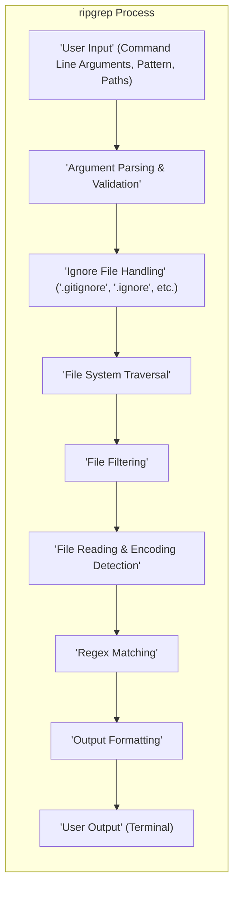

# Project Design Document: ripgrep - Improved

**Version:** 1.1
**Date:** October 26, 2023
**Author:** AI Software Architect

## 1. Introduction

This document provides an enhanced design overview of the `ripgrep` project, a highly efficient, line-oriented command-line tool for recursively searching directories for a regular expression pattern. `ripgrep` prioritizes speed and usability, offering smart defaults and support for common ignore patterns. This document serves as a refined foundation for subsequent threat modeling activities, offering a more detailed look at the system's architecture, data flow, and potential security considerations.

## 2. Goals

*   Provide a clear, comprehensive, and more detailed description of the `ripgrep` architecture.
*   Identify key components and their specific responsibilities and interactions.
*   Illustrate the data flow within the application with greater granularity.
*   Highlight potential areas of interest for security analysis and threat modeling with more specific examples.
*   Clarify assumptions and trust boundaries within the system.

## 3. Non-Goals

*   This document does not delve into the specific implementation details of individual functions or low-level modules within the `ripgrep` codebase.
*   It does not provide a comprehensive performance benchmark or detailed optimization strategies.
*   It does not cover the complete history of the project's development or the detailed rationale behind every design choice.
*   This document does not aim to be a user manual or provide instructions on how to use `ripgrep`.

## 4. Architectural Overview

`ripgrep` is designed as a command-line application leveraging the performance and safety features of the Rust programming language. Its architecture is structured around a pipeline of operations, processing user input to produce search results. The core stages are:

*   **Input Acquisition and Initial Processing:** Receiving and validating user-provided command-line arguments, including the search pattern and target paths.
*   **Ignore Rule Management:** Loading and processing ignore files to determine which files and directories should be excluded from the search.
*   **File System Exploration and Filtering:** Efficiently traversing the file system and applying ignore rules to select relevant files.
*   **Content Acquisition and Decoding:** Reading the contents of selected files, handling character encoding to ensure accurate pattern matching.
*   **Pattern Matching and Result Generation:** Applying the regular expression to the file content and identifying matching lines.
*   **Output Formatting and Presentation:** Structuring and displaying the search results to the user.

## 5. Data Flow

The flow of data within `ripgrep` can be described in more detail as follows:

*   The user initiates `ripgrep` by providing input through the command line. This input includes the search pattern (a regular expression), the target directories or files, and various optional flags and parameters.
*   The **Argument Parser** receives this raw input and performs validation checks to ensure the provided arguments are valid and consistent. This includes verifying the syntax of the regular expression and the existence of specified paths.
*   The validated configuration is then passed to the **Ignore File Handler**. This component reads and parses various ignore files (e.g., `.gitignore`, `.ignore`, `.rgignore`) to build a set of rules that define which files and directories should be excluded from the search. These rules are often based on patterns and can include negations.
*   The **File System Traversal Engine** uses the provided target paths and the ignore rules to efficiently explore the file system. It recursively traverses directories, identifying all files and subdirectories.
*   The **File Filter** component receives the list of discovered files and applies the ignore rules generated by the Ignore File Handler. This process determines the final set of files that will be searched.
*   For each file that passes the filtering stage, the **File Reader and Encoding Detector** component reads the file's content. It attempts to detect the character encoding of the file to ensure correct interpretation of the text. If encoding detection fails or is overridden by user settings, a default encoding is used.
*   The **Regex Matching** component takes the file content (as a sequence of lines) and the user-provided regular expression. It applies the regex to each line, identifying lines that match the pattern.
*   The **Output Formatter** receives the matching lines, along with metadata such as the file name and line number. It formats this information according to the user's specified output options (e.g., showing file names, line numbers, context lines, using a specific separator).
*   Finally, the formatted results are sent to the **User Output**, typically the terminal or standard output.

## 6. Components

This section provides a more detailed description of the key logical components within `ripgrep`:

*   **Argument Parser (using `clap` crate):**
    *   Responsibility: Parses command-line arguments, validates them against defined rules, and constructs a configuration object containing all the necessary parameters for the search.
    *   Interactions: Receives raw command-line input from the user. Passes the validated configuration to the Ignore File Handler.
    *   Details: Handles parsing of options like `-p` (pattern), paths, `-i` (ignore case), `-g` (glob), output formatting options, etc.
*   **Ignore File Handler:**
    *   Responsibility: Loads, parses, and interprets ignore files (`.gitignore`, `.ignore`, `.rgignore`, and potentially global ignore files). Builds a set of efficient rules for filtering files and directories.
    *   Interactions: Receives the base search paths from the Argument Parser. Provides the filtering rules to the File Filter.
    *   Details: Supports various ignore patterns, including wildcards, negation rules (`!`), and directory-specific ignore files.
*   **File System Traversal Engine:**
    *   Responsibility: Recursively explores the file system starting from the specified target directories.
    *   Interactions: Receives the base paths from the Argument Parser. Provides a list of discovered files and directories to the File Filter.
    *   Details: Uses operating system APIs for directory listing. May employ techniques like depth-first or breadth-first search. Often optimized for performance.
*   **File Filter:**
    *   Responsibility: Determines which files should be included in the search based on the ignore rules.
    *   Interactions: Receives the list of discovered files from the File System Traversal Engine and the ignore rules from the Ignore File Handler. Passes the list of eligible files to the File Reader.
    *   Details: Efficiently applies the ignore patterns to file paths.
*   **File Reader and Encoding Detector (potentially using crates like `encoding_rs`):**
    *   Responsibility: Reads the content of eligible files and attempts to detect their character encoding.
    *   Interactions: Receives the list of eligible files from the File Filter. Passes the file content (as a sequence of lines) to the Regex Matching component.
    *   Details: Supports various character encodings (e.g., UTF-8, Latin-1). May use byte order marks (BOM) or heuristics for detection. Handles potential encoding errors gracefully.
*   **Regular Expression Engine (using the `regex` crate):**
    *   Responsibility: Performs the core pattern matching operation on the content of each line.
    *   Interactions: Receives the file content and the search pattern from the Argument Parser. Provides the matching lines to the Output Formatter.
    *   Details: Utilizes a highly optimized regular expression library. Supports various regex features and syntax.
*   **Output Formatter:**
    *   Responsibility: Formats the search results for display to the user.
    *   Interactions: Receives the matching lines and metadata from the Regex Matching component. Sends the formatted output to the User Output.
    *   Details: Handles options like showing file names, line numbers, context lines before and after matches, using custom separators, and potentially outputting in different formats (e.g., JSON).
*   **Concurrency/Parallelism Manager (implicit through Rust's threading model):**
    *   Responsibility: Manages the parallel execution of tasks, such as file reading and regex matching, to improve performance.
    *   Interactions:  Orchestrates the execution of the File Reader and Regex Matching components, potentially using a thread pool.
    *   Details: Leverages Rust's built-in concurrency features or external crates for managing threads or asynchronous operations.

## 7. Security Considerations (For Threat Modeling)

This section expands on potential security considerations, providing more specific examples relevant to `ripgrep`:

*   **Input Validation Vulnerabilities:**
    *   **Regular Expression Denial of Service (ReDoS):** A maliciously crafted, computationally expensive regular expression provided by the user could cause excessive CPU consumption, leading to a denial-of-service.
    *   **Path Injection:** While less likely in Rust due to memory safety, improper handling of user-provided file paths could potentially lead to accessing files outside the intended scope.
    *   **Command Injection (Mitigated by Rust's Design):** Although Rust's memory safety features significantly reduce the risk, vulnerabilities in external libraries or incorrect use of system calls could theoretically introduce command injection possibilities if user input is directly used in shell commands (though `ripgrep` generally avoids this).
*   **File System Access Control Issues:**
    *   **Symlink Following Vulnerabilities:** If `ripgrep` blindly follows symbolic links, a malicious actor could create symlink structures that lead the tool to access sensitive files or enter infinite loops, causing resource exhaustion.
    *   **Traversal Attacks:**  Improper handling of relative paths or ".." sequences in user-provided paths could allow attackers to access files outside the intended target directory.
*   **Resource Exhaustion Attacks:**
    *   **Large File Processing:** Searching extremely large files could consume excessive memory, potentially leading to crashes or system instability.
    *   **Deep Directory Structures:** Traversing very deep or cyclical directory structures could lead to stack overflow errors or excessive memory usage.
*   **Output Handling Vulnerabilities:**
    *   **Output Injection:** If the output of `ripgrep` is used in other scripts or applications without proper sanitization, malicious content in the matched lines could be injected into the consuming application.
*   **Dependency Vulnerabilities:**
    *   Vulnerabilities in the external crates used by `ripgrep` (e.g., `regex`, `clap`, `encoding_rs`) could introduce security flaws. Regular dependency audits and updates are crucial.
*   **Encoding Handling Issues:**
    *   **Incorrect Encoding Detection:** If the encoding of a file is incorrectly detected, it could lead to incorrect pattern matching or even vulnerabilities if the output is interpreted with a different encoding.
    *   **BOM Handling:** Improper handling of Byte Order Marks could lead to unexpected behavior.
*   **Concurrency Vulnerabilities:**
    *   **Race Conditions:** If multiple threads access and modify shared data without proper synchronization, it could lead to unpredictable behavior or security vulnerabilities.

## 8. Deployment

`ripgrep` is typically deployed as a statically linked, standalone executable for various operating systems (Linux, macOS, Windows). Users download the appropriate binary and execute it directly from the command line. No server-side deployment or complex infrastructure is required.

## 9. Assumptions and Trust Boundaries

*   **User Input:** The primary trust boundary is the user input provided through command-line arguments and the search pattern. `ripgrep` attempts to validate this input but must assume that users might provide malicious or unexpected input.
*   **File System:** `ripgrep` operates within the file system permissions of the user executing the command. It assumes the operating system enforces file system access controls.
*   **Dependencies:** `ripgrep` trusts the security of its dependencies. Regular audits and updates of these dependencies are necessary to maintain security.
*   **Operating System:** `ripgrep` relies on the security of the underlying operating system for basic functionalities like file system access and memory management.

## 10. Future Considerations

*   Further detailed analysis of the concurrency model and potential race conditions.
*   Formal threat modeling exercises using frameworks like STRIDE to systematically identify potential threats.
*   Investigation of sandboxing or other isolation techniques to further limit the impact of potential vulnerabilities.
*   Implementation of more robust input sanitization and validation techniques.
*   Regular security audits of the codebase and dependencies.
*   Consideration of memory usage patterns for very large files and potential optimizations.
