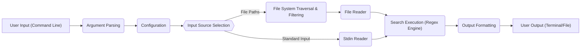
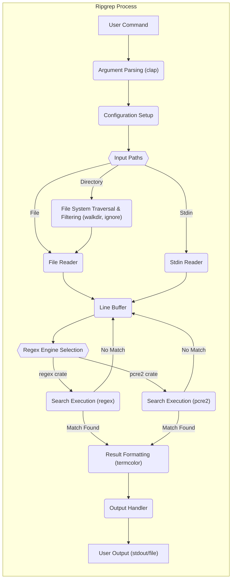

# Project Design Document: Ripgrep

**Version:** 1.1
**Date:** October 26, 2023
**Author:** Gemini (AI Language Model)

## 1. Introduction

This document provides a detailed design overview of the Ripgrep project, a line-oriented search tool that recursively searches directories for a regex pattern. This document is intended to serve as a foundation for subsequent threat modeling activities.

Ripgrep aims to be faster than other similar tools like `grep` by leveraging Rust's performance and employing various optimizations. It respects `.gitignore` files by default and offers a rich set of features for customizing search behavior.

## 2. Goals

*   Provide a fast and efficient alternative to traditional `grep`.
*   Respect `.gitignore` and other ignore files by default.
*   Offer a user-friendly command-line interface with sensible defaults.
*   Support various regex syntaxes through selectable engines.
*   Enable searching within specific file types and excluding others.
*   Provide options for controlling output formatting, including colorization and context lines.

## 3. Non-Goals

*   Providing a full-fledged text editor.
*   Implementing complex scripting or macro capabilities.
*   Supporting every possible regular expression feature under a single engine (relies on selectable engines).
*   Acting as a general-purpose file manipulation tool.

## 4. High-Level Architecture

Ripgrep operates as a command-line tool that takes a search pattern and a set of paths as input. It then recursively traverses the specified directories (or reads from standard input) to find lines matching the pattern. The core logic involves parsing arguments, configuring the search, reading input, performing the search using a chosen engine, and formatting the output.

## 5. Component Design

This section details the key components of Ripgrep and their responsibilities, along with implementation considerations.

### 5.1. Argument Parsing

*   **Description:** This component is responsible for parsing the command-line arguments provided by the user.
*   **Functionality:**
    *   Identifies the mandatory search pattern.
    *   Identifies optional target paths (files or directories); defaults to the current directory if none are provided.
    *   Parses numerous flags and options, such as:
        *   Case sensitivity (`-i`)
        *   Whole word matching (`-w`)
        *   File type filtering (`-g`, `--type-add`, `--type-not`)
        *   Output formatting (`--color`, `-n`, `-H`)
        *   Regex engine selection (`--engine`)
        *   Context lines (`-A`, `-B`, `-C`)
    *   Handles mutually exclusive options and provides informative error messages for invalid or missing arguments.
*   **Implementation Notes:**  Relies heavily on the `clap` Rust crate for defining and parsing command-line interfaces. Error handling within this component is crucial for a good user experience.

### 5.2. Configuration

*   **Description:** This component manages the configuration settings for the search operation, derived from parsed arguments, environment variables, and potentially configuration files.
*   **Functionality:**
    *   Stores the parsed command-line arguments in a structured format.
    *   Reads and applies configuration settings from environment variables (e.g., `RIPGREP_CONFIG_PATH`).
    *   Potentially supports loading configuration from a dedicated configuration file (though currently less prominent).
    *   Determines the active regex engine based on the `--engine` flag or a default setting (likely Rust's `regex` crate).
    *   Resolves provided file paths, expanding wildcards and handling relative paths.
    *   Manages ignore patterns by:
        *   Reading `.gitignore` files in the traversed directories.
        *   Reading global ignore files (e.g., `~/.gitignore`).
        *   Applying ignore patterns specified via command-line flags (`-g`, `--ignore-file`).
*   **Implementation Notes:**  The `ignore` crate is likely used for efficient handling of ignore patterns. Care must be taken to correctly prioritize and combine different sources of configuration.

### 5.3. Input Source Selection

*   **Description:** This component determines the source(s) of the data to be searched based on the configured paths.
*   **Functionality:**
    *   Checks if specific file paths are provided.
    *   If directories are provided, initiates the File System Traversal & Filtering component.
    *   If no file paths are provided, defaults to reading from standard input.
*   **Implementation Notes:**  This acts as a dispatcher, directing the flow to the appropriate input handling mechanism.

### 5.4. File System Traversal & Filtering

*   **Description:** This component recursively traverses the directory structure specified in the configuration, applying ignore rules and file type filters.
*   **Functionality:**
    *   Recursively walks through directories, starting from the provided paths.
    *   Utilizes the configured ignore patterns to skip files and directories.
    *   Applies file type filters (include or exclude specific file types based on extensions or other criteria).
    *   Passes the paths of eligible files to the File Reader.
*   **Implementation Notes:**  The `walkdir` crate is a likely dependency for efficient and robust directory traversal. Performance is critical here, especially for large directory structures.

### 5.5. File Reader

*   **Description:** This component reads the content of individual files in an efficient manner, typically line by line.
*   **Functionality:**
    *   Opens files for reading.
    *   Reads file content, often buffered for performance.
    *   Decodes file content into lines, handling different line endings.
    *   May perform basic character encoding detection or rely on a default encoding (typically UTF-8).
    *   Passes lines of text to the Search Execution component.
*   **Implementation Notes:**  Error handling for file access permissions and I/O errors is important. Efficiency in reading large files is a key performance consideration.

### 5.6. Stdin Reader

*   **Description:** This component reads data from standard input.
*   **Functionality:**
    *   Reads data from the standard input stream.
    *   Typically reads line by line.
    *   Passes lines of text to the Search Execution component.
*   **Implementation Notes:**  Needs to handle the end of the input stream gracefully.

### 5.7. Search Execution (Regex Engine)

*   **Description:** This is the core component responsible for performing the pattern matching against the input lines.
*   **Functionality:**
    *   Receives lines of text from the File Reader or Stdin Reader.
    *   Utilizes the configured regular expression engine (e.g., `regex`, `pcre2`).
    *   Applies the compiled regex pattern to each line.
    *   Identifies lines that match the pattern.
    *   Captures matching groups if specified in the pattern.
    *   May employ optimizations specific to the chosen regex engine for faster searching (e.g., using SIMD instructions, pre-filtering).
*   **Implementation Notes:**  The choice of regex engine and its configuration significantly impacts performance and security. The `regex` crate is the default and generally recommended for its safety and performance. Supporting other engines like `pcre2` adds flexibility but also complexity. Care must be taken to mitigate potential ReDoS vulnerabilities, possibly through timeouts or resource limits (though not currently a prominent feature).

### 5.8. Output Formatting

*   **Description:** This component formats the search results for display or output to a file or the terminal.
*   **Functionality:**
    *   Receives matching lines and metadata (filename, line number, etc.) from the Search Execution component.
    *   Formats the output according to the specified options:
        *   Displays matching lines, optionally with context lines before and after.
        *   Highlights the matching portion of the line using ANSI escape codes for colorization.
        *   Prints file names and line numbers.
        *   Supports various output formats (e.g., plain text, custom separators).
        *   Handles output to the terminal (stdout) or a specified file.
        *   Provides options to suppress filenames, line numbers, etc.
*   **Implementation Notes:**  Needs to handle character encoding correctly to avoid garbled output. The `termcolor` crate is likely used for cross-platform terminal color support.

## 6. Data Flow Diagram (Detailed)

## 7. Security Considerations

This section outlines potential security considerations that will be further explored during threat modeling, categorized by component.

*   **Argument Parsing:**
    *   **Malformed Input:**  Unexpected or malformed command-line arguments could potentially cause crashes or unexpected behavior. `clap` helps mitigate this, but custom validation logic needs scrutiny.
*   **Configuration:**
    *   **Path Traversal in Ignore Files:**  Maliciously crafted patterns in `.gitignore` or global ignore files could potentially lead to unintended exclusion of files.
    *   **Environment Variable Injection:** If environment variables are used for configuration, vulnerabilities in how these are processed could be exploited.
*   **File System Traversal & Filtering:**
    *   **Symbolic Link Attacks:**  Careless handling of symbolic links could lead to infinite loops or access to unintended files. Ripgrep likely has safeguards against this, but it needs verification.
*   **File Reader:**
    *   **Resource Exhaustion (Large Files):**  Processing extremely large files could lead to excessive memory usage or disk I/O, causing denial of service.
    *   **Character Encoding Issues:**  Incorrect handling of character encodings could lead to incorrect search results or security vulnerabilities if external programs process the output.
*   **Stdin Reader:**
    *   **Resource Exhaustion (Large Input):** Similar to file reading, excessively large input from stdin could cause resource exhaustion.
*   **Search Execution (Regex Engine):**
    *   **Regular Expression Denial of Service (ReDoS):**  Complex or maliciously crafted regular expressions can cause the regex engine to consume excessive CPU time, leading to denial of service. This is a significant concern, especially with user-provided patterns.
    *   **Vulnerabilities in Regex Engine:**  Bugs or vulnerabilities in the underlying regex engine libraries (`regex`, `pcre2`) could be exploited. Keeping dependencies updated is crucial.
*   **Output Formatting:**
    *   **ANSI Escape Code Injection:**  If Ripgrep processes untrusted input and includes it in the output with colorization, malicious input could inject ANSI escape codes to manipulate the terminal.
    *   **Information Disclosure:**  Incorrectly formatted output or overly verbose error messages could potentially leak sensitive information.

## 8. Dependencies

Ripgrep relies on several external Rust crates for its functionality. Key dependencies include:

*   `regex`:  For regular expression matching (default engine). Specific versions should be tracked for known vulnerabilities.
*   `clap`: For command-line argument parsing. Version updates should be monitored.
*   `ignore`: For handling ignore files (`.gitignore`, etc.).
*   `walkdir`: For efficient directory traversal.
*   `memchr`: For fast byte searching, often used internally by the `regex` crate.
*   `termcolor`: For cross-platform terminal color support.
*   Potentially `pcre2` or `pcre2-sys` if PCRE2 engine support is enabled.
*   Various other utility crates for error handling, I/O, and concurrency management (e.g., `anyhow`, `rayon`).

A thorough Software Bill of Materials (SBOM) and regular vulnerability scanning of these dependencies are essential for maintaining security.

## 9. Deployment Considerations

Ripgrep is typically deployed as a standalone, statically linked command-line executable. This simplifies deployment as it minimizes external runtime dependencies. Users download or install the binary specific to their operating system and architecture. It can be easily integrated into shell scripts, CI/CD pipelines, and other development tools. Package managers (e.g., `apt`, `brew`, `cargo install`) are common distribution methods.

## 10. Future Considerations (Potential Enhancements)

*   Support for more advanced regex features or alternative regex engines.
*   Enhanced output formatting options, such as structured output formats (JSON, CSV).
*   Improved handling of binary files or non-textual data.
*   Integration with other tools or workflows through scripting interfaces or APIs (less likely given the project's scope).
*   Performance optimizations for specific niche use cases.
*   More robust handling of character encoding detection and conversion.

This document provides a comprehensive and detailed design overview of the Ripgrep project, intended to be a valuable resource for identifying potential threats and vulnerabilities during the threat modeling process. The detailed component descriptions and security considerations aim to provide a solid foundation for further analysis.