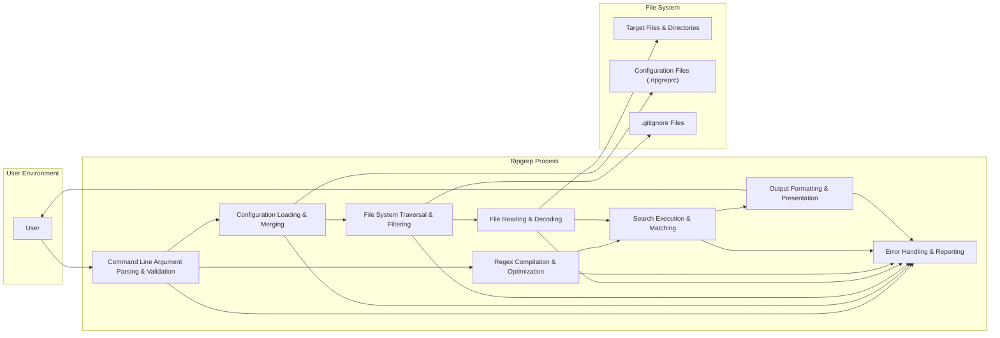
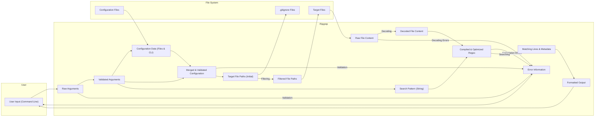

# Project Design Document: Ripgrep (Improved)

**Version:** 1.1
**Date:** October 26, 2023
**Author:** AI Software Architect

## 1. Introduction

This document provides an enhanced and more detailed design overview of the Ripgrep project, a line-oriented search tool that recursively searches directories for a regex pattern. This document is specifically tailored to serve as a robust foundation for subsequent threat modeling activities. It meticulously outlines the key architectural components, data flow with transformations, and interactions within the system, with a heightened focus on potential security implications.

## 2. Goals and Non-Goals

**Goals:**

* Provide a comprehensive and granular architectural overview of Ripgrep, suitable for in-depth security analysis.
* Clearly identify key components, their specific responsibilities, and their interactions with data.
* Precisely describe the flow of data through the system, highlighting data transformations and validation points.
* Explicitly highlight potential areas of interest and attack surfaces for security analysis, linking them to specific components and data flows.

**Non-Goals:**

* Provide a line-by-line code-level implementation description.
* Conduct a specific vulnerability assessment or penetration testing exercise.
* Offer concrete security recommendations or immediate mitigation strategies (these will be the output of the threat modeling process).
* Cover every conceivable edge case or obscure configuration option, focusing on the core functionality.

## 3. High-Level Architecture

Ripgrep operates as a command-line application, accepting user input to define search parameters and targets. It then processes this input, interacts with the file system to read content, applies the search pattern, and finally outputs the matching results.

## 4. Detailed Architecture

This section provides a more granular breakdown of the key components and their interactions, emphasizing data handling and potential security considerations.

### 4.1. Command Line Argument Parsing & Validation

* **Description:** This component is responsible for receiving, parsing, and critically, validating the arguments provided by the user via the command line interface.
* **Functionality:**
    * Utilizes a library (likely `clap` in Rust) to define the expected command-line argument structure.
    * Parses the raw input string into structured data.
    * **Crucially, performs validation checks:**
        * Ensures required arguments are present.
        * Verifies the format and range of provided values (e.g., numeric arguments, file path existence).
        * Sanitizes input to prevent injection attacks (though Ripgrep's direct execution of external commands is limited, validation is still vital).
    * Handles and reports errors related to invalid or missing arguments.
* **Security Relevance:** This is the first line of defense against malicious input. Insufficient validation can lead to:
    * **Unexpected behavior:** Causing the application to function incorrectly.
    * **Resource exhaustion:**  Providing extremely large or malformed inputs.
    * **Potential for exploiting vulnerabilities in subsequent components:** Passing invalid data downstream.

### 4.2. Configuration Loading & Merging

* **Description:** This component manages the loading of configuration settings from various sources (command-line arguments, configuration files) and merges them to determine the final application behavior.
* **Functionality:**
    * Locates and reads configuration files (e.g., `.ripgreprc`) from standard locations.
    * Parses the configuration file content (likely in TOML format), handling potential parsing errors.
    * Merges configuration settings with command-line arguments, with command-line arguments typically taking precedence.
    * **Performs validation on loaded configuration values:** Ensures they are within acceptable ranges and formats.
* **Security Relevance:**
    * **Configuration Injection:** Maliciously crafted configuration files could:
        * Override intended security settings.
        * Introduce unexpected behavior.
        * Potentially influence file system access patterns.
    * **Parsing vulnerabilities:** Errors in the TOML parsing library could be exploited.

### 4.3. File System Traversal & Filtering

* **Description:** This component is responsible for navigating the file system to identify the target files for searching, applying various filtering rules.
* **Functionality:**
    * Starts traversal from the provided directory paths.
    * Uses system calls to list directory contents.
    * **Applies filtering rules:**
        * Include/exclude patterns specified by the user.
        * File type filters.
        * Rules defined in `.gitignore` files.
    * Handles symbolic links (with options to follow or avoid them) to prevent infinite loops.
    * Implements recursion limits to prevent excessive traversal.
    * **Performs checks to prevent path traversal vulnerabilities:** Ensures that the traversal stays within the intended boundaries.
* **Security Relevance:**
    * **Path Traversal:** Vulnerabilities could allow access to sensitive files or directories outside the intended scope.
    * **Denial of Service:**
        * Infinite recursion due to mishandling of symbolic links.
        * Traversing an extremely large number of files and directories, consuming excessive resources.
    * **Information Disclosure:**  Unintended inclusion of files due to incorrect filtering logic.

### 4.4. File Reading & Decoding

* **Description:** This component handles the process of reading the content of identified files and decoding their content into a usable format (typically UTF-8).
* **Functionality:**
    * Opens files for reading with appropriate permissions.
    * Reads file contents into memory or uses memory mapping techniques for efficiency.
    * **Detects and handles different file encodings:** Attempts to automatically detect the encoding or uses user-specified encoding.
    * Decodes the file content into UTF-8, handling potential decoding errors and invalid characters.
    * May employ buffering to optimize reading performance.
* **Security Relevance:**
    * **Denial of Service:**  Reading extremely large files could consume excessive memory.
    * **Information Disclosure:**  Incorrect handling of file permissions could lead to reading files the user should not have access to.
    * **Vulnerabilities in encoding libraries:**  Errors in the decoding process could be exploited.

### 4.5. Regex Compilation & Optimization

* **Description:** This component takes the user-provided search pattern (regular expression) and compiles it into an internal representation optimized for efficient searching.
* **Functionality:**
    * Uses a robust regular expression library (the `regex` crate in Rust).
    * Parses the regular expression syntax, handling syntax errors.
    * **Applies optimizations to the compiled regex:**  To improve search performance.
    * May have limits on the complexity of the regex to prevent excessive compilation time or memory usage.
* **Security Relevance:**
    * **Denial of Service (Regex Catastrophic Backtracking):**  Maliciously crafted regular expressions with exponential matching behavior can cause the regex engine to consume excessive CPU time, leading to a denial of service. The `regex` crate in Rust is designed to mitigate this, but vigilance is still required.
    * **Vulnerabilities in the regex library:**  Bugs in the regex compilation or matching logic could be exploited.

### 4.6. Search Execution & Matching

* **Description:** This is the core component that performs the actual search operation, comparing the compiled regex against the content of each file.
* **Functionality:**
    * Takes the compiled regex and the decoded file content as input.
    * Iterates through the lines of the file.
    * Applies the regex matching algorithm to each line.
    * Stores or streams the matching lines along with relevant metadata (file name, line number, etc.).
* **Security Relevance:**
    * **Performance Issues:** Inefficient search algorithms or poorly optimized regex matching could lead to performance degradation.
    * **Potential for vulnerabilities in the matching logic:** Although the `regex` crate is well-vetted, bugs are always a possibility.

### 4.7. Output Formatting & Presentation

* **Description:** This component formats the search results for display to the user in a clear and understandable manner.
* **Functionality:**
    * Takes the matching lines and associated metadata.
    * Formats the output according to user-specified options (e.g., showing file names, line numbers, context lines, colors).
    * Escapes special characters if necessary to prevent misinterpretation by the terminal.
    * Writes the formatted output to standard output (stdout) or potentially other destinations.
* **Security Relevance:**
    * **Information Leakage:**  Incorrect formatting could unintentionally reveal more information than intended.
    * **Terminal Injection:**  If not properly escaped, specially crafted content in the matching lines could potentially execute commands in the user's terminal (though this is less likely with Ripgrep's typical output).

### 4.8. Error Handling & Reporting

* **Description:** This component is responsible for handling errors that occur during any stage of the process and reporting them to the user in a helpful way.
* **Functionality:**
    * Implements error handling logic throughout the application.
    * Catches exceptions and other error conditions.
    * Provides informative error messages to the user, including details about the error and its location.
    * May log errors for debugging purposes.
* **Security Relevance:**
    * **Information Disclosure:**  Overly verbose error messages could reveal sensitive information about the system or internal workings of Ripgrep.
    * **Denial of Service:**  Repeatedly triggering errors could potentially lead to resource exhaustion.

## 5. Data Flow Diagram (Detailed)

This diagram provides a more detailed view of the data flow, highlighting data transformations and validation points.

## 6. Key Components and Technologies

* **Core Programming Language:** Rust (known for its memory safety and performance)
* **Command Line Argument Parsing:** `clap` crate (provides robust argument parsing and validation)
* **Regular Expression Engine:** `regex` crate (a well-regarded and performant regex library in Rust, designed to prevent catastrophic backtracking)
* **File System Interaction:** Standard Rust library (`std::fs`) (provides safe and efficient file system access)
* **Configuration Parsing:** Likely `toml` crate (for parsing TOML configuration files)
* **Character Encoding Handling:** Libraries within the Rust ecosystem for handling various character encodings and decoding errors.
* **Output Handling:** Standard Rust library (`std::io`) (for writing output to the console or other streams).

## 7. Security Considerations (Detailed)

This section provides a more detailed breakdown of potential security considerations, linking them to specific components and data flows:

* **Command Injection (Mitigated by Design):** While Ripgrep itself doesn't directly execute arbitrary shell commands based on user input, vulnerabilities in dependencies or future extensions could introduce this risk. Strict input validation in the **Command Line Argument Parsing & Validation** component is crucial.
* **Path Traversal (Focus on File System Traversal & Filtering):**  Vulnerabilities in the **File System Traversal & Filtering** logic could allow attackers to access files outside the intended scope. Thorough testing of filtering rules and handling of symbolic links is essential.
* **Denial of Service (Multiple Attack Vectors):**
    * **Regex Catastrophic Backtracking (Focus on Regex Compilation & Optimization):**  While the `regex` crate mitigates this, overly complex or maliciously crafted regex patterns could still consume significant resources. Consider implementing limits on regex complexity or execution time.
    * **Resource Exhaustion via File System Traversal (Focus on File System Traversal & Filtering):**  Providing a large number of target directories or deeply nested structures could overwhelm the system. Implement recursion limits and resource usage monitoring.
    * **Large File Processing (Focus on File Reading & Decoding):**  Attempting to search extremely large files could lead to memory exhaustion. Consider implementing mechanisms to handle large files efficiently or impose size limits.
* **Configuration Injection (Focus on Configuration Loading & Merging):**  Maliciously crafted configuration files could override intended behavior or introduce vulnerabilities. Implement strict validation of configuration values and consider using a secure configuration format.
* **Input Validation Failures (Pervasive):**  Insufficient validation in any component that receives external input (command-line arguments, configuration files) can lead to unexpected behavior or create opportunities for exploitation.
* **Dependency Vulnerabilities (General Concern):**  Ripgrep relies on external libraries. Regularly audit and update dependencies to patch known vulnerabilities. Employ tools for dependency scanning.
* **Information Disclosure (Multiple Points):**
    * **Path Traversal:** As mentioned above.
    * **Error Handling:** Overly verbose error messages in the **Error Handling & Reporting** component could reveal sensitive information.
    * **Output Formatting:** Incorrect formatting in the **Output Formatting & Presentation** component could unintentionally expose sensitive data.
* **Integer Overflow/Underflow (Less Likely in Rust):** Rust's memory safety features largely prevent these types of vulnerabilities, but careful attention should still be paid to arithmetic operations, especially when dealing with file sizes or offsets.

## 8. Future Considerations

* **Plugin System:** Introducing a plugin system would significantly expand the attack surface. Careful consideration would be needed for plugin sandboxing, permission management, and secure communication between the core application and plugins.
* **Network Capabilities:** Adding network functionality (e.g., searching remote files) would introduce new security challenges related to authentication, authorization, and secure communication protocols.
* **Web Interface:** Providing a web interface would introduce a whole new set of web application security concerns (e.g., cross-site scripting, cross-site request forgery).

This improved design document provides a more detailed and security-focused overview of Ripgrep's architecture, serving as a more robust foundation for subsequent threat modeling activities. The explicit linking of potential threats to specific components and data flows will facilitate a more targeted and effective threat analysis.