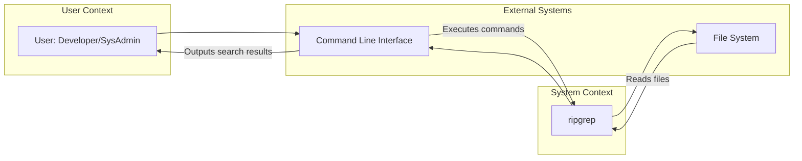
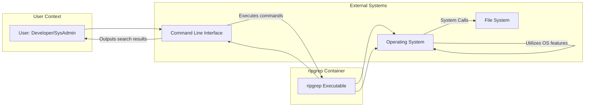
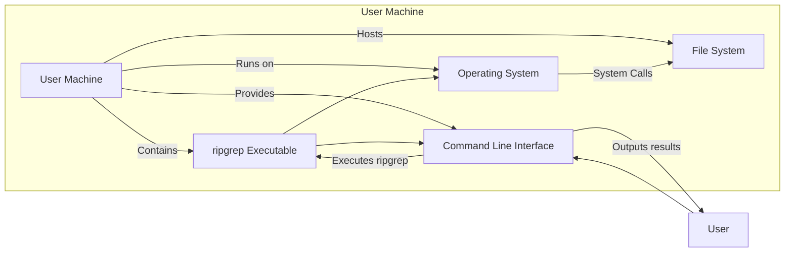
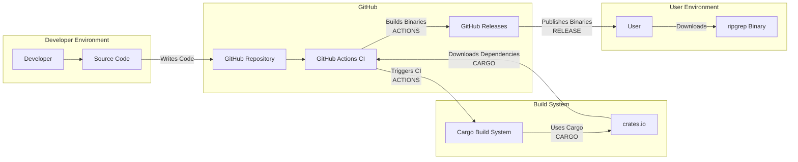

# BUSINESS POSTURE

- Business Priorities and Goals:
 - Goal: Provide a fast and efficient command-line tool for searching text patterns in files.
 - Priority: Performance and accuracy of search results.
 - Priority: Cross-platform compatibility (Linux, macOS, Windows).
 - Priority: Ease of use and command-line interface intuitiveness.
 - Priority: Open-source community support and contributions.

- Business Risks:
 - Risk: Potential for incorrect search results leading to errors in development or system administration tasks.
 - Risk: Performance bottlenecks in specific use cases or on certain hardware.
 - Risk: Security vulnerabilities in the ripgrep code that could be exploited if processing untrusted input.
 - Risk: Lack of community support or maintainership leading to stagnation or unaddressed issues.

# SECURITY POSTURE

- Existing Security Controls:
 - security control: Language choice - Rust is a memory-safe language, reducing the risk of memory-related vulnerabilities. Implemented in: Source code is written in Rust.
 - security control: Use of well-vetted regular expression engine (regex crate in Rust ecosystem). Implemented in: Source code dependencies.
 - security control: Static analysis and linters used during development (implied by Rust ecosystem and common practices). Implemented in: Development process.
 - security control: Open-source nature allows for community review and vulnerability discovery. Implemented in: Open repository on GitHub.
 - accepted risk: Reliance on external dependencies (crates) introduces potential supply chain risks.
 - accepted risk: Vulnerabilities might be discovered in the regex engine or Rust standard library itself.

- Recommended Security Controls:
 - security control: Implement automated security scanning (SAST/DAST) in the CI/CD pipeline.
 - security control: Regularly update dependencies to patch known vulnerabilities.
 - security control: Consider fuzz testing to identify potential input validation issues.
 - security control: Provide clear security vulnerability reporting guidelines for the community.

- Security Requirements:
 - Authentication:
  - Not applicable: ripgrep is a command-line tool and does not require user authentication.
 - Authorization:
  - Requirement: ripgrep should respect file system permissions and only access files that the user has permissions to read.
  - Implemented by: Operating system file system permissions.
 - Input Validation:
  - Requirement: ripgrep must properly validate and sanitize user-provided input, including search patterns, file paths, and command-line arguments, to prevent injection attacks or unexpected behavior.
  - Implemented in: Source code input parsing and processing logic.
 - Cryptography:
  - Not applicable: ripgrep does not handle or store sensitive data that requires encryption. Cryptography is not a core requirement.

# DESIGN

## C4 CONTEXT

- Context Diagram Elements:
 - Element:
  - Name: User
  - Type: Person
  - Description: A developer or system administrator who uses ripgrep to search for text patterns in files.
  - Responsibilities: Executes ripgrep commands via the command-line interface to search for specific patterns.
  - Security controls: User authentication and authorization on the operating system level to access the command-line interface and file system.
 - Element:
  - Name: ripgrep
  - Type: Software System
  - Description: A command-line tool written in Rust for recursively searching directories for a regex pattern.
  - Responsibilities:
   - Receives search commands and patterns from the command-line interface.
   - Accesses the file system to read and search file contents.
   - Processes search patterns using a regular expression engine.
   - Outputs search results to the command-line interface.
  - Security controls:
   - Input validation of command-line arguments and search patterns.
   - Respecting file system permissions during file access.
   - Memory safety provided by the Rust language.
 - Element:
  - Name: File System
  - Type: External System
  - Description: The local file system where files and directories are stored.
  - Responsibilities:
   - Stores files and directories.
   - Manages file access permissions.
   - Provides file content to ripgrep upon request.
  - Security controls:
   - Operating system level file permissions to control access to files and directories.
   - File system integrity mechanisms.
 - Element:
  - Name: Command Line Interface
  - Type: External System
  - Description: The command-line interface (e.g., terminal, shell) used to interact with ripgrep.
  - Responsibilities:
   - Provides an interface for users to input ripgrep commands and arguments.
   - Displays output from ripgrep to the user.
  - Security controls:
   - User authentication and authorization to access the command-line interface.
   - Command history and logging mechanisms provided by the shell.

## C4 CONTAINER

- Container Diagram Elements:
 - Element:
  - Name: ripgrep Executable
  - Type: Executable
  - Description: The compiled ripgrep binary, written in Rust. It's a single, self-contained executable.
  - Responsibilities:
   - Parses command-line arguments.
   - Implements the core search logic using the regex engine.
   - Interacts with the operating system to access the file system.
   - Formats and outputs search results to the command-line interface.
  - Security controls:
   - Input validation within the executable.
   - Memory safety enforced by the Rust compiler.
   - Adherence to operating system security policies.
 - Element:
  - Name: Operating System
  - Type: External System
  - Description: The underlying operating system (Linux, macOS, Windows) on which ripgrep is executed.
  - Responsibilities:
   - Provides system calls for file system access, memory management, and process execution.
   - Enforces file system permissions and security policies.
   - Provides the command-line interface environment.
  - Security controls:
   - Operating system level security controls (user authentication, access control, process isolation, etc.).
   - Security updates and patching of the operating system.
 - Element:
  - Name: File System
  - Type: External System
  - Description: The local file system, as described in the Context Diagram.
  - Responsibilities: Same as in Context Diagram.
  - Security controls: Same as in Context Diagram.
 - Element:
  - Name: Command Line Interface
  - Type: External System
  - Description: The command-line interface, as described in the Context Diagram.
  - Responsibilities: Same as in Context Diagram.
  - Security controls: Same as in Context Diagram.
 - Element:
  - Name: User
  - Type: Person
  - Description: The user, as described in the Context Diagram.
  - Responsibilities: Same as in Context Diagram.
  - Security controls: Same as in Context Diagram.

## DEPLOYMENT

- Deployment Architecture:
 - Solution: Direct download and execution of pre-compiled binaries.
 - Details: Ripgrep provides pre-compiled binaries for various operating systems (Linux, macOS, Windows) on its release page or via package managers. Users download the appropriate binary for their system and execute it directly from the command line. No complex deployment infrastructure is involved.

- Deployment Diagram Elements:
 - Element:
  - Name: User Machine
  - Type: Infrastructure
  - Description: The user's personal computer, server, or workstation where ripgrep is executed.
  - Responsibilities:
   - Provides the hardware and operating system environment for running ripgrep.
   - Hosts the file system to be searched.
   - Provides the command-line interface for user interaction.
  - Security controls:
   - Physical security of the machine.
   - Operating system security controls (firewall, antivirus, etc.).
   - User account security.
 - Element:
  - Name: ripgrep Executable
  - Type: Software
  - Description: The pre-compiled ripgrep binary deployed on the user machine.
  - Responsibilities:
   - Executes the search functionality as designed.
  - Security controls:
   - Software integrity (verified download from trusted source).
   - Operating system's process isolation and security mechanisms.
 - Element:
  - Name: Operating System
  - Type: Infrastructure Software
  - Description: The operating system running on the user machine.
  - Responsibilities:
   - Provides the runtime environment for ripgrep.
   - Manages file system access and permissions.
   - Enforces security policies.
  - Security controls:
   - Operating system security features (access control, patching, etc.).
 - Element:
  - Name: Command Line Interface
  - Type: Interface
  - Description: The command-line interface provided by the operating system.
  - Responsibilities:
   - Allows users to interact with ripgrep.
  - Security controls:
   - User authentication to access the command-line interface.
 - Element:
  - Name: File System
  - Type: Data Storage
  - Description: The file system on the user machine being searched by ripgrep.
  - Responsibilities:
   - Stores files and directories.
   - Controls access to files based on permissions.
  - Security controls:
   - File system permissions.
   - Data encryption at rest (if implemented by the user/OS).

## BUILD

- Build Process:
 - Description: Ripgrep uses Rust's build system (Cargo) for compilation and dependency management. The build process typically involves:
  - Developer writes code and commits to the Git repository.
  - Code is pushed to GitHub.
  - CI/CD pipeline (likely GitHub Actions) is triggered.
  - CI/CD pipeline performs:
   - Code checkout.
   - Rust toolchain setup.
   - Dependency resolution and download (crates.io).
   - Code compilation using `cargo build --release`.
   - Running tests.
   - Building distributable binaries for various platforms.
   - Publishing release binaries to GitHub Releases.

- Build Process Security Controls:
 - security control: Source code hosted on GitHub - provides version control and transparency. Implemented in: GitHub Repository.
 - security control: Use of Cargo - Rust's official package manager, which helps manage dependencies and build process. Implemented in: Build System configuration (Cargo.toml).
 - security control: Dependency management via crates.io - Rust's package registry, which has its own security considerations (crates are reviewed, but vulnerabilities can still exist). Implemented in: Dependency resolution process.
 - security control: Automated CI/CD pipeline (GitHub Actions) - ensures consistent and repeatable builds. Implemented in: GitHub Actions workflows.
 - security control: Compilation from source - reduces the risk of backdoors in pre-compiled binaries (though users typically download pre-compiled binaries). Implemented in: Build process.
 - security control: Running tests in CI - helps ensure code quality and identify potential issues early. Implemented in: GitHub Actions workflows.
 - security control: Release binaries are published on GitHub Releases - provides a central and relatively trusted source for binaries. Implemented in: GitHub Releases.
 - security control: Signing of release binaries (not explicitly mentioned in input, but recommended). Recommended security control.

# RISK ASSESSMENT

- Critical Business Processes:
 - Process: Software development - ripgrep helps developers quickly search codebases, logs, and documentation, improving development efficiency and reducing errors caused by manual searching.
 - Process: System administration and operations - ripgrep aids in log analysis, configuration file searching, and incident response by enabling rapid identification of relevant information within large text datasets.

- Data to Protect and Sensitivity:
 - Data: Source code - Intellectual property, sensitive if proprietary. Sensitivity: High if proprietary, lower if open-source (like ripgrep itself).
 - Data: Log files - Operational data, potentially containing sensitive information like user activity, system errors, or security events. Sensitivity: Medium to High depending on content and regulatory requirements.
 - Data: Configuration files - System settings, application configurations, potentially containing credentials or sensitive parameters. Sensitivity: Medium to High.
 - Data: Search patterns - User-defined regular expressions, may unintentionally reveal search intent or sensitive information if logged or exposed. Sensitivity: Low to Medium.

# QUESTIONS & ASSUMPTIONS

- Questions:
 - Is there any specific regulatory compliance requirement for systems where ripgrep is used? (Assuming no for now, as it's a general-purpose tool).
 - Are there any specific performance requirements or constraints in certain environments where ripgrep is deployed? (Assuming general performance focus).
 - Are there any plans to integrate ripgrep into other systems or workflows that might introduce new security considerations? (Assuming standalone command-line usage).
 - Is binary signing currently implemented for releases? (Assuming not explicitly, but recommending it).

- Assumptions:
 - BUSINESS POSTURE: The primary business goal is to provide a fast, efficient, and reliable command-line search tool for general use.
 - SECURITY POSTURE: Security is important, but performance and usability are also key priorities. The open-source nature provides a degree of inherent security review.
 - DESIGN: Ripgrep is primarily used as a standalone command-line tool, deployed directly by users on their machines. The architecture is relatively simple and focused on efficient search functionality.
 - DEPLOYMENT: Users download pre-compiled binaries from GitHub Releases or package managers and execute them locally.
 - BUILD: The build process relies on standard Rust tooling and CI/CD practices. Supply chain security is important but managed through dependency management and community trust in the Rust ecosystem.