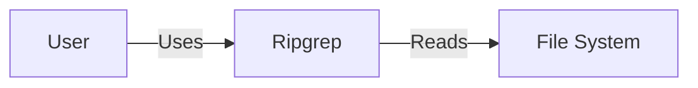
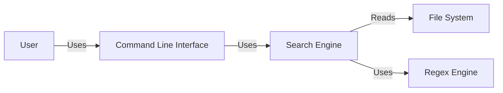
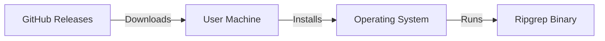
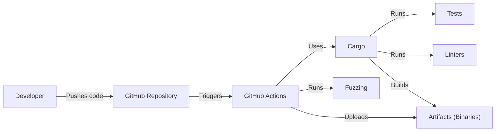

# BUSINESS POSTURE

Ripgrep is a widely used command-line tool, popular for its speed and efficiency in searching through files. It's a utility that directly impacts developer productivity. Given its nature, the business priorities and goals can be inferred as follows:

Priorities and Goals:

*   Performance: Maintain and improve the speed and efficiency of searching.
*   Reliability: Ensure the tool provides accurate and consistent results.
*   Usability: Provide a user-friendly command-line interface with clear and helpful documentation.
*   Maintainability: Keep the codebase clean, well-documented, and easy to contribute to.
*   Portability: Support a wide range of operating systems and architectures.
*   Community: Foster a healthy and active open-source community.

Business Risks:

*   Performance Degradation: Any changes that significantly slow down the search process would negatively impact user productivity.
*   Inaccurate Results: Bugs that cause ripgrep to miss matches or produce false positives would erode user trust.
*   Security Vulnerabilities: Although primarily a local tool, vulnerabilities (e.g., denial of service via crafted regex) could be exploited.
*   Maintenance Burden: If the codebase becomes difficult to maintain, it could slow down the development of new features and bug fixes.
*   Loss of Community: A decline in community engagement could lead to fewer contributions and slower development.

# SECURITY POSTURE

Existing Security Controls:

*   security control: Code Reviews: The project is hosted on GitHub, which provides built-in code review tools. Pull requests are used to review and discuss changes before merging them into the main branch. (Described in GitHub's pull request workflow).
*   security control: Testing: The project has an extensive test suite, including unit tests, integration tests, and benchmarks. (Described in the project's README and testing directory).
*   security control: Fuzzing: The project uses fuzzing (specifically with `cargo fuzz`) to find potential bugs and vulnerabilities. (Described in the `fuzz/` directory).
*   security control: Static Analysis: The project uses Rust's built-in compiler checks and Clippy, a linter, to catch potential errors and improve code quality. (Described in the project's CI workflow).
*   security control: Dependency Management: The project uses Cargo, Rust's package manager, which helps manage dependencies and ensure their integrity. (Described in `Cargo.toml` and `Cargo.lock` files).
*   security control: Safe Rust: The project is written in Rust, a memory-safe language, which inherently prevents many common security vulnerabilities like buffer overflows.

Accepted Risks:

*   accepted risk: Denial of Service (DoS): Crafted regular expressions could potentially cause excessive resource consumption (CPU, memory). While mitigated to some extent, completely preventing this is difficult.
*   accepted risk: Local Tool: Ripgrep is primarily a local tool, reducing the attack surface compared to network-facing applications.

Recommended Security Controls:

*   security control: Regular Security Audits: Conduct periodic security audits of the codebase and dependencies.
*   security control: Supply Chain Security: Implement measures to verify the integrity of third-party dependencies, such as using `cargo-crev` for reviews.
*   security control: Documented Security Policy: Create a `SECURITY.md` file outlining how to report security vulnerabilities.

Security Requirements:

*   Authentication: Not applicable, as ripgrep is a command-line tool that operates on local files.
*   Authorization: Relies on the underlying operating system's file permissions. Ripgrep should not attempt to bypass or elevate these permissions.
*   Input Validation:
    *   Regular Expressions: Validate and potentially sanitize user-provided regular expressions to mitigate ReDoS (Regular Expression Denial of Service) vulnerabilities.
    *   File Paths: Handle file paths securely, avoiding issues like path traversal vulnerabilities.
    *   Configuration Files: If configuration files are supported, validate their contents to prevent injection vulnerabilities.
*   Cryptography: Not directly applicable, as ripgrep's primary function is searching, not encryption. However, if features like encrypted file searching are added, strong cryptographic libraries and practices should be used.

# DESIGN

## C4 CONTEXT

Element Description:

*   Element:
    *   Name: User
    *   Type: Person
    *   Description: A person who uses ripgrep to search files.
    *   Responsibilities: Provides search queries and file paths to ripgrep.
    *   Security controls: None (relies on OS security).

*   Element:
    *   Name: Ripgrep
    *   Type: Software System
    *   Description: The ripgrep command-line tool.
    *   Responsibilities: Parses user input, searches files, and displays results.
    *   Security controls: Input validation, fuzzing, static analysis, code reviews, safe language (Rust).

*   Element:
    *   Name: File System
    *   Type: Software System
    *   Description: The operating system's file system.
    *   Responsibilities: Stores and provides access to files.
    *   Security controls: Operating system file permissions.

## C4 CONTAINER

Element Description:

*   Element:
    *   Name: User
    *   Type: Person
    *   Description: A person who uses ripgrep to search files.
    *   Responsibilities: Provides search queries and file paths to ripgrep.
    *   Security controls: None (relies on OS security).

*   Element:
    *   Name: Command Line Interface
    *   Type: Container
    *   Description: Parses command-line arguments and options.
    *   Responsibilities: Handles user interaction, validates input, and passes it to the Search Engine.
    *   Security controls: Input validation.

*   Element:
    *   Name: Search Engine
    *   Type: Container
    *   Description: Core logic for searching files.
    *   Responsibilities: Traverses directories, reads files, and applies search patterns.
    *   Security controls: Safe file handling, error handling.

*   Element:
    *   Name: Regex Engine
    *   Type: Container
    *   Description: Library for compiling and executing regular expressions.
    *   Responsibilities: Matches regular expressions against file content.
    *   Security controls: ReDoS mitigation (potentially).

*   Element:
    *   Name: File System
    *   Type: Software System
    *   Description: The operating system's file system.
    *   Responsibilities: Stores and provides access to files.
    *   Security controls: Operating system file permissions.

## DEPLOYMENT

Ripgrep is a command-line tool and can be deployed in multiple ways:

1.  **Via Package Managers:** Most common method. Users install ripgrep using their operating system's package manager (e.g., `apt`, `brew`, `choco`).
2.  **From Source:** Users can download the source code and compile it themselves.
3.  **Pre-built Binaries:** The project provides pre-built binaries for various operating systems and architectures on the GitHub releases page.
4.  **Containers:** While not the primary use case, ripgrep can be included in Docker images for use in CI/CD pipelines or other containerized environments.

Chosen Deployment Method (Pre-built Binaries):

Element Description:

*   Element:
    *   Name: GitHub Releases
    *   Type: Infrastructure
    *   Description: Storage location for pre-built ripgrep binaries.
    *   Responsibilities: Provides downloadable binaries for different platforms.
    *   Security controls: GitHub's platform security.

*   Element:
    *   Name: User Machine
    *   Type: Infrastructure
    *   Description: The user's computer.
    *   Responsibilities: Downloads and runs the ripgrep binary.
    *   Security controls: User's operating system security.

*   Element:
    *   Name: Operating System
    *   Type: Infrastructure
    *   Description: The user's operating system (e.g., Windows, macOS, Linux).
    *   Responsibilities: Manages file system access and process execution.
    *   Security controls: OS security features (file permissions, process isolation, etc.).

*   Element:
    *   Name: Ripgrep Binary
    *   Type: Software
    *   Description: The compiled ripgrep executable.
    *   Responsibilities: Performs the search functionality.
    *   Security controls: Built-in security measures (input validation, safe Rust).

## BUILD

Ripgrep's build process is automated using GitHub Actions.

Build Process Description:

1.  **Developer Action:** A developer pushes code changes to the GitHub repository.
2.  **Trigger:** This triggers a GitHub Actions workflow.
3.  **Build Environment:** The workflow sets up a build environment (e.g., a specific operating system, Rust version).
4.  **Cargo Build:** Cargo, Rust's build tool, is used to compile the code.
5.  **Testing:** The workflow runs the test suite (unit tests, integration tests).
6.  **Linting:** Clippy, a linter, is run to check for code style and potential errors.
7.  **Fuzzing:** `cargo fuzz` is used to run fuzz tests.
8.  **Artifact Creation:** If all checks pass, Cargo builds the final ripgrep binaries.
9.  **Artifact Upload:** The binaries are uploaded as artifacts to the GitHub Actions run and potentially to GitHub Releases.

Security Controls in Build Process:

*   security control: Automated Build: The build process is fully automated, reducing the risk of manual errors.
*   security control: Continuous Integration: GitHub Actions provides continuous integration, ensuring that code is tested and built frequently.
*   security control: Static Analysis: Clippy and Rust's compiler checks are run as part of the build process.
*   security control: Testing: The extensive test suite helps catch bugs early.
*   security control: Fuzzing: Fuzzing helps identify potential vulnerabilities.
*   security control: Dependency Management: Cargo manages dependencies and their versions.

# RISK ASSESSMENT

*   Critical Business Process: The critical business process is providing a fast and reliable tool for searching through files, directly impacting developer productivity.
*   Data Protection: Ripgrep itself doesn't store or transmit sensitive data. It interacts with the user's files, so the sensitivity of the data depends on the content of those files. Ripgrep should respect the underlying operating system's file permissions and not expose any data that the user doesn't have access to. The primary data sensitivity concern is indirect: if ripgrep has a vulnerability that allows arbitrary code execution, an attacker could potentially gain access to the user's files.

# QUESTIONS & ASSUMPTIONS

Questions:

*   Are there any specific compliance requirements (e.g., GDPR, HIPAA) that need to be considered, even though ripgrep is a local tool?
*   Are there plans to add features that might introduce new security concerns (e.g., network capabilities, support for encrypted files)?
*   What is the acceptable level of risk for ReDoS vulnerabilities?

Assumptions:

*   BUSINESS POSTURE: The primary goal is to provide a fast, reliable, and user-friendly tool.
*   SECURITY POSTURE: The existing security controls (code reviews, testing, fuzzing, safe language) are considered sufficient for the current risk profile.
*   DESIGN: The design is relatively simple, as ripgrep is a command-line tool with a focused purpose. The main security concerns are related to input validation and potential vulnerabilities in the regex engine.