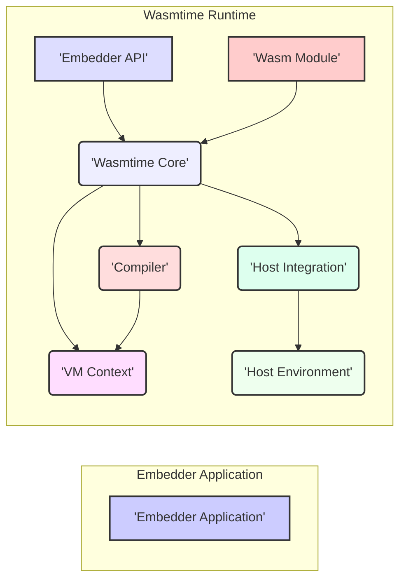
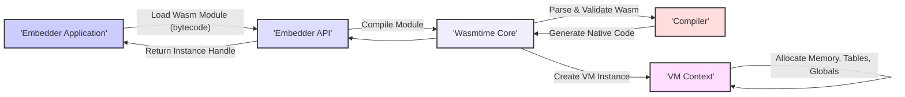
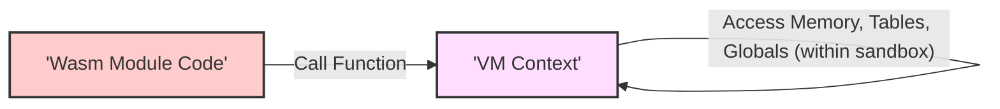

# Project Design Document: Wasmtime

**Version:** 1.1
**Date:** October 26, 2023
**Author:** AI Software Architect

## 1. Introduction

This document provides an enhanced architectural design of the Wasmtime project, a standalone WebAssembly runtime. This revised document aims to offer a more detailed and nuanced understanding of the system's components, their interactions, and the overall architecture, specifically tailored for subsequent threat modeling activities. We will elaborate on potential attack surfaces and trust boundaries.

## 2. Goals

*   Provide a clear and detailed architectural overview of Wasmtime, suitable for security analysis.
*   Identify key components and their specific responsibilities, including security-relevant functions.
*   Describe the interactions and data flow between components with a focus on potential vulnerabilities.
*   Explicitly highlight potential trust boundaries and attack surfaces within the system.
*   Serve as a robust foundation for future threat modeling exercises, enabling the identification of potential risks and mitigation strategies.

## 3. Non-Goals

*   This document does not delve into the intricate details of the WebAssembly specification itself beyond what is necessary for understanding Wasmtime's architecture.
*   It does not cover the micro-level implementation details of every single function or module within Wasmtime's codebase.
*   Performance benchmarking and optimization strategies are outside the scope of this document, although performance can have security implications (e.g., denial of service).
*   Specific details of the build system, continuous integration/continuous deployment (CI/CD) pipelines, or the contribution process are not included.

## 4. Architectural Overview

Wasmtime is architected as an embeddable WebAssembly runtime, emphasizing security and performance. Its primary function is the secure and efficient execution of WebAssembly modules within a host environment. The architecture can be conceptually divided into the following key areas, highlighting trust boundaries:

*   **Embedder Application (Trust Boundary):** The external application that integrates and controls the Wasmtime runtime. This represents a significant trust boundary.
*   **Embedder API (Trust Boundary):** The well-defined interface through which the Embedder Application interacts with the Wasmtime Core. This is a critical point for security enforcement.
*   **Wasmtime Core (Trusted Component):** The central runtime engine responsible for the entire lifecycle of WebAssembly execution, including compilation, instantiation, and management.
*   **Compiler (Trusted Component):**  The component that translates WebAssembly bytecode into native machine code. Security vulnerabilities here can have severe consequences.
*   **VM (Virtual Machine) Context (Sandboxed Environment):**  The isolated execution environment for individual WebAssembly instances, providing memory and resource separation. This is the primary sandbox.
*   **Host Integration (Trust Boundary):** The mechanisms allowing WebAssembly modules to interact with the host environment, representing a potential avenue for attack if not carefully managed.

## 5. Component Details

This section provides a more detailed description of the key components within Wasmtime, emphasizing their security implications.

### 5.1. Embedder API

*   **Description:** This is the primary programmatic interface exposed by Wasmtime for embedding into host applications. It provides functions for managing the Wasmtime runtime and interacting with WebAssembly modules. Examples include functions for:
    *   `wasmtime_module_new()`: Loading and compiling a WebAssembly module from bytecode.
    *   `wasmtime_instance_new()`: Creating an instance of a compiled module.
    *   `wasmtime_linker_define_function()`: Defining host functions to be imported by WebAssembly modules.
    *   `wasmtime_instance_call_export()`: Calling an exported function within a WebAssembly instance.
*   **Responsibilities:**
    *   Establishing a secure and controlled boundary between the embedding application and the potentially untrusted WebAssembly code.
    *   Handling the initial loading, compilation, and instantiation of WebAssembly modules based on embedder requests.
    *   Orchestrating the execution of WebAssembly code within the managed runtime environment.
    *   Providing mechanisms for the embedder to configure resource limits and security policies.
*   **Security Considerations:** This API represents a critical trust boundary. Vulnerabilities in the API or its implementation could allow a malicious embedder to bypass security measures or compromise the runtime. Conversely, improper use of the API by the embedder can introduce vulnerabilities. Input validation on all parameters passed through this API is crucial.

### 5.2. Wasmtime Core

*   **Description:** The central orchestrator of the Wasmtime runtime. It manages the lifecycle of WebAssembly modules and instances, coordinating the activities of other components.
*   **Responsibilities:**
    *   Receiving requests from the Embedder API and delegating tasks to other components.
    *   Interacting with the Compiler to translate WebAssembly bytecode into executable machine code.
    *   Managing the creation and lifecycle of VM Contexts for each WebAssembly instance, ensuring isolation.
    *   Handling function calls, including calls between WebAssembly modules and host functions.
    *   Enforcing security policies, such as resource limits (memory, fuel), and sandboxing restrictions.
    *   Orchestrating interactions with the Host Integration component for import resolution and host function calls.
*   **Security Considerations:** This component operates with high privileges within the Wasmtime runtime. It must be robust against malicious WebAssembly code attempting to exploit vulnerabilities in the runtime or bypass security measures. Proper error handling and preventing unexpected state transitions are vital.

### 5.3. Compiler

*   **Description:** Responsible for the just-in-time (JIT) compilation of WebAssembly bytecode into native machine code. Wasmtime primarily uses the Cranelift compiler backend.
*   **Responsibilities:**
    *   Parsing and validating WebAssembly bytecode to ensure it conforms to the specification.
    *   Performing optimizations to improve the performance of the generated machine code.
    *   Generating safe and efficient machine code that adheres to the security constraints of the Wasmtime sandbox. This includes ensuring memory safety and control flow integrity.
    *   Implementing mitigations against common code generation vulnerabilities.
*   **Security Considerations:** The compiler is a critical component for security. Bugs in the compiler could lead to the generation of unsafe machine code, potentially allowing WebAssembly modules to escape the sandbox and compromise the host system. The compiler itself is a significant attack surface.

### 5.4. VM (Virtual Machine) Context

*   **Description:** Provides an isolated and secure execution environment for each instance of a WebAssembly module. This includes:
    *   **Linear Memory:** A contiguous block of memory accessible by the WebAssembly instance. Access is strictly controlled to prevent out-of-bounds access.
    *   **Table Instances:**  Tables of function references or other data, with bounds checking enforced.
    *   **Global Variables:**  Variables accessible by the WebAssembly instance, with type and access control.
    *   **Call Stack:**  Manages the execution flow of the WebAssembly instance.
*   **Responsibilities:**
    *   Enforcing memory safety by preventing WebAssembly code from accessing memory outside of its allocated linear memory.
    *   Managing the execution state of a WebAssembly instance, including the program counter and local variables.
    *   Providing isolation between different WebAssembly instances running within the same Wasmtime runtime.
    *   Trapping on invalid memory accesses, table accesses, and other runtime errors.
*   **Security Considerations:** The VM Context is the cornerstone of Wasmtime's sandboxing mechanism. Its integrity is crucial for preventing malicious code from affecting other instances or the host environment. Vulnerabilities in the VM Context could lead to sandbox escapes.

### 5.5. Host Integration

*   **Description:** Provides controlled mechanisms for WebAssembly modules to interact with the external host environment. This primarily involves:
    *   **Host Functions (Trust Boundary):** Functions defined by the embedder and exposed to WebAssembly modules through the import mechanism. These represent a significant trust boundary.
    *   **Imports:** Declarations within a WebAssembly module that specify external functions, memories, globals, or tables that it requires from the host environment.
*   **Responsibilities:**
    *   Facilitating controlled and secure communication between WebAssembly code and the host environment.
    *   Providing access to host resources (e.g., system calls, file system access) in a mediated and secure manner through host functions.
    *   Marshaling data between the WebAssembly linear memory and the host environment during host function calls.
    *   Enforcing security policies on host function calls, such as argument validation and access control.
*   **Security Considerations:** Host functions represent a significant attack surface. If a host function has vulnerabilities, a malicious WebAssembly module could exploit them to gain unauthorized access to the host system. Careful design, implementation, and auditing of host functions are essential. The types and capabilities exposed through host functions should be minimized according to the principle of least privilege.

## 6. Data Flow Diagrams

This section illustrates the flow of data during key operations within Wasmtime, highlighting potential security implications at each stage.

### 6.1. Module Loading and Instantiation

*   **Security Notes:** Validation in the Compiler (D) is crucial to prevent malformed or malicious bytecode from being executed. The creation of the VM Context (E) establishes the initial security boundary.

### 6.2. Function Call (Within Wasm Module)

*   **Security Notes:** The VM Context (B) enforces memory safety and prevents access outside the module's allocated resources. Control flow integrity is maintained within the compiled code.

### 6.3. Host Function Call

```mermaid
graph LR
    A["'Wasm Module Code'"] -- "Call Imported Function" --> B["'VM Context'"];
    B -- "Trap to Wasmtime Core" --> C["'Wasmtime Core'"];
    C -- "Dispatch to Host Function" --> D["'Host Integration'"];
    D -- "Execute Host Function" --> E["'Host Environment'"];
    E -- "Return Result" --> D;
    D -- "Marshal Result" --> C;
    C -- "Return to VM Context" --> B;
    B -- "Return to Wasm Module" --> A;
    style A fill:#fcc,stroke:#333,stroke-width:2px
    style B fill:#fdf,stroke:#333,stroke-width:2px
    style C fill:#eef,stroke:#333,stroke-width:2px
    style D fill:#dfe,stroke:#333,stroke-width:2px
    style E fill:#efe,stroke:#333,stroke-width:2px
```

*   **Security Notes:** This is a critical trust boundary. Data marshaling between the Wasm module and the host environment must be handled carefully to prevent vulnerabilities. The security of the Host Environment (E) is paramount.

## 7. Security Considerations

Based on the architectural overview and component details, several key security considerations are paramount for Wasmtime:

*   **Robust Sandboxing:** The security of the VM Context is the foundation of Wasmtime's security model.
    *   **Memory Safety:** Strict enforcement of memory boundaries is crucial to prevent out-of-bounds reads and writes.
    *   **Control Flow Integrity (CFI):** Mechanisms to prevent malicious code from altering the intended control flow of execution are necessary.
    *   **Resource Limits:**  Enforcing limits on memory usage, execution time (fuel), and other resources prevents denial-of-service attacks.
*   **Compiler Hardening:** The compiler must be resilient against attacks that attempt to generate malicious code.
    *   **Input Validation:** Thorough validation of WebAssembly bytecode is essential.
    *   **Mitigation of Code Generation Bugs:** Techniques to prevent the compiler from introducing vulnerabilities in the generated machine code are critical.
    *   **Defense against Spectre/Meltdown-like attacks:**  Consideration of speculative execution vulnerabilities and appropriate mitigations.
*   **Secure Host Function Interface:** Host functions must be designed and implemented with security in mind.
    *   **Input Validation:** All data passed from WebAssembly modules to host functions must be rigorously validated.
    *   **Principle of Least Privilege:** Host functions should only expose the necessary functionality and should operate with the minimum required privileges.
    *   **Error Handling:** Robust error handling in host functions is essential to prevent unexpected behavior or security vulnerabilities.
*   **Embedder Responsibility:** The embedding application plays a crucial role in maintaining the overall security.
    *   **Careful Management of Host Functions:** The embedder must carefully choose and implement the host functions it exposes.
    *   **Resource Management:** The embedder should configure appropriate resource limits for Wasmtime.
    *   **Secure Configuration:** Proper configuration of Wasmtime's security settings is essential.
*   **Supply Chain Security:** The security of Wasmtime's dependencies (e.g., Cranelift) is also a concern.
    *   Regularly updating dependencies and monitoring for known vulnerabilities is necessary.
    *   Using trusted sources for dependencies.
*   **Security Audits and Penetration Testing:** Regular security audits and penetration testing are crucial for identifying potential vulnerabilities.

## 8. Deployment Considerations

The security considerations for Wasmtime can vary depending on the deployment context:

*   **Standalone Runtime:** When used as a standalone runtime, the security of the host operating system and the permissions granted to the Wasmtime process are critical.
*   **Embedded in Applications:** When embedded in other applications, the trust relationship between the embedding application and the WebAssembly code needs careful consideration. The security of the embedding application becomes paramount.
*   **Web Browsers (Hypothetical):** While Wasmtime is not directly used in web browsers for executing arbitrary web content (browsers have their own Wasm engines), if it were, the browser's existing security model would be the primary defense.
*   **Server-Side Wasm:** In server-side deployments, securing the host environment and carefully managing the capabilities exposed to WebAssembly modules are crucial.

## 9. Future Considerations

*   Further enhancements to the sandboxing mechanisms, potentially leveraging hardware virtualization features.
*   Exploration of more advanced compiler security techniques.
*   Development of more comprehensive tooling for security auditing and vulnerability analysis of WebAssembly modules running on Wasmtime.
*   Continued monitoring and patching of potential security vulnerabilities.
*   Formal verification of critical components to provide stronger security guarantees.

This enhanced document provides a more detailed and security-focused understanding of the Wasmtime architecture, serving as a more robust foundation for subsequent threat modeling activities.