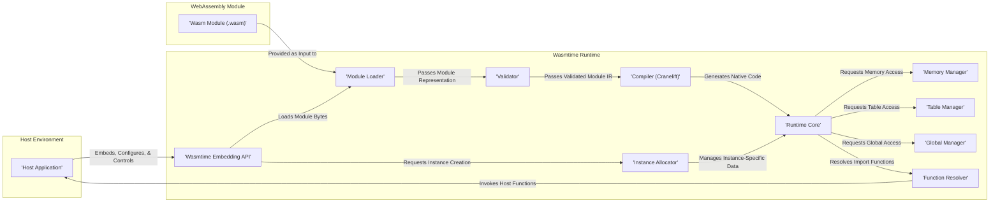
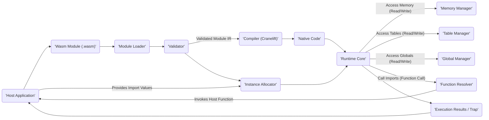

# Project Design Document: Wasmtime

**Version:** 1.1
**Date:** October 26, 2023
**Author:** AI Software Architect

## 1. Introduction

This document provides a detailed design overview of the Wasmtime project, a standalone WebAssembly-like runtime environment. This document is specifically tailored to serve as a robust foundation for subsequent threat modeling activities. It meticulously outlines the key components, data flows, and interactions within the Wasmtime runtime, with a strong emphasis on security-relevant aspects.

## 2. Goals

* Provide a comprehensive and easily understandable architectural overview of the Wasmtime runtime.
* Clearly identify the key components of Wasmtime and their specific responsibilities within the system.
* Accurately describe the data flow within the system, tracing the journey of a WebAssembly module from loading to execution and interaction with the host.
* Explicitly highlight potential security-relevant aspects of the design for each component, providing context for threat identification.
* Serve as a definitive and reliable basis for future threat modeling exercises, enabling security experts to effectively analyze potential vulnerabilities.

## 3. Non-Goals

* Provide an exhaustive, line-by-line code-level implementation guide for Wasmtime.
* Analyze specific, known vulnerabilities or detail past exploit scenarios within Wasmtime.
* Offer performance benchmarks, optimization strategies, or detailed resource utilization metrics for the runtime.
* Describe the entire WebAssembly specification in exhaustive detail; the focus is on Wasmtime's implementation.

## 4. High-Level Architecture

Wasmtime is architected as a secure and performant embeddable runtime environment for executing WebAssembly modules. Its core components are designed to work together to safely load, validate, compile, and execute potentially untrusted WebAssembly code within a sandboxed environment.

## 5. Detailed Design

This section provides a more granular description of the key components within Wasmtime, focusing on their responsibilities, data interactions, and security implications.

### 5.1. Host Environment

* **Description:** The external application or system that embeds and leverages the Wasmtime runtime to execute WebAssembly modules. This is the trusted context in which Wasmtime operates.
* **Responsibilities:**
    * Loading WebAssembly module bytecode from various sources (e.g., file system, network).
    * Configuring the Wasmtime runtime engine with specific settings and resource limits.
    * Providing import functions and global variables that the WebAssembly module can interact with.
    * Receiving exported functions, memories, tables, and globals from the executed WebAssembly module.
    * Managing the overall lifecycle of Wasmtime engines, modules, and instances.
    * Handling potential traps (runtime errors) originating from the WebAssembly execution.
* **Security Considerations:** The security of the host environment is paramount. Vulnerabilities in the host application can be exploited by malicious WebAssembly code executed within Wasmtime. The host must carefully manage the interfaces it exposes to Wasmtime and the data it shares. Improperly configured resource limits can also lead to denial-of-service.

### 5.2. Wasmtime Embedding API

* **Description:** The set of well-defined functions, data structures, and interfaces exposed by the Wasmtime library that allows host applications to interact with and control the runtime. This API serves as the primary boundary between the trusted host and the potentially untrusted WebAssembly code.
* **Responsibilities:**
    * Creating and configuring Wasmtime `Engine` instances, which manage global runtime settings.
    * Loading and compiling WebAssembly modules into a reusable `Module` representation.
    * Instantiating `Module`s to create runnable `Instance`s, providing import values during instantiation.
    * Accessing exported functions, memories, tables, and globals from a module instance.
    * Managing the lifecycle of `Engine`s, `Module`s, and `Instance`s, including resource cleanup.
    * Handling and propagating traps (runtime errors) back to the host application.
    * Providing mechanisms for configuring security-related features like fuel consumption limits.
* **Security Considerations:** This API must be meticulously designed and used correctly by the host to prevent security vulnerabilities. Incorrect usage, such as passing incorrect import types or failing to enforce resource limits, can create attack vectors. The API itself must be resistant to misuse that could compromise the runtime or host.

### 5.3. Module Loader

* **Description:** The component responsible for reading the raw byte stream of a WebAssembly module and parsing it into an internal representation that Wasmtime can understand.
* **Responsibilities:**
    * Reading the WebAssembly binary format according to the specification.
    * Parsing the module structure, including sections for types, functions, imports, exports, memory, tables, and data.
    * Performing initial sanity checks on the module's format and basic structural integrity.
* **Inputs:** Raw bytes of a WebAssembly module, typically provided by the host application.
* **Outputs:** An internal representation of the WebAssembly module, suitable for further processing by the validator.
* **Security Considerations:** Vulnerabilities in the loader could allow malicious modules with carefully crafted structures to bypass validation or cause crashes due to parsing errors (e.g., buffer overflows, out-of-bounds reads). The loader must be resilient to malformed or oversized modules.

### 5.4. Validator

* **Description:** A critical security component that verifies the loaded WebAssembly module adheres to the WebAssembly specification and is well-formed, ensuring it doesn't contain any inherently unsafe constructs.
* **Responsibilities:**
    * Checking the type signatures of functions, ensuring consistency between declarations and uses.
    * Verifying the validity of individual instructions and the control flow graph of functions.
    * Ensuring that the module respects resource limits defined by the specification and potentially the host.
    * Enforcing security-related constraints, such as limitations on memory access and table manipulation.
* **Inputs:** The internal representation of the WebAssembly module produced by the loader.
* **Outputs:** A validated internal representation of the module, indicating it is safe for compilation, or an error if validation fails.
* **Security Considerations:** The validator is a fundamental security gatekeeper. Bypassing or having vulnerabilities within the validator would allow the execution of potentially malicious or unsafe code. The validation process must be comprehensive and correctly implement all relevant security checks from the WebAssembly specification.

### 5.5. Compiler (Cranelift)

* **Description:** The code generation engine responsible for translating the validated WebAssembly bytecode into native machine code that can be executed directly by the processor. Wasmtime utilizes the Cranelift compiler backend.
* **Responsibilities:**
    * Translating individual WebAssembly instructions into equivalent sequences of native machine instructions for the target architecture.
    * Performing optimizations to improve the performance of the generated code while maintaining correctness and security.
    * Ensuring that the generated code respects the security boundaries and memory safety guarantees of the Wasmtime runtime.
    * Handling different target architectures and instruction sets.
* **Inputs:** The validated internal representation of the WebAssembly module.
* **Outputs:** Native machine code that represents the compiled WebAssembly module.
* **Security Considerations:** Compiler bugs can lead to the generation of incorrect or unsafe code, potentially introducing vulnerabilities like buffer overflows, arbitrary code execution, or information leaks. The compiler must be meticulously tested and verified to ensure the generated code is safe and adheres to security policies.

### 5.6. Instance Allocator

* **Description:** Manages the allocation and initialization of resources required for a specific instance of a WebAssembly module when it is instantiated. This includes memory, tables, and global variables.
* **Responsibilities:**
    * Allocating memory regions for the module's linear memory instance(s).
    * Creating and initializing table instances, including setting initial sizes and element types.
    * Initializing global variables with their declared initial values.
    * Linking import and export declarations, connecting the module instance to the host environment.
* **Inputs:** The validated module definition and import values provided by the host.
* **Outputs:** A fully initialized instance of the WebAssembly module, ready for execution.
* **Security Considerations:** Improper allocation or initialization of resources can lead to security issues. For example, failing to properly initialize memory could expose uninitialized data, and incorrect table initialization could lead to type confusion vulnerabilities.

### 5.7. Runtime Core

* **Description:** The central execution engine that executes the compiled native code of a WebAssembly instance. It manages the execution context, call stack, and interactions with other runtime components.
* **Responsibilities:**
    * Executing the generated native machine code of the WebAssembly module.
    * Managing the call stack during function calls.
    * Handling traps (runtime errors) that occur during execution, such as out-of-bounds memory access or division by zero.
    * Interacting with the memory manager, table manager, and global manager to access instance-specific data.
    * Invoking imported functions provided by the host environment through the function resolver.
* **Inputs:** The compiled native code of the module and the instance-specific data.
* **Outputs:** The results of the execution, or a trap if a runtime error occurs.
* **Security Considerations:** The runtime core must enforce memory safety and prevent access violations. It needs to handle traps securely, preventing information leaks or the ability for the WebAssembly code to gain control of the execution flow in an unsafe manner.

### 5.8. Memory Manager

* **Description:** Responsible for managing the linear memory instances associated with WebAssembly modules. It provides mechanisms for allocating, accessing, and protecting memory regions.
* **Responsibilities:**
    * Allocating and deallocating memory regions for linear memory instances.
    * Enforcing memory access boundaries, preventing out-of-bounds reads and writes.
    * Potentially implementing memory protection mechanisms to isolate memory between different instances or the host.
* **Security Considerations:** This is a critical security component. Bugs in the memory manager can lead to memory corruption, buffer overflows, and other memory-related vulnerabilities that can be exploited to compromise the runtime or the host.

### 5.9. Table Manager

* **Description:** Manages the table instances used for indirect function calls and other dynamic data structures within WebAssembly.
* **Responsibilities:**
    * Allocating and managing table entries, which can hold function references or other values.
    * Enforcing table access boundaries, preventing out-of-bounds access to table elements.
    * Ensuring type safety of elements stored in tables, preventing type confusion vulnerabilities during indirect calls.
* **Security Considerations:** Improper table management can lead to type confusion vulnerabilities, allowing calls to arbitrary functions with incorrect signatures, potentially leading to security breaches.

### 5.10. Global Manager

* **Description:** Manages the global variables defined within a WebAssembly module instance.
* **Responsibilities:**
    * Storing and retrieving the values of global variables.
    * Enforcing mutability constraints on globals, ensuring that immutable globals are not modified after initialization.
* **Security Considerations:** While generally less complex than memory or tables, incorrect global management could lead to unexpected behavior or information leaks if mutable globals are not handled correctly.

### 5.11. Function Resolver

* **Description:** Responsible for resolving import function calls made by the WebAssembly module to functions provided by the host environment.
* **Responsibilities:**
    * Looking up the target host function based on the module and function name specified in the import declaration.
    * Verifying that the type signature of the imported host function matches the signature declared in the WebAssembly module.
    * Invoking the host function when an imported function is called from within the WebAssembly module.
* **Security Considerations:** The function resolver must carefully validate the types of imported functions to prevent type mismatches, which could lead to memory corruption or other vulnerabilities when the host function is called with unexpected arguments. It also needs to ensure that the intended host function is being called and not a malicious substitute.

## 6. Data Flow Diagram

The following diagram illustrates the typical data flow when a WebAssembly module is loaded and executed by the Wasmtime runtime, emphasizing the movement of data between components.

## 7. Security Considerations

Based on the detailed design described above, several key areas require careful and thorough consideration during threat modeling exercises. These areas represent potential attack surfaces and vulnerabilities:

* **Robustness of Module Validation:** Ensuring the validator is comprehensive and cannot be bypassed or tricked by maliciously crafted modules is paramount. Vulnerabilities here directly translate to the ability to execute unsafe code.
* **Security of the Compilation Process:** Bugs or vulnerabilities within the compiler could lead to the generation of unsafe native code, potentially bypassing memory safety guarantees and introducing exploitable flaws.
* **Integrity of Memory Management:** The memory manager must strictly enforce memory boundaries to prevent buffer overflows, out-of-bounds access, and other memory corruption issues. This is a fundamental aspect of sandboxing.
* **Safety of Table Management:** Protecting against type confusion vulnerabilities during indirect function calls through tables is crucial. Incorrect table management can lead to arbitrary code execution.
* **Security of Import Resolution:**  Careful and rigorous validation of import types and ensuring that the correct, intended host functions are called is essential to prevent malicious function calls or data corruption through type mismatches.
* **Security Boundary of the Embedding API:** The interface between the host application and Wasmtime must be secure and prevent the host from being compromised by the WebAssembly module or vice versa due to improper API usage or vulnerabilities in the API itself.
* **Enforcement of Resource Limits:**  Strictly enforcing appropriate resource limits (memory, execution time/fuel) is necessary to prevent denial-of-service attacks or resource exhaustion.
* **Secure Handling of Runtime Errors (Traps):**  The runtime must handle traps securely to prevent information leaks or the ability for malicious code to leverage error conditions to gain control or extract sensitive information.

## 8. Assumptions and Dependencies

* **Underlying Host OS Security:** While Wasmtime provides a sandboxed environment, the security of the overall system still relies on the security of the underlying host operating system and its kernel.
* **Security of Upstream Dependencies:** Wasmtime depends on external libraries like Cranelift. Security vulnerabilities discovered in these dependencies could potentially impact the security of Wasmtime.
* **Strict Adherence to the WebAssembly Specification:**  The design and security model of Wasmtime assume strict compliance with the WebAssembly specification. Deviations or misinterpretations of the specification could introduce unforeseen security risks.

This document provides a significantly enhanced and more detailed understanding of the Wasmtime architecture, specifically tailored for effective threat modeling. The outlined components, data flows, and security considerations should provide a solid foundation for identifying and mitigating potential security threats within the Wasmtime runtime environment.