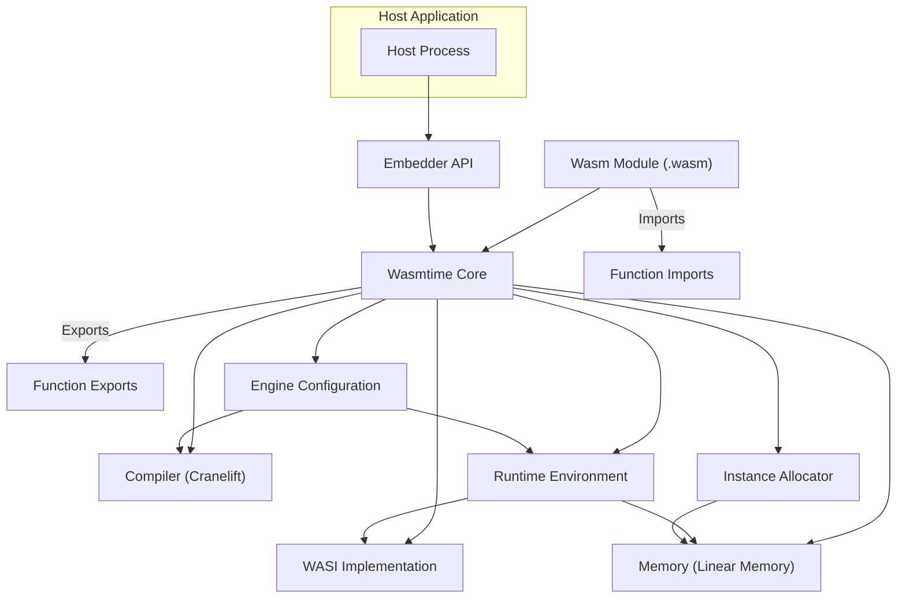
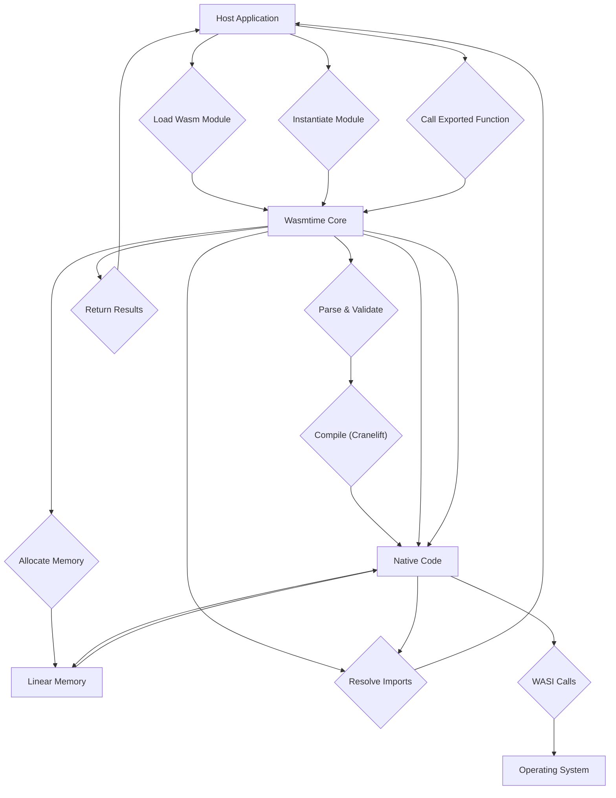

# Project Design Document: Wasmtime

**Version:** 1.1
**Date:** October 26, 2023
**Author:** AI Software Architect

## 1. Introduction

This document provides an enhanced and more detailed design overview of the Wasmtime project, an open-source, standalone runtime for WebAssembly (Wasm). This document is intended to serve as a robust foundation for subsequent threat modeling activities. It comprehensively outlines the key components, architecture, data flow, and security considerations of Wasmtime, providing a deeper understanding of its internal workings.

## 2. Goals and Objectives

The primary goals of Wasmtime are:

*   **Security:** To provide a robust and secure environment for executing untrusted WebAssembly code, minimizing the risk of vulnerabilities and ensuring isolation.
*   **Performance:** To offer high-performance execution of WebAssembly modules, leveraging efficient compilation techniques and runtime optimizations.
*   **Standards Compliance:** To strictly adhere to the latest WebAssembly specifications and emerging standards, ensuring compatibility and interoperability.
*   **Embeddability:** To be easily embeddable into a wide range of host applications and environments, offering flexible integration options.
*   **Flexibility:** To support diverse use cases and integration patterns, catering to various application needs and deployment scenarios.
*   **Resource Efficiency:** To minimize the runtime's resource footprint (CPU, memory) for efficient execution, especially in resource-constrained environments.

## 3. High-Level Architecture

Wasmtime's architecture is centered around the principle of securely and efficiently embedding a Wasm execution environment within a host process. The interconnected components work together to manage the complete lifecycle of Wasm modules.

**Components:**

*   **Host Process:** The encompassing application that embeds and leverages the Wasmtime runtime to execute WebAssembly code. Examples include web browsers, server applications, and IoT device firmware.
*   **Wasm Module (.wasm):** The compiled WebAssembly binary code containing instructions, data, and metadata, ready for execution within the Wasmtime environment.
*   **Wasmtime Core:** The central orchestrator responsible for the entire lifecycle of Wasm instances. This includes loading, validating, compiling, instantiating, and managing the execution of Wasm modules.
*   **Compiler (Cranelift):** A crucial component that performs just-in-time (JIT) compilation, translating the platform-independent Wasm bytecode into highly optimized native machine code specific to the host architecture. Cranelift prioritizes both speed and security during compilation.
*   **Runtime Environment:** Provides the essential infrastructure for executing the compiled Wasm code. This includes managing the call stack, handling function calls (both within Wasm and between Wasm and the host), and overseeing memory management for Wasm instances.
*   **Embedder API:** The well-defined set of functions, data structures, and interfaces that allow the host application to interact with Wasmtime. This API provides functionalities for loading modules, instantiating them, calling exported functions, and managing the Wasmtime engine.
*   **WASI Implementation:** A concrete implementation of the WebAssembly System Interface (WASI), which offers a standardized way for Wasm modules to interact with the underlying operating system in a secure and sandboxed manner. This includes functionalities like file system access, networking, and environment variables, governed by capabilities.
*   **Memory (Linear Memory):** The dedicated memory space allocated for each Wasm instance. This linear memory is directly accessible by the Wasm code and can also be accessed by the host application through the Embedder API, enabling data sharing. Access is strictly controlled to maintain isolation.
*   **Function Imports:** Functions defined and implemented by the host application that are made available to the Wasm module. These imports allow Wasm modules to leverage host functionalities and interact with the external environment.
*   **Function Exports:** Functions defined within the Wasm module that are exposed and can be called by the host application through the Embedder API. This provides a mechanism for the host to invoke functionality within the Wasm module.
*   **Instance Allocator:** Responsible for managing the allocation and deallocation of resources, including memory, for Wasm instances. This component ensures efficient resource utilization and prevents resource leaks.
*   **Engine Configuration:** Allows the host application to configure various aspects of the Wasmtime engine, such as compilation settings, memory limits, and security parameters. This provides flexibility in tailoring Wasmtime's behavior to specific needs.

## 4. Key Components and their Interactions

This section provides a more detailed breakdown of the primary components and their intricate interactions throughout the lifecycle of a Wasm module execution.

*   **Loading Phase:**
    *   The **Host Application** initiates the process by utilizing the **Embedder API** to load a **Wasm Module** from a specified source (e.g., file path, byte array).
    *   The **Wasmtime Core** receives the module data and performs initial parsing and validation to ensure it conforms to the WebAssembly specification.
*   **Compilation Phase:**
    *   The **Wasmtime Core** invokes the **Compiler (Cranelift)** to translate the validated Wasm bytecode into optimized native machine code.
    *   **Cranelift** applies various optimization techniques to generate efficient code while prioritizing security and preventing potential vulnerabilities during the compilation process.
    *   The generated **Native Code** is stored in memory, ready for execution. The **Engine Configuration** can influence the compilation process, such as enabling or disabling certain optimizations.
*   **Instantiation Phase:**
    *   The **Host Application** requests the instantiation of the loaded module through the **Embedder API**.
    *   The **Wasmtime Core** utilizes the **Instance Allocator** to create a new instance of the module, allocating the necessary resources, including **Linear Memory**.
    *   **Function Imports** declared by the Wasm module are resolved to their corresponding implementations provided by the **Host Application**.
*   **Execution Phase:**
    *   The **Host Application** can invoke **Function Exports** of the Wasm instance by calling functions through the **Embedder API**.
    *   The **Runtime Environment** takes control and executes the compiled **Native Code**.
    *   During execution, the Wasm code can interact with the host environment through **Function Imports** and make system calls via the **WASI Implementation**.
    *   Memory access within the Wasm instance is strictly sandboxed and confined to the allocated **Linear Memory**. The **Runtime Environment** enforces these boundaries.
*   **Termination Phase:**
    *   The execution of the Wasm instance concludes, either by reaching a natural termination point or through explicit termination initiated by the host.
    *   The **Wasmtime Core**, guided by the **Instance Allocator**, cleans up all resources associated with the terminated instance, including releasing allocated memory.

## 5. Data Flow

The following diagram and description illustrate the typical flow of data during the execution of a Wasm module within the Wasmtime runtime.

**Detailed Data Flow Description:**

1. The **Host Application** initiates the process by sending a request to **Load Wasm Module** to the **Wasmtime Core**.
2. The **Wasmtime Core** receives the raw module data.
3. The core proceeds to **Parse & Validate** the Wasm bytecode to ensure its structural integrity and adherence to the WebAssembly specification.
4. The validated bytecode is then passed to the **Cranelift compiler**.
5. **Cranelift** performs just-in-time compilation, generating highly optimized **Native Code** for the target architecture.
6. The generated **Native Code** is stored and managed by the **Wasmtime Core**.
7. The **Host Application** requests the **Wasmtime Core** to **Instantiate Module**.
8. The **Wasmtime Core** manages the instantiation process.
9. Part of instantiation involves **Allocate Memory** for the Wasm instance's **Linear Memory**.
10. The **Linear Memory** is the dedicated memory space for the Wasm instance.
11. The **Wasmtime Core** proceeds to **Resolve Imports**, linking function calls from the Wasm module to their implementations in the **Host Application**.
12. During import resolution, there is data exchange between the **Wasmtime Core** and the **Host Application** to establish these links.
13. The **Host Application** can then **Call Exported Function** within the instantiated Wasm module.
14. This call is routed through the **Wasmtime Core**.
15. The **Wasmtime Core** executes the corresponding **Native Code**.
16. During execution, the **Native Code** can access and manipulate data within the **Linear Memory**.
17. The **Native Code** might also interact with the **Linear Memory** to read or write data.
18. If the Wasm code needs to interact with the operating system, it makes **WASI Calls**.
19. These **WASI Calls** are handled by the **WASI Implementation** within Wasmtime, which then interacts with the underlying **Operating System**.
20. The executed code might also call back to **imported functions** previously resolved in the **Host Application**.
21. Finally, the **Wasmtime Core** packages the **Return Results** from the Wasm function execution.
22. The **Return Results** are sent back to the initiating **Host Application**.

## 6. Security Considerations

Security is a paramount design principle in Wasmtime. Several key features and considerations contribute to its secure execution environment:

*   **Sandboxing:** Wasmtime employs robust sandboxing techniques to isolate Wasm instances from the host environment and from each other. This isolation restricts access to system resources and prevents interference between different Wasm modules. Memory access is strictly confined within the allocated **Linear Memory** for each instance.
*   **Memory Safety:** WebAssembly's fundamental design inherently enforces memory safety. Features like bounds checking on memory accesses prevent common vulnerabilities such as buffer overflows and out-of-bounds reads/writes. Cranelift further reinforces memory safety during the compilation process.
*   **Control Flow Integrity (CFI):** Wasm's structured control flow, with well-defined control transfer instructions, makes it significantly harder for malicious code to hijack the execution flow and perform arbitrary code execution.
*   **Capability-Based Security (WASI):** The WebAssembly System Interface (WASI) adopts a capability-based security model. This means that Wasm modules only gain access to specific system resources (like files or network sockets) if they are explicitly granted those capabilities by the host environment. This fine-grained control minimizes the potential damage from compromised modules.
*   **Embedder Responsibility:** While Wasmtime provides a secure foundation, the overall security of the system also depends on the **Host Application's** responsible use of the **Embedder API**. This includes carefully managing imported functions and configuring Wasmtime appropriately.
*   **No Direct System Access by Default:** By default, Wasm modules running within Wasmtime cannot directly access the host operating system's functionalities or file system. Any interaction with the system must go through the **WASI Implementation** or through explicitly provided host imports, both of which offer opportunities for security enforcement.

**Potential Security Concerns (Areas for focused threat modeling):**

*   **Vulnerabilities in Cranelift:** Despite its security focus, potential bugs or vulnerabilities within the **Cranelift compiler** could theoretically be exploited to bypass security measures.
*   **Sandbox Escape Vulnerabilities:**  While Wasmtime's sandboxing is strong, the possibility of undiscovered vulnerabilities that could allow Wasm code to escape the sandbox and gain unauthorized access to the host system needs careful consideration.
*   **Abuse of WASI Capabilities:**  If the **Host Application** grants overly permissive WASI capabilities to a Wasm module, it could potentially be exploited to perform malicious actions within the limits of those granted capabilities.
*   **Security Flaws in Host API Implementations:**  Vulnerabilities in the **Host Application's** implementation of imported functions could be exploited by malicious Wasm code. Careful auditing and secure coding practices are crucial for host-provided imports.
*   **Resource Exhaustion Attacks:**  Malicious Wasm code could be designed to consume excessive resources (CPU, memory, etc.), leading to denial-of-service conditions for the host application. Mechanisms to limit resource consumption are important.
*   **Supply Chain Security:**  The risk of using compromised or malicious Wasm modules from untrusted sources needs to be addressed. Verification and provenance mechanisms can help mitigate this.
*   **Spectre and Meltdown Style Attacks:**  While Wasmtime and Cranelift attempt to mitigate these speculative execution vulnerabilities, they remain a potential concern that requires ongoing attention and mitigation strategies.

## 7. Deployment Model

Wasmtime's flexibility allows for diverse deployment models, catering to various application needs:

*   **Standalone Wasm Runtime:**  The `wasmtime` command-line interface (CLI) provides a convenient way to execute Wasm modules directly from the terminal. This is useful for testing, development, and running simple Wasm applications.
*   **Embedded in Applications:**  Wasmtime is designed to be easily embedded as a library within host applications written in various programming languages. This allows applications to leverage Wasm for plugin systems, sandboxed execution of untrusted code, or performance-critical components. Examples include:
    *   Embedding in Rust applications using the `wasmtime` crate.
    *   Embedding in C/C++ applications via the provided C API.
    *   Embedding in Python applications using the `wasmtime-py` bindings.
*   **Serverless Functions:** Wasmtime can serve as a lightweight and secure runtime environment for serverless functions. Its fast startup times and small footprint make it well-suited for this purpose.
*   **Edge Computing:**  Wasmtime's resource efficiency makes it an excellent choice for deploying and executing applications on resource-constrained edge devices, such as IoT gateways and sensors.
*   **Web Browsers (Future):** While not its primary focus currently, the principles behind Wasmtime could potentially influence future browser implementations or extensions for enhanced Wasm execution.

## 8. Dependencies

Wasmtime relies on a set of key dependencies to function correctly:

*   **Rust:** The primary programming language in which Wasmtime is implemented. The Rust standard library provides core functionalities.
*   **Cranelift:** The powerful and secure code generation backend responsible for compiling Wasm bytecode to native machine code.
*   **WASI SDK:**  Provides headers and libraries necessary for building and interacting with WASI-compliant Wasm modules.
*   **`anyhow`:** A Rust crate for ergonomic error handling.
*   **`object`:** A Rust crate for parsing object files, used for dynamic linking and other purposes.
*   **`serde` and `serde_derive`:** Rust crates for serialization and deserialization, used for configuration and data handling.
*   **Various other Rust crates:**  For tasks such as parsing Wasm binaries, validation, asynchronous operations, and runtime support. These dependencies are managed through Rust's package manager, Cargo.

## 9. Future Considerations

The Wasmtime project is continuously evolving, with several potential future developments and enhancements under consideration:

*   **Further Performance Optimizations:** Ongoing efforts to refine the **Cranelift compiler** and the **Runtime Environment** to achieve even higher performance and lower overhead. This includes exploring new optimization techniques and improving code generation strategies.
*   **Enhanced Security Features:**  Research and implementation of new security mechanisms to further strengthen the sandbox and mitigate emerging threats. This could involve exploring hardware-assisted virtualization or more advanced CFI techniques.
*   **Expanded WASI Support:**  Implementing more proposals from the WebAssembly System Interface (WASI) to provide broader access to operating system functionalities in a standardized and secure manner. This includes areas like networking, threading, and advanced file system operations.
*   **Support for New WebAssembly Features:**  Staying up-to-date with the evolving WebAssembly standard and implementing support for new features and proposals as they become finalized. This ensures compatibility with the latest Wasm modules.
*   **Improved Tooling and Developer Experience:**  Enhancements to the `wasmtime` CLI tool, debugging capabilities, and other developer-facing tools to make it easier to build, test, and debug Wasm applications running on Wasmtime.
*   **Tiered Compilation:** Implementing tiered compilation strategies where frequently executed code is further optimized over time, balancing startup performance with peak performance.
*   **Ahead-of-Time (AOT) Compilation:** Exploring options for ahead-of-time compilation of Wasm modules to native code for specific platforms, potentially improving startup times in certain scenarios.

## 10. Glossary

*   **Wasm (WebAssembly):** A portable, size- and load-time-efficient binary instruction format for a stack-based virtual machine. Designed as a compilation target for high-level languages, enabling near-native performance on the web and other environments.
*   **WASI (WebAssembly System Interface):** A standardized interface that provides WebAssembly modules with access to operating system-like functionalities in a secure and portable way. It employs a capability-based security model.
*   **JIT (Just-In-Time Compilation):** A compilation technique where code is compiled into native machine code during runtime, just before it is executed. This allows for dynamic optimization based on the execution environment.
*   **Linear Memory:** A contiguous block of addressable memory that is allocated to a Wasm instance. This memory is the primary means by which Wasm code stores and manipulates data.
*   **Embedder API:** The set of functions, data structures, and interfaces provided by Wasmtime that allows host applications to interact with and control the Wasm runtime.
*   **Instance:** A runtime representation of a Wasm module that has been loaded into memory and is ready for execution. It includes the module's code, memory, globals, and tables.
*   **Module:** A compiled WebAssembly binary file (`.wasm`) containing the bytecode, data, and metadata of a WebAssembly program.
*   **Cranelift:** The just-in-time compiler used by Wasmtime to translate WebAssembly bytecode into efficient native machine code. It prioritizes both performance and security.