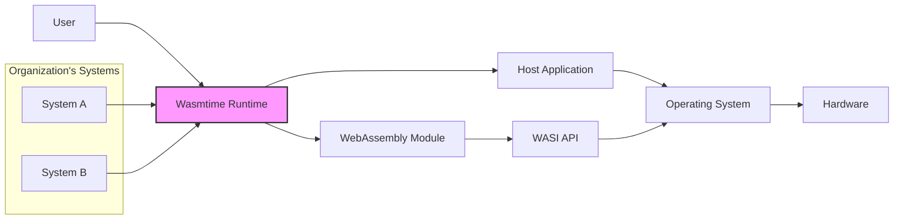
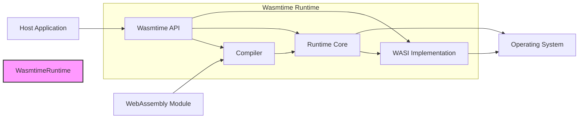
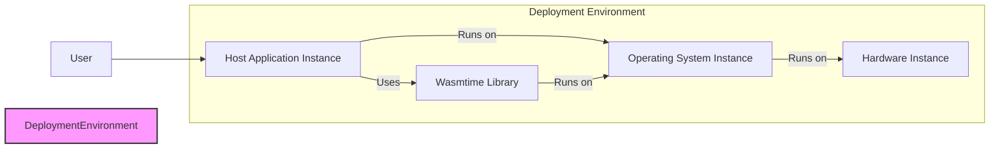
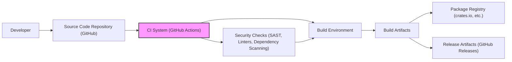

# BUSINESS POSTURE

The Wasmtime project aims to provide a secure, efficient, and embeddable runtime for WebAssembly and WASI. It enables the execution of WebAssembly modules outside of the browser environment, opening up possibilities for server-side applications, embedded systems, and plugin architectures.

- Business priorities:
  - Provide a robust and reliable WebAssembly runtime.
  - Ensure high performance and efficiency in WebAssembly execution.
  - Offer strong security guarantees for executing potentially untrusted WebAssembly code.
  - Enable easy embedding of Wasmtime into various host applications and environments.
  - Foster a vibrant ecosystem around WebAssembly and WASI.

- Business goals:
  - Become the leading standalone WebAssembly runtime.
  - Drive adoption of WebAssembly and WASI in diverse application domains.
  - Establish Wasmtime as a secure and trusted platform for WebAssembly execution.
  - Build a strong community of users and contributors.

- Business risks:
  - Security vulnerabilities in the runtime could lead to exploitation when running untrusted WebAssembly code.
  - Performance bottlenecks could hinder adoption in performance-sensitive applications.
  - Lack of compatibility with emerging WebAssembly standards could limit its usefulness.
  - Competition from other WebAssembly runtimes could reduce market share.
  - Insufficient community support could slow down development and adoption.

# SECURITY POSTURE

- Security controls:
  - security control: Memory safety is a core principle of WebAssembly, which Wasmtime leverages to isolate WebAssembly modules from the host environment and each other. Implemented within the WebAssembly specification and enforced by Wasmtime's execution engine.
  - security control: Capability-based security model through WASI, allowing fine-grained control over WebAssembly module access to host resources. Implemented through WASI API and Wasmtime's WASI implementation.
  - security control: Sandboxing of WebAssembly modules, preventing direct access to host system resources without explicit permission. Implemented by Wasmtime's runtime environment.
  - security control: Regular security audits and vulnerability scanning of the Wasmtime codebase. Described in project's security practices (if publicly available) and general good software development practices.
  - security control: Fuzzing and property-based testing to identify potential vulnerabilities. Part of Wasmtime's testing strategy, likely integrated into CI/CD pipelines.
  - security control: Secure coding practices followed by developers, including code reviews and static analysis. Standard software development practices.

- Accepted risks:
  - accepted risk: Potential for vulnerabilities to be discovered in the WebAssembly specification or Wasmtime's implementation despite security efforts. Mitigation through proactive security measures and responsive vulnerability handling.
  - accepted risk: Risk of denial-of-service attacks if WebAssembly modules can consume excessive resources. Mitigation through resource limits and monitoring within Wasmtime.
  - accepted risk: Supply chain risks associated with dependencies used by Wasmtime. Mitigation through dependency scanning and management practices.

- Recommended security controls:
  - security control: Implement and enforce resource limits (memory, CPU, execution time) for WebAssembly modules to prevent denial-of-service attacks.
  - security control: Integrate static application security testing (SAST) tools into the CI/CD pipeline to automatically detect potential security vulnerabilities in the codebase.
  - security control: Implement dynamic application security testing (DAST) or fuzzing in the CI/CD pipeline to identify runtime vulnerabilities.
  - security control: Establish a clear vulnerability disclosure and response process to handle security issues effectively.
  - security control: Provide guidance and best practices for users on securely embedding and configuring Wasmtime in their applications.

- Security requirements:
  - Authentication: Not directly applicable to Wasmtime itself as it's a runtime environment. Authentication is the responsibility of the host application embedding Wasmtime.
  - Authorization: Wasmtime must enforce the WASI capability-based security model to control WebAssembly module access to host resources. Authorization decisions are made based on WASI permissions granted to modules.
  - Input validation: Wasmtime needs to validate WebAssembly modules to ensure they conform to the WebAssembly specification and prevent malicious or malformed modules from causing issues. Input validation should occur during module loading and instantiation.
  - Cryptography: Wasmtime itself might not directly implement cryptographic primitives, but it should support WebAssembly modules that utilize cryptography. Secure handling of cryptographic keys and operations within WebAssembly modules is important, and WASI-crypto (if used) should be implemented securely.

# DESIGN

## C4 CONTEXT

- Context Diagram Elements:
  - Element:
    - Name: User
    - Type: Person
    - Description: End-user who interacts with applications that embed Wasmtime, indirectly executing WebAssembly modules.
    - Responsibilities: Initiating actions that may trigger execution of WebAssembly modules within host applications.
    - Security controls: User authentication and authorization are handled by the Host Application, not directly by Wasmtime.

  - Element:
    - Name: Host Application
    - Type: Software System
    - Description: Application that embeds the Wasmtime runtime to execute WebAssembly modules. Examples include server applications, embedded systems, or plugin hosts.
    - Responsibilities: Loading, instantiating, and managing WebAssembly modules using Wasmtime. Providing host functions and resources to WebAssembly modules through WASI or custom APIs. Enforcing application-level security policies.
    - Security controls: Input validation of WebAssembly modules before loading. Resource limits for WebAssembly execution. Application-level authentication and authorization for users and modules. Secure configuration of Wasmtime runtime.

  - Element:
    - Name: Wasmtime Runtime
    - Type: Software System
    - Description: Standalone runtime environment for WebAssembly and WASI. Responsible for compiling, optimizing, and executing WebAssembly modules securely and efficiently.
    - Responsibilities: Compiling WebAssembly bytecode to machine code. Enforcing WebAssembly security model (memory safety, sandboxing). Implementing WASI API. Managing module instances and execution. Providing API for host applications to interact with the runtime.
    - Security controls: WebAssembly memory safety and sandboxing. WASI capability-based security. Input validation of WebAssembly modules. Resource management and limits. Secure coding practices in Wasmtime development. Regular security audits and testing.

  - Element:
    - Name: WebAssembly Module
    - Type: Software System
    - Description: A compiled unit of WebAssembly code, potentially from various source languages. Can interact with the host environment through WASI or custom host functions.
    - Responsibilities: Performing computations as instructed by the host application. Interacting with the host environment through defined interfaces.
    - Security controls: WebAssembly's inherent memory safety. Limited access to host resources based on WASI capabilities. Input validation within the module itself (responsibility of module developer).

  - Element:
    - Name: WASI API
    - Type: Interface
    - Description: WebAssembly System Interface, a standardized API for WebAssembly modules to interact with operating system-like functionalities.
    - Responsibilities: Providing a consistent interface for WebAssembly modules to access host resources in a portable and secure manner. Defining capabilities and permissions for resource access.
    - Security controls: Capability-based security model. Fine-grained permissions for accessing host resources. Implemented and enforced by Wasmtime.

  - Element:
    - Name: Operating System
    - Type: Infrastructure
    - Description: Underlying operating system on which Wasmtime and host applications are running. Provides system resources and services.
    - Responsibilities: Providing system calls and resources to Wasmtime and host applications. Enforcing operating system-level security policies.
    - Security controls: Operating system-level security features (e.g., process isolation, access control). Security hardening of the operating system.

  - Element:
    - Name: Hardware
    - Type: Infrastructure
    - Description: Physical hardware on which the operating system, Wasmtime, and host applications are deployed.
    - Responsibilities: Providing computational resources for execution.
    - Security controls: Hardware security features (e.g., secure boot, memory protection). Physical security of hardware.

  - Element:
    - Name: System A, System B
    - Type: Software System
    - Description: External systems that might interact with the Host Application, which in turn might execute WebAssembly modules via Wasmtime. These represent other systems within the organization's ecosystem.
    - Responsibilities: Providing data or services to the Host Application.
    - Security controls: System A and System B will have their own security controls, independent of Wasmtime. Secure communication channels between these systems and the Host Application are important.

## C4 CONTAINER

- Container Diagram Elements:
  - Element:
    - Name: Wasmtime API
    - Type: Library/API
    - Description: Public API exposed by Wasmtime for host applications to interact with the runtime. Provides functions for loading, instantiating, and managing WebAssembly modules, configuring runtime settings, and interacting with WASI.
    - Responsibilities: Providing a programmatic interface for host applications. Handling requests from host applications to load and execute WebAssembly modules. Managing runtime configuration.
    - Security controls: API access control (if applicable in embedding context). Input validation of API calls from host applications. Secure API design to prevent misuse.

  - Element:
    - Name: Compiler
    - Type: Component
    - Description: Responsible for compiling WebAssembly bytecode into optimized machine code for the target architecture. Employs techniques like just-in-time (JIT) compilation or ahead-of-time (AOT) compilation.
    - Responsibilities: WebAssembly bytecode parsing and validation. Code optimization and generation. Ensuring secure compilation process.
    - Security controls: Input validation of WebAssembly bytecode. Compiler hardening to prevent vulnerabilities. Secure code generation to maintain memory safety and sandboxing.

  - Element:
    - Name: Runtime Core
    - Type: Component
    - Description: Core execution engine of Wasmtime. Manages the execution of compiled WebAssembly code. Enforces WebAssembly's memory safety and sandboxing. Handles module instantiation, function calls, and memory management.
    - Responsibilities: Secure and efficient execution of WebAssembly code. Enforcing memory safety and sandboxing. Managing module instances and execution context. Resource management during execution.
    - Security controls: Memory safety mechanisms enforced by WebAssembly. Sandboxing and isolation of WebAssembly modules. Resource limits and monitoring during execution.

  - Element:
    - Name: WASI Implementation
    - Type: Component
    - Description: Implementation of the WebAssembly System Interface (WASI) within Wasmtime. Provides concrete implementations of WASI APIs for interacting with the host operating system.
    - Responsibilities: Implementing WASI standard APIs. Translating WASI calls to operating system calls. Enforcing WASI capability-based security.
    - Security controls: Capability-based security enforcement for WASI APIs. Input validation of WASI calls. Secure implementation of WASI APIs to prevent vulnerabilities.

  - Element:
    - Name: Host Application
    - Type: Software System
    - Description: Application embedding Wasmtime, as described in the Context Diagram.
    - Responsibilities: Interacting with Wasmtime API to load and execute WebAssembly modules. Providing host functions and resources.
    - Security controls: Same as described in Context Diagram.

  - Element:
    - Name: WebAssembly Module
    - Type: Software System
    - Description: WebAssembly module to be executed, as described in the Context Diagram.
    - Responsibilities: Performing computations.
    - Security controls: Same as described in Context Diagram.

  - Element:
    - Name: Operating System
    - Type: Infrastructure
    - Description: Underlying operating system, as described in the Context Diagram.
    - Responsibilities: Providing system resources.
    - Security controls: Same as described in Context Diagram.

## DEPLOYMENT

Wasmtime can be deployed in various ways depending on the use case. Common deployment scenarios include:

1.  **As a library embedded in host applications:** Host applications link against the Wasmtime library and use its API to execute WebAssembly modules. This is common for applications requiring plugin functionality or embedding WebAssembly for specific tasks.
2.  **As a standalone CLI tool:** Wasmtime CLI can be used to execute WebAssembly modules directly from the command line. This is useful for development, testing, and scripting scenarios.
3.  **As part of a larger platform or service:** Wasmtime can be integrated into cloud platforms, serverless functions, or other services to provide WebAssembly execution capabilities.

For detailed description, let's consider deployment scenario **1. As a library embedded in host applications**.

- Deployment Diagram Elements:
  - Element:
    - Name: Host Application Instance
    - Type: Software Instance
    - Description: A running instance of the host application that embeds the Wasmtime library.
    - Responsibilities: Executing application logic and managing Wasmtime library. Handling user requests.
    - Security controls: Application-level security controls (authentication, authorization, input validation). Secure configuration of the host application instance. Monitoring and logging.

  - Element:
    - Name: Wasmtime Library
    - Type: Software Library
    - Description: The Wasmtime runtime library linked into the host application.
    - Responsibilities: Providing WebAssembly runtime functionality to the host application.
    - Security controls: Security controls inherent in Wasmtime's design and implementation (memory safety, sandboxing, WASI security).

  - Element:
    - Name: Operating System Instance
    - Type: Infrastructure Instance
    - Description: A running instance of the operating system on which the host application and Wasmtime library are deployed.
    - Responsibilities: Providing system resources and services to the host application and Wasmtime.
    - Security controls: Operating system-level security controls (access control, process isolation, security patches). Security hardening of the operating system instance.

  - Element:
    - Name: Hardware Instance
    - Type: Infrastructure Instance
    - Description: Physical or virtual hardware on which the operating system instance is running.
    - Responsibilities: Providing computational resources.
    - Security controls: Hardware security features. Physical security of hardware.

  - Element:
    - Name: User
    - Type: Person
    - Description: End-user interacting with the host application.
    - Responsibilities: Interacting with the application.
    - Security controls: User authentication and authorization managed by the host application.

## BUILD

- Build Process Elements:
  - Element:
    - Name: Developer
    - Type: Person
    - Description: Software developer contributing to the Wasmtime project.
    - Responsibilities: Writing code, committing changes to the source code repository.
    - Security controls: Developer workstations should be secured. Code reviews to ensure code quality and security.

  - Element:
    - Name: Source Code Repository (GitHub)
    - Type: Software System
    - Description: GitHub repository hosting the Wasmtime source code.
    - Responsibilities: Version control, code storage, collaboration platform.
    - Security controls: Access control to the repository. Branch protection policies. Audit logging of changes.

  - Element:
    - Name: CI System (GitHub Actions)
    - Type: Software System
    - Description: Continuous Integration system used to automate the build, test, and release process. Likely GitHub Actions for a GitHub repository.
    - Responsibilities: Automated build process. Running tests. Performing security checks. Publishing build artifacts.
    - Security controls: Secure configuration of CI pipelines. Access control to CI system. Secrets management for credentials.

  - Element:
    - Name: Build Environment
    - Type: Infrastructure
    - Description: Environment where the code is compiled and built. Could be containerized or virtualized.
    - Responsibilities: Providing a consistent and reproducible build environment.
    - Security controls: Hardened build environment. Regularly updated build tools and dependencies. Isolation of build environments.

  - Element:
    - Name: Security Checks (SAST, Linters, Dependency Scanning)
    - Type: Software System
    - Description: Automated security tools integrated into the CI pipeline to perform static analysis, linting, and dependency vulnerability scanning.
    - Responsibilities: Identifying potential security vulnerabilities in the code and dependencies. Enforcing coding standards.
    - Security controls: Regularly updated security scanning tools and vulnerability databases. Configuration of tools to match security requirements.

  - Element:
    - Name: Build Artifacts
    - Type: Data
    - Description: Compiled binaries, libraries, and other outputs of the build process.
    - Responsibilities: Representing the build output.
    - Security controls: Integrity checks (e.g., checksums) for build artifacts. Secure storage of build artifacts.

  - Element:
    - Name: Package Registry (crates.io, etc.)
    - Type: Software System
    - Description: Package registry where Wasmtime libraries and tools are published (e.g., crates.io for Rust crates).
    - Responsibilities: Hosting and distributing Wasmtime packages.
    - Security controls: Package signing and verification. Access control to publish packages.

  - Element:
    - Name: Release Artifacts (GitHub Releases)
    - Type: Data
    - Description: Release binaries and source code archives published on GitHub Releases.
    - Responsibilities: Providing official releases of Wasmtime.
    - Security controls: Signing of release artifacts. Secure storage and distribution of release artifacts.

# RISK ASSESSMENT

- Critical business processes:
  - Secure execution of WebAssembly code is the primary critical process. Failure to ensure security could lead to vulnerabilities in applications embedding Wasmtime.
  - Reliable and performant execution of WebAssembly code is also critical for adoption and usability.

- Data being protected and sensitivity:
  - WebAssembly modules themselves are code and potentially contain sensitive logic or algorithms. Intellectual property within modules needs protection.
  - Data processed by WebAssembly modules within the runtime. Sensitivity depends on the application context. Wasmtime aims to provide isolation, but data confidentiality and integrity within modules are application's responsibility.
  - Wasmtime codebase itself. Integrity and confidentiality of the source code are important to prevent malicious modifications and maintain trust.

# QUESTIONS & ASSUMPTIONS

- Questions:
  - What are the specific resource limits enforced by Wasmtime (CPU, memory, execution time)? Are these configurable?
  - What SAST/DAST tools are currently used in the Wasmtime CI pipeline?
  - Is there a formal vulnerability disclosure and response process in place for Wasmtime?
  - What are the guidelines and best practices for users embedding Wasmtime securely?
  - Are there specific security certifications or compliance standards that Wasmtime aims to achieve?

- Assumptions:
  - Wasmtime prioritizes security as a core design principle.
  - The development team follows secure coding practices.
  - The project has some form of automated security testing in place.
  - Users embedding Wasmtime are responsible for application-level security controls and configuration.
  - WASI capability-based security is a key mechanism for authorization in Wasmtime.