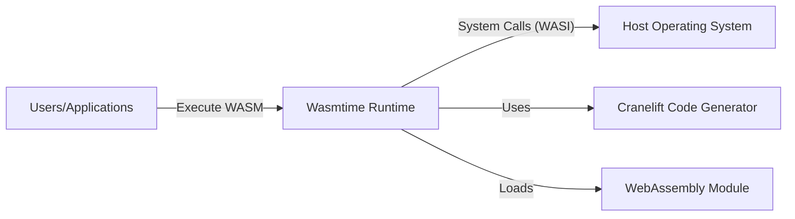
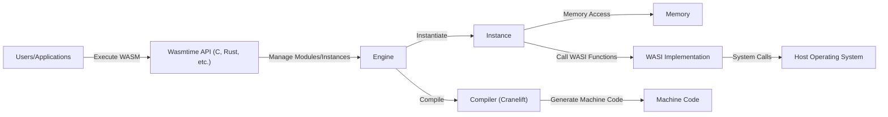
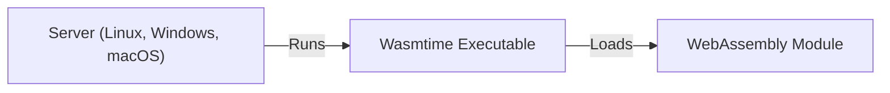
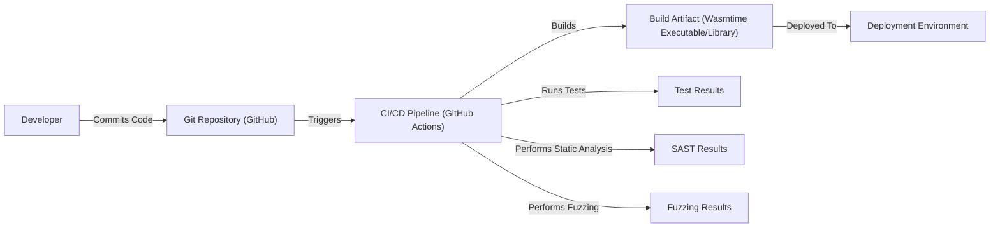

# BUSINESS POSTURE

Wasmtime is a standalone wasm-only runtime for WebAssembly and WASI, developed by the Bytecode Alliance. It aims to provide a fast, secure, and efficient way to execute WebAssembly code outside of web browsers. This is crucial for server-side applications, embedded systems, and other environments where WebAssembly's portability and sandboxed execution are beneficial.

Business priorities and goals:

- Provide a secure and reliable runtime for WebAssembly.
- Enable the use of WebAssembly in various non-browser environments.
- Foster the growth and adoption of WebAssembly as a universal runtime.
- Offer a performant alternative to existing runtime solutions.
- Maintain a high level of compatibility with WebAssembly and WASI standards.

Most important business risks:

- Security vulnerabilities in the runtime could lead to exploits and compromise of host systems.
- Performance issues could hinder adoption and limit the applicability of Wasmtime.
- Incompatibility with evolving WebAssembly/WASI standards could fragment the ecosystem.
- Lack of features or tooling could make Wasmtime less attractive than competing solutions.
- Failure to maintain a strong community and contributor base could slow down development and innovation.

# SECURITY POSTURE

Existing security controls and accepted risks (based on the provided repository and general knowledge of similar projects):

- security control: Sandboxed execution: WebAssembly code runs in a sandboxed environment, limiting its access to the host system. Implemented within the Wasmtime runtime itself.
- security control: Memory safety: WebAssembly's linear memory model and runtime checks help prevent memory corruption vulnerabilities. Implemented within the Wasmtime runtime.
- security control: Control flow integrity: WebAssembly's structured control flow and validation process help prevent control flow hijacking attacks. Implemented within the Wasmtime runtime.
- security control: Regular security audits and code reviews: The Bytecode Alliance likely conducts regular security audits and code reviews to identify and address vulnerabilities. Described in security policies and development practices.
- security control: Fuzzing: Continuous fuzzing is used to discover potential vulnerabilities. Mentioned in the repository and likely integrated into the CI/CD pipeline.
- security control: Static analysis: Static analysis tools are used to identify potential security issues during development. Likely integrated into the CI/CD pipeline.
- accepted risk: Potential for unknown vulnerabilities: Despite security measures, there's always a risk of undiscovered vulnerabilities in complex software like Wasmtime.
- accepted risk: Reliance on external dependencies: Wasmtime depends on external libraries (e.g., Cranelift, WASI implementations), which could introduce vulnerabilities.
- accepted risk: Performance trade-offs for security: Some security features might introduce performance overhead, which needs to be carefully balanced.

Recommended security controls:

- security control: Implement a comprehensive Software Bill of Materials (SBOM) management system to track all dependencies and their vulnerabilities.
- security control: Establish a clear vulnerability disclosure and response process.
- security control: Integrate dynamic analysis tools (e.g., sanitizers) into the testing process.
- security control: Explore formal verification techniques for critical components of the runtime.

Security requirements:

- Authentication: Not directly applicable to the Wasmtime runtime itself, as it executes WebAssembly modules. Authentication would be handled by the application embedding Wasmtime or within the WebAssembly module itself.
- Authorization: Wasmtime should enforce the capabilities-based security model of WASI, restricting access to system resources based on granted capabilities.
- Input validation: Wasmtime should validate WebAssembly modules during loading to ensure they conform to the specification and do not contain malicious code. Input validation within the WebAssembly module is the responsibility of the module's developer.
- Cryptography: Wasmtime itself doesn't provide cryptographic primitives. WebAssembly modules can use WASI-crypto or other WASI extensions for cryptographic operations. Wasmtime should ensure the secure execution of these extensions.

# DESIGN

## C4 CONTEXT

Element descriptions:

-   Name: Users/Applications
    -   Type: External Entity
    -   Description: Applications or users that utilize Wasmtime to execute WebAssembly modules.
    -   Responsibilities: Provide WebAssembly modules to Wasmtime for execution; Handle results and outputs from Wasmtime.
    -   Security controls: Not directly applicable, as this is an external entity. Security relies on the application's own security practices and the security of the WebAssembly modules it uses.

-   Name: Wasmtime Runtime
    -   Type: System
    -   Description: The core runtime environment for executing WebAssembly modules.
    -   Responsibilities: Load, validate, and execute WebAssembly modules; Provide a sandboxed execution environment; Manage memory and resources; Interface with the host operating system through WASI.
    -   Security controls: Sandboxed execution, Memory safety, Control flow integrity, Regular security audits, Fuzzing, Static analysis.

-   Name: Host Operating System
    -   Type: External System
    -   Description: The underlying operating system on which Wasmtime runs.
    -   Responsibilities: Provide system resources (memory, CPU, I/O) to Wasmtime; Enforce OS-level security controls.
    -   Security controls: OS-level security mechanisms (e.g., process isolation, user permissions).

-   Name: Cranelift Code Generator
    -   Type: External Library
    -   Description: A code generator used by Wasmtime to compile WebAssembly code into native machine code.
    -   Responsibilities: Generate efficient and secure machine code from WebAssembly bytecode.
    -   Security controls: Cranelift's own security measures and testing.

-   Name: WebAssembly Module
    -   Type: Data
    -   Description: The WebAssembly module (.wasm file) containing the code to be executed.
    -   Responsibilities: Contain the application logic to be executed by Wasmtime.
    -   Security controls: Relies on the security of the WebAssembly code itself and the sandboxing provided by Wasmtime.

## C4 CONTAINER

Element descriptions:

-   Name: Users/Applications
    -   Type: External Entity
    -   Description: Applications or users interacting with the Wasmtime API.
    -   Responsibilities: Use the Wasmtime API to load, configure, and execute WebAssembly modules.
    -   Security controls: Not directly applicable; relies on application-level security.

-   Name: Wasmtime API (C, Rust, etc.)
    -   Type: API
    -   Description: The public API exposed by Wasmtime for embedding and interacting with the runtime.
    -   Responsibilities: Provide a stable and secure interface for interacting with Wasmtime; Handle input validation and error handling.
    -   Security controls: API-level input validation, error handling, and access control.

-   Name: Engine
    -   Type: Component
    -   Description: The core component responsible for managing the lifecycle of WebAssembly modules and instances.
    -   Responsibilities: Load and validate modules; Create and manage instances; Coordinate compilation and execution.
    -   Security controls: Module validation, resource management, and internal security checks.

-   Name: Compiler (Cranelift)
    -   Type: Component
    -   Description: The component responsible for compiling WebAssembly bytecode into native machine code.
    -   Responsibilities: Generate efficient and secure machine code; Perform optimizations.
    -   Security controls: Cranelift's internal security mechanisms and testing.

-   Name: Instance
    -   Type: Component
    -   Description: A runtime instance of a WebAssembly module.
    -   Responsibilities: Execute the WebAssembly code; Manage the module's memory and state; Interact with the WASI implementation.
    -   Security controls: Sandboxed execution, memory safety, control flow integrity.

-   Name: Memory
    -   Type: Component
    -   Description: The linear memory allocated for a WebAssembly instance.
    -   Responsibilities: Store the data used by the WebAssembly module.
    -   Security controls: Memory isolation, bounds checking, and protection mechanisms.

-   Name: WASI Implementation
    -   Type: Component
    -   Description: The implementation of the WebAssembly System Interface (WASI).
    -   Responsibilities: Provide a standardized interface for WebAssembly modules to interact with the host system; Enforce capabilities-based security.
    -   Security controls: Capabilities-based access control, input validation, and sandboxing of system calls.

-   Name: Host Operating System
    -   Type: External System
    -   Description: The underlying operating system.
    -   Responsibilities: Provide system resources and services.
    -   Security controls: OS-level security mechanisms.

-   Name: Machine Code
    -   Type: Data
    -   Description: Native machine code generated by the compiler.
    -   Responsibilities: Execute WebAssembly instructions.
    -   Security controls: Relies on the correctness and security of the compiler.

## DEPLOYMENT

Possible deployment solutions:

1.  Standalone executable: Wasmtime can be compiled into a standalone executable that can be deployed on various operating systems.
2.  Embedded library: Wasmtime can be embedded as a library within other applications.
3.  Containerized deployment: Wasmtime can be deployed within containers (e.g., Docker) for isolation and portability.
4.  Serverless platforms: Wasmtime can be used as a runtime for serverless functions.

Chosen deployment solution (Standalone executable):

Element descriptions:

-   Name: Server (Linux, Windows, macOS)
    -   Type: Infrastructure Node
    -   Description: A physical or virtual server running a supported operating system.
    -   Responsibilities: Provide the hardware and OS environment for running Wasmtime.
    -   Security controls: OS-level security controls, network security, physical security (if applicable).

-   Name: Wasmtime Executable
    -   Type: Software System Instance
    -   Description: The compiled Wasmtime runtime executable.
    -   Responsibilities: Execute WebAssembly modules.
    -   Security controls: Sandboxed execution, memory safety, control flow integrity, etc. (as described in previous sections).

-   Name: WebAssembly Module
    -   Type: Data
    -   Description: The WebAssembly module to be executed.
    -   Responsibilities: Contain the application logic.
    -   Security controls: Relies on the security of the WebAssembly code and Wasmtime's sandboxing.

## BUILD

Build process description:

1.  Developers commit code to the Git repository (GitHub).
2.  The CI/CD pipeline (GitHub Actions) is triggered by new commits.
3.  The pipeline builds the Wasmtime executable/library from source.
4.  The pipeline runs various tests (unit tests, integration tests, etc.) and reports the results.
5.  Static analysis tools (e.g., linters, code analyzers) are executed to identify potential code quality and security issues.
6.  Fuzzing is performed to discover potential vulnerabilities.
7.  If all checks pass, the build artifacts (Wasmtime executable/library) are created and potentially deployed to a deployment environment.

Security controls in the build process:

-   security control: CI/CD pipeline: Automates the build and testing process, ensuring consistency and repeatability.
-   security control: Static analysis: Identifies potential code quality and security issues early in the development cycle.
-   security control: Fuzzing: Discovers potential vulnerabilities by providing invalid or unexpected inputs to the runtime.
-   security control: Dependency management: Tools like Cargo (for Rust) manage dependencies and can help identify vulnerable dependencies.
-   security control: Code signing: Build artifacts can be signed to ensure their integrity and authenticity. (Not explicitly mentioned in the repository, but a recommended practice).

# RISK ASSESSMENT

Critical business processes to protect:

-   Execution of WebAssembly modules: Ensuring the secure and reliable execution of WebAssembly code is the core function of Wasmtime.
-   Development and maintenance of Wasmtime: Maintaining the codebase, addressing vulnerabilities, and adding new features are crucial for the long-term viability of the project.
-   Community engagement: Fostering a strong community of users and contributors is essential for the growth and adoption of Wasmtime.

Data to protect and their sensitivity:

-   WebAssembly modules (provided by users): Sensitivity varies depending on the application. Could contain proprietary code, sensitive data, or intellectual property. Wasmtime's responsibility is to provide a secure execution environment, but the data's confidentiality and integrity within the module are the responsibility of the module's developer.
-   Wasmtime source code: Publicly available, but its integrity is crucial to prevent the introduction of malicious code.
-   Build artifacts: Must be protected from tampering to ensure that users are running trusted versions of Wasmtime.
-   Security reports and vulnerability information: Must be handled confidentially to prevent premature disclosure of vulnerabilities.

# QUESTIONS & ASSUMPTIONS

Questions:

-   What is the specific threat model used for Wasmtime development (if any)?
-   What are the specific performance targets and benchmarks for Wasmtime?
-   What are the plans for supporting emerging WebAssembly features and proposals?
-   What is the process for handling security vulnerabilities reported by external researchers?
-   Are there any specific compliance requirements (e.g., regulatory) that Wasmtime needs to meet?

Assumptions:

-   BUSINESS POSTURE: The Bytecode Alliance prioritizes security and is committed to maintaining a secure runtime.
-   BUSINESS POSTURE: Performance is a key consideration, but security will not be compromised for performance gains.
-   SECURITY POSTURE: Regular security audits and code reviews are conducted.
-   SECURITY POSTURE: Fuzzing is integrated into the CI/CD pipeline.
-   DESIGN: The provided repository is the primary source of truth for the design and implementation of Wasmtime.
-   DESIGN: The WASI implementation used by Wasmtime is secure and well-maintained.
-   DESIGN: Developers follow secure coding practices.