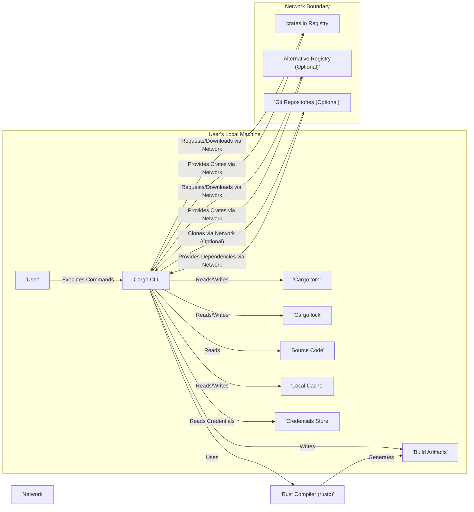

# Project Design Document: Cargo - The Rust Package Manager

**Version:** 1.1
**Date:** October 26, 2023
**Author:** AI Software Architect

## 1. Introduction

This document provides an enhanced high-level design overview of Cargo, the build system and package manager for the Rust programming language. This document is specifically tailored to serve as a robust foundation for subsequent threat modeling activities. It details the key components, data flows, and external dependencies of Cargo with a focus on security-relevant aspects.

### 1.1. Goals

* Provide a clear, concise, and detailed description of Cargo's architecture, emphasizing security boundaries and interactions.
* Identify the major components and their interactions, highlighting potential security implications.
* Outline the data flow within the system, focusing on sensitive data and potential manipulation points.
* Highlight external dependencies and integrations, detailing communication protocols and authentication mechanisms.
* Serve as a comprehensive and actionable basis for identifying potential security threats, vulnerabilities, and attack vectors.

### 1.2. Scope

This document covers the core functionalities of Cargo, including:

* Package management (dependency resolution, downloading, verification, installation).
* Building Rust projects (compilation, linking, build script execution).
* Running tests and benchmarks.
* Publishing and managing crates on crates.io (authentication, authorization, upload process).
* Project initialization and management (template handling).
* Handling of alternative registries.

This document focuses on the interactions and interfaces of Cargo and its dependencies. Internal implementation details of the Rust compiler (`rustc`) and the crates.io registry infrastructure are only discussed where they directly impact Cargo's security posture.

### 1.3. Target Audience

This document is intended for:

* Security engineers and architects responsible for threat modeling and security assessments.
* Development teams building and maintaining Cargo.
* Security researchers investigating potential vulnerabilities in the Rust ecosystem.
* Operations teams managing infrastructure related to Cargo usage.

## 2. System Architecture

Cargo operates as a command-line tool with interactions spanning local resources and remote services. The following diagram illustrates the high-level architecture, emphasizing data flow and trust boundaries:

### 2.1. Key Components

* **Cargo CLI:** The primary interface for users. It handles command parsing, project management, dependency resolution, build orchestration, and interaction with external resources. Security considerations include input validation, secure handling of credentials, and preventing command injection.
* **Cargo.toml:** The project manifest file. Security risks involve potential for malicious or misleading metadata, dependency specification vulnerabilities, and build script definitions that could execute arbitrary code.
* **Cargo.lock:** The dependency lock file. Ensuring the integrity of this file is crucial for reproducible builds and preventing dependency substitution attacks.
* **Source Code:** The project's Rust source files. While not directly a Cargo component, Cargo manages its compilation, and vulnerabilities in the source code are a primary concern.
* **Local Cache:** Stores downloaded crates and build artifacts. Security risks include cache poisoning, where malicious actors could replace legitimate packages with compromised ones. Integrity checks are vital here.
* **Build Artifacts:** The output of the build process. Security considerations involve ensuring the integrity and provenance of these artifacts.
* **Credentials Store:**  Stores authentication tokens for interacting with registries like crates.io. Secure storage and access control are paramount.
* **crates.io Registry:** The central repository for Rust crates. Security concerns include supply chain attacks, account takeovers, and vulnerabilities in the registry itself. Cargo's interaction needs to be secure and validated.
* **Alternative Registry (Optional):**  Allows using private or alternative crate registries. Introduces similar security considerations as crates.io, requiring careful configuration and trust management.
* **Git Repositories (Optional):**  Source for dependencies. Security risks include compromised repositories, man-in-the-middle attacks during cloning, and reliance on the security of the Git hosting platform.
* **Rust Compiler (rustc):**  Compiles Rust code. While external to Cargo, vulnerabilities in the compiler could be exploited during the build process. Cargo relies on the integrity of the installed `rustc`.
* **Network:** The communication channel for interacting with remote resources. Secure protocols (HTTPS, SSH) and certificate validation are essential.

## 3. Data Flow

This section details the flow of data during key Cargo operations, highlighting potential security implications at each stage.

### 3.1. Dependency Resolution and Download

1. **Input:** User initiates a build or adds a dependency. Cargo CLI reads `Cargo.toml`.
2. **Resolution:** Cargo analyzes dependencies in `Cargo.toml`. This involves network requests to registries (crates.io or alternative) to fetch crate metadata and version information. *Security Consideration: Ensure HTTPS is used and server certificates are validated to prevent man-in-the-middle attacks. Be aware of potential for dependency confusion if multiple registries are configured.*
3. **Lock File Update:** Cargo updates `Cargo.lock` with the resolved dependency versions. *Security Consideration:  Protect `Cargo.lock` from unauthorized modification to prevent pinning to vulnerable versions.*
4. **Download:** Cargo downloads crate files (typically `.crate` files) from the specified registry. *Security Consideration: Verify the integrity of downloaded crates using checksums (if available) to prevent tampering. Be aware of potential vulnerabilities in the registry's CDN or storage mechanisms.*
5. **Caching:** Downloaded crates are stored in the local cache. *Security Consideration: Implement measures to prevent cache poisoning. Consider content addressing or strong integrity checks for cached files.*

### 3.2. Building a Project

1. **Input:** User executes `cargo build`. Cargo CLI reads `Cargo.toml` and `Cargo.lock`.
2. **Dependency Retrieval:** Cargo retrieves necessary dependencies from the local cache or downloads them if not present.
3. **Compilation:** Cargo invokes the Rust compiler (`rustc`) with the project's source code and dependencies. *Security Consideration: Be aware of potential vulnerabilities in the Rust compiler itself. Build scripts defined in `Cargo.toml` execute arbitrary code and represent a significant security risk. Isolate build environments where possible.*
4. **Artifact Generation:** `rustc` generates build artifacts in the target directory. *Security Consideration: Ensure appropriate permissions are set on build artifacts to prevent unauthorized access or modification.*

### 3.3. Publishing a Crate

1. **Input:** User executes `cargo publish`.
2. **Authentication:** Cargo authenticates the user with the target registry (typically crates.io) using stored credentials. *Security Consideration: Securely manage and store API tokens. Use strong authentication mechanisms and consider multi-factor authentication where available.*
3. **Package Preparation:** Cargo packages the crate's source code and metadata. *Security Consideration: Ensure that only intended files are included in the published crate. Prevent accidental inclusion of sensitive information.*
4. **Upload:** Cargo uploads the packaged crate to the registry via a network connection. *Security Consideration: Use HTTPS for secure communication. Implement measures to prevent replay attacks or unauthorized uploads.*
5. **Registry Processing:** The registry processes the uploaded crate. *Security Consideration:  This stage is outside of Cargo's direct control, but understanding the registry's security practices is important.*

## 4. External Dependencies and Integrations

Cargo's functionality relies on several external systems and services, each introducing potential security considerations:

* **crates.io Registry:**
    * **Protocol:** HTTPS
    * **Authentication:** API tokens
    * **Security Considerations:** Supply chain attacks, account compromise, registry vulnerabilities, data integrity.
* **Alternative Registries:**
    * **Protocol:** Typically HTTPS, but may vary.
    * **Authentication:** Varies depending on the registry (API keys, basic auth, etc.).
    * **Security Considerations:** Similar to crates.io, but security posture depends on the specific registry implementation. Trust relationships need careful management.
* **Git Repositories:**
    * **Protocol:** HTTPS, SSH
    * **Authentication:** SSH keys, HTTPS credentials (if required)
    * **Security Considerations:** Repository compromise, man-in-the-middle attacks, reliance on the security of the Git hosting platform. Submodule handling can introduce further complexity.
* **Rust Compiler (`rustc`):**
    * **Protocol:** Local execution.
    * **Security Considerations:** Vulnerabilities in the compiler itself. Ensure the compiler is obtained from a trusted source and is regularly updated.
* **Network Infrastructure:**
    * **Protocol:** TCP/IP, HTTPS, SSH
    * **Security Considerations:** General network security threats, including eavesdropping and tampering.
* **Operating System:**
    * **Protocol:** System calls.
    * **Security Considerations:**  Reliance on the security of the underlying operating system for file system access, process isolation, and network operations.

## 5. Security Considerations (Detailed)

This section expands on the initial security considerations, providing more specific examples and potential threats.

* **Supply Chain Security:**
    * **Threat:** Malicious crates with backdoors or vulnerabilities being introduced as dependencies.
    * **Mitigation:**  Dependency review, using tools for vulnerability scanning, considering alternative registries with stricter vetting processes, using `Cargo.lock` and verifying its integrity.
* **Dependency Confusion:**
    * **Threat:**  Attackers publishing malicious crates with names similar to private dependencies, leading to accidental inclusion.
    * **Mitigation:**  Careful configuration of registry sources, using private registries for internal dependencies, and potentially using namespace prefixes.
* **crates.io Account Takeover:**
    * **Threat:**  Attackers gaining access to developer accounts and publishing malicious crate updates.
    * **Mitigation:**  Strong passwords, multi-factor authentication, and monitoring of account activity.
* **Local Cache Poisoning:**
    * **Threat:**  Attackers gaining access to the local cache and replacing legitimate crates with malicious ones.
    * **Mitigation:**  Appropriate file system permissions, integrity checks for cached files, and potentially using containerization or sandboxing.
* **`Cargo.toml` and `Cargo.lock` Manipulation:**
    * **Threat:**  Attackers modifying these files to introduce malicious dependencies or pin to vulnerable versions.
    * **Mitigation:**  Version control, code review, and ensuring appropriate file system permissions.
* **Build Script Execution:**
    * **Threat:**  Malicious code embedded in build scripts that executes during the build process.
    * **Mitigation:**  Careful review of build scripts, sandboxing build environments, and potentially disabling build script execution for trusted dependencies.
* **Network Attacks:**
    * **Threat:**  Man-in-the-middle attacks during dependency downloads or crate publishing.
    * **Mitigation:**  Enforcing HTTPS, validating server certificates, and using secure network connections.
* **Vulnerabilities in `rustc`:**
    * **Threat:**  Exploiting vulnerabilities in the Rust compiler to inject malicious code during compilation.
    * **Mitigation:**  Using trusted and up-to-date versions of the Rust compiler.
* **Credentials Management:**
    * **Threat:**  Exposure or theft of API tokens used for interacting with registries.
    * **Mitigation:**  Secure storage of credentials (e.g., using operating system keychains), avoiding committing credentials to version control, and using environment variables or dedicated credential management tools.

## 6. Conclusion

This enhanced design document provides a more detailed and security-focused overview of Cargo's architecture, data flow, and external dependencies. It highlights potential security considerations and threats that should be further explored during the threat modeling process. This document serves as a valuable resource for security engineers, developers, and anyone involved in ensuring the security of Rust projects and the broader Rust ecosystem.