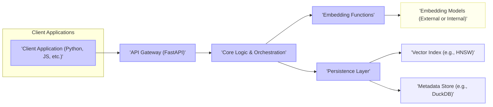
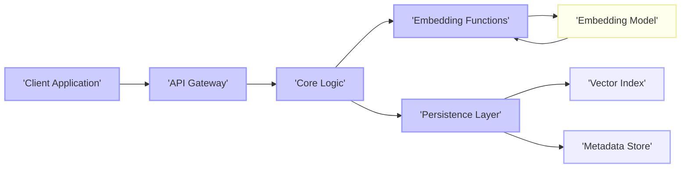
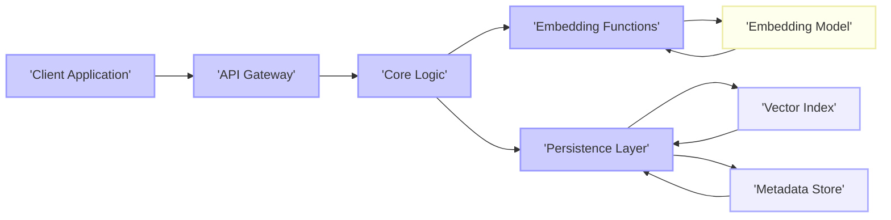

# Project Design Document: Chroma - An AI-native open-source embedding database

**Version:** 1.1
**Date:** October 26, 2023
**Author:** AI Architecture Expert

## 1. Introduction

This document provides an enhanced design overview of the Chroma project, an open-source embedding database. It details the system's architecture, key components, data flow, and critical considerations for security and deployment. This refined document is intended to serve as a robust foundation for subsequent threat modeling activities.

## 2. Goals and Objectives

The primary goals of the Chroma project are to:

*   Offer a user-friendly interface for storing and querying vector embeddings.
*   Provide a scalable and performant solution for managing extensive embedding datasets.
*   Enable efficient similarity search and retrieval based on vector embeddings.
*   Support a diverse range of embedding models and data types.
*   Facilitate seamless integration into AI/ML workflows and applications.
*   Maintain an open-source and community-driven development approach.

## 3. High-Level Architecture

The Chroma system is structured around the following core components:

*   **Client Applications:** These are external applications or services that interact with Chroma to manage embeddings. They utilize provided client libraries in languages like Python and JavaScript.
*   **API Gateway (FastAPI):** This component serves as the entry point for all external interactions with Chroma. It handles request routing, and potentially authentication and data serialization.
*   **Core Logic & Orchestration:** This central component manages the processing of requests, coordinating interactions between other components, and overseeing the overall workflow of embedding operations.
*   **Embedding Functions:** This component is responsible for generating vector embeddings from input data. It can leverage external embedding models or utilize internal embedding capabilities.
*   **Persistence Layer:** This layer manages the storage of vector embeddings and their associated metadata. It comprises two key sub-components:
    *   **Vector Index:** A specialized data structure (e.g., Hierarchical Navigable Small Worlds - HNSW) optimized for rapid similarity searches.
    *   **Metadata Store:** A database (e.g., DuckDB) used to store structured metadata linked to the embeddings.
*   **Embedding Models (External or Internal):** These are the models used to create the vector embeddings. They can be hosted externally via APIs (e.g., OpenAI Embeddings API) or be integrated directly within the Chroma system.

## 4. Detailed Component Design

### 4.1. Client Applications

*   **Responsibilities:**
    *   Constructing and sending requests to the Chroma API to store embeddings and their metadata.
    *   Formulating queries to retrieve similar embeddings based on a provided query vector or text input.
    *   Processing and interpreting responses received from the Chroma API.
    *   Managing any necessary API keys or authentication tokens required for accessing the Chroma service.
*   **Implementation Details:**
    *   Typically utilizes Chroma's officially provided client libraries (e.g., the Python client).
    *   Communicates with the API Gateway using standard HTTP/HTTPS protocols.

### 4.2. API Gateway (FastAPI)

*   **Responsibilities:**
    *   Receiving and correctly routing all incoming API requests to the appropriate internal components.
    *   Performing validation and sanitization of incoming request data to prevent malicious input.
    *   Implementing authentication and authorization mechanisms to control access to the API (potential future enhancement or current implementation detail).
    *   Enforcing rate limiting policies to protect against abuse and ensure service availability (potential future enhancement or current implementation detail).
    *   Handling the serialization and deserialization of request and response data, typically using JSON format.
*   **Implementation Details:**
    *   Built using the FastAPI framework in Python, leveraging its features for API definition and validation.
    *   Defines specific API endpoints for core operations such as `add`, `query`, `get`, `delete`, and `update`.
    *   May incorporate middleware for implementing security measures, logging, and monitoring.

### 4.3. Core Logic & Orchestration

*   **Responsibilities:**
    *   Receiving processed requests from the API Gateway and coordinating the necessary actions across other internal components.
    *   Managing the complete lifecycle of embeddings, including their creation, retrieval, deletion, and updates.
    *   Interacting with the Embedding Functions component to generate vector embeddings when new data is added or when querying with text.
    *   Interacting with the Persistence Layer to store and retrieve both embedding vectors and their associated metadata.
    *   Implementing the core query logic and similarity search algorithms to find relevant embeddings.
*   **Implementation Details:**
    *   Primarily implemented in Python, forming the core business logic of the Chroma system.
    *   Manages the interaction flow between the Embedding Functions and the Persistence Layer (Vector Index and Metadata Store).

### 4.4. Embedding Functions

*   **Responsibilities:**
    *   Generating high-quality vector embeddings from various types of input data, most commonly text.
    *   Supporting the use of multiple embedding models, allowing flexibility in choosing the most appropriate model for a given task.
    *   Handling communication with external embedding services via their APIs, including managing API keys and request formatting.
    *   Managing the loading and execution of internal embedding models if such capabilities are integrated into Chroma.
*   **Implementation Details:**
    *   May involve integration with popular libraries like Sentence Transformers for local embedding generation or direct API calls to services like OpenAI Embeddings.
    *   Needs to be designed to handle different input data formats and the varying dimensionality of output embeddings.

### 4.5. Persistence Layer

*   **Responsibilities:**
    *   Providing durable and efficient storage for vector embeddings.
    *   Storing all associated metadata alongside the corresponding embedding vectors.
    *   Offering efficient mechanisms for performing similarity searches based on vector distances, enabling rapid retrieval of relevant embeddings.
    *   Ensuring the persistence and reliability of the stored data.

    #### 4.5.1. Vector Index (e.g., HNSW)

    *   **Responsibilities:**
        *   Indexing vector embeddings to enable fast nearest neighbor searches.
        *   Supporting efficient addition and deletion of embeddings without requiring a full re-index.
        *   Providing configurable parameters for performance tuning, such as `ef_construction` and `M`, to optimize for different use cases.
    *   **Implementation Details:**
        *   Likely implemented using libraries such as `hnswlib` or similar optimized vector indexing libraries.
        *   Stores the graph structure and the actual vector data, potentially with options for in-memory or on-disk storage.

    #### 4.5.2. Metadata Store (e.g., DuckDB)

    *   **Responsibilities:**
        *   Storing structured metadata associated with each embedding in a relational format.
        *   Providing flexible querying capabilities based on the metadata fields, allowing for filtering and sorting of results.
        *   Supporting efficient joins between embedding IDs in the Vector Index and the corresponding metadata.
    *   **Implementation Details:**
        *   Utilizes a lightweight, embedded analytical database like DuckDB for its speed and ease of integration.
        *   Stores metadata in tables, with columns representing different metadata attributes.

## 5. Data Flow

The following diagrams illustrate the typical data flow for the two primary operations within Chroma:

### 5.1. Adding Data (Embedding and Metadata)

1. The Client Application initiates the process by sending a request containing the data to be embedded and its associated metadata to the API Gateway.
2. The API Gateway receives the request and routes it to the Core Logic component for processing.
3. The Core Logic then sends the raw data to the Embedding Functions component to generate the vector embedding.
4. The Embedding Functions component utilizes the specified Embedding Model to create the numerical representation of the input data.
5. The generated embedding is returned from the Embedding Model back to the Embedding Functions component.
6. The Embedding Functions component passes the generated embedding back to the Core Logic.
7. The Core Logic forwards both the generated embedding and the accompanying metadata to the Persistence Layer for storage.
8. Within the Persistence Layer, the embedding is stored in the Vector Index for efficient similarity searching, and the metadata is stored in the Metadata Store.
9. The Persistence Layer confirms the successful storage operation to the Core Logic, which then sends a confirmation response back through the API Gateway to the originating Client Application.

### 5.2. Querying Data (Similarity Search)

1. The Client Application sends a query request to the API Gateway. This request can contain either text to be used for similarity search or a pre-computed vector embedding.
2. The API Gateway forwards the query request to the Core Logic for processing.
3. If the query is text-based, the Core Logic sends the text to the Embedding Functions component to generate the corresponding query vector.
4. The Embedding Functions component uses the designated Embedding Model to create the vector representation of the query text.
5. The generated query vector is returned from the Embedding Model to the Embedding Functions component.
6. The Embedding Functions component sends the query vector back to the Core Logic.
7. The Core Logic then sends the query vector to the Persistence Layer to initiate the similarity search.
8. The Persistence Layer utilizes the Vector Index to perform a nearest neighbor search, identifying the most similar embedding vectors based on the query vector.
9. The Persistence Layer retrieves the metadata associated with the identified embedding vectors from the Metadata Store.
10. The Persistence Layer returns the matching embeddings and their associated metadata to the Core Logic.
11. The Core Logic formats the search results and sends them back through the API Gateway to the requesting Client Application.

## 6. Security Considerations

*   **Authentication and Authorization:**
    *   **Need:** Implement robust mechanisms to verify the identity of clients and control their access to API endpoints and data.
    *   **Potential Solutions:** API keys, OAuth 2.0, or JWT (JSON Web Tokens) could be used to authenticate clients. Role-Based Access Control (RBAC) can be implemented to define granular permissions for different users or applications.
*   **Input Validation:**
    *   **Need:** Rigorously validate all input data received by the API Gateway and Core Logic to prevent injection attacks (e.g., SQL injection, command injection) and data corruption.
    *   **Implementation:** Employ strict data type checking, input length limitations, and sanitization techniques to neutralize potentially malicious input.
*   **Data Security (At Rest and In Transit):**
    *   **At Rest:**
        *   **Need:** Protect sensitive embedding data and metadata when stored persistently.
        *   **Potential Solutions:** Implement encryption at rest for both the Vector Index and the Metadata Store. Consider using database-level encryption or file system encryption.
    *   **In Transit:**
        *   **Need:** Secure communication channels between clients and the Chroma API, as well as between internal components.
        *   **Implementation:** Enforce the use of HTTPS for all API communication to encrypt data transmitted over the network. Consider TLS/SSL for internal communication if necessary.
*   **Dependency Management:**
    *   **Need:** Regularly monitor and update project dependencies to patch known security vulnerabilities.
    *   **Process:** Implement a process for tracking dependencies and applying security updates promptly. Utilize tools like dependency scanners to identify potential risks.
*   **Rate Limiting:**
    *   **Need:** Protect the API from denial-of-service (DoS) attacks and abuse by limiting the number of requests from a single source within a given timeframe.
    *   **Implementation:** Configure rate limiting policies at the API Gateway level.
*   **Access Control to Embedding Models:**
    *   **Need:** Secure access to external embedding model APIs by properly managing and protecting API keys or credentials.
    *   **Best Practices:** Store API keys securely (e.g., using environment variables or secrets management tools) and avoid hardcoding them in the application.
*   **Code Injection:**
    *   **Need:** Prevent code injection vulnerabilities by carefully sanitizing any user-provided data that might be used in queries or commands to the underlying databases or embedding models.
    *   **Mitigation:** Use parameterized queries or prepared statements to prevent SQL injection. Avoid executing arbitrary code based on user input.
*   **Data Privacy:**
    *   **Need:** Consider the privacy implications of the data being stored and processed, and ensure compliance with relevant data privacy regulations (e.g., GDPR, CCPA).
    *   **Considerations:** Implement data anonymization or pseudonymization techniques where appropriate. Provide mechanisms for data deletion and user consent management.

## 7. Deployment Considerations

*   **Local Development:** Chroma is designed for easy local setup and development, often utilizing Docker or direct execution of the Python application.
*   **Cloud Deployment:** Deployment to major cloud platforms (AWS, Google Cloud, Azure) is well-supported through containerization (Docker) and orchestration tools like Kubernetes, enabling scalability and resilience.
*   **Scalability:**  The Persistence Layer is a key area for scalability. Consider the following:
    *   **Vector Index:** Choose a Vector Index implementation that supports scaling (e.g., distributed HNSW).
    *   **Metadata Store:** Select a Metadata Store that can handle the expected data volume and query load, potentially requiring a distributed database solution.
    *   **API Gateway and Core Logic:** These components can be horizontally scaled by deploying multiple instances behind a load balancer.
*   **Configuration Management:**  Employ best practices for managing configuration parameters:
    *   Externalize configuration settings (e.g., database connection strings, API keys) using environment variables or dedicated configuration management tools.
    *   Avoid hardcoding sensitive information in the application code.

## 8. Future Considerations

*   **Enhanced Authentication and Authorization:**  Further development of authentication and authorization features, potentially including more granular permission controls.
*   **Role-Based Access Control (RBAC):**  Implementation of a comprehensive RBAC system to manage user permissions and access to resources.
*   **Data Backup and Recovery:**  Development of robust strategies for backing up and restoring the embedding database to ensure data durability and business continuity.
*   **Monitoring and Logging:**  Integration with monitoring and logging tools to track system performance, identify potential issues, and facilitate security auditing.
*   **Support for More Vector Index Types:**  Expanding the supported Vector Index implementations to offer users more choices and cater to different performance requirements.
*   **Distributed Deployment:**  Further refinement of the architecture to fully support distributed deployments, enabling horizontal scaling of all components for handling massive datasets and high throughput.

This improved document provides a more detailed and refined overview of the Chroma project's design. It offers a stronger foundation for understanding the system's architecture and will be even more valuable for conducting thorough threat modeling to identify and mitigate potential security risks.
