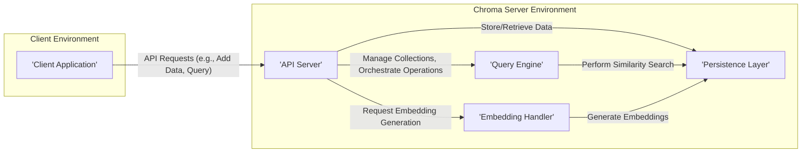
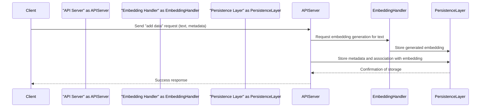
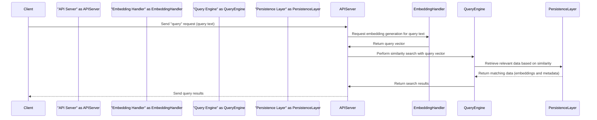

# Project Design Document: Chroma Vector Database

**Version:** 1.1
**Date:** October 26, 2023
**Prepared By:** AI Software Architect

## 1. Introduction

This document provides a detailed architectural design for the Chroma vector database project, as represented by the repository at [https://github.com/chroma-core/chroma](https://github.com/chroma-core/chroma). This document aims to clearly outline the system's components, their interactions, and the overall architecture. It will serve as a foundation for subsequent threat modeling activities, providing a granular understanding of the system's inner workings.

## 2. Goals and Objectives

The primary goals of the Chroma project, as inferred from the repository, are to provide:

*   An intuitive and straightforward vector database for storing, managing, and querying vector embeddings.
*   A developer-centric API, prioritizing ease of integration and use across different application types.
*   Flexible support for a wide range of embedding models and diverse data formats.
*   High-performance similarity search capabilities, ensuring rapid retrieval of relevant information.
*   Robust data persistence mechanisms to guarantee data durability and reliability.
*   Scalability and performance characteristics suitable for handling growing datasets and increasing query loads.

## 3. High-Level Architecture

The Chroma architecture is structured around the following core components, facilitating a modular and maintainable design:

*   **Client Interface:** The primary point of interaction for users, typically implemented as a Python client library, simplifying integration with Python-based applications.
*   **API Server:**  The central orchestrator, responsible for receiving client requests, managing collections, and coordinating operations across other internal components.
*   **Query Engine:** The specialized component dedicated to performing efficient similarity searches and retrieving data points based on the proximity of their vector embeddings.
*   **Embedding Handler:**  The module responsible for the creation and management of vector embeddings, potentially supporting various embedding models and strategies.
*   **Persistence Layer:** The underlying storage mechanism responsible for the durable storage and retrieval of all data, including vector embeddings, metadata, and collection configurations.

## 4. Component Details

This section provides a more granular breakdown of each component, outlining their specific functionalities and potential technologies involved:

### 4.1. Client Interface

*   **Description:**  Provides user-friendly libraries, primarily the Python client library, enabling developers to seamlessly interact with the Chroma database.
*   **Responsibilities:**
    *   Offers programmatic methods for creating, managing, and deleting collections of embeddings.
    *   Provides functions for adding data records, including the content (text, documents, or other data) and associated metadata.
    *   Facilitates querying the database based on vector similarity, allowing users to find semantically similar data.
    *   Manages connection details and handles the serialization and deserialization of requests and responses.
*   **Key Technologies/Concepts:**
    *   Primary implementation as a Python client library leveraging the Chroma API.
    *   Abstraction layer simplifying interaction with the underlying RESTful API.
    *   Potentially supports other client libraries in different programming languages in the future.

### 4.2. API Server

*   **Description:**  The core service that acts as the entry point for all client interactions, managing and coordinating operations within the Chroma system.
*   **Responsibilities:**
    *   Exposes a well-defined RESTful API for interacting with Chroma, adhering to standard web service principles.
    *   Handles authentication and authorization of incoming requests, ensuring only authorized users can access and modify data.
    *   Manages the lifecycle of collections, including creation, deletion, and listing available collections.
    *   Routes incoming requests to the appropriate internal components (Query Engine, Embedding Handler, Persistence Layer) based on the requested operation.
    *   Performs validation of incoming requests to ensure data integrity and prevent errors.
    *   Implements error handling and returns informative responses to the client.
*   **Key Technologies/Concepts:**
    *   Likely built using a modern Python web framework such as FastAPI or Flask, known for their performance and developer-friendliness.
    *   Utilizes standard HTTP methods (GET, POST, PUT, DELETE) for API endpoints.
    *   May incorporate middleware for handling cross-cutting concerns like authentication, logging, and request tracing.

### 4.3. Query Engine

*   **Description:**  The specialized engine responsible for efficiently searching and retrieving data based on the similarity of their vector embeddings to a query vector.
*   **Responsibilities:**
    *   Receives query vectors from the API Server, representing the embedding of the search term or data.
    *   Implements efficient similarity search algorithms, likely leveraging Approximate Nearest Neighbors (ANN) techniques for scalability.
    *   Retrieves the top-k most similar data points based on the chosen similarity metric (e.g., cosine similarity, dot product).
    *   May utilize indexing techniques, such as hierarchical navigable small worlds (HNSW) or inverted file indexes, to accelerate the search process.
*   **Key Technologies/Concepts:**
    *   Likely utilizes specialized libraries for vector similarity search, such as Faiss, Annoy, or potentially custom-built indexing solutions.
    *   Manages the indexing and retrieval of vector data, optimizing for both speed and accuracy.
    *   Performance is a critical design consideration for this component, especially for large datasets.

### 4.4. Embedding Handler

*   **Description:**  The component dedicated to generating vector embeddings from raw input data, enabling semantic understanding and similarity comparisons.
*   **Responsibilities:**
    *   Receives raw data (text, documents, images, etc.) from the API Server.
    *   Utilizes pre-trained or custom-trained embedding models to convert the input data into dense vector representations.
    *   May support a variety of embedding models, allowing users to choose the most appropriate model for their data and task.
    *   Potentially allows users to specify parameters for the embedding process.
    *   Stores the generated embeddings in the Persistence Layer, linking them to the original data.
*   **Key Technologies/Concepts:**
    *   Integration with popular embedding model libraries and services, such as Sentence Transformers, OpenAI Embeddings API, or other machine learning frameworks.
    *   May involve model loading, management, and potentially fine-tuning capabilities.
    *   Could be implemented as a separate microservice or integrated within the API Server, depending on performance and scalability requirements.

### 4.5. Persistence Layer

*   **Description:**  The foundational layer responsible for the reliable and durable storage of all data within the Chroma system.
*   **Responsibilities:**
    *   Provides mechanisms for efficiently storing and retrieving vector embeddings, ensuring low-latency access for querying.
    *   Stores associated metadata for each data point, enabling filtering and other data management operations.
    *   Manages collection definitions and configurations, maintaining the structure and settings of each collection.
    *   Ensures data persistence and durability, protecting against data loss.
    *   May handle data indexing and optimization for efficient retrieval.
*   **Key Technologies/Concepts:**
    *   Could leverage various database technologies, each with its own strengths and weaknesses:
        *   **Specialized Vector Database:**  A database specifically designed for storing and querying vector embeddings (e.g., potentially leveraging components of other vector DBs or a custom implementation optimized for Chroma's needs).
        *   **Key-Value Stores:**  Suitable for storing embeddings and metadata with simple lookups.
        *   **Document Databases:**  Can store embeddings and associated metadata as documents.
        *   **Relational Databases:**  While less common for raw embeddings, could be used with appropriate indexing techniques or for storing metadata.
    *   Considerations for scalability, performance, data consistency, and backup/restore strategies are crucial for this layer.

## 5. Data Flow

This section illustrates the typical data flow for two fundamental operations within Chroma: adding data and querying information.

### 5.1. Adding Data

**Detailed Steps:**

1. The **Client** application initiates the process by sending an "add data" request to the **API Server**. This request typically includes the raw data (e.g., a text document) and any associated metadata.
2. The **API Server**, upon receiving the request, forwards the raw data to the **Embedding Handler** and requests the generation of a corresponding vector embedding.
3. The **Embedding Handler** processes the data using the configured embedding model and generates the vector embedding. This embedding is then sent to the **Persistence Layer** for storage.
4. Simultaneously, the **API Server** sends the metadata associated with the data point, along with a link to the generated embedding, to the **Persistence Layer**.
5. The **Persistence Layer** stores both the embedding and the metadata, ensuring they are correctly associated. Once the storage is successful, it sends a confirmation back to the **API Server**.
6. Finally, the **API Server**, having received confirmation of successful storage, sends a success response back to the **Client** application, indicating that the data has been added to the Chroma database.

### 5.2. Querying Data

**Detailed Steps:**

1. The **Client** application initiates a query by sending a "query" request to the **API Server**. This request includes the query text or data for which similar items are to be found.
2. The **API Server** forwards the query text to the **Embedding Handler** and requests the generation of a vector embedding for the query.
3. The **Embedding Handler** generates the query vector and returns it to the **API Server**.
4. The **API Server** then sends the generated query vector to the **Query Engine**, instructing it to perform a similarity search within the stored embeddings.
5. The **Query Engine** interacts with the **Persistence Layer** to retrieve the most similar data points based on the query vector, utilizing its indexing and search algorithms.
6. The **Persistence Layer** returns the matching data points, including their embeddings and associated metadata, to the **Query Engine**.
7. The **Query Engine** processes the results and returns the ranked list of similar items to the **API Server**.
8. Finally, the **API Server** sends the query results back to the **Client** application, providing the user with the semantically similar data found in the Chroma database.

## 6. Security Considerations (For Threat Modeling)

This section outlines key security considerations that are crucial for identifying potential threats and vulnerabilities during the threat modeling process:

*   **Authentication and Authorization:**
    *   **Threat:** Unauthorized access to the API and data.
    *   **Considerations:** How are users and applications authenticated (e.g., API keys, OAuth 2.0)? Is there a robust authorization mechanism to control access to specific collections or data (e.g., role-based access control)? How are credentials securely managed and stored?
*   **Data Security in Transit:**
    *   **Threat:** Eavesdropping and interception of sensitive data.
    *   **Considerations:** Is all communication between the client and the API Server encrypted using HTTPS? Is mutual TLS (mTLS) considered for internal communication between components?
*   **Data Security at Rest:**
    *   **Threat:** Unauthorized access to stored data.
    *   **Considerations:** Is data in the Persistence Layer encrypted at rest? What encryption mechanisms are used? How are encryption keys managed and rotated? Are there access controls on the underlying storage infrastructure?
*   **Input Validation:**
    *   **Threat:** Injection attacks (e.g., SQL injection if using a relational database for metadata), cross-site scripting (XSS) if user-provided data is rendered.
    *   **Considerations:** Is all input data from the client thoroughly validated and sanitized before being processed or stored? Are appropriate encoding techniques used to prevent injection vulnerabilities?
*   **API Security:**
    *   **Threat:** Denial of service (DoS) attacks, brute-force attacks, API abuse.
    *   **Considerations:** Are there rate limiting mechanisms in place to prevent API abuse? Are there protections against common web application vulnerabilities (e.g., OWASP Top Ten)? Is input size limited to prevent resource exhaustion?
*   **Dependency Management:**
    *   **Threat:** Vulnerabilities in third-party libraries and dependencies.
    *   **Considerations:** Is there a process for regularly scanning dependencies for known vulnerabilities? Are dependencies updated promptly to patch security flaws? Is there a Software Bill of Materials (SBOM) available?
*   **Infrastructure Security:**
    *   **Threat:** Compromise of the underlying infrastructure.
    *   **Considerations:** How is the Chroma server deployed and secured? Are standard security hardening practices applied to the operating system and server configurations? Are appropriate network security controls in place (e.g., firewalls, intrusion detection systems)?
*   **Embedding Model Security:**
    *   **Threat:** Potential biases or vulnerabilities in the embedding models themselves.
    *   **Considerations:** If using external embedding models, are there security implications associated with them (e.g., data privacy when sending data to external services)? Is there a process for evaluating the security and trustworthiness of embedding models?
*   **Data Privacy:**
    *   **Threat:** Exposure of sensitive or personally identifiable information (PII).
    *   **Considerations:** How is sensitive data handled and protected throughout the system? Are there mechanisms for data anonymization or pseudonymization if required? Does the system comply with relevant data privacy regulations (e.g., GDPR, CCPA)?

## 7. Deployment Considerations

*   **Deployment Environment Options:**
    *   Local development environments (e.g., using Docker Compose).
    *   Cloud platforms (e.g., AWS, Azure, GCP) utilizing managed services or container orchestration platforms like Kubernetes.
    *   On-premise infrastructure, potentially requiring more manual configuration and management.
*   **Scalability Strategies:**
    *   **API Server:** Horizontal scaling by deploying multiple instances behind a load balancer.
    *   **Query Engine:**  Scaling can be complex and may involve distributed indexing techniques or sharding data across multiple instances.
    *   **Persistence Layer:** The scalability depends heavily on the chosen database technology. Options include replication, sharding, or using cloud-managed database services with auto-scaling capabilities.
*   **Resource Requirements Estimation:**
    *   Memory requirements will be influenced by the size of the embedding index and the number of concurrent queries.
    *   CPU usage will be higher during embedding generation and query processing.
    *   Storage requirements depend on the size of the dataset and the dimensionality of the embeddings.
*   **Configuration Management:**
    *   Mechanisms for managing configuration parameters, such as API keys, database connection strings, embedding model settings, and security credentials.
    *   Consider using environment variables, configuration files, or dedicated configuration management tools.
*   **Monitoring and Logging:**
    *   Implementing comprehensive monitoring to track performance metrics (e.g., query latency, resource utilization) and identify potential issues.
    *   Centralized logging for auditing and troubleshooting.

## 8. Future Considerations

*   **Enhanced Distributed Architecture:**  Exploring more advanced distributed architectures to achieve greater scalability, fault tolerance, and resilience, potentially involving microservices or a distributed database backend.
*   **Expanded Embedding Model Support:**  Continuously adding support for new and emerging embedding models, including those for different modalities (e.g., images, audio).
*   **Advanced Querying Features:**  Implementing support for more complex query types, such as filtering by metadata, combining vector similarity with other search criteria, and performing aggregations on query results.
*   **Real-time Data Ingestion and Updates:**  Developing mechanisms for efficiently handling real-time data streams and updating the embedding index without significant downtime.
*   **Improved Monitoring and Observability:**  Investing in more sophisticated monitoring and observability tools to gain deeper insights into system performance and behavior.
*   **Pluggable Architecture:**  Designing a more pluggable architecture to allow easier integration of custom components, such as different embedding handlers or persistence layers.

This improved design document provides a more detailed and nuanced understanding of the Chroma vector database project. The enhanced descriptions of components, data flow, and security considerations will be valuable for conducting thorough threat modeling and ensuring the security and reliability of the system.