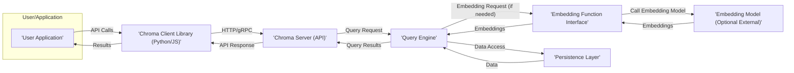
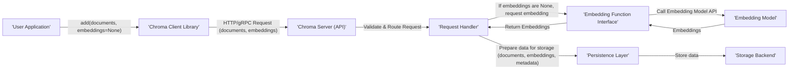
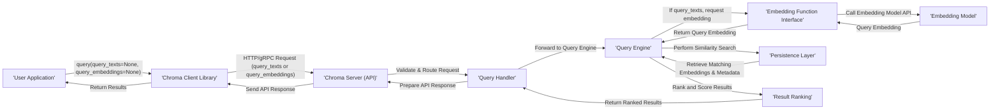

## Project Design Document: Chroma - An AI-native Open-Source Embedding Database

**Version:** 1.1
**Date:** October 26, 2023
**Author:** AI Architecture Expert

### 1. Introduction

This document outlines the design of Chroma, an open-source embedding database. It aims to provide a comprehensive overview of the system's architecture, components, data flow, and deployment considerations. This document will serve as the foundation for subsequent threat modeling activities, providing the necessary context for identifying potential vulnerabilities and attack vectors.

### 2. Goals and Objectives

*   Provide a developer-friendly platform for storing and querying vector embeddings efficiently.
*   Offer a simple and intuitive API for common embedding database operations, abstracting away complex underlying mechanisms.
*   Support a wide range of embedding models and diverse data types beyond just text.
*   Enable high-performance similarity search and retrieval of embedded data, crucial for AI applications.
*   Offer flexible deployment options, ranging from local development to scalable cloud environments, catering to various use cases.
*   Maintain an open-source and community-driven development model, fostering transparency and collaboration.

### 3. High-Level Architecture

The following diagram illustrates the high-level architecture of Chroma, highlighting the key interactions between its components:

**Components:**

*   **User/Application:** Represents any external system or user initiating interactions with Chroma, such as a web application, a data pipeline, or a command-line tool.
*   **Chroma Client Library (Python/JS):** Provides a set of language-specific SDKs that simplify interaction with the Chroma Server, handling serialization, request construction, and response parsing.
*   **Chroma Server (API):** The central processing unit of Chroma, responsible for receiving client requests, orchestrating operations across other components, and returning responses.
*   **Query Engine:**  The core logic for processing search queries, including embedding generation (if needed), similarity calculations, and result ranking.
*   **Embedding Function Interface:**  A well-defined abstraction layer that allows Chroma to seamlessly integrate with various embedding models, whether they are hosted internally or externally.
*   **Persistence Layer:**  Manages the storage and retrieval of vector embeddings and associated metadata, ensuring data durability and efficient access.
*   **Embedding Model (Optional External):**  An external service or library responsible for generating vector embeddings from raw data (e.g., text, images).

### 4. Detailed Component Description

*   **Chroma Client Library:**
    *   Provides a user-friendly API for common operations:
        *   `create_collection()`:  Defines a new namespace for embeddings.
        *   `add()`: Inserts documents and their corresponding embeddings into a collection.
        *   `query()`:  Performs similarity searches within a collection.
        *   `get()`: Retrieves documents by their unique IDs.
        *   `delete()`: Removes documents or entire collections.
    *   Handles communication protocols (HTTP/gRPC) and data serialization/deserialization.
    *   May include features like automatic batching of requests for efficiency.

*   **Chroma Server (API):**
    *   Exposes a well-defined API (likely RESTful with JSON payloads, potentially gRPC for performance).
    *   Handles:
        *   **Authentication:** Verifying the identity of the client (e.g., API keys, tokens).
        *   **Authorization:** Controlling access to specific collections and operations based on client identity.
        *   **Request Routing:** Directing incoming requests to the appropriate internal handlers.
        *   **Rate Limiting:** Protecting against abuse by limiting the number of requests from a client.
        *   **Logging and Monitoring:** Recording events and metrics for debugging and performance analysis.

*   **Query Engine:**
    *   Receives structured query requests from the Chroma Server.
    *   **Embedding Generation:** If the query includes raw data (e.g., text) and no pre-computed embedding, it utilizes the Embedding Function Interface to generate the query embedding.
    *   **Similarity Search:** Performs efficient similarity search using indexing techniques (e.g., HNSW, Annoy) against the stored embeddings in the Persistence Layer.
    *   **Filtering and Metadata Handling:**  Applies any specified filters based on metadata associated with the embeddings.
    *   **Result Ranking and Scoring:** Orders the results based on similarity scores.

*   **Embedding Function Interface:**
    *   Defines a contract for interacting with embedding models.
    *   Supports different modes of integration:
        *   **Local Function Calls:** Directly invoking embedding functions within the Chroma Server process.
        *   **External API Calls:** Making requests to external embedding services over the network.
    *   Handles:
        *   **Authentication with External Services:** Securely managing API keys or tokens for external embedding providers.
        *   **Data Transformation:** Adapting data formats between Chroma and the embedding model.
        *   **Error Handling:** Managing potential failures when interacting with embedding models.

*   **Persistence Layer:**
    *   Responsible for the durable storage of:
        *   **Vector Embeddings:** The numerical representations of the data.
        *   **Document Content:** The original data associated with the embeddings.
        *   **Metadata:**  Additional information associated with each document (e.g., source, tags).
    *   Supports various storage backends, potentially including:
        *   **In-Memory Stores:** For development or ephemeral data.
        *   **Local File Systems:** Using formats like Parquet or specialized vector database formats (e.g., DuckDB).
        *   **Dedicated Vector Databases:**  Integration with existing vector database solutions for scalability and performance.
        *   **Relational Databases:** Utilizing vector extensions for storage and querying.
    *   Implements indexing strategies for efficient similarity search.

### 5. Data Flow

The following diagrams illustrate the data flow for adding and querying data, providing a more granular view of the interactions between components.

**5.1. Adding Data:**

**Steps:**

1. The User Application calls the `add()` function in the Chroma Client Library, providing documents and optionally pre-computed embeddings.
2. The Client Library sends an HTTP/gRPC request to the Chroma Server API, including the documents and provided embeddings (if any).
3. The Chroma Server's Request Handler validates the request and routes it for processing.
4. If embeddings are not provided in the request:
    *   The Request Handler sends the document content to the Embedding Function Interface.
    *   The Embedding Function Interface calls the configured Embedding Model's API.
    *   The Embedding Model generates the vector embeddings and returns them to the Embedding Function Interface.
5. The Embedding Function Interface returns the generated embeddings to the Request Handler.
6. The Request Handler prepares the data for storage, including the documents, embeddings, and any associated metadata.
7. The Request Handler interacts with the Persistence Layer to store the data in the chosen Storage Backend.

**5.2. Querying Data:**

**Steps:**

1. The User Application calls the `query()` function in the Chroma Client Library, providing either `query_texts` or `query_embeddings`.
2. The Client Library sends an HTTP/gRPC request to the Chroma Server API.
3. The Chroma Server's Query Handler validates the request and forwards it to the Query Engine.
4. If `query_texts` are provided and `query_embeddings` are not:
    *   The Query Engine requests an embedding from the Embedding Function Interface.
    *   The Embedding Function Interface calls the configured Embedding Model's API.
    *   The Embedding Model generates the query embedding and returns it.
5. The Query Engine performs a similarity search against the embeddings stored in the Persistence Layer.
6. The Persistence Layer retrieves the matching embeddings and their associated metadata.
7. The Query Engine's Result Ranking component ranks and scores the results based on similarity.
8. The Query Engine returns the ranked results to the Query Handler.
9. The Query Handler prepares the API response.
10. The Chroma Server sends the API response back to the Client Library.
11. The Client Library returns the results to the User Application.

### 6. Deployment Architecture

Chroma's deployment flexibility introduces different security considerations:

*   **Local Deployment (Development/Testing):**
    *   Often uses in-memory persistence, posing a risk of data loss if the server crashes.
    *   Typically less focus on strict authentication and authorization.
    *   Network exposure is usually limited to the local machine.

*   **Containerized Deployment (Docker/Kubernetes):**
    *   Provides isolation but requires careful configuration of container security (e.g., limiting privileges, using secure base images).
    *   Network policies in Kubernetes are crucial for controlling access between containers.
    *   Secrets management for API keys and database credentials becomes important.

*   **Cloud Deployment (AWS, Azure, GCP):**
    *   Leverages cloud provider security features (e.g., VPCs, security groups, IAM).
    *   Requires careful configuration of cloud resources to prevent unauthorized access.
    *   Managed database services can simplify persistence but introduce dependencies on the cloud provider's security model.
    *   Consider data encryption at rest and in transit using cloud-provided services.

### 7. Security Considerations (Detailed)

This section expands on the initial security considerations, providing more specific examples and potential threats.

*   **Authentication and Authorization:**
    *   **Threat:** Unauthorized access to collections or data manipulation if authentication is weak or missing.
    *   **Considerations:** Implement robust API key management, explore OAuth 2.0 for user-based access, enforce strong password policies if user accounts are involved.
    *   **Threat:** Privilege escalation if authorization mechanisms are flawed, allowing users to perform actions they are not permitted to.
    *   **Considerations:** Implement role-based access control (RBAC) to manage permissions effectively.

*   **Data Security:**
    *   **Threat:** Data breaches if sensitive embedding data or metadata is compromised at rest.
    *   **Considerations:** Implement encryption at rest for the Persistence Layer, regardless of the backend used.
    *   **Threat:** Man-in-the-middle attacks if communication between components is not encrypted.
    *   **Considerations:** Enforce HTTPS for all API communication, consider TLS for internal communication if sensitive data is exchanged.

*   **Input Validation:**
    *   **Threat:** Injection attacks (e.g., SQL injection if using a relational database backend, command injection if interacting with external systems) if input is not properly sanitized.
    *   **Considerations:** Implement strict input validation on all API endpoints, especially for parameters used in database queries or external API calls.

*   **Network Security:**
    *   **Threat:** Unauthorized access to the Chroma Server or its underlying infrastructure.
    *   **Considerations:** Utilize firewalls to restrict network access, implement network segmentation to isolate the Chroma Server, consider using a VPN for secure remote access.

*   **Dependency Management:**
    *   **Threat:** Vulnerabilities in third-party libraries can be exploited to compromise the Chroma Server.
    *   **Considerations:** Implement a process for regularly scanning dependencies for known vulnerabilities and updating them promptly.

*   **Rate Limiting:**
    *   **Threat:** Denial-of-service (DoS) attacks can overwhelm the Chroma Server, making it unavailable.
    *   **Considerations:** Implement rate limiting on API endpoints to restrict the number of requests from a single source within a given timeframe.

*   **Secrets Management:**
    *   **Threat:** Exposure of sensitive credentials (e.g., API keys for external embedding services, database passwords) if stored insecurely.
    *   **Considerations:** Utilize secure secrets management solutions (e.g., HashiCorp Vault, cloud provider secrets managers) to store and access sensitive information. Avoid hardcoding secrets in the codebase.

### 8. Assumptions and Constraints

*   The Chroma Server is assumed to be a trusted component within the deployment environment.
*   The security of the underlying infrastructure (e.g., operating system, network) is the responsibility of the deployment environment.
*   The performance and security characteristics of external Embedding Models are outside the direct control of Chroma.
*   Initial development focuses on providing core embedding database functionality, with more advanced security features to be implemented iteratively.

### 9. Future Considerations

*   Implementation of more granular access control mechanisms.
*   Auditing of API calls and data access.
*   Support for data masking or anonymization.
*   Integration with security information and event management (SIEM) systems.
*   Regular security assessments and penetration testing.

This improved design document provides a more detailed and security-focused overview of the Chroma project, serving as a solid foundation for comprehensive threat modeling.