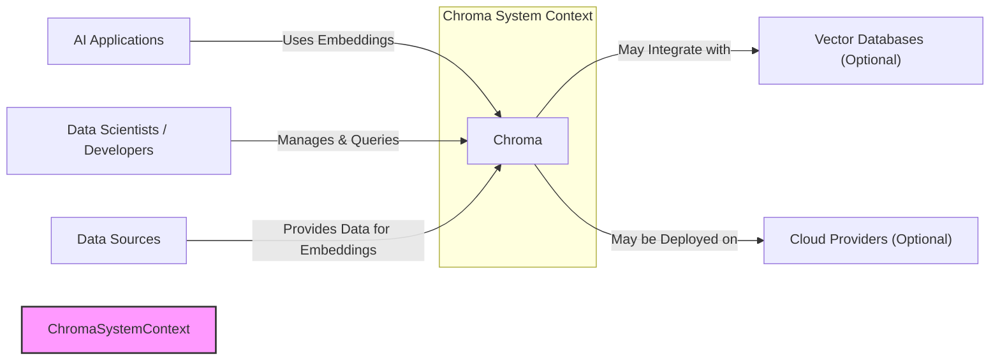
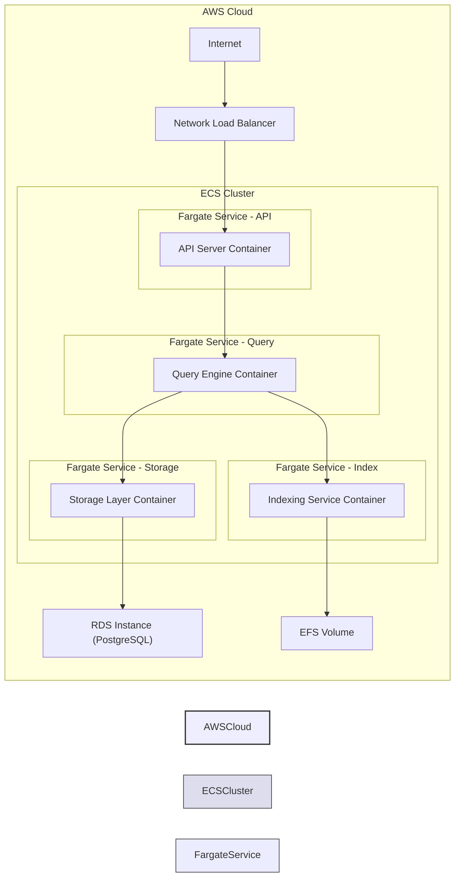
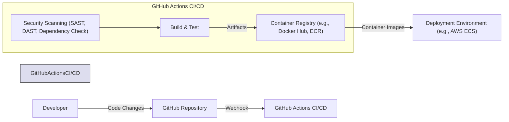

# BUSINESS POSTURE

This project, Chroma, is an AI-native open-source embedding database. The primary business goal is to provide developers with a simple and efficient way to store and query embeddings for AI applications. Embeddings are numerical representations of data, crucial for modern machine learning tasks like semantic search, recommendation systems, and natural language processing. By offering an open-source solution, Chroma aims to foster innovation and accessibility in the AI field.

Business priorities for Chroma are:
- Ease of use and integration for developers.
- High performance and scalability to handle large embedding datasets.
- Robustness and reliability for production deployments.
- Openness and community-driven development.

Key business risks associated with Chroma include:
- Data breaches exposing sensitive embeddings or associated metadata.
- Unauthorized access to the database, leading to data manipulation or exfiltration.
- Performance bottlenecks or instability impacting AI application functionality.
- Lack of community adoption and support, hindering project growth and sustainability.

# SECURITY POSTURE

Existing security controls for the Chroma project, based on a review of the GitHub repository and common open-source practices, include:

- security control: Code review process via GitHub pull requests. Implemented in: GitHub repository workflow.
- security control: Use of standard Python security practices. Implemented in: Codebase.
- security control: Dependency management using `pip` and `poetry`. Implemented in: `pyproject.toml` and `poetry.lock`.
- security control: Open-source licensing, allowing community scrutiny. Implemented in: LICENSE file in the repository.

Accepted risks for the Chroma project, based on typical open-source project assumptions and lack of explicit security documentation:

- accepted risk: Reliance on community contributions for security vulnerability discovery and patching.
- accepted risk: Potential for vulnerabilities in third-party dependencies.
- accepted risk: Lack of formal security audits or penetration testing.
- accepted risk: Default configurations might not be hardened for production environments.

Recommended security controls to implement as high priority:

- recommended security control: Implement authentication and authorization mechanisms to control access to the database and its API.
- recommended security control: Implement input validation and sanitization to prevent injection attacks.
- recommended security control: Implement encryption at rest and in transit to protect sensitive embedding data.
- recommended security control: Integrate automated security scanning tools (SAST/DAST) into the CI/CD pipeline.
- recommended security control: Establish a clear vulnerability disclosure and response process.

Security requirements for the Chroma project:

- Authentication:
  - Requirement: The system must support authentication to verify the identity of clients accessing the database.
  - Requirement: Different authentication methods should be considered, such as API keys, OAuth 2.0, or integration with existing identity providers.
- Authorization:
  - Requirement: The system must implement authorization to control access to specific resources and operations based on user roles or permissions.
  - Requirement: Granular access control should be considered, allowing restrictions at the database, collection, or even document level.
- Input Validation:
  - Requirement: All external inputs, including API requests and data ingestion, must be validated to prevent injection attacks (e.g., SQL injection, command injection).
  - Requirement: Input validation should be performed on both the client and server sides.
- Cryptography:
  - Requirement: Sensitive data, including embeddings and potentially metadata, must be encrypted at rest.
  - Requirement: Communication channels, especially API endpoints, must be encrypted in transit using TLS/HTTPS.
  - Requirement: Secure key management practices must be implemented for encryption keys.

# DESIGN

## C4 CONTEXT



Context Diagram Elements:

- Element:
  - Name: AI Applications
  - Type: User System
  - Description: Applications that utilize embeddings for various AI tasks such as semantic search, recommendation engines, and NLP applications.
  - Responsibilities: Consume embeddings from Chroma to perform AI-driven operations. Send queries to Chroma to retrieve relevant embeddings.
  - Security controls: Implement authorization and access control to Chroma API. Securely handle embeddings received from Chroma.

- Element:
  - Name: Data Scientists / Developers
  - Type: User
  - Description: Users who interact with Chroma to manage embedding collections, perform queries, and integrate Chroma into AI workflows.
  - Responsibilities: Configure and manage Chroma instances. Develop and test AI applications using Chroma. Monitor Chroma performance and health.
  - Security controls: Use strong passwords or API keys for Chroma access. Follow secure development practices when integrating with Chroma.

- Element:
  - Name: Data Sources
  - Type: External System
  - Description: External systems that provide the raw data from which embeddings are generated and stored in Chroma. These can be databases, document stores, APIs, or other data repositories.
  - Responsibilities: Provide data to Chroma for embedding generation and storage. May receive requests from Chroma for data updates or synchronization.
  - Security controls: Securely store and manage source data. Implement access controls to prevent unauthorized access to source data.

- Element:
  - Name: Vector Databases (Optional)
  - Type: External System
  - Description: Other vector databases that Chroma might integrate with for specific functionalities or as a backend storage option. This is optional as Chroma can function as a vector database itself.
  - Responsibilities: Potentially store and index embeddings for Chroma. Provide specialized vector search capabilities.
  - Security controls: Implement secure integration with Chroma. Ensure data consistency and integrity between Chroma and external vector databases.

- Element:
  - Name: Cloud Providers (Optional)
  - Type: Infrastructure Provider
  - Description: Cloud platforms like AWS, Azure, or GCP where Chroma instances might be deployed.
  - Responsibilities: Provide infrastructure for running Chroma. Offer services like compute, storage, and networking.
  - Security controls: Cloud provider security controls (IAM, network security groups, encryption). Securely configure and manage cloud resources for Chroma.

- Element:
  - Name: Chroma
  - Type: Software System
  - Description: The Chroma embedding database system itself. It stores, indexes, and allows querying of embeddings.
  - Responsibilities: Store and manage embedding data. Provide API for querying and manipulating embeddings. Ensure data persistence and availability. Implement security controls to protect embedding data and access.
  - Security controls: Authentication, authorization, input validation, encryption at rest and in transit, secure configuration.

## C4 CONTAINER

```mermaid
flowchart LR
    subgraph Chroma Containers
        API["API Server (FastAPI)"]
        Query["Query Engine"]
        Storage["Storage Layer"]
        Index["Indexing Service"]
    end

    U1["AI Applications"]
    U2["Data Scientists / Developers"]

    U1 -->|API Requests (HTTPS)| API
    U2 -->|API Requests (HTTPS)| API
    API -->|Queries| Query
    Query -->|Data Access| Storage
    Query -->|Index Lookups| Index
    Storage -->|Data Persistence| Disk["Disk Storage"]

    style ChromaContainers fill:#ccf,stroke:#333,stroke-width:2px
```

Container Diagram Elements:

- Element:
  - Name: API Server (FastAPI)
  - Type: Web Application
  - Description: Provides the REST API for interacting with Chroma. Built using FastAPI (Python). Handles API requests from AI Applications and Developers.
  - Responsibilities: API request routing and handling. Authentication and authorization of API requests. Input validation. Communication with Query Engine.
  - Security controls: HTTPS for API communication. API authentication (API keys, OAuth 2.0). Input validation and sanitization. Rate limiting to prevent abuse.

- Element:
  - Name: Query Engine
  - Type: Application
  - Description: Processes queries for embeddings. Orchestrates data retrieval from Storage Layer and Indexing Service. Implements search algorithms and query optimization.
  - Responsibilities: Query parsing and execution. Data retrieval from Storage Layer. Index lookups. Query optimization.
  - Security controls: Secure query processing logic to prevent injection attacks. Access control to Storage Layer and Indexing Service.

- Element:
  - Name: Storage Layer
  - Type: Database
  - Description: Persists embedding data and metadata. Could be implemented using various database technologies (e.g., SQLite for local, PostgreSQL, or a dedicated vector database for larger deployments).
  - Responsibilities: Data persistence and retrieval. Data integrity and consistency. Data backup and recovery.
  - Security controls: Encryption at rest. Database access controls. Regular backups. Security hardening of the database system.

- Element:
  - Name: Indexing Service
  - Type: Application/Service
  - Description: Builds and maintains indexes for efficient embedding search. Could use various indexing techniques (e.g., approximate nearest neighbor algorithms).
  - Responsibilities: Index creation and updates. Index storage and retrieval. Index optimization for query performance.
  - Security controls: Access control to index data. Secure index building and update processes.

- Element:
  - Name: Disk Storage
  - Type: Data Store
  - Description: Physical or virtual disk storage where the Storage Layer database files and indexes are stored.
  - Responsibilities: Persistent storage of data. Data availability and durability.
  - Security controls: Disk encryption. Access control to storage volumes. Physical security of storage infrastructure (if on-premise).

## DEPLOYMENT

Deployment Architecture: Cloud Deployment (AWS ECS with Fargate)



Deployment Diagram Elements (AWS ECS with Fargate):

- Element:
  - Name: Internet
  - Type: Network
  - Description: Public internet network from which users and applications access Chroma.
  - Responsibilities: Provides network connectivity to Chroma.
  - Security controls: Standard internet security protocols.

- Element:
  - Name: Network Load Balancer (NLB)
  - Type: Load Balancer
  - Description: AWS Network Load Balancer to distribute incoming API traffic across API Server containers.
  - Responsibilities: Load balancing, high availability, TLS termination.
  - Security controls: TLS termination, DDoS protection, access logs.

- Element:
  - Name: API Server Container
  - Type: Container
  - Description: Docker container running the API Server application. Deployed on AWS Fargate.
  - Responsibilities: Handle API requests, authentication, authorization, communication with Query Engine.
  - Security controls: Container image security scanning, least privilege container execution, network isolation within ECS.

- Element:
  - Name: Query Engine Container
  - Type: Container
  - Description: Docker container running the Query Engine application. Deployed on AWS Fargate.
  - Responsibilities: Process queries, interact with Storage and Index containers.
  - Security controls: Container image security scanning, least privilege container execution, network isolation within ECS.

- Element:
  - Name: Indexing Service Container
  - Type: Container
  - Description: Docker container running the Indexing Service application. Deployed on AWS Fargate.
  - Responsibilities: Build and maintain indexes, serve index lookups.
  - Security controls: Container image security scanning, least privilege container execution, network isolation within ECS.

- Element:
  - Name: Storage Layer Container
  - Type: Container
  - Description: Docker container running the Storage Layer application. Deployed on AWS Fargate.
  - Responsibilities: Manage database connections, data persistence.
  - Security controls: Container image security scanning, least privilege container execution, network isolation within ECS.

- Element:
  - Name: RDS Instance (PostgreSQL)
  - Type: Database Service
  - Description: AWS RDS PostgreSQL instance used as the backend database for the Storage Layer.
  - Responsibilities: Persistent storage of embedding data, database management.
  - Security controls: RDS security features (encryption at rest and in transit, access control lists, security groups, backups).

- Element:
  - Name: EFS Volume
  - Type: Shared File System
  - Description: AWS EFS volume used for shared storage between Indexing Service containers for index data.
  - Responsibilities: Shared storage for indexes, data persistence.
  - Security controls: EFS encryption at rest and in transit, access control policies.

- Element:
  - Name: ECS Cluster
  - Type: Container Orchestration Service
  - Description: AWS ECS cluster managing Fargate services and containers.
  - Responsibilities: Container orchestration, scaling, health monitoring.
  - Security controls: ECS security features (IAM roles, security groups, container isolation).

- Element:
  - Name: AWS Cloud
  - Type: Cloud Provider Infrastructure
  - Description: AWS cloud environment hosting the Chroma deployment.
  - Responsibilities: Provides underlying infrastructure, security of the cloud platform.
  - Security controls: AWS shared responsibility model, AWS security services (IAM, VPC, CloudTrail, etc.).

## BUILD



Build Process Description:

1. Developer makes code changes and commits them to the GitHub repository.
2. GitHub triggers a webhook event upon code push or pull request.
3. GitHub Actions CI/CD pipeline is initiated.
4. Build & Test stage:
   - Code is checked out.
   - Dependencies are installed.
   - Code is compiled and built.
   - Unit and integration tests are executed.
   - Build artifacts (e.g., Python packages, Dockerfiles) are created.
5. Security Scanning stage:
   - Static Application Security Testing (SAST) tools scan the codebase for potential vulnerabilities.
   - Dynamic Application Security Testing (DAST) tools (if applicable) scan running application for vulnerabilities.
   - Dependency check tools scan project dependencies for known vulnerabilities.
6. Container Registry stage:
   - Docker images are built from Dockerfiles.
   - Built container images are pushed to a container registry (e.g., Docker Hub, AWS ECR).
7. Deployment Environment stage:
   - Container images from the registry are deployed to the target deployment environment (e.g., AWS ECS).

Build Process Security Controls:

- security control: Automated build process using GitHub Actions CI/CD. Implemented in: `.github/workflows` directory in the repository.
- security control: Source code version control using Git and GitHub. Implemented in: GitHub repository.
- security control: Code review process for all code changes. Implemented in: GitHub pull request workflow.
- security control: Automated unit and integration tests. Implemented in: GitHub Actions workflow.
- security control: Static Application Security Testing (SAST) integrated into CI/CD. Recommended: Implement in GitHub Actions workflow.
- security control: Dependency scanning for known vulnerabilities. Recommended: Implement in GitHub Actions workflow using tools like `safety` for Python dependencies.
- security control: Container image scanning for vulnerabilities. Recommended: Integrate container image scanning in CI/CD pipeline before pushing to registry.
- security control: Secure storage and access control for container registry. Implemented in: Container registry platform security features.
- security control: Immutable build artifacts (container images). Implemented in: Docker image build process.

# RISK ASSESSMENT

Critical business process being protected:

- Efficient and reliable storage and retrieval of embeddings for AI applications. Disruption or compromise of this process would directly impact the functionality of AI systems relying on Chroma.

Data being protected and its sensitivity:

- Embeddings: These are numerical representations of data and can be highly sensitive depending on the source data they represent. If embeddings are derived from personally identifiable information (PII), financial data, or other confidential sources, their compromise could lead to privacy breaches, data leaks, or misuse of sensitive information.
- Metadata associated with embeddings: This metadata might include information about the source data, timestamps, user associations, or other contextual details. The sensitivity of metadata depends on its nature and potential to reveal sensitive information when combined with embeddings or other data.
- API access credentials (API keys, OAuth tokens): These credentials are used to authenticate and authorize access to the Chroma API. Compromise of these credentials could lead to unauthorized access to the database, data manipulation, or exfiltration.

Data Sensitivity Levels:

- High: Embeddings and metadata derived from PII, financial data, health records, or other highly confidential sources. Compromise could lead to significant harm, legal repercussions, and reputational damage.
- Medium: Embeddings and metadata derived from less sensitive data but still requiring protection to maintain business confidentiality or operational integrity. Compromise could lead to moderate harm or business disruption.
- Low: Embeddings and metadata derived from publicly available or non-sensitive data. Compromise would have minimal impact.

# QUESTIONS & ASSUMPTIONS

Questions:

- What type of database is currently used as the default Storage Layer in Chroma? Is it pluggable and supports different database backends?
- What authentication and authorization mechanisms are currently supported or planned for Chroma API?
- Is there any existing documentation or roadmap regarding security features and vulnerability management for Chroma?
- What is the intended deployment scale and environment for Chroma (e.g., local development, small-scale production, large enterprise deployments)?
- Are there specific compliance requirements (e.g., GDPR, HIPAA, SOC 2) that Chroma needs to adhere to?

Assumptions:

- Assumption: Chroma is intended to be used in various environments, from local development to cloud deployments.
- Assumption: Security is a growing concern for Chroma users, especially as it handles potentially sensitive embedding data.
- Assumption: The project aims to follow open-source best practices for security and development.
- Assumption: The deployment architecture described (AWS ECS with Fargate) is a representative example of a cloud deployment scenario.
- Assumption: The build process described (GitHub Actions CI/CD) is a typical modern software development workflow.