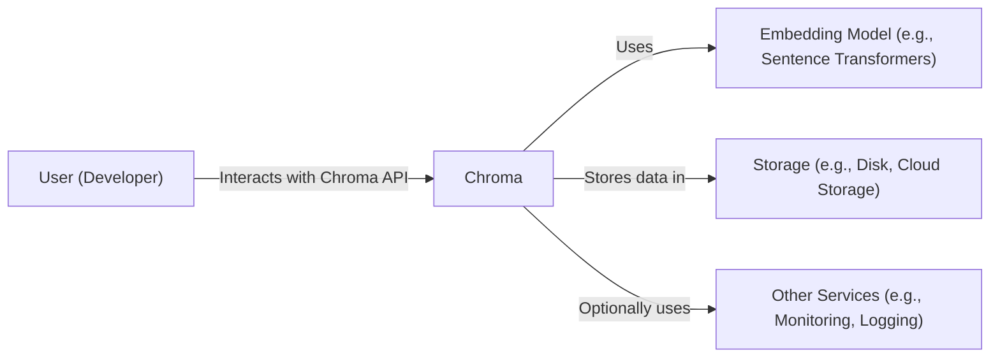
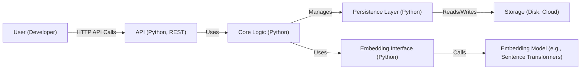
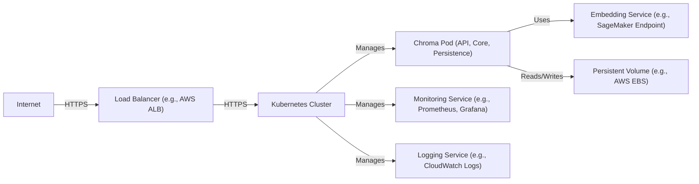
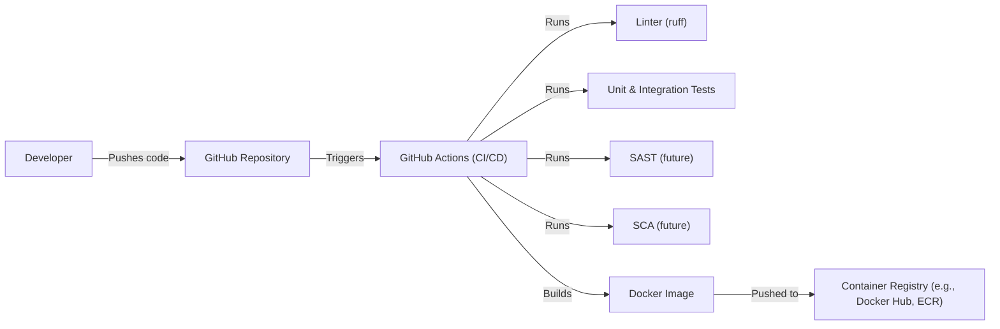

Okay, let's create a design document for Chroma, based on the provided GitHub repository.

# BUSINESS POSTURE

Chroma is an open-source embedding database designed to make it easy to build LLM (Large Language Model) applications by providing a way to store and retrieve embeddings efficiently. It appears to be in a relatively early stage of development, balancing rapid feature iteration with the need to establish a stable and secure foundation.

Business Priorities:

*   Rapidly grow the user base and community.
*   Provide a simple, easy-to-use API for developers.
*   Support a wide range of embedding models and use cases.
*   Ensure scalability and performance to handle large datasets.
*   Establish a reputation for reliability and data integrity.
*   Monetization strategy is not immediately clear, but likely involves a hosted/cloud offering in the future.

Business Goals:

*   Become the leading open-source embedding database.
*   Attract a vibrant community of contributors and users.
*   Enable developers to build innovative LLM applications.
*   Secure partnerships with key players in the AI/ML ecosystem.

Most Important Business Risks:

*   Data breaches or loss of user data due to security vulnerabilities.
*   Performance bottlenecks or scalability issues that hinder adoption.
*   Lack of adoption due to complexity or competition.
*   Inability to secure funding or establish a sustainable business model.
*   Reputational damage due to bugs, instability, or security incidents.
*   Supply chain attacks.

# SECURITY POSTURE

Existing Security Controls:

*   security control: Code reviews: Evident from the GitHub pull request process.
*   security control: Basic testing: Unit tests and integration tests are present in the repository.
*   security control: Use of linters: Python linters (e.g., `ruff`) are used to enforce code style and identify potential issues.
*   security control: Dependency management: Dependencies are managed using `poetry`.
*   security control: Containerization: Docker is used for development and potentially deployment.
*   security control: Basic CI/CD: GitHub Actions are used for automated testing and building.

Accepted Risks:

*   accepted risk: Limited formal security audits or penetration testing.
*   accepted risk: Reliance on community contributions for security reviews.
*   accepted risk: Potential for vulnerabilities in third-party dependencies.
*   accepted risk: Evolving threat model as the project matures and gains popularity.
*   accepted risk: Limited input validation and sanitization (early stage of development).

Recommended Security Controls:

*   security control: Implement Static Application Security Testing (SAST) in the CI/CD pipeline.
*   security control: Implement Software Composition Analysis (SCA) to identify vulnerabilities in dependencies.
*   security control: Conduct regular security audits and penetration testing.
*   security control: Develop a formal security vulnerability disclosure program.
*   security control: Implement more robust input validation and sanitization throughout the codebase.
*   security control: Define and enforce a clear security model for data access and authorization.
*   security control: Implement logging and monitoring to detect and respond to security incidents.
*   security control: Consider using a secrets management solution.
*   security control: Implement Dynamic Application Security Testing (DAST).

Security Requirements:

*   Authentication:
    *   Currently, Chroma does not appear to have built-in authentication. This is a significant area for future development.
    *   Future authentication mechanisms should support various methods (API keys, OAuth 2.0, etc.).
    *   Authentication should be required for all write operations and potentially for read operations depending on the deployment configuration.
*   Authorization:
    *   Currently, Chroma does not appear to have a granular authorization model.
    *   Future authorization should allow for fine-grained control over access to collections and data.
    *   Role-Based Access Control (RBAC) or Attribute-Based Access Control (ABAC) should be considered.
*   Input Validation:
    *   All user-provided input (e.g., collection names, document text, metadata) must be validated and sanitized to prevent injection attacks and other vulnerabilities.
    *   Input validation should be performed at the API layer and potentially at lower levels of the system.
    *   Use a whitelist approach where possible, defining allowed characters and formats.
*   Cryptography:
    *   If sensitive data is stored, it should be encrypted at rest and in transit.
    *   Use strong, industry-standard encryption algorithms (e.g., AES-256).
    *   Key management should be carefully considered, potentially using a dedicated key management service (KMS).
    *   HTTPS should be enforced for all client-server communication.

# DESIGN

## C4 CONTEXT

Element Description:

*   Element:
    *   Name: User (Developer)
    *   Type: Person
    *   Description: A developer building an LLM application that uses Chroma to store and retrieve embeddings.
    *   Responsibilities: Interacts with the Chroma API to create collections, add documents, query for embeddings, and manage the database.
    *   Security controls: Authentication (future), Authorization (future), Rate limiting (future).

*   Element:
    *   Name: Chroma
    *   Type: Software System
    *   Description: The Chroma embedding database.
    *   Responsibilities: Provides an API for storing and retrieving embeddings, manages data persistence, and interacts with embedding models.
    *   Security controls: Input validation, Data sanitization, (Future: Authentication, Authorization, Encryption).

*   Element:
    *   Name: Embedding Model (e.g., Sentence Transformers)
    *   Type: Software System
    *   Description: An external library or service that generates embeddings from text.
    *   Responsibilities: Takes text as input and produces a numerical vector (embedding) as output.
    *   Security controls: Relies on the security of the chosen embedding model library/service.

*   Element:
    *   Name: Storage (e.g., Disk, Cloud Storage)
    *   Type: Software System
    *   Description: The underlying storage mechanism used by Chroma to persist data.
    *   Responsibilities: Stores embeddings, metadata, and other relevant data.
    *   Security controls: Encryption at rest (future), Access controls (future).

*   Element:
    *   Name: Other Services (e.g., Monitoring, Logging)
    *   Type: Software System
    *   Description: Optional external services used for monitoring, logging, and other operational tasks.
    *   Responsibilities: Collect and analyze logs, monitor system performance, and provide alerts.
    *   Security controls: Depends on the specific services used.

## C4 CONTAINER

Element Description:

*   Element:
    *   Name: User (Developer)
    *   Type: Person
    *   Description: A developer building an LLM application.
    *   Responsibilities: Interacts with the Chroma API.
    *   Security controls: Authentication (future), Authorization (future).

*   Element:
    *   Name: API (Python, REST)
    *   Type: Container
    *   Description: The public API exposed by Chroma, allowing developers to interact with the database.
    *   Responsibilities: Handles incoming requests, validates input, and routes requests to the core logic.
    *   Security controls: Input validation, Rate limiting (future), Authentication (future), Authorization (future).

*   Element:
    *   Name: Core Logic (Python)
    *   Type: Container
    *   Description: The core business logic of Chroma, responsible for managing collections, embeddings, and queries.
    *   Responsibilities: Implements the core functionality of the database.
    *   Security controls: Data sanitization, Internal input validation.

*   Element:
    *   Name: Persistence Layer (Python)
    *   Type: Container
    *   Description: Handles the interaction with the underlying storage mechanism.
    *   Responsibilities: Reads and writes data to storage, manages data serialization and deserialization.
    *   Security controls: Data validation before persistence.

*   Element:
    *   Name: Storage (Disk, Cloud)
    *   Type: Container
    *   Description: The underlying storage mechanism (e.g., local disk, cloud storage).
    *   Responsibilities: Stores data persistently.
    *   Security controls: Encryption at rest (future), Access controls (future).

*   Element:
    *   Name: Embedding Interface (Python)
    *   Type: Container
    *   Description: An abstraction layer for interacting with different embedding models.
    *   Responsibilities: Provides a consistent interface for generating embeddings, regardless of the underlying model.
    *   Security controls: Input validation (for text passed to embedding models).

*   Element:
    *   Name: Embedding Model (e.g., Sentence Transformers)
    *   Type: Container
    *   Description: The external library or service used to generate embeddings.
    *   Responsibilities: Generates embeddings from text.
    *   Security controls: Relies on the security of the chosen embedding model.

## DEPLOYMENT

Possible Deployment Solutions:

1.  Local Development: Using Docker Compose for local development and testing.
2.  Single Server: Deploying Chroma on a single server (e.g., a virtual machine) using Docker or directly running the Python application.
3.  Cloud Deployment (e.g., AWS, GCP, Azure): Deploying Chroma on a managed cloud platform using services like Kubernetes, ECS, or serverless functions.
4.  Distributed Deployment: Deploying Chroma in a distributed manner for scalability and high availability, potentially using a distributed database or a custom sharding solution.

Chosen Solution (for detailed description): Cloud Deployment (e.g., AWS) using Kubernetes.

Element Description:

*   Element:
    *   Name: Internet
    *   Type: External
    *   Description: The public internet.
    *   Responsibilities: Provides access to the Chroma service.
    *   Security controls: Network firewalls, DDoS protection.

*   Element:
    *   Name: Load Balancer (e.g., AWS ALB)
    *   Type: Infrastructure
    *   Description: Distributes incoming traffic across multiple Chroma pods.
    *   Responsibilities: Load balancing, SSL termination.
    *   Security controls: SSL/TLS certificates, Security groups.

*   Element:
    *   Name: Kubernetes Cluster
    *   Type: Infrastructure
    *   Description: A container orchestration platform that manages the Chroma deployment.
    *   Responsibilities: Orchestrates containers, manages scaling, and provides service discovery.
    *   Security controls: Kubernetes RBAC, Network policies, Pod security policies.

*   Element:
    *   Name: Chroma Pod (API, Core, Persistence)
    *   Type: Container Instance
    *   Description: A running instance of the Chroma container, containing the API, core logic, and persistence layer.
    *   Responsibilities: Handles requests, processes data, and interacts with storage.
    *   Security controls: Container security context, Resource limits.

*   Element:
    *   Name: Embedding Service (e.g., SageMaker Endpoint)
    *   Type: External Service
    *   Description: A managed service for generating embeddings.
    *   Responsibilities: Provides embedding generation capabilities.
    *   Security controls: IAM roles and permissions, VPC configuration.

*   Element:
    *   Name: Persistent Volume (e.g., AWS EBS)
    *   Type: Infrastructure
    *   Description: Persistent storage for Chroma data.
    *   Responsibilities: Stores data persistently.
    *   Security controls: Encryption at rest, Access controls.

*   Element:
    *   Name: Monitoring Service (e.g., Prometheus, Grafana)
    *   Type: External Service
    *   Description: Monitors the performance and health of the Chroma deployment.
    *   Responsibilities: Collects metrics, provides dashboards, and generates alerts.
    *   Security controls: Access controls, Secure communication channels.

*   Element:
    *   Name: Logging Service (e.g., CloudWatch Logs)
    *   Type: External Service
    *   Description: Collects and stores logs from the Chroma deployment.
    *   Responsibilities: Provides centralized logging and log analysis capabilities.
    *   Security controls: Access controls, Secure communication channels.

## BUILD

Build Process Description:

1.  Developer pushes code changes to the GitHub repository.
2.  GitHub Actions is triggered by the push event.
3.  The CI/CD pipeline defined in GitHub Actions runs.
4.  Linters (e.g., `ruff`) are executed to enforce code style and identify potential issues.
5.  Unit and integration tests are executed to verify the correctness of the code.
6.  (Future) Static Application Security Testing (SAST) tools are run to identify potential security vulnerabilities in the code.
7.  (Future) Software Composition Analysis (SCA) tools are run to identify vulnerabilities in third-party dependencies.
8.  A Docker image is built containing the Chroma application.
9.  The Docker image is pushed to a container registry (e.g., Docker Hub, Amazon ECR).

Security Controls:

*   security control: Code reviews (GitHub pull requests).
*   security control: Linting (ruff).
*   security control: Automated testing (unit and integration tests).
*   security control: (Future) SAST.
*   security control: (Future) SCA.
*   security control: Containerization (Docker).
*   security control: (Future) Image signing.
*   security control: (Future) Vulnerability scanning of the Docker image.

# RISK ASSESSMENT

Critical Business Processes:

*   Storing and retrieving embeddings reliably and efficiently.
*   Providing a user-friendly API for developers.
*   Maintaining the integrity and confidentiality of user data.
*   Ensuring the availability and scalability of the service.

Data Sensitivity:

*   Embeddings: While embeddings themselves are numerical vectors, they can indirectly reveal information about the original text data. The sensitivity depends on the nature of the original data. If the original data is sensitive (e.g., PII, confidential documents), then the embeddings should also be treated as sensitive.
*   Metadata: Metadata associated with embeddings (e.g., document IDs, timestamps, user-defined tags) can also be sensitive, depending on its content.
*   User Data: If Chroma implements user accounts or authentication in the future, user data (e.g., usernames, passwords, API keys) will be highly sensitive.
*   Collection Names: Collection names could potentially reveal information about the type of data being stored.

# QUESTIONS & ASSUMPTIONS

Questions:

*   What are the specific performance requirements for Chroma (e.g., queries per second, latency)?
*   What are the expected data volumes and growth rates?
*   What are the specific compliance requirements (e.g., GDPR, HIPAA)?
*   What is the long-term monetization strategy for Chroma?
*   What level of support and maintenance will be provided to users?
*   What are the plans for handling data backups and disaster recovery?
*   Are there any specific security certifications or standards that Chroma aims to achieve?
*   What is the process for handling security vulnerabilities reported by external researchers?
*   What are plans for multi-tenancy support?

Assumptions:

*   BUSINESS POSTURE: Chroma is currently in a rapid development phase, prioritizing feature development and community growth. Security is a growing concern but may not be the top priority at this stage.
*   SECURITY POSTURE: The current security posture is relatively basic, relying primarily on code reviews and testing. There is significant room for improvement in terms of security controls and processes.
*   DESIGN: The design is modular and extensible, allowing for future enhancements and integrations. The use of Docker and Kubernetes facilitates deployment and scalability. The reliance on external embedding models introduces a dependency on the security of those models.
*   The primary users are developers who are somewhat technically savvy.
*   The initial deployments will likely be small-scale and non-critical.
*   The project will continue to evolve rapidly, and the design and security posture will need to adapt accordingly.
*   There is no built-in authentication or authorization at this time.
*   Data is not encrypted at rest by default.
*   There is no formal security vulnerability disclosure program.