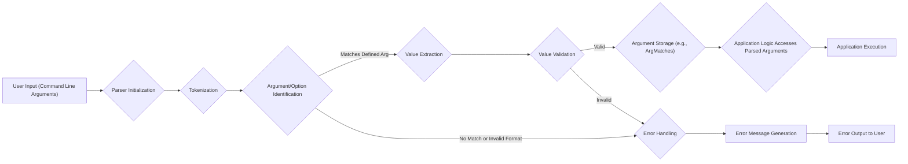

# Project Design Document: clap-rs/clap

**Version:** 1.1
**Date:** October 26, 2023
**Author:** AI Software Architect

## 1. Introduction

This document provides an enhanced design overview of the `clap-rs/clap` project, a command-line argument parsing library for Rust. The primary purpose of this document is to offer a clear and detailed articulation of `clap`'s architecture, components, and data flow, specifically tailored to facilitate comprehensive threat modeling activities. This document serves as a crucial reference for security analysts, developers, and anyone involved in assessing the security posture of applications utilizing `clap`.

## 2. Goals

*   Provide an in-depth and precise description of the `clap` library's architecture and its internal workings.
*   Clearly identify key components, their responsibilities, and their interactions within the library.
*   Illustrate the data flow within the library during the argument parsing process, highlighting critical stages.
*   Emphasize areas of the library that are particularly relevant to security considerations, providing a solid foundation for threat modeling.

## 3. Overview

`clap` is a widely adopted and robust Rust library designed to streamline the creation of command-line interfaces (CLIs). It empowers developers to define the structure of their CLI applications, encompassing arguments, options, and subcommands, and efficiently parses user-provided input according to these predefined rules. `clap` automates several essential tasks:

*   Parsing command-line arguments based on a declarative definition.
*   Performing validation of user input against specified criteria.
*   Generating informative and user-friendly help messages.
*   Offering a straightforward and ergonomic API to access the parsed arguments within the application.

The library is engineered for flexibility and extensibility, accommodating a wide range of argument types, validation strategies, and customization options.

## 4. Architecture

The `clap` library's architecture is modular and well-defined, comprising several interconnected components that collaborate to achieve argument parsing.

### 4.1. Key Components

*   **`App` (or `Command`):** This is the top-level structure representing the entire command-line application. It acts as a container for all configuration related to the CLI, including:
    *   Application name, version, author, and description.
    *   Definitions of all arguments, options, and subcommands.
    *   Global settings and behaviors for the parser.
*   **`Arg`:** Represents a single command-line argument or option. It encapsulates the definition of an individual input element, including:
    *   Name (for positional arguments).
    *   Short and long flags (for options).
    *   Whether the argument is required or optional.
    *   The expected number of values.
    *   Default values if no input is provided.
    *   Specific validation rules or functions to apply to the input.
*   **`Parser`:** The central engine responsible for the core parsing logic. It takes the raw command-line arguments as input and orchestrates the process of matching them against the defined `Arg`s and extracting their values. Key responsibilities include:
    *   Tokenizing the input string.
    *   Identifying arguments, options, and subcommands.
    *   Handling flag parsing (e.g., `-h`, `--help`).
    *   Managing value parsing and collection.
*   **`Value Validation`:** This component enforces constraints and rules on the values provided for arguments. `clap` offers various validation mechanisms:
    *   **Type Checking:** Ensuring values can be parsed into the expected data type (e.g., integer, float, string).
    *   **Range Constraints:** Limiting numerical values to a specific range.
    *   **Value Sets (Enums):** Restricting values to a predefined set of allowed options.
    *   **Custom Validation Functions:** Allowing developers to define their own validation logic for more complex scenarios.
*   **`Help Generation`:** This feature automatically generates comprehensive help messages based on the `App` and `Arg` definitions. It produces output that includes:
    *   Usage instructions for the application and its subcommands.
    *   Descriptions of all available arguments and options.
    *   Information about required arguments and default values.
    *   Examples of how to use the command-line interface.
*   **`Error Handling`:** This component manages errors encountered during the parsing process. It is responsible for:
    *   Detecting invalid argument formats or missing required arguments.
    *   Executing validation checks and reporting failures.
    *   Generating informative error messages to guide the user.
    *   Providing mechanisms for custom error handling.
*   **`Subcommand`:** Enables the creation of nested command structures within the application. Each subcommand can have its own set of `Arg`s and options, allowing for more organized and complex CLI applications.
*   **`Derive API` (Optional):** `clap` provides a powerful derive macro (`#[derive(Parser)]`) that significantly simplifies the process of defining the CLI structure. By annotating Rust structs, the macro automatically generates the necessary `App` and `Arg` configurations, reducing boilerplate code.

### 4.2. Data Flow

The following diagram illustrates the detailed data flow within the `clap` library during the argument parsing process:

**Detailed Data Flow Explanation:**

*   **User Input:** The process begins when the user provides command-line arguments to the application.
*   **Parser Initialization:** The application initializes the `Parser` with the defined `App` configuration.
*   **Tokenization:** The `Parser` breaks down the raw input string into individual tokens (arguments, options, flags, values).
*   **Argument/Option Identification:** The `Parser` attempts to match each token against the defined `Arg`s and subcommands within the `App` structure, considering short and long flags, argument names, and subcommand names.
*   **Value Extraction:** Once a matching `Arg` is found, the `Parser` extracts the associated value(s) from the input tokens.
*   **Value Validation:** The extracted values are then passed to the `Value Validation` component, which applies the defined validation rules (type checking, range constraints, custom functions, etc.).
*   **Argument Storage (e.g., ArgMatches):** If validation is successful, the parsed argument and its value are stored in a structure (typically `ArgMatches`) that provides an API for the application logic to access the parsed data.
*   **Error Handling:** If any errors occur during identification, extraction, or validation, the `Error Handling` component is invoked.
*   **Error Message Generation:** The `Error Handling` component generates an informative error message describing the issue.
*   **Error Output to User:** The generated error message is displayed to the user, typically on the console.
*   **Application Logic Accesses Parsed Arguments:** The application's main logic uses the `ArgMatches` structure to retrieve the parsed argument values.
*   **Application Execution:** With the parsed and validated arguments, the application proceeds with its intended functionality.

### 4.3. Configuration Details

The configuration of the command-line interface in `clap` is primarily done programmatically using the builder pattern provided by the `App` and `Arg` structures or through the declarative approach offered by the derive API. This configuration defines:

*   **Application Metadata:** Name, version, author, and description of the CLI application.
*   **Argument Definitions:** Detailed specifications for each argument and option, including:
    *   Name, short and long flags.
    *   Help text displayed in the help message.
    *   Whether the argument is required.
    *   The number of values expected.
    *   Default values.
    *   Validation rules and functions.
*   **Subcommand Structure:** Definition of nested commands, each with its own set of arguments and options.
*   **Global Settings:** Various settings that control the behavior of the parser, such as whether to allow invalid UTF-8, ignore errors, or customize help message formatting.

## 5. Security Considerations for Threat Modeling

Understanding the architecture and data flow of `clap` is crucial for identifying potential security vulnerabilities. Here are key areas to consider during threat modeling:

*   **Insufficient Input Validation:**  A primary security concern is the lack of or inadequate input validation. If developers do not define and enforce strict validation rules, applications using `clap` can be vulnerable to:
    *   **Buffer Overflows:**  Maliciously long input strings for arguments could potentially overflow buffers if not handled correctly in subsequent application logic.
    *   **Command Injection:** If argument values are directly incorporated into system commands without proper sanitization, attackers could inject arbitrary commands. *Example: An argument intended for a filename could be crafted to execute shell commands.*
    *   **SQL Injection:** If argument values are used in SQL queries without proper escaping or parameterized queries, attackers could inject malicious SQL code.
    *   **Path Traversal:**  If arguments specify file paths, insufficient validation could allow attackers to access files outside the intended directory.
    *   **Denial of Service (DoS):**  Providing extremely large or specially crafted input values could consume excessive resources, leading to a denial of service. *Example: An extremely large number of arguments or very long string values.*
*   **Error Message Information Disclosure:**  Overly verbose error messages might reveal sensitive information about the application's internal structure, file paths, or dependencies, which could be exploited by attackers. *Mitigation: Ensure error messages are informative but avoid exposing sensitive details.*
*   **Default Value Vulnerabilities:**  If default values for arguments are not carefully considered, they could introduce unintended security risks. *Example: A default file path pointing to a sensitive location.*
*   **Dependency Vulnerabilities:**  `clap` relies on other Rust crates. Vulnerabilities in these dependencies could indirectly affect applications using `clap`. *Mitigation: Regularly audit and update dependencies, and use tools for dependency vulnerability scanning.*
*   **Supply Chain Attacks:**  Compromise of the `clap` crate itself or its dependencies could introduce malicious code into applications. *Mitigation: Use trusted sources for dependencies and verify checksums.*
*   **Locale and Encoding Issues:**  Improper handling of different locales and character encodings could lead to unexpected behavior or vulnerabilities.
*   **Argument Parsing Ambiguities:**  While `clap` aims to be clear, complex argument definitions could potentially lead to ambiguities that attackers might exploit.

## 6. Dependencies

`clap` relies on a set of well-maintained Rust crates to provide its functionality. Key dependencies include:

*   **`std` (Rust Standard Library):** Provides fundamental data structures and functionalities.
*   **`strsim`:** Used for calculating string similarities, primarily for suggesting corrections in help messages.
*   **`terminal_size`:**  Used to determine the terminal width for formatting help output.
*   **`anstream` and `anstyle`:**  Used for handling ANSI escape codes to enable colored output in help messages.

It is crucial to be aware of the dependencies of `clap` and to ensure they are regularly updated to patch any potential security vulnerabilities. Employing dependency scanning tools is recommended to proactively identify and address such risks.

## 7. Deployment

`clap` is deployed as a library that is integrated into Rust applications during the build process. Developers declare `clap` as a dependency in their `Cargo.toml` file. The Rust build system then compiles and links `clap` into the final application executable. There is no separate deployment process for the `clap` library itself.

## 8. Future Considerations

*   **Advanced Sanitization Options:** Exploring the inclusion of more built-in sanitization functions or integration points for external sanitization libraries could enhance security.
*   **Formal Security Audits:** Regular, independent security audits of the `clap` codebase are essential to identify and address potential vulnerabilities proactively.
*   **Integration with Security Analysis Tools:**  Improving integration with static analysis tools and fuzzing frameworks would facilitate earlier detection of security issues during development.
*   **Security Best Practices Documentation:** Providing more comprehensive documentation on secure coding practices when using `clap` would be beneficial for developers.

This enhanced design document provides a more detailed and security-focused overview of the `clap` library. It serves as a valuable resource for conducting thorough threat modeling and understanding the security implications of using `clap` in command-line applications. By carefully considering the architecture, data flow, and potential vulnerabilities, developers can build more secure and robust CLI tools.
