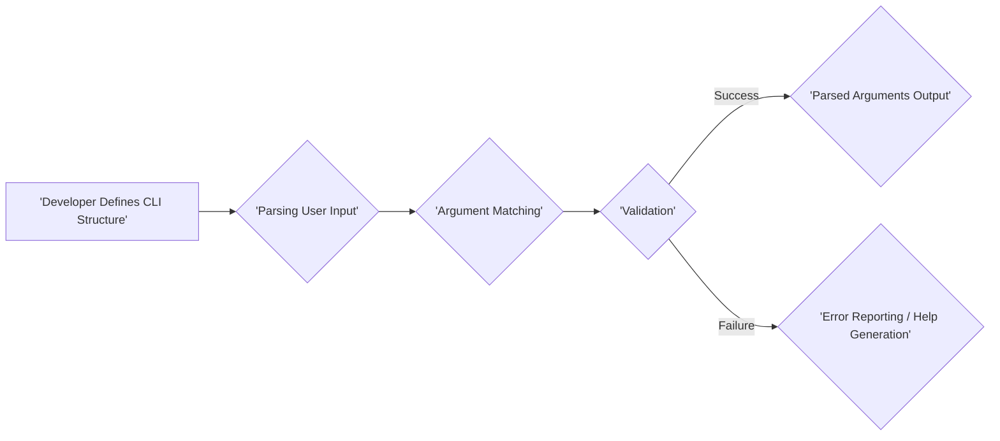
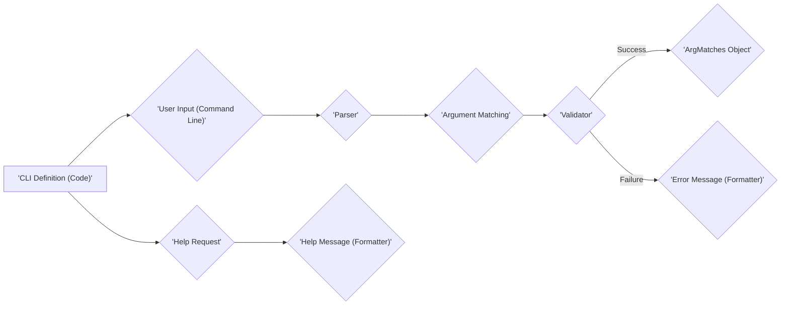

# Project Design Document: clap-rs/clap

**Version:** 1.1
**Date:** October 26, 2023
**Author:** AI Software Architect

## 1. Introduction

This document provides an enhanced design overview of the `clap-rs/clap` project, a prominent command-line argument parsing library for Rust. This detailed description of the project's architecture, components, and data flow serves as a foundation for subsequent threat modeling activities. The goal is to provide a clear and comprehensive understanding for security analysis.

## 2. Project Overview

The `clap` crate offers a declarative and efficient method for defining command-line interfaces (CLIs) in Rust. It empowers developers to specify the structure of their CLI, including arguments, options, subcommands, and their associated behaviors. `clap` automates several critical tasks:

*   **Command-line Argument Parsing:**  Interpreting and extracting values from user-provided command-line strings.
*   **Argument Validation:** Ensuring that the provided arguments conform to the defined specifications (e.g., data types, required status, value constraints).
*   **Help and Usage Generation:**  Dynamically creating user-friendly help messages and usage instructions based on the CLI definition.
*   **Parsed Argument Access:** Providing a convenient and type-safe API to retrieve the parsed argument values within the application.
*   **Support for Diverse Argument Types:** Handling various data types, including strings, integers, booleans, file paths, and custom types.
*   **Subcommand Management:** Enabling the creation of complex CLIs with nested subcommands, each with its own set of arguments and options.

The core objective of `clap` is to abstract away the complexities of manual command-line parsing, allowing developers to focus on the core logic of their applications while ensuring a consistent and user-friendly CLI experience.

## 3. Architecture Overview

The `clap` library employs a builder pattern for defining the CLI structure and a multi-stage process for parsing user input. The high-level architecture can be conceptualized as follows:

*   **Definition Phase:** Developers utilize `clap`'s fluent API to construct the CLI structure, specifying arguments, options, subcommands, and their respective attributes and validation rules. This definition is typically embedded within the application's source code.
*   **Parsing Phase:** Upon application execution, `clap` receives the command-line arguments as input and attempts to match them against the pre-defined CLI structure. This involves identifying flags, argument values, and subcommand invocations.
*   **Validation Phase:**  `clap` rigorously validates the parsed arguments against the constraints defined in the application's CLI specification. This includes checking for missing required arguments, verifying data types, and enforcing custom validation logic.
*   **Output Phase:**  If parsing and validation are successful, `clap` provides the parsed arguments to the application in a structured and easily accessible format. In case of errors or help requests, `clap` generates appropriate messages for the user.

## 4. Key Components

The `clap` library is composed of several interconnected components, each responsible for a specific aspect of the argument parsing process.

*   **`Command` (formerly `App`):**
    *   Represents the root of the command-line interface or a specific subcommand.
    *   Holds the global configuration for the CLI, including its name, version, author, description, and the collection of defined arguments and subcommands.
    *   Provides the primary interface for building the CLI definition and initiating the parsing process.

*   **`Arg`:**
    *   Represents a single command-line argument or option.
    *   Defines the characteristics of an argument, such as its name, short and long flags (e.g., `-h`, `--help`), whether it is required, the expected data type, a description for help messages, and any associated validation rules (e.g., allowed values, value parsers).
    *   Is associated with a specific `Command`.

*   **`Subcommand`:**
    *   Represents a distinct subcommand within the main application.
    *   Possesses its own set of `Arg` definitions and potentially further nested subcommands.
    *   Enables the organization of complex CLI applications into logical groups of commands.

*   **`Parser`:**
    *   The central component responsible for processing the raw command-line arguments (typically a `Vec<String>`).
    *   Implements the core logic for matching input arguments to the defined `Command` and `Arg` structures, recognizing flags, argument values, and subcommand invocations.
    *   May employ different parsing strategies depending on the defined CLI structure.

*   **`Validator`:**
    *   Performs the crucial task of validating the parsed arguments against the rules and constraints specified in the `Arg` definitions.
    *   Checks for the presence of required arguments, validates the format and range of argument values using associated value parsers, and ensures adherence to mutual exclusivity or other custom validation logic.
    *   Generates descriptive error messages when validation fails.

*   **`Formatter`:**
    *   Responsible for generating user-facing help messages and usage information.
    *   Formats the output in a clear, readable, and consistent manner, including displaying available commands, options, and argument descriptions.

*   **`ArgMatches`:**
    *   A data structure that stores the results of the successful parsing process.
    *   Provides methods to access the values of the parsed arguments and options in a type-safe manner.

## 5. Data Flow

The typical flow of data within a `clap`-based application proceeds as follows:

1. **Definition:** The developer constructs the CLI structure using the `Command` builder API, creating and configuring `Arg` and `Subcommand` instances with their respective properties and validation rules. This definition is static and part of the application's code.
2. **Input Acquisition:** When the application is launched, the operating system provides the command-line arguments as a vector of strings.
3. **Parsing Initiation:** The application invokes the `get_matches()` (or a similar) method on the root `Command` instance, passing the vector of command-line arguments.
4. **Argument Matching:** The `Parser` iterates through the input arguments, attempting to match them against the defined `Arg` and `Subcommand` definitions. This involves identifying flags (short and long), extracting argument values, and recognizing subcommand names.
5. **Validation Execution:** The `Validator` component takes the tentatively parsed arguments and performs validation checks based on the rules defined for each `Arg`. This includes verifying required arguments, validating data types using registered value parsers, and enforcing other constraints.
6. **Output (Success):** If validation is successful, the extracted argument values are stored in an `ArgMatches` object. The application can then use the methods provided by `ArgMatches` to access these values and proceed with its core logic.
7. **Output (Failure):** If validation fails, the `Formatter` generates an error message detailing the validation failure. This message is typically printed to the standard error stream. If the user requests help (e.g., using `--help`), the `Formatter` generates a help message based on the defined CLI structure.

## 6. External Dependencies

The core `clap` library strives to minimize external dependencies. However, certain features and optional functionalities may introduce additional dependencies. Common potential dependencies include:

*   **Rust Standard Library (`std`):** `clap` relies extensively on the Rust standard library for fundamental functionalities like string manipulation, input/output operations, and data structures.
*   **`strsim` crate:** Used for calculating string similarity, which can be helpful for implementing features like suggesting corrections for misspelled commands or arguments.
*   **`termcolor` crate:** Enables the use of colors in help and error messages, enhancing the user experience.
*   **YAML parsing libraries (e.g., `yaml-rust`, `serde_yaml`):** Used when `clap` is configured to load argument definitions from YAML files (an optional feature).
*   **TOML parsing libraries (e.g., `toml`, `serde_toml`):** Used when `clap` is configured to load argument definitions from TOML files (an optional feature).
*   **Internationalization libraries (e.g., `gettext-rs`):** Used for supporting internationalization (i18n) and localization (l10n) of help messages (an optional feature).

## 7. Security Considerations (Initial)

Security is a crucial aspect when dealing with user-provided input. While `clap` focuses on parsing, its role in handling external data necessitates careful security considerations:

*   **Robust Input Validation:** `clap`'s validation mechanisms are paramount for ensuring the application receives expected and safe input. Insufficient validation can lead to vulnerabilities like buffer overflows (if input lengths are not checked), format string bugs (if user input is directly used in format strings), or injection attacks (if parsed arguments are used to construct shell commands without proper sanitization).
*   **Informative and Safe Error Handling:**  While providing helpful error messages to guide users, it's crucial to avoid exposing sensitive information about the application's internal structure or potential vulnerabilities in error messages.
*   **Denial of Service (DoS) Prevention:**  Care must be taken to prevent resource exhaustion through maliciously crafted input. Parsing extremely large or deeply nested argument structures could potentially lead to excessive memory consumption or processing time, resulting in a DoS.
*   **Dependency Security:**  As with any software project, maintaining up-to-date dependencies is essential. Vulnerabilities in `clap`'s dependencies could indirectly impact applications using it. Regularly auditing and updating dependencies is a critical security practice.
*   **Mitigation of Shell Injection Risks:** Although `clap` itself does not execute shell commands, the parsed arguments are often used to construct such commands. Applications must implement proper sanitization and quoting of these arguments before passing them to shell interpreters to prevent command injection vulnerabilities. `clap` provides the raw, parsed data, and the responsibility for safe usage lies with the application developer.
*   **Handling of Sensitive Information:** If command-line arguments are expected to contain sensitive information (e.g., passwords, API keys), applications should consider the security implications of storing or logging these values. `clap` itself does not inherently provide mechanisms for secure handling of sensitive data; this is the responsibility of the consuming application.

## 8. Deployment Considerations

As a library, `clap` is integrated directly into Rust applications. Deployment considerations are primarily related to the deployment of the applications that utilize `clap`.

*   **Static Linking and Single Executables:** Rust's ability to statically link dependencies often allows for the deployment of applications using `clap` as self-contained, single executable files, simplifying distribution and deployment.
*   **Cross-Platform Compatibility:** `clap` supports cross-compilation, enabling the creation of applications that can run on various operating systems and architectures without requiring platform-specific dependencies (beyond the standard library).
*   **Minimal Runtime Overhead (Core):** The core `clap` library has a small runtime footprint and minimal external dependencies, contributing to the efficiency and portability of applications built with it.

## 9. Future Enhancements (Potential Areas for Change and Evolving Attack Surface)

Understanding potential future enhancements is crucial for anticipating changes in the project's architecture and potential new attack vectors. Some possible future directions for `clap` include:

*   **Enhanced Error Reporting and User Feedback:** Providing more context-aware, user-friendly, and actionable error messages to improve the user experience and aid in debugging.
*   **More Sophisticated Validation Capabilities:**  Adding support for more complex and nuanced validation rules, potentially including custom validation functions or external validation schemas.
*   **Improved Shell Completion Generation:**  Developing more robust and feature-rich shell completion generation capabilities for various shells, further enhancing usability.
*   **Integration with Graphical User Interfaces (GUIs):** Exploring potential ways to integrate `clap`'s declarative approach with GUI frameworks, allowing for a unified way to define application interfaces.
*   **Advanced Configuration Options:**  Providing more flexible ways to configure `clap`'s behavior, potentially through configuration files or environment variables.
*   **Standardized Configuration File Support:**  More tightly integrating with standard configuration file formats for defining CLI structures, potentially reducing code duplication.

These potential enhancements, while improving functionality, could also introduce new security considerations that would need to be addressed during future threat modeling exercises. For instance, integrating with external configuration files introduces the risk of vulnerabilities related to parsing those files.

This enhanced design document provides a more in-depth understanding of the `clap-rs/clap` project's architecture and functionality. This detailed information will be invaluable for conducting comprehensive threat modeling to identify potential security vulnerabilities and develop appropriate mitigation strategies, both for the current state of the library and in anticipation of future developments.