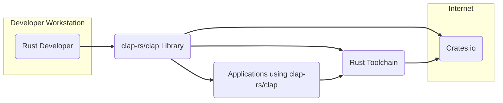
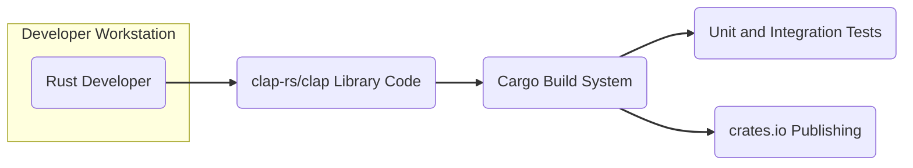
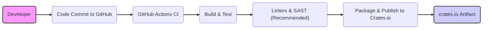

# BUSINESS POSTURE

- Business priorities and goals:
  - Provide a robust, reliable, and user-friendly command-line argument parsing library for Rust developers.
  - Enable Rust developers to easily build command-line interfaces for their applications.
  - Maintain a widely adopted and trusted library within the Rust ecosystem.
- Most important business risks:
  - Risk of bugs or vulnerabilities in the library leading to issues in applications that depend on it.
  - Risk of performance issues impacting the usability of applications using the library.
  - Risk of lack of maintenance or community support leading to stagnation and reduced adoption.

# SECURITY POSTURE

- Existing security controls:
  - security control: Open source development model, allowing for community review and contribution, hosted on GitHub.
  - security control: Use of Rust programming language, which provides memory safety and reduces certain classes of vulnerabilities.
  - security control: Comprehensive suite of unit and integration tests to ensure functionality and catch regressions, described in repository's test suite.
  - security control: Code review process via GitHub pull requests before merging changes, visible in repository's pull request history.
- Accepted risks:
  - accepted risk: Reliance on community contributions for identifying and addressing security vulnerabilities.
  - accepted risk: Potential for vulnerabilities in dependencies that clap-rs/clap relies upon.
- Recommended security controls:
  - security control: Implement automated Static Application Security Testing (SAST) tools in the Continuous Integration (CI) pipeline to detect potential vulnerabilities in code changes.
  - security control: Consider incorporating dependency scanning tools to identify known vulnerabilities in third-party libraries used by clap-rs/clap.
  - security control: Establish a clear process for reporting and handling security vulnerabilities, including a security policy and contact information.
- Security requirements:
  - Authentication: Not applicable for a library. Clap-rs/clap itself does not handle user authentication.
  - Authorization: Not applicable for a library. Clap-rs/clap itself does not handle user authorization.
  - Input validation: Critical. Clap-rs/clap must robustly validate and sanitize command-line arguments to prevent unexpected behavior, crashes, or vulnerabilities in applications using it. This is implicitly part of the library's core functionality.
  - Cryptography: Not directly applicable. Clap-rs/clap itself is not expected to perform cryptographic operations. However, applications using clap-rs/clap might handle sensitive data, and clap-rs/clap should not introduce vulnerabilities that could compromise such data if passed as arguments (though passing sensitive data as command line arguments is generally discouraged).

# DESIGN

## C4 CONTEXT



- Elements of context diagram:
  - - Name: Rust Developer
    - Type: Person
    - Description: Software developers who use the clap-rs/clap library to build command-line applications in Rust.
    - Responsibilities: Utilize clap-rs/clap to define and parse command-line arguments for their applications. Report issues and contribute to the library.
    - Security controls: Secure development practices on their workstations.
  - - Name: clap-rs/clap Library
    - Type: Software System
    - Description: A Rust library for parsing command-line arguments. It is the central component of this design document.
    - Responsibilities: Provide a robust and flexible API for defining and parsing command-line arguments. Ensure correct and safe parsing of user inputs.
    - Security controls: Input validation, secure coding practices, automated testing, community review.
  - - Name: Rust Toolchain
    - Type: Software System
    - Description: The Rust compiler (rustc), package manager (Cargo), and standard library. Essential for building and using Rust libraries.
    - Responsibilities: Compile Rust code, manage dependencies, provide core functionalities for Rust programs.
    - Security controls: Security of the Rust toolchain itself, which is maintained by the Rust project.
  - - Name: Crates.io
    - Type: Software System
    - Description: The official package registry for Rust crates (libraries). Used to distribute and download clap-rs/clap.
    - Responsibilities: Host and distribute Rust crates. Ensure integrity and availability of packages.
    - Security controls: Security measures implemented by Crates.io to protect packages and user accounts.
  - - Name: Applications using clap-rs/clap
    - Type: Software System
    - Description: Various command-line applications built by Rust developers that depend on the clap-rs/clap library.
    - Responsibilities: Utilize clap-rs/clap to handle command-line argument parsing. Implement application-specific logic.
    - Security controls: Application-specific security controls, including how they handle arguments parsed by clap-rs/clap.

## C4 CONTAINER



- Elements of container diagram:
  - - Name: clap-rs/clap Library Code
    - Type: Container (Code Repository)
    - Description: The source code of the clap-rs/clap library, written in Rust and hosted on GitHub.
    - Responsibilities: Implement the command-line argument parsing logic. Maintain code quality, security, and functionality.
    - Security controls: Version control (Git), code review process, static analysis (planned), vulnerability scanning (planned).
  - - Name: Cargo Build System
    - Type: Container (Build Tool)
    - Description: Rust's build system and package manager. Used to compile, test, and package the clap-rs/clap library.
    - Responsibilities: Compile the Rust code, manage dependencies, run tests, create distributable packages.
    - Security controls: Dependency management, build reproducibility, potentially build signing (not currently implemented for clap-rs/clap publishing process as visible in repository).
  - - Name: Unit and Integration Tests
    - Type: Container (Testing Framework)
    - Description: Automated tests written to verify the functionality and correctness of the clap-rs/clap library.
    - Responsibilities: Ensure code quality, detect regressions, validate input parsing logic.
    - Security controls: Test coverage, regular execution in CI, security-focused test cases (e.g., testing for input validation vulnerabilities).
  - - Name: crates.io Publishing
    - Type: Container (Distribution System)
    - Description: Process of packaging and uploading the compiled clap-rs/clap library to Crates.io for public distribution.
    - Responsibilities: Make the library available to Rust developers. Ensure integrity of published packages.
    - Security controls: Crates.io security controls, potentially signing of packages (not currently implemented for clap-rs/clap publishing process as visible in repository), secure publishing process (using API keys, etc.).

## DEPLOYMENT

```mermaid
flowchart LR
    subgraph Developer Environment
        A("Developer Workstation")
        B("Cargo Build Tool")
    end
    subgraph Crates.io Registry
        C("Crates.io Server")
        D("clap-rs/clap Package")
    end
    subgraph User Application Deployment Environment
        E("User Application Server/Environment")
        F("Application using clap-rs/clap")
    end

    A --> B: Build & Publish
    B --> C: Publish
    C --> D: Stores
    C --> E: Download
    E --> F: Uses

    linkStyle 0,1,2,3,4 stroke:#333,stroke-width:2px;
```

- Elements of deployment diagram:
  - - Name: Developer Workstation
    - Type: Infrastructure (Physical/Virtual Machine)
    - Description: The development machine used by Rust developers to build and publish the clap-rs/clap library.
    - Responsibilities: Development, testing, building, and publishing of the library.
    - Security controls: Developer workstation security practices, access control, secure development environment.
  - - Name: Cargo Build Tool
    - Type: Software
    - Description: Rust's build tool used on the developer workstation to compile and package the library.
    - Responsibilities: Building the library, managing dependencies, packaging for distribution.
    - Security controls: Secure build process, dependency integrity checks.
  - - Name: Crates.io Server
    - Type: Infrastructure (Server)
    - Description: The servers hosting the Crates.io registry, responsible for storing and distributing Rust crates.
    - Responsibilities: Hosting and serving Rust crates, managing package metadata, user accounts, and API access.
    - Security controls: Crates.io infrastructure security, access control, DDoS protection, package integrity checks.
  - - Name: clap-rs/clap Package
    - Type: Data (Software Package)
    - Description: The packaged and published version of the clap-rs/clap library stored on Crates.io.
    - Responsibilities: Provide the distributable artifact of the library.
    - Security controls: Package integrity (checksums, potentially signing - not currently implemented for clap-rs/clap publishing process as visible in repository), Crates.io security measures.
  - - Name: User Application Server/Environment
    - Type: Infrastructure (Server/Environment)
    - Description: The environment where applications using clap-rs/clap are deployed and run. This could be various environments like servers, desktops, cloud instances, etc.
    - Responsibilities: Run applications that depend on clap-rs/clap.
    - Security controls: Environment-specific security controls, application security controls.
  - - Name: Application using clap-rs/clap
    - Type: Software
    - Description: An application built by a Rust developer that uses the clap-rs/clap library for command-line argument parsing.
    - Responsibilities: Utilize clap-rs/clap for argument parsing, implement application logic.
    - Security controls: Application-specific security controls, secure handling of arguments parsed by clap-rs/clap.

## BUILD



- Elements of build diagram:
  - - Name: Developer
    - Type: Person
    - Description: A software developer contributing to the clap-rs/clap project.
    - Responsibilities: Writing code, fixing bugs, adding features, and committing changes to the GitHub repository.
    - Security controls: Secure coding practices, code review participation, workstation security.
  - - Name: Code Commit to GitHub
    - Type: Process
    - Description: The action of committing code changes to the clap-rs/clap GitHub repository.
    - Responsibilities: Version control, change tracking, triggering the CI pipeline.
    - Security controls: GitHub access controls, branch protection rules, commit signing (not enforced but possible).
  - - Name: GitHub Actions CI
    - Type: System (CI/CD)
    - Description: GitHub's built-in Continuous Integration and Continuous Delivery service, used to automate the build, test, and publishing process for clap-rs/clap.
    - Responsibilities: Automate build, test, and potentially deployment workflows.
    - Security controls: GitHub Actions security best practices, secrets management, workflow definition security.
  - - Name: Build & Test
    - Type: Process
    - Description: The automated process of compiling the Rust code and running unit and integration tests.
    - Responsibilities: Ensure code compiles correctly and tests pass, verifying functionality.
    - Security controls: Secure build environment, dependency integrity checks during build, test isolation.
  - - Name: Linters & SAST (Recommended)
    - Type: Process (Security Check)
    - Description: Recommended addition to the build process to include automated code linters and Static Application Security Testing (SAST) tools to identify potential code quality and security issues.
    - Responsibilities: Improve code quality, identify potential vulnerabilities early in the development lifecycle.
    - Security controls: SAST tool configuration, integration with CI pipeline, vulnerability reporting.
  - - Name: Package & Publish to Crates.io
    - Type: Process
    - Description: The automated process of packaging the compiled library and publishing it to the Crates.io registry.
    - Responsibilities: Distribute the library to Rust developers via Crates.io.
    - Security controls: Secure publishing process (API keys management), package integrity (checksums, potentially signing - not currently implemented for clap-rs/clap publishing process as visible in repository), Crates.io security controls.
  - - Name: crates.io Artifact
    - Type: Data (Software Package)
    - Description: The final packaged and published clap-rs/clap library available on Crates.io.
    - Responsibilities: Distributable artifact of the library.
    - Security controls: Crates.io security measures, package integrity.

# RISK ASSESSMENT

- Critical business process we are trying to protect:
  - Providing a reliable, secure, and functional command-line argument parsing library to the Rust community. The critical process is the development, build, and distribution of this library.
- Data we are trying to protect and their sensitivity:
  - Source code: Publicly available on GitHub, but integrity and availability are important to prevent malicious modifications or disruptions.
  - Build artifacts (compiled library): Publicly available on Crates.io, integrity and availability are crucial to ensure users download legitimate and functional library versions.
  - Crates.io publishing credentials: Sensitive. Compromise could lead to malicious package uploads.
  - GitHub account credentials: Sensitive. Compromise could lead to code manipulation or repository takeover.

# QUESTIONS & ASSUMPTIONS

- Questions:
  - What is the intended scope for threat modeling? Is it focused solely on the clap-rs/clap library itself, or does it extend to applications that use the library? (Assumption: Focus is primarily on the library itself).
  - Are there any specific security concerns or past incidents that are driving this design document and threat modeling exercise? (Assumption: This is a proactive security assessment, not triggered by a specific incident).
  - What is the acceptable risk level for the clap-rs/clap project? (Assumption: Aim for a low risk level given the library's wide usage and importance in the Rust ecosystem).
- Assumptions:
  - The clap-rs/clap project aims to be a widely used and trusted library in the Rust ecosystem.
  - Security and reliability are important non-functional requirements for the clap-rs/clap library.
  - The primary distribution channel for clap-rs/clap is Crates.io.
  - The development and build infrastructure relies on GitHub and GitHub Actions.