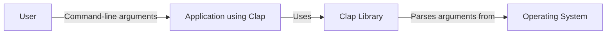
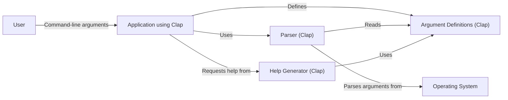
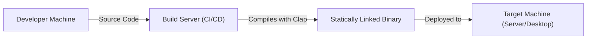
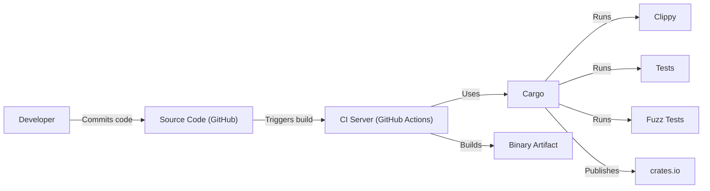

# BUSINESS POSTURE

Business Priorities and Goals:

*   Provide a robust and feature-rich command-line argument parser for Rust applications.
*   Offer a simple and intuitive API for developers to define and handle command-line arguments.
*   Maintain high performance and minimal overhead.
*   Support a wide range of command-line argument parsing features, including subcommands, flags, options, and positional arguments.
*   Provide excellent documentation and examples to facilitate adoption.
*   Foster a vibrant community and encourage contributions.
*   Ensure cross-platform compatibility.

Business Risks:

*   Inability to parse complex command-line arguments correctly, leading to application errors or unexpected behavior.
*   Security vulnerabilities introduced through improper handling of user-provided input, potentially leading to code injection or denial-of-service attacks.
*   Performance bottlenecks that impact the startup time or responsiveness of applications using the library.
*   Lack of features or flexibility that limit the library's applicability to certain use cases.
*   Poor documentation or support that hinders developer adoption.
*   Compatibility issues with different operating systems or Rust versions.

# SECURITY POSTURE

Existing Security Controls:

*   security control: Fuzz testing: The project uses fuzz testing (cargo-fuzz) to identify potential vulnerabilities and edge cases in argument parsing.
*   security control: Code reviews: All contributions are subject to code review to ensure code quality and security.
*   security control: Clippy: Clippy, a linter, is used to enforce coding best practices and identify potential issues.
*   security control: Tests: Extensive test suite to ensure correctness and prevent regressions.
*   security control: Dependency management: Dependencies are carefully managed and reviewed.

Accepted Risks:

*   accepted risk: The library relies on the correctness of the Rust standard library and other core dependencies.
*   accepted risk: Complex parsing logic may contain subtle bugs that are not detected by existing tests.

Recommended Security Controls:

*   security control: Regularly audit dependencies for known vulnerabilities.
*   security control: Implement more comprehensive security-focused fuzzing, specifically targeting potential injection vulnerabilities.
*   security control: Consider using a static analysis tool specifically designed for security audits, in addition to Clippy.
*   security control: Document secure usage guidelines for developers using the library, emphasizing input validation and sanitization.

Security Requirements:

*   Authentication: Not directly applicable to a command-line argument parser.
*   Authorization: Not directly applicable to a command-line argument parser.
*   Input Validation:
    *   The library should correctly handle various input types, including strings, numbers, and booleans.
    *   The library should enforce constraints on input values, such as minimum/maximum lengths, allowed characters, and valid ranges.
    *   The library should provide mechanisms for developers to define custom validation rules.
    *   The library should reject invalid input gracefully, providing informative error messages.
*   Cryptography: Not directly applicable, unless the parsed arguments are used for cryptographic operations (in which case, standard cryptographic best practices should be followed in the application using clap).

# DESIGN

## C4 CONTEXT

Element Descriptions:

*   Element:
    *   Name: User
    *   Type: Person
    *   Description: The person interacting with the application through the command line.
    *   Responsibilities: Provides command-line arguments to the application.
    *   Security controls: None (external to the system).

*   Element:
    *   Name: Clap Library
    *   Type: Library
    *   Description: The clap library for parsing command-line arguments.
    *   Responsibilities: Parses command-line arguments and provides them to the application in a structured format.
    *   Security controls: Fuzz testing, code reviews, Clippy, tests, dependency management.

*   Element:
    *   Name: Application using Clap
    *   Type: Software System
    *   Description: The application that utilizes the clap library.
    *   Responsibilities: Defines the expected command-line arguments and uses clap to parse them.  Performs the application's core logic.
    *   Security controls:  Dependent on the specific application. Should include input validation and sanitization based on clap's output.

*   Element:
    *   Name: Operating System
    *   Type: System
    *   Description: The operating system on which the application runs.
    *   Responsibilities: Provides the command-line arguments to the application process.
    *   Security controls: OS-level security controls (e.g., user permissions, process isolation).

## C4 CONTAINER

Since Clap is a library, the container diagram is essentially the same as the context diagram, with the addition of internal components within the Clap library itself. For simplicity, we'll represent the major components.

Element Descriptions:

*   Element:
    *   Name: User
    *   Type: Person
    *   Description: The person interacting with the application.
    *   Responsibilities: Provides command-line arguments.
    *   Security controls: None (external).

*   Element:
    *   Name: Application using Clap
    *   Type: Software System
    *   Description: The application using the clap library.
    *   Responsibilities: Defines arguments, uses the parser, handles parsed arguments.
    *   Security controls: Application-specific.

*   Element:
    *   Name: Operating System
    *   Type: System
    *   Description: The operating system.
    *   Responsibilities: Provides the raw command-line arguments.
    *   Security controls: OS-level security.

*   Element:
    *   Name: Parser (Clap)
    *   Type: Component
    *   Description: The core parsing engine of the clap library.
    *   Responsibilities: Parses the raw command-line arguments according to the argument definitions.
    *   Security controls: Fuzz testing, code reviews.

*   Element:
    *   Name: Argument Definitions (Clap)
    *   Type: Component
    *   Description: Data structures representing the defined arguments, flags, and options.
    *   Responsibilities: Stores the specifications of the expected command-line arguments.
    *   Security controls: Code reviews.

*   Element:
    *   Name: Help Generator (Clap)
    *   Type: Component
    *   Description: Generates help messages based on the argument definitions.
    *   Responsibilities: Creates user-friendly documentation for the command-line interface.
    *   Security controls: Code reviews.

## DEPLOYMENT

Clap is a library, so "deployment" in the traditional sense doesn't apply.  Instead, it's *integrated* into applications. However, we can describe how an application *using* Clap would be deployed. We'll consider a few common scenarios and then detail one:

Possible Deployment Solutions:

1.  Statically linked binary: The application and Clap are compiled into a single, self-contained executable.
2.  Dynamically linked binary: The application links to Clap as a shared library (less common for Rust).
3.  Containerized application (e.g., Docker): The application and its dependencies, including Clap, are packaged into a container image.
4.  Cargo publish: Clap itself is deployed to crates.io.

Chosen Deployment Solution (Statically Linked Binary):

Element Descriptions:

*   Element:
    *   Name: Developer Machine
    *   Type: Infrastructure Node
    *   Description: The machine where the application code (and Clap dependency) resides.
    *   Responsibilities: Code development, testing, and pushing to the build server.
    *   Security controls: Developer machine security (e.g., access controls, malware protection).

*   Element:
    *   Name: Build Server (CI/CD)
    *   Type: Infrastructure Node
    *   Description: A server that automates the build and testing process.
    *   Responsibilities: Builds the application, runs tests, and creates the deployable artifact.
    *   Security controls: Access controls, build process security (e.g., signed builds, secure dependency management).

*   Element:
    *   Name: Target Machine (Server/Desktop)
    *   Type: Infrastructure Node
    *   Description: The machine where the application will run.
    *   Responsibilities: Executes the application binary.
    *   Security controls: Standard server/desktop security measures (e.g., firewalls, intrusion detection, access controls).

*   Element:
    *   Name: Statically Linked Binary
    *   Type: Artifact
    *   Description: The compiled application, including the Clap library.
    *   Responsibilities:  The executable application.
    *   Security controls:  Code signing (if applicable).

## BUILD

Build Process Description:

1.  Developer commits code to the GitHub repository.
2.  This triggers a build on the CI server (GitHub Actions in this case).
3.  Cargo, the Rust build tool, is used to manage dependencies, compile the code, and run tests.
4.  Clippy is run to check for code style and potential errors.
5.  Unit tests and integration tests are executed.
6.  Fuzz tests (using cargo-fuzz) are run to identify potential vulnerabilities.
7.  If all checks pass, Cargo can publish the library to crates.io.
8.  The CI server may also build a binary artifact of the library or an application using it.

Security Controls in Build Process:

*   security control: CI/CD pipeline: Automates the build and testing process, ensuring consistency and reducing manual errors.
*   security control: Dependency management: Cargo.lock ensures consistent dependency versions.
*   security control: Clippy: Enforces coding best practices and identifies potential issues.
*   security control: Tests: Comprehensive test suite to catch bugs and regressions.
*   security control: Fuzz testing: Identifies potential vulnerabilities through automated input generation.
*   security control: GitHub Actions: Provides a secure and controlled environment for building and testing the code.

# RISK ASSESSMENT

Critical Business Processes:

*   Reliable and predictable application behavior: Applications using Clap must function correctly based on user-provided input.
*   Maintaining developer trust: Clap must be a dependable and secure library to maintain its reputation and adoption.

Data to Protect:

*   Sensitivity: Low to Medium (depending on the application using Clap).
*   Data: Clap itself doesn't directly handle sensitive data. However, the *applications* using Clap might process sensitive data provided as command-line arguments. The sensitivity depends entirely on the specific application. For example, an application managing cryptographic keys would have highly sensitive command-line arguments, while a simple calculator application would not. Clap itself is primarily concerned with the *structure* of the arguments, not their content. The *responsibility for protecting sensitive data lies with the application using Clap*.

# QUESTIONS & ASSUMPTIONS

Questions:

*   Are there any specific compliance requirements (e.g., PCI DSS, HIPAA) that applications using Clap might need to adhere to? This would influence recommendations for input validation and data handling within those applications.
*   What is the expected threat model for applications using Clap? Are they primarily used in trusted environments, or are they exposed to potentially malicious users?
*   What level of assurance is required for the correctness of Clap's parsing logic? Is there a need for formal verification or other advanced verification techniques?

Assumptions:

*   BUSINESS POSTURE: The primary goal is to provide a reliable and feature-rich command-line argument parsing library. Security is a high priority, but not at the expense of usability or performance.
*   SECURITY POSTURE: The existing security controls (fuzz testing, code reviews, Clippy) are considered a good baseline, but there's room for improvement.
*   DESIGN: The design is relatively simple, as Clap is a library. The main focus is on the correctness and security of the parsing logic. The deployment model assumes a statically linked binary for applications using Clap, but other models are possible. The build process relies on GitHub Actions and Cargo.