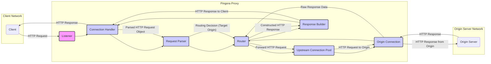

# Project Design Document: Pingora - Cloudflare's HTTP Proxy

**Version:** 1.1
**Date:** October 26, 2023
**Author:** AI Software Architect

## 1. Introduction

This document provides an enhanced and more detailed design overview of Pingora, Cloudflare's Rust-based HTTP proxy, as described in the GitHub repository: [https://github.com/cloudflare/pingora](https://github.com/cloudflare/pingora). This revised document aims to provide an even clearer articulation of the architecture, components, and data flow within Pingora, with a stronger focus on aspects relevant to threat modeling.

## 2. Goals and Objectives

*   Provide a comprehensive and detailed architectural overview of Pingora.
*   Identify key components and their specific responsibilities and interactions.
*   Describe the data flow through the system with greater granularity.
*   Highlight security-relevant aspects of the design with concrete examples.
*   Serve as a robust basis for identifying potential security threats and vulnerabilities.

## 3. High-Level Architecture

Pingora operates as a high-performance, asynchronous reverse proxy positioned between clients and origin servers. It efficiently handles incoming HTTP requests, makes routing decisions, forwards requests to the appropriate backend, and returns responses to the clients. Its architecture emphasizes concurrency and non-blocking operations.

## 4. Component Details

This section provides a more detailed breakdown of the key components within the Pingora proxy and their interactions.

*   **Listener:**
    *   Specifically responsible for accepting new TCP connections on configured IP addresses and ports.
    *   Handles the initial TCP handshake (SYN, SYN-ACK, ACK).
    *   Offloads the newly accepted socket to a **Connection Handler**.
    *   May implement features like TCP Fast Open.

*   **Connection Handler:**
    *   Manages the lifecycle of an individual client connection.
    *   Handles reading raw bytes from the socket using non-blocking I/O.
    *   Buffers incoming data until a complete HTTP request can be parsed.
    *   Writes the constructed HTTP response back to the client socket.
    *   Manages connection timeouts and keeps alive mechanisms.

*   **Request Parser:**
    *   Decodes the raw byte stream into a structured HTTP request object.
    *   Implements strict parsing according to HTTP specifications (e.g., RFC 7230).
    *   Performs validation checks for:
        *   Valid HTTP method, URI, and version.
        *   Correct header formatting and syntax.
        *   Reasonable header sizes and counts to prevent abuse.
    *   May handle different HTTP versions (HTTP/1.1, HTTP/2).

*   **Router:**
    *   Examines the parsed HTTP request (specifically the headers and URI) to determine the appropriate upstream origin server.
    *   Utilizes a configurable set of routing rules, which can be based on:
        *   Hostname (e.g., `Host` header).
        *   Path prefixes or exact matches.
        *   Specific headers or header values.
    *   May implement load balancing algorithms (e.g., round-robin, weighted, least connections) across multiple eligible origin servers.
    *   Can perform transformations on the request before forwarding (e.g., adding/removing headers).

*   **Upstream Connection Pool:**
    *   Maintains a pool of persistent TCP connections to various origin servers.
    *   Reduces the latency and overhead of establishing new connections for each request.
    *   Implements connection health checks (e.g., sending periodic pings) to detect unhealthy origins.
    *   Handles connection reuse and idle connection management.
    *   May support different connection protocols to the origin (e.g., HTTP/1.1, HTTP/2).

*   **Origin Connection:**
    *   Represents an active, established connection to a specific origin server from the connection pool.
    *   Responsible for serializing the HTTP request object back into a byte stream for transmission to the origin.
    *   Handles reading the raw bytes of the HTTP response from the origin.
    *   May implement timeouts for requests to the origin.

*   **Response Builder:**
    *   Constructs the final HTTP response that will be sent back to the client.
    *   Typically takes the response received from the origin and may modify it based on configuration or requirements.
    *   Possible modifications include:
        *   Adding or removing headers (e.g., security headers).
        *   Modifying the response body (less common for a proxy).
        *   Setting caching headers.
    *   Ensures the response conforms to HTTP specifications.

*   **Configuration Management:**
    *   Handles the loading, parsing, and management of Pingora's configuration.
    *   Configuration sources can include files, environment variables, or a configuration server.
    *   Supports reloading configuration without service interruption (zero-downtime reload).
    *   Configuration includes routing rules, upstream server definitions, TLS settings, logging parameters, etc.

*   **Logging and Metrics:**
    *   Records detailed logs of requests and responses, including timestamps, client IPs, requested URLs, response codes, and latencies.
    *   Generates various metrics about Pingora's performance, such as:
        *   Request rate and throughput.
        *   Error rates (client and origin).
        *   Connection pool statistics.
        *   Resource utilization (CPU, memory).
    *   Supports exporting logs and metrics to external systems for analysis and monitoring.

## 5. Data Flow

The detailed flow of an HTTP request through Pingora is as follows:

1. A client initiates a TCP connection to the Pingora proxy.
2. The **Listener** accepts the connection and hands the socket to a **Connection Handler**.
3. The **Connection Handler** asynchronously reads raw bytes from the client socket.
4. The **Request Parser** incrementally parses the byte stream into an HTTP request object, validating its structure and content.
5. The **Router** examines the parsed HTTP request object (specifically headers like `Host` and the request URI).
6. Based on configured routing rules, the **Router** selects the appropriate target origin server and potentially a specific upstream connection pool.
7. The **Router** retrieves an available **Origin Connection** from the **Upstream Connection Pool** for the selected origin. If no connection is available, a new one is established.
8. The **Origin Connection** serializes the HTTP request object back into a byte stream.
9. The serialized HTTP request is sent to the origin server.
10. The **Origin Connection** asynchronously reads the raw bytes of the HTTP response from the origin server.
11. The **Response Builder** receives the raw response data and constructs the final HTTP response object.
12. The **Response Builder** may modify the response based on configured rules (e.g., adding security headers).
13. The **Connection Handler** serializes the constructed HTTP response object into a byte stream.
14. The byte stream of the HTTP response is sent back to the client over the established TCP connection.
15. The **Logging and Metrics** component records information about the request and response at various stages of the process.

## 6. Security Considerations

This section provides a more detailed look at security considerations, including potential threats and how Pingora's design addresses them.

*   **Input Validation:**
    *   **Threat:** HTTP smuggling, request splitting, header injection attacks.
    *   **Mitigation:** The **Request Parser** implements strict adherence to HTTP specifications, rejecting malformed requests and preventing attackers from injecting malicious content or bypassing security checks. It enforces limits on header sizes and counts to prevent resource exhaustion.

*   **TLS/SSL Termination:**
    *   **Threat:** Man-in-the-middle attacks, eavesdropping, downgrade attacks.
    *   **Mitigation:** Pingora supports strong TLS versions (TLS 1.2 and 1.3) and secure cipher suites. Secure storage of private keys is paramount. Configuration options should enforce HTTPS and prevent downgrades to insecure protocols. Regular updates are needed to patch TLS vulnerabilities.

*   **Authentication and Authorization:**
    *   **Threat:** Unauthorized access to backend resources.
    *   **Mitigation:** Pingora can be configured to perform authentication (e.g., verifying API keys, JWTs) and authorization checks before forwarding requests. Secure handling and storage of credentials within Pingora's configuration are crucial.

*   **Rate Limiting and Abuse Prevention:**
    *   **Threat:** Denial-of-service (DoS) and distributed denial-of-service (DDoS) attacks, brute-force attacks.
    *   **Mitigation:** Pingora can implement rate limiting based on various criteria (e.g., client IP, request headers). Connection limits can prevent resource exhaustion. Integration with external DDoS mitigation services is also possible.

*   **Origin Server Protection:**
    *   **Threat:** Overloading origin servers, exposing origin servers directly to the internet.
    *   **Mitigation:** Pingora acts as a protective layer, hiding the origin servers' IP addresses. Connection pooling and request buffering help to smooth out traffic spikes and prevent overwhelming the origins.

*   **Logging and Auditing:**
    *   **Threat:** Lack of visibility into security incidents, difficulty in forensic analysis.
    *   **Mitigation:** Comprehensive logging provides an audit trail of requests and responses, aiding in security monitoring and incident response. Logs should include relevant information for identifying malicious activity. Secure storage and access control for logs are essential.

*   **Configuration Security:**
    *   **Threat:** Unauthorized modification of routing rules or security settings, exposure of sensitive credentials.
    *   **Mitigation:** Configuration files should have restricted access permissions. Secrets within the configuration (e.g., TLS private keys, API keys) should be stored securely, ideally using encryption or a dedicated secrets management system.

*   **Dependency Management:**
    *   **Threat:** Vulnerabilities in third-party libraries used by Pingora.
    *   **Mitigation:**  Regularly scanning dependencies for known vulnerabilities and updating them is crucial. Using a dependency management toolchain that facilitates security audits is important.

*   **Code Security:**
    *   **Threat:** Software vulnerabilities introduced during development (e.g., buffer overflows, injection flaws).
    *   **Mitigation:** Following secure coding practices, performing code reviews, and utilizing static and dynamic analysis tools can help identify and prevent vulnerabilities in Pingora's codebase.

## 7. Deployment Considerations

*   **Infrastructure:** Pingora can be deployed on bare metal servers, virtual machines, or within containerized environments (e.g., Docker, Kubernetes).
*   **Scalability:** Pingora's asynchronous architecture allows it to scale horizontally by adding more instances behind a load balancer. Load balancing can be based on various algorithms (e.g., round robin, least connections).
*   **Monitoring:** Integration with monitoring systems (e.g., Prometheus, Grafana) is essential for tracking performance metrics, error rates, and resource utilization. Alerting should be configured for critical issues.
*   **Updates and Rollbacks:** A well-defined process for deploying updates and security patches is necessary. The ability to perform rollbacks to previous versions in case of issues is also crucial for maintaining service availability. Consider using blue/green deployments or canary releases for safer updates.
*   **Containerization and Orchestration:** Deploying Pingora within containers (e.g., Docker) and orchestrating them with tools like Kubernetes simplifies deployment, scaling, and management.

## 8. Future Considerations

*   **Support for HTTP/3 (QUIC):** Implementing support for the latest HTTP protocol to improve performance and security.
*   **Advanced Caching Mechanisms:** Incorporating more sophisticated caching strategies to reduce latency and origin server load.
*   **WebAssembly (Wasm) Integration:** Allowing users to extend Pingora's functionality with custom Wasm modules.
*   **Enhanced Observability:** Further improving logging and metrics capabilities for deeper insights into system behavior and performance.
*   **Integration with Service Mesh Technologies:** Exploring integration with service mesh platforms for enhanced traffic management and security in microservices environments.

This improved document provides a more detailed and nuanced understanding of Pingora's architecture, which is essential for thorough threat modeling. The added specifics about component responsibilities, data flow, and security considerations will enable security professionals to identify a wider range of potential threats and develop more effective mitigation strategies.