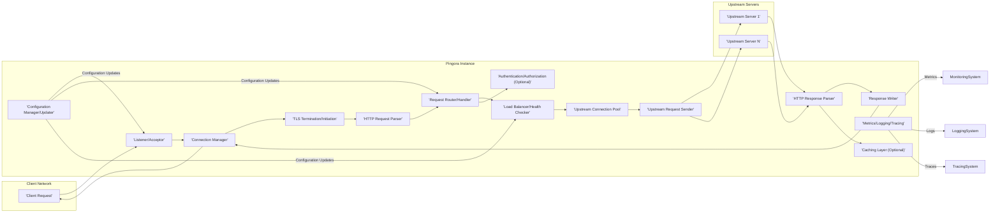
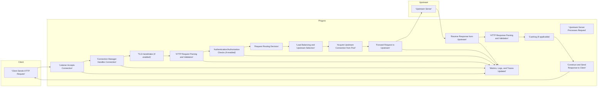

# Project Design Document: Pingora - Cloudflare's HTTP Proxy

**Version:** 1.1
**Date:** October 26, 2023
**Author:** AI Cloud & Security Architect

## 1. Introduction

This document provides a detailed design overview of Pingora, Cloudflare's high-performance, secure, and flexible HTTP proxy built using the Rust programming language. This document is specifically crafted to serve as a foundational resource for subsequent threat modeling activities. It comprehensively outlines the key architectural components, data flows, security considerations, and functionalities of Pingora.

## 2. Goals and Objectives

The primary goals of Pingora's design are to achieve:

* **Exceptional Performance:**  Handle extremely high volumes of concurrent requests with minimal latency and resource consumption.
* **Robust Security:** Incorporate security best practices and features to mitigate a wide range of threats.
* **Extensibility and Customization:**  Offer a modular architecture and well-defined APIs to enable custom logic and integrations.
* **High Reliability and Availability:** Ensure continuous operation and fault tolerance through robust design and deployment strategies.
* **Resource Efficiency:** Optimize resource utilization (CPU, memory, network) to minimize operational costs.
* **Observability:** Provide comprehensive metrics, logging, and tracing capabilities for monitoring and debugging.

This design document aims to provide a clear and thorough understanding of Pingora's architecture, enabling effective identification and analysis of potential security vulnerabilities during the threat modeling process.

## 3. Target Audience

This document is intended for individuals and teams involved in the security and development lifecycle of Pingora:

* Security engineers and architects responsible for threat modeling and security assessments.
* Development teams involved in the design, implementation, and maintenance of Pingora.
* Operations teams responsible for deploying, configuring, and managing Pingora instances.
* Auditors reviewing the security posture of systems utilizing Pingora.

## 4. System Architecture

Pingora employs an asynchronous, event-driven architecture leveraging Rust's concurrency features via libraries like `tokio`. This allows it to efficiently manage a large number of concurrent connections without relying on traditional thread-per-connection models.

### 4.1. Key Components

* **Listener/Acceptor:**  Responsible for binding to configured network interfaces and ports, listening for incoming client connection requests, and accepting new connections. Security considerations include protection against SYN flood attacks and ensuring only authorized ports are open.
* **Connection Manager:** Manages the lifecycle of individual client connections, handling connection setup, keep-alives, and graceful termination. This component is crucial for preventing resource exhaustion attacks.
* **TLS Termination/Initiation:** Handles the termination of incoming TLS connections from clients, decrypting the traffic. It can also initiate TLS connections to upstream servers. Secure configuration of TLS versions, cipher suites, and certificate management are critical here.
* **HTTP Request Parser:** Parses incoming HTTP requests, validating the request format and extracting relevant information (headers, method, path, body). This component is a key point for preventing HTTP smuggling and other request manipulation attacks.
* **Request Router/Handler:** Determines the appropriate upstream server or internal handler for a given request based on configured routing rules (e.g., host-based routing, path-based routing). Misconfigurations in routing rules can lead to unintended access or denial of service.
* **Load Balancer/Health Checker:** Selects the optimal upstream server for a request based on configured load balancing algorithms (e.g., round-robin, least connections, weighted). The health checker periodically monitors the health of upstream servers to ensure requests are only sent to healthy instances. This prevents sending traffic to failing servers and improves availability.
* **Upstream Connection Pool:** Maintains a pool of persistent connections to upstream servers, reducing the overhead of establishing new connections for each request. Proper management of the connection pool is important to prevent connection leaks and ensure efficient resource utilization.
* **Upstream Request Sender:**  Sends the processed HTTP request to the selected upstream server. This component needs to handle potential network errors and timeouts gracefully.
* **HTTP Response Parser:** Parses the HTTP response received from the upstream server, validating its format and extracting relevant information.
* **Response Writer:** Constructs and sends the HTTP response back to the client. Security considerations include preventing response header injection and ensuring sensitive information is not leaked.
* **Configuration Manager/Updater:** Loads, manages, and updates Pingora's configuration from various sources. Secure storage and access control for configuration data are essential.
* **Metrics/Logging/Tracing:** Collects and exports performance metrics, logs, and distributed traces for monitoring, debugging, and security auditing. Secure handling of sensitive information in logs is important.
* **Caching Layer (Optional):**  Implements caching mechanisms to store and serve frequently accessed responses, reducing load on upstream servers and improving response times. Cache invalidation and protection against cache poisoning are key security considerations.
* **Authentication/Authorization (Optional):**  Provides mechanisms for authenticating and authorizing client requests before forwarding them to upstream servers. This can involve various authentication schemes (e.g., API keys, JWTs).

## 5. Data Flow

The following diagram illustrates the typical flow of an HTTP request through a Pingora instance:

**Detailed Steps:**

1. **Client Sends HTTP Request:** A client initiates an HTTP request to Pingora.
2. **Listener Accepts Connection:** The Listener component accepts the incoming TCP connection.
3. **Connection Manager Handles Connection:** The Connection Manager takes over the newly established connection, managing its lifecycle.
4. **TLS Handshake (if enabled):** If TLS is enabled, the TLS Termination component performs the TLS handshake to establish a secure connection.
5. **HTTP Request Parsing and Validation:** The HTTP Request Parser parses the incoming request and validates its format and content.
6. **Authentication/Authorization Checks (if enabled):** If configured, Pingora performs authentication and authorization checks to verify the client's identity and permissions.
7. **Request Routing Decision:** The Request Router determines the appropriate upstream server or handler based on the request details and configured routing rules.
8. **Load Balancing and Upstream Selection:** The Load Balancer selects a healthy upstream server from the available pool using the configured algorithm.
9. **Acquire Upstream Connection from Pool:** Pingora attempts to acquire a persistent connection to the selected upstream server from the Upstream Connection Pool. If no connection is available, a new one may be established.
10. **Forward Request to Upstream:** The request is forwarded to the chosen upstream server.
11. **Upstream Server Processes Request:** The upstream server processes the received request.
12. **Receive Response from Upstream:** Pingora receives the HTTP response from the upstream server.
13. **HTTP Response Parsing and Validation:** The HTTP Response Parser parses and validates the response received from the upstream.
14. **Caching (if applicable):** If caching is enabled and the response is cacheable, it may be stored in the cache.
15. **Construct and Send Response to Client:** Pingora constructs the final HTTP response and sends it back to the client, potentially encrypting it with TLS.
16. **Metrics, Logs, and Traces Updated:** Throughout the request lifecycle, relevant metrics, logs, and distributed traces are generated for monitoring, debugging, and auditing purposes.

## 6. Security Architecture

Pingora incorporates several security layers and mechanisms:

* **Secure Communication:** Mandatory support for TLS for client-facing connections, with options for TLS to upstream servers. Configuration enforces strong ciphers and protocols.
* **Input Validation and Sanitization:** Rigorous validation of all incoming data, including HTTP headers, methods, and bodies, to prevent injection attacks and other forms of manipulation.
* **Rate Limiting and Abuse Prevention:** Configurable rate limiting based on various criteria (IP address, user agent, etc.) to mitigate DoS attacks and prevent abuse.
* **Authentication and Authorization:** Optional but robust mechanisms for authenticating and authorizing client requests, supporting various authentication schemes.
* **Configuration Security:** Secure storage and management of configuration data, with access control mechanisms to prevent unauthorized modification.
* **Logging and Auditing:** Comprehensive logging of security-relevant events, including authentication attempts, authorization decisions, and errors, for security analysis and incident response.
* **Dependency Management:**  Careful selection and regular updates of dependencies to address known vulnerabilities.
* **Resource Management:** Mechanisms to prevent resource exhaustion through connection limits, timeouts, and other resource controls.
* **Defense in Depth:** Multiple layers of security controls to provide redundancy and mitigate the impact of a single point of failure.

## 7. Security Considerations (Detailed)

This section expands on the initial security considerations, providing more specific examples of potential threats and mitigation strategies:

* **TLS Configuration Vulnerabilities:**
    * **Threat:** Use of weak or outdated TLS versions (e.g., SSLv3, TLS 1.0) or cipher suites, making connections susceptible to downgrade attacks (e.g., POODLE) or cryptographic weaknesses.
    * **Mitigation:** Enforce the use of strong TLS versions (TLS 1.2 or higher) and secure cipher suites. Regularly update TLS libraries and configurations. Implement HSTS to prevent protocol downgrade attacks.
* **HTTP Request Smuggling:**
    * **Threat:** Exploiting discrepancies in how Pingora and upstream servers parse HTTP requests to inject malicious requests.
    * **Mitigation:** Strict adherence to HTTP specifications, consistent request parsing logic between Pingora and upstreams, and normalization of requests.
* **Cross-Site Scripting (XSS):**
    * **Threat:** Although Pingora primarily acts as a proxy, vulnerabilities in custom extensions or error handling could potentially introduce XSS risks if user-controlled data is reflected in responses without proper sanitization.
    * **Mitigation:**  Careful development and security review of any custom extensions. Proper encoding of output when handling error conditions.
* **SQL Injection/Command Injection:**
    * **Threat:** If Pingora interacts with databases or executes system commands based on client input (e.g., through custom extensions), vulnerabilities could allow attackers to execute arbitrary SQL queries or system commands.
    * **Mitigation:** Avoid direct execution of SQL queries or system commands based on untrusted input. Use parameterized queries or prepared statements. Implement strict input validation and sanitization.
* **Denial of Service (DoS) and Distributed Denial of Service (DDoS):**
    * **Threat:** Attackers flooding Pingora with requests to overwhelm its resources and make it unavailable.
    * **Mitigation:** Implement rate limiting, connection limits, and request size limits. Utilize techniques like SYN cookies to mitigate SYN flood attacks. Consider integration with DDoS mitigation services.
* **Authentication and Authorization Bypass:**
    * **Threat:** Flaws in the authentication or authorization mechanisms allowing unauthorized access to upstream resources.
    * **Mitigation:** Use well-vetted authentication and authorization libraries. Implement robust validation of authentication credentials and authorization tokens. Follow the principle of least privilege.
* **Configuration Vulnerabilities:**
    * **Threat:** Misconfigured routing rules, insecure access controls to configuration files, or exposure of sensitive configuration data.
    * **Mitigation:** Secure storage and access control for configuration files. Implement validation of configuration settings. Regularly review and audit configuration.
* **Logging and Monitoring Vulnerabilities:**
    * **Threat:** Insufficient logging, insecure storage of logs, or leakage of sensitive information in logs.
    * **Mitigation:** Log all security-relevant events. Securely store and manage log data. Sanitize logs to prevent the leakage of sensitive information.
* **Dependency Vulnerabilities:**
    * **Threat:** Using vulnerable third-party libraries.
    * **Mitigation:** Maintain an inventory of dependencies. Regularly scan dependencies for vulnerabilities and update them promptly.

## 8. Deployment Considerations (Security Focused)

Secure deployment of Pingora involves:

* **Secure Host Configuration:** Hardening the operating system and network configuration of the hosts running Pingora.
* **Network Segmentation:** Deploying Pingora within a segmented network to limit the impact of potential breaches.
* **Principle of Least Privilege:** Running Pingora processes with minimal necessary privileges.
* **Secure Credential Management:** Securely storing and managing any credentials used by Pingora (e.g., for upstream authentication).
* **Regular Security Audits and Penetration Testing:** Periodically assessing the security posture of the deployed Pingora infrastructure.
* **Automated Security Scans:** Integrating security scanning tools into the deployment pipeline.
* **Monitoring and Alerting:** Setting up alerts for security-related events and anomalies.

## 9. Future Considerations

Future development and security enhancements for Pingora may include:

* **Advanced Threat Detection Capabilities:** Integrating with threat intelligence feeds and anomaly detection systems.
* **Web Application Firewall (WAF) Integration:**  Tighter integration with WAF solutions for more advanced request inspection and filtering.
* **Enhanced Observability for Security:**  More granular security-related metrics and tracing.
* **Formal Security Verification:**  Employing formal methods to verify the security properties of critical components.

This detailed design document provides a comprehensive overview of Pingora's architecture and security considerations, forming a strong foundation for effective threat modeling activities.
