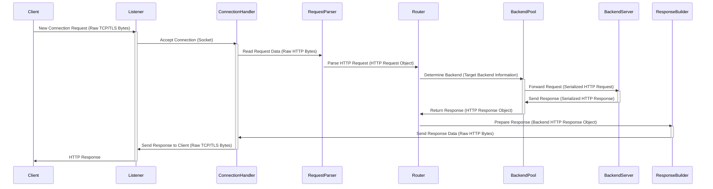

# Project Design Document: Pingora - A Rust-Based HTTP Framework

**Version:** 1.1
**Date:** October 26, 2023
**Author:** AI Software Architect

## 1. Introduction

This document provides an enhanced architectural design of Pingora, a Rust-based HTTP framework developed by Cloudflare. This iteration builds upon the previous version, offering more granular details about Pingora's components, their interactions, and the overall system architecture. The primary goal remains to provide a comprehensive understanding suitable for subsequent threat modeling activities.

## 2. Goals

*   Provide a clear and detailed architectural description of the Pingora framework.
*   Elaborate on the responsibilities and functionalities of key components.
*   Offer a more in-depth explanation of the data flow within the framework, highlighting critical data transformations.
*   Emphasize security considerations relevant to each component and interaction, facilitating targeted threat identification.
*   Serve as a robust foundation for future threat modeling exercises and security assessments.

## 3. Scope

This document encompasses the core architectural design of the Pingora framework, drawing insights from its public GitHub repository and common HTTP proxy design patterns. It focuses on the fundamental building blocks, their interactions, and the data they process. While it doesn't delve into the intricacies of every code module, it provides sufficient detail for effective threat modeling.

## 4. High-Level Architecture

Pingora is architected as a high-performance, asynchronous, and event-driven HTTP framework, primarily designed for building robust and scalable proxies and gateways. Its foundation in Rust leverages memory safety and concurrency features to achieve exceptional efficiency and reliability.

```mermaid
graph LR
    subgraph "Pingora Instance"
        A["'Listener (TCP/TLS)'"]
        B["'Connection Handler'"]
        C["'Request Parser (HTTP/1.1, HTTP/2, HTTP/3)'"]
        D["'Router / Dispatcher'"]
        E["'Backend Connection Pool'"]
        F["'Backend Connection'"]
        G["'Response Builder'"]
        H["'Logging & Metrics'"]
        I["'Configuration Manager'"]
    end

    A -- "Accepts Connections" --> B
    B -- "Manages Connection Lifecycle" --> C
    C -- "Parses HTTP Request" --> D
    D -- "Selects Backend" --> E
    E -- "Manages Backend Connections" --> F
    F -- "Communicates with Backend" --> D
    D -- "Constructs Response" --> G
    G -- "Sends Response" --> B
    B -- "Sends Data" --> A
    I -- "Provides Configuration" --> Pingora Instance
    Pingora Instance -- "Generates Data" --> H
```

**Key Components with Enhanced Descriptions:**

*   **Listener (TCP/TLS):**  This component is responsible for binding to specified network interfaces and ports, listening for incoming connection requests. It handles the initial TCP handshake and, if configured, the TLS handshake, establishing secure connections. It manages the lifecycle of incoming connections and hands them off to Connection Handlers.
    *   Responsibilities: Accepting new connections, TLS negotiation (if enabled), connection management.
*   **Connection Handler:**  Each instance of this component manages the lifecycle of a single client connection. It's responsible for reading raw data from the socket, buffering it, and passing it to the Request Parser. It also handles sending the final response back to the client and closing the connection. It leverages asynchronous I/O to handle multiple connections concurrently without blocking.
    *   Responsibilities: Reading request data, writing response data, connection state management, error handling per connection.
*   **Request Parser (HTTP/1.1, HTTP/2, HTTP/3):** This component takes the raw byte stream from the Connection Handler and parses it according to the HTTP protocol. It extracts key information like HTTP method, URI, headers, and body. It must be resilient to malformed requests and handle different HTTP versions correctly. Support for HTTP/3 implies handling QUIC protocol details.
    *   Responsibilities: HTTP protocol parsing, header processing, body handling, error detection for invalid requests.
*   **Router / Dispatcher:** This component examines the parsed HTTP request (e.g., host, path, headers) and uses a set of configurable rules to determine the appropriate backend server to forward the request to. It acts as the central decision point for routing logic and may implement features like load balancing, traffic shaping, and request transformations.
    *   Responsibilities: Request routing based on configured rules, load balancing decisions, request modification (optional).
*   **Backend Connection Pool:** To optimize performance, this component maintains a pool of persistent connections to backend servers. It manages the creation, reuse, and health checking of these connections. It aims to minimize the overhead of establishing new connections for each request. It might implement different pooling strategies and handle connection failures.
    *   Responsibilities: Managing backend connection lifecycle, connection health checks, connection reuse, potentially implementing circuit breaking.
*   **Backend Connection:** Represents an active, established connection to a specific backend server. This component is responsible for serializing the outgoing HTTP request, sending it to the backend, receiving the backend's response, and deserializing it. It handles the underlying network communication with the backend.
    *   Responsibilities: Sending requests to backends, receiving responses from backends, handling connection errors.
*   **Response Builder:** This component takes the response received from the backend and constructs the final HTTP response to be sent back to the client. This may involve modifying headers, adding security headers, or performing other transformations.
    *   Responsibilities: Constructing the final HTTP response, adding/modifying headers, potentially caching responses.
*   **Logging & Metrics:** This component collects and outputs logs and performance metrics about Pingora's operation. This includes request logs, error logs, and performance indicators like request latency and throughput. This data is crucial for monitoring, debugging, and performance analysis.
    *   Responsibilities: Generating and outputting logs, collecting and exposing metrics.
*   **Configuration Manager:** This component is responsible for loading, managing, and providing configuration parameters to other components within Pingora. This configuration dictates routing rules, backend server addresses, TLS settings, and other operational parameters.
    *   Responsibilities: Loading configuration from various sources, providing configuration data to other components, potentially supporting dynamic configuration updates.

## 5. Data Flow

The typical request/response lifecycle within Pingora involves the following steps, with a focus on data transformation and movement:



**Detailed Steps with Data Focus:**

1. **Client initiates a connection:** The client sends a connection request to the Pingora instance's listener as raw TCP or TLS bytes.
2. **Listener accepts the connection:** The listener accepts the incoming connection and creates a new Connection Handler, passing the established socket.
3. **Connection Handler reads request data:** The Connection Handler reads raw HTTP bytes from the client's socket.
4. **Request Parser parses the request:** The Request Parser takes the raw bytes and transforms them into a structured HTTP Request object, containing parsed headers, body, and other relevant information.
5. **Router determines the backend:** The Router examines the HTTP Request object and uses its configured rules to select the appropriate backend server, resulting in target backend information (e.g., IP address, port).
6. **Backend Pool retrieves a connection:** The Router interacts with the Backend Connection Pool to obtain an available connection to the selected backend.
7. **Request is forwarded to the backend:** The Backend Connection serializes the HTTP Request object back into raw bytes and sends it to the backend server.
8. **Backend server processes the request:** The backend server processes the request and generates a response, typically as a serialized HTTP Response.
9. **Response is sent back to Pingora:** The backend server sends the serialized HTTP Response back to the Pingora instance through the established connection.
10. **Response Builder prepares the response:** The Response Builder receives the backend's HTTP Response object and potentially modifies it before preparing it for transmission back to the client.
11. **Response is sent to the client:** The Connection Handler takes the prepared response, serializes it into raw HTTP bytes, and sends it back to the client through the listener.

## 6. Security Considerations

This section details potential security considerations for each component and interaction, providing a basis for targeted threat modeling.

*   **Listener (TCP/TLS):**
    *   **Threat:**  Denial of Service (DoS) attacks targeting connection establishment.
    *   **Threat:**  Vulnerabilities in TLS implementation leading to information disclosure or man-in-the-middle attacks (e.g., downgrade attacks, protocol weaknesses).
    *   **Mitigation Considerations:** Rate limiting connection attempts, robust TLS configuration, regular security audits of TLS implementation.
*   **Connection Handler:**
    *   **Threat:**  Resource exhaustion through slowloris attacks or similar connection-holding attacks.
    *   **Threat:**  Memory safety issues in handling connection state or buffering data.
    *   **Mitigation Considerations:** Connection timeouts, limits on concurrent connections, secure memory management practices.
*   **Request Parser (HTTP/1.1, HTTP/2, HTTP/3):**
    *   **Threat:**  Request smuggling vulnerabilities due to inconsistencies in parsing between Pingora and backend servers.
    *   **Threat:**  Buffer overflows or other memory safety issues when parsing large or malformed headers/bodies.
    *   **Threat:**  Exploitation of HTTP/2 or HTTP/3 specific vulnerabilities.
    *   **Mitigation Considerations:** Strict adherence to HTTP specifications, robust error handling, input validation, regular updates to address protocol vulnerabilities.
*   **Router / Dispatcher:**
    *   **Threat:**  Bypass of intended access controls due to misconfigured routing rules.
    *   **Threat:**  Server-Side Request Forgery (SSRF) if routing decisions are based on untrusted user input.
    *   **Mitigation Considerations:** Secure configuration management, principle of least privilege for routing rules, careful validation of routing criteria.
*   **Backend Connection Pool:**
    *   **Threat:**  Connection hijacking or reuse of connections for unauthorized requests.
    *   **Threat:**  Exhaustion of backend resources due to excessive connection pooling.
    *   **Mitigation Considerations:** Secure connection management, appropriate connection timeouts, authentication and authorization for backend connections.
*   **Backend Connection:**
    *   **Threat:**  Man-in-the-middle attacks if communication with backends is not encrypted.
    *   **Threat:**  Injection vulnerabilities if data sent to backends is not properly sanitized.
    *   **Mitigation Considerations:** TLS encryption for backend connections, proper input sanitization before sending data to backends.
*   **Response Builder:**
    *   **Threat:**  Injection of malicious content into responses (e.g., cross-site scripting (XSS) vulnerabilities).
    *   **Threat:**  Accidental leakage of sensitive information in response headers.
    *   **Mitigation Considerations:** Proper encoding of response data, careful management of response headers, security headers (e.g., Content-Security-Policy).
*   **Logging & Metrics:**
    *   **Threat:**  Exposure of sensitive information in logs.
    *   **Threat:**  Tampering with logs to hide malicious activity.
    *   **Mitigation Considerations:** Secure storage and access control for logs, redaction of sensitive data in logs, use of secure logging mechanisms.
*   **Configuration Manager:**
    *   **Threat:**  Unauthorized access or modification of configuration, leading to security breaches or service disruption.
    *   **Threat:**  Storage of sensitive credentials (e.g., backend authentication details) in insecure configuration.
    *   **Mitigation Considerations:** Secure storage and access control for configuration data, encryption of sensitive configuration values, audit logging of configuration changes.

## 7. Deployment Considerations

Pingora's deployment context significantly impacts its security posture. Common deployment scenarios and their security implications include:

*   **Reverse Proxy:**  Exposed to the public internet, requiring robust security measures against a wide range of attacks.
*   **API Gateway:**  Handles authentication and authorization, making it a critical component for securing backend APIs. Vulnerabilities here can expose entire API ecosystems.
*   **Internal Service Mesh Proxy:**  While operating within a trusted network, still needs security considerations to prevent lateral movement and internal attacks.

Deployment environments also introduce specific security considerations:

*   **Cloud Environments:** Leveraging cloud provider security features (e.g., firewalls, IAM) is crucial. Misconfigurations in cloud deployments can create significant vulnerabilities.
*   **Containerized Environments:** Container security best practices (e.g., minimal images, vulnerability scanning) are essential. Container orchestration platforms like Kubernetes also introduce their own security considerations.
*   **Bare Metal Servers:** Requires careful manual configuration and management of security controls.

## 8. Future Considerations

Future enhancements could introduce new security considerations:

*   **Advanced Routing Features:** More complex routing logic might introduce new attack vectors if not carefully designed and implemented.
*   **Caching Mechanisms:** Caching sensitive data requires careful consideration to prevent unauthorized access or leakage.
*   **WebSockets Support:** Introduces new security challenges related to stateful connections and potential for abuse.
*   **Plugin Architecture:** Security of plugins and the plugin interface becomes a critical concern.

## 9. Conclusion

This enhanced design document provides a more detailed and security-focused overview of the Pingora framework's architecture. By elaborating on component responsibilities, data flow, and specific security considerations, it aims to be a valuable asset for threat modeling and security assessments. This detailed understanding will enable security professionals to more effectively identify potential vulnerabilities and recommend appropriate mitigation strategies, ultimately contributing to a more secure and resilient system.