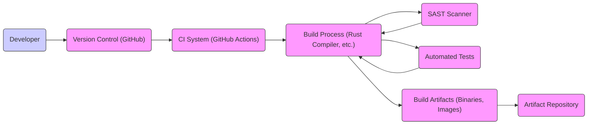

# BUSINESS POSTURE

This project, Pingora, is a library for building fast, reliable and programmable proxies. For Cloudflare, the business priority is to maintain and improve its global network performance, reliability, and security. Pingora directly contributes to this by providing a foundation for building high-performance proxy services that are critical to Cloudflare's CDN, security, and other network services.

The primary business goal is to enhance Cloudflare's infrastructure capabilities, enabling them to handle increasing network traffic, offer new features, and maintain a competitive edge in performance and service delivery.

Most important business risks that need to be addressed:
- Performance degradation of Cloudflare services due to inefficient proxy implementation.
- Reliability issues in proxy infrastructure leading to service disruptions and outages.
- Security vulnerabilities in the proxy code that could be exploited to compromise Cloudflare's network or customer data.
- Operational complexity in managing and deploying proxies at scale across Cloudflare's global network.
- Slow development and feature delivery due to limitations of existing proxy solutions.

# SECURITY POSTURE

Existing security controls:
- security control: Cloudflare employs a Secure Software Development Lifecycle (SSDLC) that is likely applied to Pingora's development. This includes code reviews, static and dynamic analysis, and security testing. (Location: Cloudflare's general security practices, assumed to be in place for core infrastructure projects)
- security control: Cloudflare has a dedicated security team that reviews and approves significant architectural and code changes. (Location: Cloudflare's internal security processes, assumed to be in place for core infrastructure projects)
- security control: Cloudflare uses automated testing and CI/CD pipelines, which likely include security checks. (Location: Cloudflare's general engineering practices, assumed to be in place for core infrastructure projects)
- security control: Cloudflare has incident response procedures in place to handle security incidents. (Location: Cloudflare's general security practices, assumed to be in place for core infrastructure projects)

Accepted risks:
- accepted risk: Potential for zero-day vulnerabilities in dependencies used by Pingora. Mitigation is through timely patching and vulnerability monitoring.
- accepted risk: Risk of misconfiguration during deployment of Pingora-based proxies. Mitigation is through automation, configuration management, and testing.
- accepted risk: Performance overhead of certain security features might need to be balanced against overall proxy performance.

Recommended security controls:
- security control: Implement automated security scanning (SAST/DAST) as part of the CI/CD pipeline specifically for Pingora.
- security control: Conduct regular penetration testing and security audits of Pingora-based proxy deployments.
- security control: Implement robust logging and monitoring of security-relevant events within Pingora proxies.
- security control: Establish a clear process for security vulnerability reporting and remediation for Pingora.
- security control: Provide security training for developers working on Pingora and related proxy services, focusing on secure coding practices for high-performance network applications.

Security requirements:
- Authentication:
  - Requirement: Authentication is required for administrative access to manage and configure Pingora-based proxies.
  - Requirement: Authentication mechanisms should be strong and multi-factor authentication should be considered for privileged access.
- Authorization:
  - Requirement: Authorization mechanisms must be in place to control access to administrative functions and resources within Pingora-based proxies.
  - Requirement: Role-Based Access Control (RBAC) should be implemented to manage permissions based on user roles.
- Input Validation:
  - Requirement: All external inputs to Pingora-based proxies, including network traffic and configuration data, must be thoroughly validated to prevent injection attacks and other input-related vulnerabilities.
  - Requirement: Input validation should be performed at multiple layers, including protocol parsing, data deserialization, and application logic.
- Cryptography:
  - Requirement: Cryptography must be used to protect sensitive data in transit and at rest.
  - Requirement: Pingora-based proxies should support TLS for secure communication with clients and upstream servers.
  - Requirement: Secure key management practices must be implemented for cryptographic keys used by Pingora-based proxies.

# DESIGN

## C4 CONTEXT

```mermaid
graph LR
    subgraph Cloudflare Network
        P("Pingora Based Proxy")
    end
    U1("Internet Users") --> P
    S1("Upstream Servers") <-- P
    O1("Operations Team") --> P
    M1("Monitoring System") <-- P
    C1("Configuration Management System") <-- P

    P -- "Proxied Requests" --> S1
    P -- "Configuration Updates" --> C1
    P -- "Metrics and Logs" --> M1
    O1 -- "Management and Control" --> P
    U1 -- "HTTP/HTTPS Requests" --> P

    style P fill:#f9f,stroke:#333,stroke-width:2px
```

Context Diagram Elements:

- Element:
  - Name: Pingora Based Proxy
  - Type: Software System
  - Description: A high-performance proxy service built using the Pingora library. It handles incoming requests from internet users and forwards them to upstream servers, applying various network and security policies.
  - Responsibilities:
    - Receive and process incoming network requests.
    - Terminate TLS connections.
    - Route requests to appropriate upstream servers.
    - Enforce security policies (e.g., rate limiting, WAF).
    - Collect metrics and logs.
    - Manage configurations.
  - Security controls:
    - Input validation on incoming requests.
    - TLS termination and encryption.
    - Authorization checks for management operations.
    - Logging of security-relevant events.
    - Rate limiting and other traffic control mechanisms.

- Element:
  - Name: Internet Users
  - Type: Person
  - Description: End-users on the internet who access websites and applications served through Cloudflare's network.
  - Responsibilities:
    - Send HTTP/HTTPS requests to access web resources.
  - Security controls:
    - None directly controlled by Pingora, but their security posture impacts the overall system (e.g., botnets, malicious users).

- Element:
  - Name: Upstream Servers
  - Type: Software System
  - Description: Origin servers hosting the actual content and applications that internet users are trying to access.
  - Responsibilities:
    - Host and serve web content and applications.
    - Process requests forwarded by the Pingora proxy.
  - Security controls:
    - Server-side security controls (firewalls, intrusion detection, application security).
    - Secure configuration and patching.

- Element:
  - Name: Operations Team
  - Type: Person
  - Description: Cloudflare's operations team responsible for managing, monitoring, and maintaining the Pingora-based proxy infrastructure.
  - Responsibilities:
    - Deploy and configure Pingora proxies.
    - Monitor proxy performance and health.
    - Respond to incidents and alerts.
    - Manage proxy configurations and updates.
  - Security controls:
    - Access control to management interfaces.
    - Secure credentials management.
    - Audit logging of administrative actions.

- Element:
  - Name: Monitoring System
  - Type: Software System
  - Description: Cloudflare's monitoring infrastructure that collects metrics, logs, and alerts from Pingora-based proxies.
  - Responsibilities:
    - Collect and aggregate metrics and logs from proxies.
    - Provide dashboards and visualizations for monitoring.
    - Generate alerts based on predefined thresholds.
  - Security controls:
    - Secure data transmission from proxies to the monitoring system.
    - Access control to monitoring data and dashboards.

- Element:
  - Name: Configuration Management System
  - Type: Software System
  - Description: Cloudflare's configuration management system used to manage and distribute configurations to Pingora-based proxies.
  - Responsibilities:
    - Store and manage proxy configurations.
    - Distribute configuration updates to proxies.
    - Version control of configurations.
  - Security controls:
    - Access control to configuration data.
    - Audit logging of configuration changes.
    - Secure communication channels for configuration distribution.

## C4 CONTAINER

```mermaid
graph LR
    subgraph Cloudflare Network
        subgraph Pingora Based Proxy Container
            PE("Proxy Engine")
            CL("Configuration Loader")
            TH("TLS Handler")
            RL("Routing Logic")
            ML("Metrics Logger")
        end
    end
    U1("Internet Users") --> TH
    S1("Upstream Servers") <-- PE
    C1("Configuration Management System") --> CL
    M1("Monitoring System") <-- ML

    TH --> PE
    PE --> RL
    RL --> PE
    CL --> PE
    PE --> ML

    style "Pingora Based Proxy Container" fill:#ccf,stroke:#333,stroke-width:2px
    style PE fill:#f9f,stroke:#333,stroke-width:1px
    style CL fill:#f9f,stroke:#333,stroke-width:1px
    style TH fill:#f9f,stroke:#333,stroke-width:1px
    style RL fill:#f9f,stroke:#333,stroke-width:1px
    style ML fill:#f9f,stroke:#333,stroke-width:1px
```

Container Diagram Elements:

- Element:
  - Name: Proxy Engine
  - Type: Container (Rust Application/Library)
  - Description: The core component of the Pingora-based proxy, responsible for request processing, routing, and policy enforcement. It leverages the Pingora library for its functionality.
  - Responsibilities:
    - Request parsing and processing.
    - Upstream connection management.
    - Request routing based on configuration.
    - Policy enforcement (e.g., rate limiting, WAF integration).
    - Interaction with other containers within the proxy.
  - Security controls:
    - Input validation and sanitization.
    - Secure coding practices in Rust.
    - Implementation of security policies.
    - Logging of security events.

- Element:
  - Name: Configuration Loader
  - Type: Container (Rust Application/Library)
  - Description: Responsible for loading and managing the proxy configuration from the Configuration Management System.
  - Responsibilities:
    - Fetching configuration data from the Configuration Management System.
    - Parsing and validating configuration data.
    - Providing configuration data to the Proxy Engine.
    - Handling configuration updates.
  - Security controls:
    - Secure communication with the Configuration Management System.
    - Validation of configuration data to prevent malicious configurations.
    - Access control to configuration data within the container.

- Element:
  - Name: TLS Handler
  - Type: Container (Rust Application/Library)
  - Description: Handles TLS termination and encryption for incoming and outgoing connections.
  - Responsibilities:
    - TLS handshake and session management.
    - Encryption and decryption of data in transit.
    - Certificate management.
  - Security controls:
    - Secure TLS configuration (e.g., strong cipher suites, protocol versions).
    - Proper certificate validation.
    - Protection of private keys.

- Element:
  - Name: Routing Logic
  - Type: Container (Rust Application/Library)
  - Description: Determines the routing of requests to upstream servers based on configured rules.
  - Responsibilities:
    - Implementing routing algorithms and logic.
    - Matching requests to routing rules.
    - Selecting appropriate upstream servers.
  - Security controls:
    - Secure routing logic to prevent unintended routing or bypass of security policies.
    - Access control to routing configuration.

- Element:
  - Name: Metrics Logger
  - Type: Container (Rust Application/Library)
  - Description: Collects and exports metrics and logs to the Monitoring System.
  - Responsibilities:
    - Gathering performance and operational metrics.
    - Logging events, including security-relevant events.
    - Formatting and exporting metrics and logs to the Monitoring System.
  - Security controls:
    - Secure transmission of metrics and logs to the Monitoring System.
    - Redaction of sensitive data in logs.
    - Access control to logs within the container.

## DEPLOYMENT

Deployment Architecture: Globally Distributed Edge Network

```mermaid
graph LR
    subgraph Global Edge Network Location 1
        LB1("Load Balancer")
        subgraph Server Rack 1
            PS1("Pingora Server 1")
            PS2("Pingora Server 2")
        end
    end
    subgraph Global Edge Network Location 2
        LB2("Load Balancer")
        subgraph Server Rack 2
            PS3("Pingora Server 3")
            PS4("Pingora Server 4")
        end
    end
    C1("Configuration Management System") --> LB1
    C1 --> LB2
    M1("Monitoring System") <-- PS1
    M1 <-- PS2
    M1 <-- PS3
    M1 <-- PS4
    U1("Internet Users") --> LB1
    U1 --> LB2
    LB1 --> PS1
    LB1 --> PS2
    LB2 --> PS3
    LB2 --> PS4
    PS1 --> S1("Upstream Servers")
    PS2 --> S1
    PS3 --> S1
    PS4 --> S1

    style "Global Edge Network Location 1" fill:#eef,stroke:#333,stroke-width:2px
    style "Server Rack 1" fill:#fef,stroke:#333,stroke-width:1px
    style "Global Edge Network Location 2" fill:#eef,stroke:#333,stroke-width:2px
    style "Server Rack 2" fill:#fef,stroke:#333,stroke-width:1px
    style LB1 fill:#f9f,stroke:#333,stroke-width:1px
    style LB2 fill:#f9f,stroke:#333,stroke-width:1px
    style PS1 fill:#f9f,stroke:#333,stroke-width:1px
    style PS2 fill:#f9f,stroke:#333,stroke-width:1px
    style PS3 fill:#f9f,stroke:#333,stroke-width:1px
    style PS4 fill:#f9f,stroke:#333,stroke-width:1px
```

Deployment Diagram Elements:

- Element:
  - Name: Load Balancer (LB1, LB2)
  - Type: Infrastructure (Hardware/Software Load Balancer)
  - Description: Distributes incoming traffic across multiple Pingora Servers within a specific edge location. Provides high availability and scalability.
  - Responsibilities:
    - Distribute traffic to backend Pingora Servers.
    - Health checking of Pingora Servers.
    - TLS termination (potentially, depending on configuration).
  - Security controls:
    - DDoS protection.
    - Rate limiting.
    - Access control to management interfaces.
    - Secure configuration.

- Element:
  - Name: Pingora Server (PS1, PS2, PS3, PS4)
  - Type: Infrastructure (Physical/Virtual Server)
  - Description: Servers running instances of the Pingora-based proxy application. Deployed in server racks within Cloudflare's global edge network locations.
  - Responsibilities:
    - Run the Pingora proxy application.
    - Process incoming requests.
    - Forward requests to upstream servers.
    - Collect metrics and logs.
  - Security controls:
    - Operating system hardening.
    - Security patching.
    - Host-based intrusion detection/prevention.
    - Firewalling.

- Element:
  - Name: Server Rack 1, Server Rack 2
  - Type: Infrastructure (Logical Grouping)
  - Description: Represents a logical grouping of servers within a specific data center or edge location.
  - Responsibilities:
    - Physical security of servers.
    - Network connectivity within the rack.
    - Power and cooling.
  - Security controls:
    - Physical access control to data centers and server racks.
    - Environmental controls.

- Element:
  - Name: Global Edge Network Location 1, Global Edge Network Location 2
  - Type: Infrastructure (Geographical Location)
  - Description: Represents different geographical locations within Cloudflare's global edge network, each containing multiple server racks and load balancers.
  - Responsibilities:
    - Provide geographically distributed points of presence for serving content and applications.
    - Network connectivity between edge locations and the internet.
  - Security controls:
    - Network security controls at edge locations.
    - DDoS mitigation infrastructure.

## BUILD



Build Process Description:

- Developer: Writes code, performs local testing, and commits changes to the Version Control system.
- Version Control (GitHub): Stores the source code of Pingora. Provides version history, collaboration features, and triggers CI pipelines on code changes.
  - Security controls: Access control to the repository, branch protection, audit logging of changes.
- CI System (GitHub Actions): Automates the build, test, and security scanning process. Triggers builds on code commits and pull requests.
  - Security controls: Secure configuration of CI pipelines, access control to CI system, secrets management for build credentials.
- Build Process (Rust Compiler, etc.): Compiles the Rust code, links libraries, and creates executable binaries.
  - Security controls: Use of trusted build tools and toolchains, dependency management, build reproducibility.
- SAST Scanner: Static Application Security Testing tool that analyzes the source code for potential security vulnerabilities.
  - Security controls: Regularly updated vulnerability rules, integration into the CI pipeline to fail builds on critical findings.
- Automated Tests: Executes unit tests, integration tests, and other automated tests to verify the functionality and stability of the code.
  - Security controls: Security-focused test cases, code coverage analysis.
- Build Artifacts (Binaries, Images): Output of the build process, including executable binaries, container images, and other deployable artifacts.
  - Security controls: Integrity checks (e.g., checksums, signatures) of build artifacts.
- Artifact Repository: Stores the build artifacts in a secure and versioned manner.
  - Security controls: Access control to the artifact repository, vulnerability scanning of stored artifacts, audit logging of access.

# RISK ASSESSMENT

Critical business processes we are trying to protect:
- Core Cloudflare services that rely on proxies, including CDN, DDoS mitigation, WAF, and other network services.
- Availability and performance of Cloudflare's global network.
- Reputation and customer trust in Cloudflare's services.

Data we are trying to protect and their sensitivity:
- Proxied network traffic: Sensitivity varies depending on the type of traffic. Could include sensitive user data, API keys, authentication tokens, etc. Requires confidentiality and integrity.
- Configuration data: Contains sensitive information about proxy behavior, routing rules, security policies, and potentially credentials. Requires confidentiality and integrity.
- Logs and metrics: May contain information about user activity, system performance, and security events. Sensitivity depends on the level of detail and potential for re-identification. Requires integrity and potentially confidentiality.

# QUESTIONS & ASSUMPTIONS

Questions:
- What specific security scanning tools (SAST/DAST) are currently used in Cloudflare's CI/CD pipeline for Rust projects?
- What are the specific authentication and authorization mechanisms planned for managing Pingora-based proxies?
- What are the performance requirements and constraints for security features in Pingora-based proxies?
- Are there specific compliance requirements (e.g., PCI DSS, SOC 2, GDPR) that Pingora-based proxies need to adhere to?
- What is the incident response plan specifically for security vulnerabilities identified in Pingora or Pingora-based proxies?

Assumptions:
- Pingora is intended for use within Cloudflare's internal infrastructure and services.
- Security is a high priority for the Pingora project, given its critical role in Cloudflare's infrastructure.
- Cloudflare has existing security infrastructure and processes in place that Pingora will integrate with.
- Performance and efficiency are key design goals for Pingora, alongside security and reliability.
- Deployment environment is Cloudflare's globally distributed edge network.