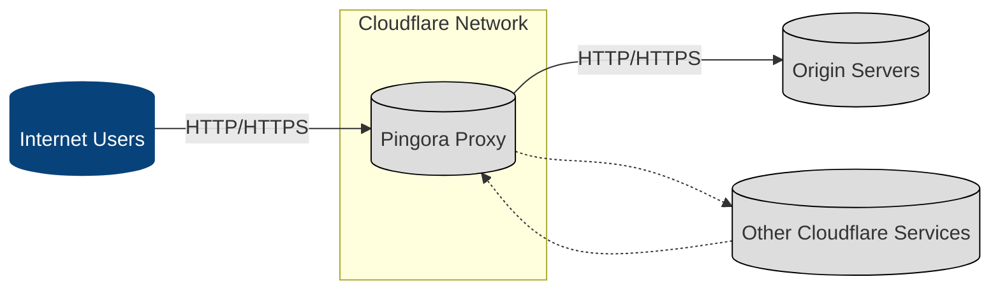
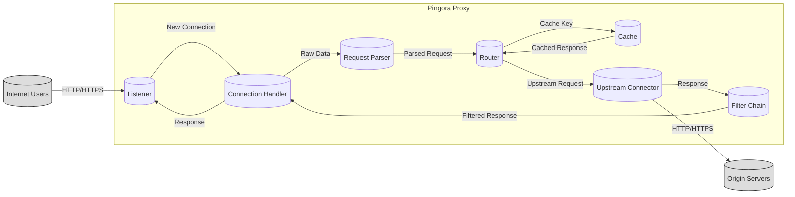
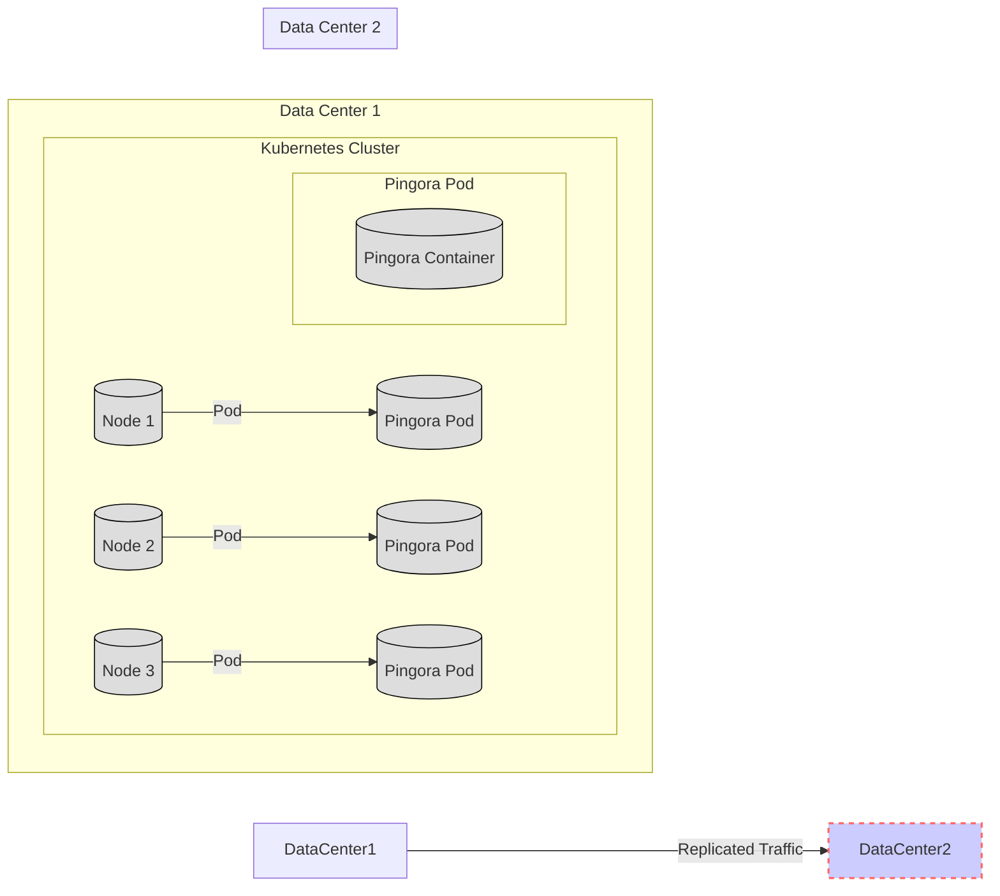
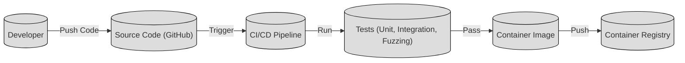

Okay, let's create a design document for Cloudflare's Pingora project, focusing on aspects relevant for threat modeling.

# BUSINESS POSTURE

Pingora is a Rust-based asynchronous framework for building programmable network services, particularly HTTP proxies.  It's developed by Cloudflare, a company whose core business is providing internet security, performance, and reliability services.

Business Priorities and Goals:

-   Performance:  Pingora is designed to replace Nginx in Cloudflare's infrastructure, implying a need for extremely high performance and low latency.  This is critical for handling massive global traffic.
-   Reliability:  As a core component of Cloudflare's network, Pingora must be exceptionally reliable and fault-tolerant. Downtime or instability directly impacts Cloudflare's customers.
-   Security:  Given Cloudflare's business, security is paramount. Pingora must be resistant to attacks and vulnerabilities, protecting both Cloudflare and its customers.
-   Scalability:  Pingora needs to scale horizontally to handle ever-increasing traffic demands.
-   Maintainability and Extensibility:  The framework nature of Pingora suggests a need for easy maintenance, updates, and the ability to add new features and functionalities.  This allows Cloudflare to adapt to evolving needs.
-   Cost-Effectiveness: While not explicitly stated, replacing Nginx likely has a cost-saving component, either through reduced resource consumption or licensing fees.

Most Important Business Risks:

-   Service Degradation/Outage:  Any vulnerability or instability in Pingora could lead to widespread service degradation or outages for Cloudflare's customers, causing significant reputational and financial damage.
-   Security Breach:  Exploitable vulnerabilities in Pingora could allow attackers to compromise Cloudflare's infrastructure, potentially leading to data breaches, service manipulation, or denial-of-service attacks.
-   Inability to Scale:  If Pingora cannot scale to meet future traffic demands, it could become a bottleneck, limiting Cloudflare's growth and ability to serve customers.
-   Performance Bottlenecks:  If Pingora does not meet its performance goals, it could negatively impact the speed and responsiveness of Cloudflare's services.

# SECURITY POSTURE

Existing Security Controls (based on the repository and general Cloudflare practices):

-   security control: Memory Safety (Rust): The use of Rust as the primary programming language inherently mitigates many common memory safety vulnerabilities (e.g., buffer overflows, use-after-free) that plague C/C++ applications like Nginx. Implemented in: Codebase.
-   security control: Secure Development Practices: Cloudflare likely employs secure coding practices, code reviews, and static analysis tools as part of their development lifecycle. Implemented in: Development Process (Assumed).
-   security control: Fuzzing: The repository mentions fuzzing, indicating a proactive approach to finding vulnerabilities by providing invalid or unexpected inputs. Implemented in: Testing and CI/CD (Mentioned in README).
-   security control: Dependency Management: Rust's Cargo package manager and build system helps manage dependencies and track vulnerabilities. Implemented in: Build System (Cargo).
-   security control: Network Segmentation: As part of Cloudflare's infrastructure, Pingora likely benefits from network segmentation and isolation, limiting the impact of potential breaches. Implemented in: Deployment Environment (Cloudflare Infrastructure).
-   security control: DDoS Mitigation: Cloudflare's core business is DDoS mitigation, so Pingora is likely designed to be resilient to various DDoS attacks. Implemented in: Design and Cloudflare Infrastructure.
-   security control: TLS/SSL: Pingora supports TLS/SSL for secure communication. Implemented in: Codebase (libraries used).
-   security control: Input Validation: Pingora, as an HTTP proxy, must perform rigorous input validation to prevent attacks like HTTP smuggling, request forgery, and others. Implemented in: Codebase (HTTP parsing logic).
-   security control: Regular Security Audits: Cloudflare likely conducts regular security audits and penetration testing of its infrastructure, including Pingora. Implemented in: Security Program (Assumed).

Accepted Risks:

-   accepted risk: Complexity of Asynchronous Programming: Asynchronous programming, while performant, can introduce complexity and potential race conditions if not handled carefully.
-   accepted risk: Reliance on Third-Party Libraries: Pingora, like any project, depends on third-party Rust crates. Vulnerabilities in these dependencies could impact Pingora's security.
-   accepted risk: Novel Attack Vectors: As a relatively new project, Pingora might be susceptible to yet-undiscovered attack vectors specific to its architecture or implementation.

Recommended Security Controls:

-   Formal Verification:  Consider using formal methods or model checking to verify the correctness of critical parts of the code, especially concurrency-related logic.
-   Content Security Policy (CSP):  If Pingora handles any user-provided content, implementing CSP can help mitigate XSS attacks.
-   Regular Penetration Testing: Conduct regular, independent penetration testing specifically targeting Pingora.
-   Supply Chain Security: Implement robust supply chain security measures to verify the integrity of dependencies and prevent malicious code injection.

Security Requirements:

-   Authentication:
    -   Pingora should support various authentication mechanisms for both client-to-proxy and proxy-to-origin connections (e.g., mTLS, API keys, JWT).
    -   Authentication credentials must be securely stored and managed.
-   Authorization:
    -   Pingora should implement fine-grained authorization controls to restrict access to resources based on user roles and permissions.
    -   Authorization decisions should be enforced consistently across all components.
-   Input Validation:
    -   All inputs from clients and origin servers must be strictly validated against predefined schemas or rules.
    -   Input validation should be performed at multiple layers (e.g., HTTP parsing, application logic).
    -   Invalid inputs should be rejected with appropriate error messages.
-   Cryptography:
    -   TLS 1.3 or higher should be used for all secure communication.
    -   Strong cryptographic algorithms and key lengths should be used.
    -   Cryptographic keys must be securely generated, stored, and managed.
    -   Regularly rotate cryptographic keys.

# DESIGN

## C4 CONTEXT

Element Descriptions:

-   Element:
    -   Name: Internet Users
    -   Type: Person
    -   Description: Users accessing websites and applications served through Cloudflare.
    -   Responsibilities: Initiating HTTP/HTTPS requests.
    -   Security Controls: Browser security features, HTTPS enforcement.
-   Element:
    -   Name: Pingora Proxy
    -   Type: Software System
    -   Description: The Pingora-based HTTP proxy service.
    -   Responsibilities: Handling incoming requests, routing, caching, security enforcement, load balancing.
    -   Security Controls: Memory safety (Rust), input validation, TLS/SSL, DDoS mitigation, fuzzing, (potentially) WAF integration.
-   Element:
    -   Name: Origin Servers
    -   Type: Software System
    -   Description: The servers hosting the actual website or application content.
    -   Responsibilities: Serving content to Pingora.
    -   Security Controls: Standard server security practices, potentially Cloudflare Tunnel for secure connection to the Cloudflare network.
-   Element:
    -   Name: Other Cloudflare Services
    -   Type: Software System
    -   Description: Other services within the Cloudflare network that Pingora might interact with (e.g., caching, DNS, WAF).
    -   Responsibilities: Providing supporting services to Pingora.
    -   Security Controls: Dependent on the specific service.

## C4 CONTAINER

Element Descriptions:

-   Element:
    -   Name: Listener
    -   Type: Container
    -   Description: Listens for incoming connections on specific ports (e.g., 80, 443).
    -   Responsibilities: Accepting new connections, handling TLS termination.
    -   Security Controls: TLS configuration, connection limits, IP filtering.
-   Element:
    -   Name: Connection Handler
    -   Type: Container
    -   Description: Manages established connections.
    -   Responsibilities: Reading and writing data, managing connection state.
    -   Security Controls: Timeout management, resource limits.
-   Element:
    -   Name: Request Parser
    -   Type: Container
    -   Description: Parses raw HTTP requests.
    -   Responsibilities: Validating request format, extracting headers and body.
    -   Security Controls: Input validation, HTTP smuggling prevention.
-   Element:
    -   Name: Router
    -   Type: Container
    -   Description: Determines how to handle a request based on routing rules.
    -   Responsibilities: Matching requests to configured routes, selecting upstream servers.
    -   Security Controls: Access control based on routing rules.
-   Element:
    -   Name: Cache
    -   Type: Container
    -   Description: Caches responses to improve performance.
    -   Responsibilities: Storing and retrieving cached responses, managing cache invalidation.
    -   Security Controls: Cache poisoning prevention, secure cache key generation.
-   Element:
    -   Name: Upstream Connector
    -   Type: Container
    -   Description: Establishes connections to upstream (origin) servers.
    -   Responsibilities: Sending requests to origin servers, receiving responses.
    -   Security Controls: TLS/SSL to origin, connection pooling, health checks.
-   Element:
    -   Name: Filter Chain
    -   Type: Container
    -   Description: Applies a series of filters to requests and responses.
    -   Responsibilities: Modifying requests/responses, implementing security policies (e.g., WAF rules).
    -   Security Controls: Depends on the specific filters implemented (e.g., WAF, header manipulation).

## DEPLOYMENT

Possible Deployment Solutions:

1.  Bare Metal Servers: Deploying Pingora directly on physical servers within Cloudflare's data centers.
2.  Virtual Machines: Deploying Pingora on virtual machines within Cloudflare's infrastructure.
3.  Containers (e.g., Docker): Packaging Pingora and its dependencies into containers and deploying them using a container orchestration platform (e.g., Kubernetes).
4.  Cloudflare Workers: While Pingora is designed to *replace* parts of the infrastructure that likely powers Workers, it's conceivable that some components or management functions could be deployed as Workers. This is less likely for the core proxy functionality.

Chosen Solution (for detailed description): Containers (Docker + Kubernetes)

This is a likely scenario given Cloudflare's scale and use of modern infrastructure practices.

Element Descriptions:

-   Element:
    -   Name: Data Center 1
    -   Type: Deployment Environment
    -   Description: A Cloudflare data center.
    -   Responsibilities: Providing physical infrastructure and network connectivity.
    -   Security Controls: Physical security, network segmentation, firewalls.
-   Element:
    -   Name: Kubernetes Cluster
    -   Type: Container Orchestration Platform
    -   Description: A Kubernetes cluster managing the deployment of Pingora containers.
    -   Responsibilities: Scheduling pods, managing resources, ensuring high availability.
    -   Security Controls: Kubernetes RBAC, network policies, pod security policies.
-   Element:
    -   Name: Node 1, Node 2, Node 3
    -   Type: Node
    -   Description: Physical or virtual machines within the Kubernetes cluster.
    -   Responsibilities: Running containerized workloads.
    -   Security Controls: Host-level security measures, kernel hardening.
-   Element:
    -   Name: Pingora Pod 1, Pingora Pod 2, Pingora Pod 3
    -   Type: Pod
    -   Description: A Kubernetes pod running one or more Pingora containers.
    -   Responsibilities: Providing an isolated environment for Pingora instances.
    -   Security Controls: Pod security context, resource limits.
-   Element:
    -   Name: Pingora Container
    -   Type: Container
    -   Description: A Docker container containing the Pingora application and its dependencies.
    -   Responsibilities: Running the Pingora proxy service.
    -   Security Controls: Container image security scanning, minimal base image.
-   Element:
    -   Name: Data Center 2
    -   Type: Deployment Environment
    -   Description: Another Cloudflare data center, for redundancy and geographic distribution.
    -   Responsibilities: Same as Data Center 1.
    -   Security Controls: Same as Data Center 1.

## BUILD

Build Process Description:

1.  Developers write and commit code to the GitHub repository.
2.  A push to the repository triggers the CI/CD pipeline (likely GitHub Actions, given the project's location).
3.  The CI/CD pipeline performs the following steps:
    -   security control: Static Analysis: Runs static analysis tools (e.g., linters, security analyzers) to identify potential code quality and security issues.
    -   security control: Dependency Scanning: Scans dependencies for known vulnerabilities.
    -   Build: Compiles the Rust code using Cargo.
    -   security control: Unit Tests: Executes unit tests to verify the functionality of individual components.
    -   security control: Integration Tests: Executes integration tests to verify the interaction between different components.
    -   security control: Fuzzing: Runs fuzzing tests to identify vulnerabilities by providing invalid or unexpected inputs.
    -   security control: Container Image Build: Builds a Docker container image containing the compiled Pingora binary and its dependencies.
    -   security control: Container Image Scanning: Scans the container image for known vulnerabilities.
    -   Push to Registry: Pushes the container image to a container registry (e.g., Docker Hub, Cloudflare's internal registry).

Security Controls in Build Process:

-   Automated Build: The entire build process is automated, ensuring consistency and reducing the risk of manual errors.
-   Static Analysis: Identifies potential code quality and security issues early in the development lifecycle.
-   Dependency Scanning: Detects known vulnerabilities in third-party dependencies.
-   Testing: Comprehensive testing (unit, integration, fuzzing) helps ensure the correctness and security of the code.
-   Container Image Scanning: Identifies vulnerabilities in the container image before deployment.
-   Secure Registry: Storing container images in a secure registry protects them from unauthorized access and modification.

# RISK ASSESSMENT

Critical Business Processes:

-   HTTP/HTTPS traffic proxying and routing.
-   TLS termination and encryption.
-   Caching of web content.
-   Load balancing across origin servers.
-   Protection against DDoS attacks and other web-based threats.

Data Sensitivity:

-   HTTP Request/Response Data: This includes headers, cookies, and potentially sensitive data transmitted between clients and origin servers. Sensitivity varies greatly depending on the specific websites and applications being served. Some data may be highly sensitive (e.g., personal information, financial data), while other data may be public.
-   Configuration Data: Pingora's configuration data (routing rules, upstream server information, etc.) is sensitive, as it controls the behavior of the proxy.
-   TLS Certificates and Keys: These are highly sensitive and must be protected from unauthorized access.
-   Cached Data: The sensitivity of cached data depends on the content being cached.
-   Logs: Logs may contain sensitive information, such as IP addresses, user-agent strings, and request details.

# QUESTIONS & ASSUMPTIONS

Questions:

-   What specific threat models has Cloudflare already developed for Pingora or similar systems?
-   What are the specific performance and scalability targets for Pingora?
-   What are the specific compliance requirements (e.g., PCI DSS, GDPR) that Pingora must adhere to?
-   What is the process for handling security vulnerabilities discovered in Pingora?
-   What are the specific monitoring and alerting capabilities in place for Pingora?
-   What level of access do developers have to production environments?
-   Are there any specific hardware security modules (HSMs) used for key management?
-   What is the expected lifetime and update frequency of Pingora deployments?

Assumptions:

-   BUSINESS POSTURE: Cloudflare has a strong security culture and prioritizes security in its development processes.
-   SECURITY POSTURE: Cloudflare employs a defense-in-depth approach to security, with multiple layers of controls.
-   DESIGN: The design diagrams provided are a simplified representation of the actual architecture and deployment.
-   BUILD: The build process is fully automated and includes security checks.
-   DEPLOYMENT: Pingora is deployed in a highly available and fault-tolerant manner.
-   OPERATIONS: Cloudflare has robust monitoring, logging, and incident response capabilities.
-   THREAT MODEL: Attackers are sophisticated and motivated to compromise Cloudflare's infrastructure.
-   REGULATIONS: Pingora is subject to various regulatory requirements depending on the data it handles.
-   DEPENDENCIES: Third-party dependencies are regularly reviewed and updated.
-   CODE QUALITY: The Rust code is written with a focus on security and correctness.