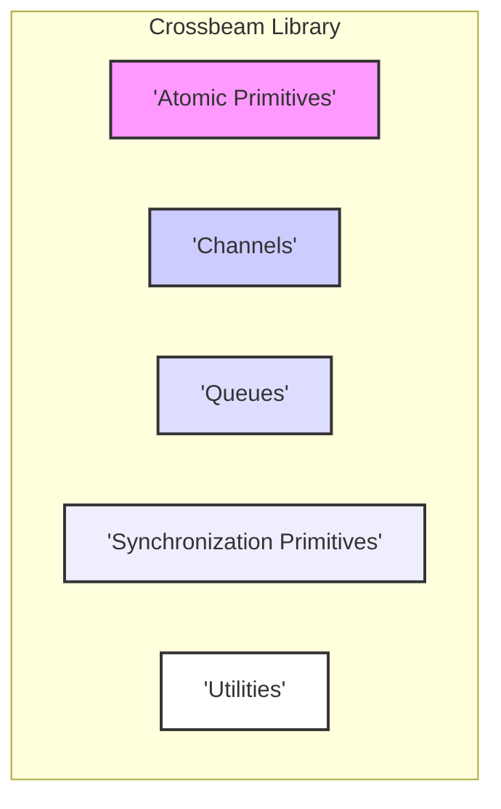
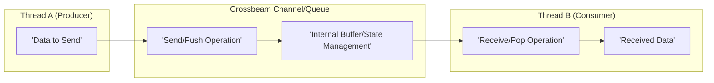

# Project Design Document: Crossbeam

**Version:** 1.1
**Date:** October 26, 2023
**Author:** AI Software Architect

## 1. Introduction

This document provides an enhanced design overview of the Crossbeam project, a collection of powerful tools designed to facilitate the development of correct, efficient, and safe concurrent programs in Rust. This document is specifically crafted to serve as a robust foundation for subsequent threat modeling activities. It meticulously outlines the key architectural components, data flows, and interactions within the Crossbeam library, highlighting potential areas of security concern.

## 2. Goals and Non-Goals

**Goals:**

*   Deliver a comprehensive and detailed architectural overview of the Crossbeam library, suitable for security analysis.
*   Thoroughly identify key components, elaborating on their specific functionalities and internal mechanisms.
*   Precisely describe the data flow and interactions between components, including nuances related to concurrency and synchronization.
*   Sharpen the focus on potential areas of security concern from an architectural perspective, providing more specific examples.
*   Serve as a well-defined and actionable basis for future threat modeling exercises, enabling the identification of potential vulnerabilities.

**Non-Goals:**

*   Provide a granular, line-by-line code-level analysis of the Crossbeam library's implementation.
*   Document every single implementation detail or algorithm used within the library; the focus is on architectural significance.
*   Perform a formal, in-depth security audit or penetration testing of the library's codebase.
*   Address specific, known vulnerabilities or bugs within the current codebase; the focus is on inherent architectural risks.

## 3. Architectural Overview

Crossbeam is a foundational library in the Rust ecosystem, offering a rich set of concurrency primitives. Its modular design allows developers to choose the specific tools they need for their concurrent applications. The library emphasizes safety and efficiency, providing abstractions that help manage the complexities of concurrent programming.

The core categories of components within Crossbeam, designed for distinct concurrency needs, are:

*   **Atomic Primitives:** Provides fundamental atomic types and operations, crucial for building lock-free data structures and algorithms. These ensure thread-safe manipulation of single memory locations.
*   **Channels:** Offers a variety of message passing channels, enabling safe and efficient communication between threads with different synchronization and buffering characteristics.
*   **Queues:** Implements diverse concurrent queue structures, optimized for various producer-consumer patterns and offering different performance trade-offs.
*   **Synchronization Primitives:** Includes advanced synchronization tools beyond basic mutexes and condition variables, facilitating complex coordination patterns between threads.
*   **Utilities:** Contains helper functions, traits, and structures that support the functionality of other modules and provide general concurrency utilities.

## 4. Component Details

This section provides a more detailed examination of the key components within the Crossbeam library, focusing on aspects relevant to security.

### 4.1. Atomic Primitives

*   **Description:** This module provides low-level building blocks for concurrent programming, offering atomic access to basic data types. It leverages the underlying hardware's atomic instructions where possible.
*   **Functionality:**
    *   Provides atomic wrappers around integer types (`AtomicUsize`, `AtomicIsize`, `AtomicU8`, etc.), allowing for thread-safe incrementing, decrementing, and other arithmetic operations.
    *   Offers `AtomicPtr` for atomically loading and storing raw pointers, crucial for building lock-free data structures.
    *   Includes `AtomicBool` for atomic boolean flags, often used for signaling and synchronization.
    *   Enforces memory ordering guarantees (e.g., `SeqCst`, `Acquire`, `Release`, `Relaxed`) which are critical for correctness in concurrent scenarios but can be misused, leading to subtle bugs.
    *   May include compare-and-swap (CAS) operations, the foundation for many lock-free algorithms.
*   **Potential Security Considerations:**
    *   **Incorrect Memory Ordering:**  Using weaker memory ordering than required can lead to data races and unexpected behavior, potentially exploitable if it leads to predictable incorrect states.
    *   **ABA Problem:** In certain lock-free algorithms using CAS, a value might change from A to B and back to A, causing a CAS operation to succeed incorrectly if not handled carefully. This can lead to logical errors and potential vulnerabilities.
    *   **Unintended Shared Mutable State:**  While atomics provide safe access, the overall design must ensure that only intended data is shared and mutated atomically.

### 4.2. Channels

*   **Description:** This module offers various implementations of message passing channels, each with different characteristics regarding buffering, synchronization, and the number of senders and receivers.
*   **Functionality:**
    *   **Bounded Channels:**  Have a fixed capacity. Sending blocks if the channel is full, and receiving blocks if the channel is empty. This can prevent unbounded resource consumption but introduces the possibility of deadlocks if not managed correctly.
    *   **Unbounded Channels:**  Have no fixed capacity, allowing senders to always send. This can lead to memory exhaustion if the receiver cannot keep up, a potential DoS vector.
    *   **Synchronous Channels (Rendezvous Channels):**  The sender blocks until a receiver is ready to receive the message, and vice-versa. This provides strong synchronization but can be prone to deadlocks.
    *   Support for single-producer, single-consumer (SPSC), multi-producer, single-consumer (MPSC), single-producer, multi-consumer (SPMC), and multi-producer, multi-consumer (MPMC) scenarios.
    *   Mechanisms for gracefully closing channels and handling closed channel errors.
*   **Potential Security Considerations:**
    *   **Denial of Service (DoS) via Unbounded Channels:**  Malicious actors or buggy code could flood an unbounded channel, leading to excessive memory consumption and application crashes.
    *   **Deadlocks:**  Circular dependencies in send/receive operations across multiple threads can lead to deadlocks, halting progress.
    *   **Data Integrity and Ordering:** While channels generally guarantee message delivery, subtle bugs in implementation or misuse could lead to dropped or out-of-order messages, potentially causing logical vulnerabilities.
    *   **Resource Exhaustion (Bounded Channels):**  If senders continuously fill bounded channels without receivers consuming, it can lead to resource contention and potentially impact other parts of the application.

### 4.3. Queues

*   **Description:** This module provides different types of concurrent queues, optimized for specific producer-consumer patterns and performance characteristics.
*   **Functionality:**
    *   Implementations of MPSC, MPMC, and potentially other queue variants.
    *   Lock-free queue implementations aim for high performance by avoiding traditional locking mechanisms, relying on atomic operations instead. These are complex and require careful implementation to avoid subtle bugs.
    *   Lock-based queue implementations offer simpler semantics but might have lower performance under high contention.
    *   Operations for pushing (enqueueing) and popping (dequeuing) elements.
    *   Potentially support for bulk operations (e.g., pushing or popping multiple elements at once).
*   **Potential Security Considerations:**
    *   **Denial of Service (DoS) via Unbounded Queues:** Similar to unbounded channels, unbounded queues can be exploited to consume excessive memory.
    *   **Data Corruption in Lock-Free Queues:**  Bugs in the intricate logic of lock-free algorithms can lead to data corruption, lost elements, or inconsistent queue states. These are notoriously difficult to debug and can have serious security implications.
    *   **Contention and Performance Degradation:**  Under high contention, even well-designed concurrent queues can experience performance degradation, potentially leading to denial of service in time-sensitive applications.
    *   **Fairness Issues:**  In some queue implementations, certain producers or consumers might be unfairly favored or starved, potentially leading to logical vulnerabilities.

### 4.4. Synchronization Primitives

*   **Description:** This module offers higher-level synchronization abstractions that simplify complex concurrent coordination tasks.
*   **Functionality:**
    *   **Barriers:** Allow multiple threads to wait until all of them reach a specific point before any can proceed. Incorrect use can lead to deadlocks if threads don't reach the barrier.
    *   **Wait Groups:** Enable a thread to wait for a collection of other threads to complete their tasks. Mismanagement of the wait group counter can lead to premature or delayed wake-ups.
    *   **Epoch-Based Reclamation (EBR):** A memory management technique used in lock-free data structures to safely reclaim memory without the risk of use-after-free errors. Incorrect implementation or usage can lead to memory safety issues.
    *   Potentially other advanced primitives like `ShardedLock` for finer-grained locking.
*   **Potential Security Considerations:**
    *   **Deadlocks:** Incorrect usage of barriers or other synchronization primitives can easily lead to deadlocks where threads are blocked indefinitely.
    *   **Livelocks:** Threads might continuously change state in response to each other without making progress, effectively stalling the application.
    *   **Use-After-Free (with EBR):**  If EBR is not implemented or used correctly, it can lead to use-after-free vulnerabilities in lock-free data structures.
    *   **Race Conditions in Primitive Logic:**  Bugs in the implementation of these synchronization primitives themselves could lead to subtle concurrency issues and potential vulnerabilities.

### 4.5. Utilities

*   **Description:** This module provides various helper functions, traits, and structures used internally by Crossbeam and potentially exposed for general use.
*   **Functionality:**
    *   Helper functions for thread management or manipulation.
    *   Potentially custom allocators or memory management utilities.
    *   Internal data structures or algorithms used by other modules.
    *   Traits that define common interfaces for concurrency primitives.
*   **Potential Security Considerations:**
    *   **General Purpose Utility Vulnerabilities:**  If utility functions have vulnerabilities (e.g., buffer overflows, integer overflows), these could be exploited by other parts of the library or by users.
    *   **Memory Management Issues:**  Bugs in custom allocators could lead to memory corruption or leaks.
    *   **Unintended Information Disclosure:**  Utility functions might inadvertently expose sensitive information.

## 5. Data Flow

The data flow within Crossbeam is centered around the movement and sharing of data between threads, facilitated by the provided concurrency primitives.

**Key Data Flow Patterns:**

*   **Message Passing (Channels):** Data originates in a sending thread, is serialized (implicitly or explicitly), and then transmitted through the channel's internal mechanisms to a receiving thread. The channel manages buffering, synchronization, and potentially ordering of messages.
*   **Shared Memory with Synchronization (Atomics, Queues):**  Multiple threads access and modify shared memory locations. Atomic operations ensure that these modifications are performed indivisibly. Synchronization primitives coordinate access to prevent data races and ensure consistency. For queues, data elements are moved into and out of the queue's internal storage.
*   **Synchronization Signals:**  Synchronization primitives like barriers and wait groups don't directly move application data but rather control the flow of execution of threads based on shared state.

## 6. Security Considerations

Building upon the component-level considerations, here are broader security aspects relevant to the Crossbeam library:

*   **Memory Safety and Data Races:** While Rust's type system provides strong guarantees, unsafe code within Crossbeam's implementation (if present) requires rigorous review. Incorrect usage of atomic operations or flawed lock-free algorithms can still introduce data races.
*   **Deadlocks and Livelocks:** The design and correct usage of Crossbeam's synchronization primitives are crucial to avoid deadlocks and livelocks, which can lead to application unavailability.
*   **Resource Exhaustion (DoS):** Unbounded channels and queues present a clear risk of denial-of-service attacks if an attacker can influence the rate of message production or queue insertion.
*   **API Misuse and Mental Model:** The complexity of concurrent programming means that even a well-designed API can be misused. Clear documentation, examples, and guidance are essential to prevent developers from introducing vulnerabilities through incorrect usage.
*   **Dependency Chain Security:** Crossbeam relies on the Rust standard library and potentially other crates. Vulnerabilities in these dependencies could indirectly impact the security of applications using Crossbeam. Supply chain security is a relevant concern.
*   **Panic Safety and Unwinding:**  The library should handle panics gracefully to prevent data corruption or inconsistent states. The interaction between panics and concurrent operations needs careful consideration.
*   **Side-Channel Attacks:** Depending on the specific use case and the sensitivity of the data being processed, potential side-channel attacks (e.g., timing attacks) related to the performance characteristics of different concurrency primitives might need to be considered.

## 7. Deployment Considerations

Crossbeam is designed as a library to be integrated into other Rust applications. Its security implications are primarily realized within the context of these applications.

*   **Careful Selection of Primitives:** Developers must choose the appropriate Crossbeam primitives for their specific concurrency needs, considering the security implications of each (e.g., bounded vs. unbounded channels).
*   **Configuration and Tuning:** Some Crossbeam primitives might offer configuration options (e.g., channel capacity) that can impact both performance and security. Incorrect configuration can lead to vulnerabilities.
*   **Regular Updates:** Keeping Crossbeam updated is crucial to benefit from bug fixes and security patches released by the maintainers.
*   **Static Analysis and Testing:**  Applications using Crossbeam should undergo thorough static analysis and testing, including concurrency-specific testing, to identify potential vulnerabilities.

## 8. Future Considerations

*   **Introduction of New Primitives:**  Any new concurrency primitives added to Crossbeam will require careful security analysis during their design and implementation.
*   **Performance Optimizations:**  Optimizations, especially in lock-free algorithms, can be complex and might inadvertently introduce subtle concurrency bugs with security implications.
*   **API Evolution:** Changes to the API should be carefully considered to avoid breaking existing code and to prevent the introduction of new avenues for misuse.

This enhanced design document provides a more detailed and security-focused understanding of the Crossbeam project's architecture. It serves as a valuable resource for conducting thorough threat modeling, enabling the identification of potential vulnerabilities and the development of appropriate mitigation strategies.
