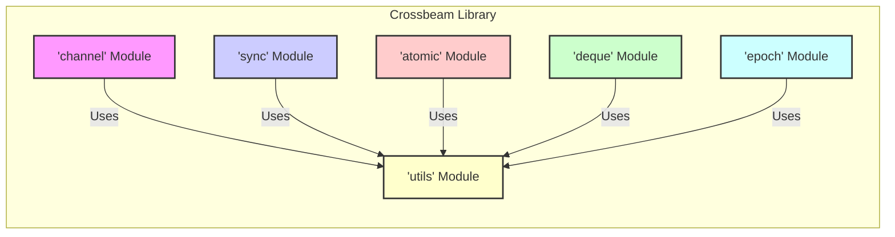
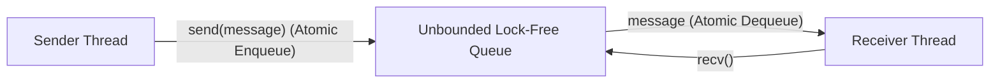
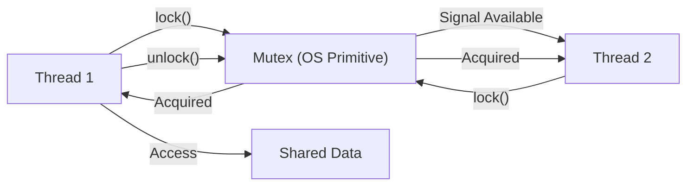
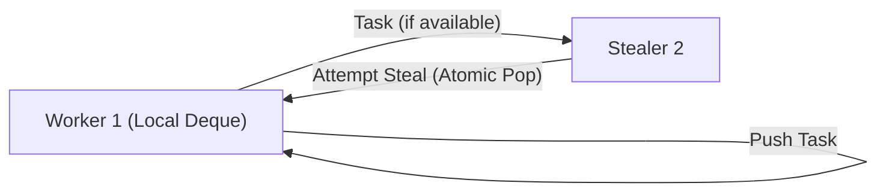

# Project Design Document: Crossbeam - Concurrency Primitives for Rust

**Version:** 1.1
**Date:** October 26, 2023
**Author:** AI Software Architect

## 1. Introduction

This document provides an enhanced design overview of the `crossbeam-rs/crossbeam` project. Crossbeam is a widely used Rust library offering a rich set of concurrency primitives that extend the standard library's capabilities. This revised document aims to provide a more detailed and precise description of the library's architecture, data flows, and interactions, making it even more suitable for subsequent threat modeling activities.

## 2. Project Overview

`crossbeam` empowers Rust developers to build robust concurrent and parallel applications. It prioritizes efficiency, memory safety (leveraging Rust's guarantees), and a developer-friendly experience when working with complex concurrency patterns. The library provides specialized and often more performant alternatives to the concurrency tools found in the Rust standard library.

## 3. Goals and Objectives

* **Deliver highly efficient and performant concurrency primitives:**  Focus on minimizing overhead and maximizing throughput in concurrent operations.
* **Guarantee memory safety and freedom from data races:**  Architected to leverage Rust's ownership and borrowing system, ensuring safe concurrent access to data.
* **Offer a comprehensive suite of concurrency tools:**  Encompasses a diverse range of primitives, including various channel types, sophisticated synchronization mechanisms, and fine-grained atomic operations.
* **Provide ergonomic and intuitive APIs:**  Designed for ease of use, simplifying the development of concurrent applications.
* **Serve as a reliable foundation for concurrent Rust ecosystems:** Intended to be a stable and dependable building block for other libraries and applications requiring concurrency.

## 4. Non-Goals

* **Developing application-specific concurrency frameworks:**  Remains focused on low-level primitives rather than higher-level abstractions like actor models or distributed task queues.
* **Completely replacing the Rust standard library's concurrency features:**  Acts as a complementary library, offering specialized alternatives where needed.
* **Eliminating all potential for liveness issues:** While designed for robustness, incorrect usage can still lead to deadlocks or livelocks at the application level.

## 5. Target Audience

The primary users of `crossbeam` are Rust developers building concurrent and parallel software who require more advanced control and performance than the standard library offers. This includes:

* Developers of libraries providing concurrent abstractions.
* Application developers building multi-threaded, parallel, or asynchronous systems.
* Engineers requiring fine-grained control over thread synchronization and inter-thread communication.

## 6. High-Level Architecture

`crossbeam` is modularly designed, with each module focusing on a specific category of concurrency primitives. The relationships between these modules are illustrated below:

* **`channel` Module:** Provides diverse channel implementations for message passing between threads with varying characteristics.
* **`sync` Module:** Offers a range of synchronization primitives for managing concurrent access to shared resources.
* **`atomic` Module:** Exposes atomic types and operations for lock-free, low-level concurrent data manipulation.
* **`deque` Module:** Implements efficient double-ended queues, specifically optimized for work-stealing parallel task execution.
* **`epoch` Module:** Provides epoch-based memory reclamation for safe and efficient memory management in concurrent data structures.
* **`utils` Module:** Contains internal utility functions and types shared across the other modules.

## 7. Component Design

This section provides a more detailed look at the key components within each module, highlighting their functionality and internal mechanisms.

### 7.1. `channel` Module

This module offers various channel types, each tailored for specific communication patterns and performance requirements.

* **`unbounded` Channel:**
    * Allows an unlimited number of messages to be sent.
    * Internally utilizes a lock-free queue, typically a Chase-Lev deque or similar, for high performance.
    * Comprises a `Sender` for sending messages and a `Receiver` for receiving.
    * Supports both Multiple-Producer Single-Consumer (MPSC) and Multiple-Producer Multiple-Consumer (MPMC) scenarios through cloning of the `Sender` and `Receiver`. Potential for memory exhaustion if send rate significantly exceeds receive rate.
* **`bounded` Channel:**
    * Has a fixed capacity for messages, defined at creation.
    * Sending will block the sender thread if the channel is full, and receiving will block the receiver if the channel is empty. This backpressure mechanism can prevent resource exhaustion.
    * Implemented with a circular buffer or similar structure, often protected by a mutex or atomic operations.
    * Also provides `Sender` and `Receiver` ends, supporting MPSC and MPMC variations. Different strategies for handling full channels (e.g., `try_send` which returns immediately).
* **`select!` Macro:**
    * Enables non-blocking waiting on multiple channel operations (sends or receives) across different channels.
    * Implemented using OS-specific mechanisms like `epoll` (Linux), `kqueue` (macOS, BSD), or `WaitForMultipleObjects` (Windows) for efficient event notification. This avoids busy-waiting and reduces CPU usage.
    * Introduces complexity in error handling as multiple operations can potentially fail.
* **Asynchronous Channels (`async` feature):**
    * Provides channel implementations designed to work seamlessly with asynchronous runtimes like `tokio` and `async-std`.
    * Leverages futures and asynchronous I/O primitives for non-blocking send and receive operations.
    * Typically built on top of the synchronous channel implementations, adding asynchronous wrappers.

### 7.2. `sync` Module

This module provides essential synchronization primitives for managing concurrent access to shared data and coordinating thread execution.

* **`Mutex`:**
    * Provides mutual exclusion, ensuring that only one thread can hold the lock and access the protected data at any given time.
    * Internally uses platform-specific locking mechanisms provided by the operating system (e.g., pthreads mutexes on Unix-like systems, critical sections on Windows). Susceptible to priority inversion issues if not used carefully.
    * Supports poisoning: if a thread holding the mutex panics, subsequent attempts to acquire the mutex will return an error, indicating potential data corruption.
* **`RwLock`:**
    * Allows either multiple readers or a single writer to hold the lock. This improves performance in scenarios with frequent reads and infrequent writes.
    * Typically implemented with separate read and write counters and waiting queues. Write locks have priority over read locks to prevent writer starvation.
    * Also supports poisoning, similar to `Mutex`.
* **`Barrier`:**
    * Enables multiple threads to synchronize at a specific point in their execution. All participating threads must reach the barrier before any can proceed.
    * Internally uses a counter and condition variable. When a thread reaches the barrier, it decrements the counter and waits on the condition variable. The last thread to arrive signals the condition variable, releasing all waiting threads.
* **`WaitGroup`:**
    * Allows a thread to wait for a collection of other threads to complete their execution.
    * Implemented with an internal counter that is incremented when a task is added and decremented when a task finishes. The waiting thread blocks until the counter reaches zero.
* **`ShardedLock`:**
    * A lock that internally consists of multiple smaller locks (shards). This can improve concurrency by allowing different threads to access different shards concurrently, reducing contention on a single lock.
    * The mapping of data to shards is crucial for performance. Poor sharding can lead to contention on specific shards.
* **`Parker` and `Unparker`:**
    * Low-level primitives for putting a thread to sleep (parking) and waking it up (unparking). These are fundamental building blocks for higher-level synchronization primitives.
    * Rely on OS-level thread blocking and signaling mechanisms.
* **`Condvar` (Condition Variable):**
    * Allows threads to wait for a specific condition to become true. Always used in conjunction with a `Mutex`.
    * A thread acquires the mutex, checks the condition, and if it's false, waits on the condition variable, releasing the mutex. Another thread, upon changing the condition, signals the condition variable, waking up one or more waiting threads. The waiting threads then re-acquire the mutex and re-check the condition.

### 7.3. `atomic` Module

This module provides atomic types that allow for lock-free concurrent operations on single values, crucial for building high-performance concurrent data structures.

* **Atomic Integer Types (`AtomicBool`, `AtomicI8`, `AtomicUsize`, etc.):**
    * Provide atomic read, write, fetch-and-add, compare-and-swap (CAS), and other operations on primitive integer types. These operations are guaranteed to be indivisible and prevent data races.
    * Directly map to CPU-level atomic instructions, ensuring efficiency. Different memory ordering guarantees (e.g., `SeqCst`, `Acquire`, `Release`, `Relaxed`) control the visibility of these operations across threads, allowing for fine-tuning of performance and correctness. Incorrect memory ordering can lead to subtle concurrency bugs.
* **Atomic Pointer (`AtomicPtr`):**
    * Allows atomic operations on raw pointers, essential for building lock-free data structures like linked lists and queues. Requires careful handling to avoid dangling pointers and memory safety issues.
* **Ordering Modes:**
    * Offers various memory ordering guarantees (e.g., `SeqCst`, `Acquire`, `Release`, `Relaxed`) to control how atomic operations are ordered and made visible to other threads. Choosing the correct ordering is critical for correctness and performance.

### 7.4. `deque` Module

This module implements efficient double-ended queues, particularly optimized for work-stealing scenarios in parallel task execution.

* **`Injector`:**
    * Represents the central queue where tasks are initially pushed. Typically used by a central task distributor or scheduler.
    * Often implemented as a lock-free deque to allow concurrent pushes.
* **`Stealer`:**
    * Allows worker threads to "steal" tasks from the tail of other workers' deques when their own deque is empty. This is the core of the work-stealing algorithm.
    * Requires careful synchronization to avoid conflicts when multiple stealers try to access the same deque.
* **`Worker`:**
    * Represents a local deque for a specific thread. Tasks are initially pushed onto the worker's own deque. This reduces contention as most operations are local.
    * When a worker runs out of tasks, it attempts to steal from other workers' deques.

### 7.5. `epoch` Module

This module provides epoch-based reclamation, a technique for safe memory management in concurrent data structures without the overhead of traditional garbage collection or reference counting.

* **`AtomicEpoch`:**
    * An atomic counter representing the current global epoch. Incremented periodically.
* **`Guard`:**
    * A RAII guard that registers the current thread's participation in the current epoch. When a `Guard` is active, the thread is considered to be in that epoch.
    * Ensures that memory deallocation of objects potentially accessed by the thread in that epoch is deferred until the thread is no longer in that epoch.
* **`Collector`:**
    * Manages the collection of deferred operations (e.g., deallocations). When the global epoch advances sufficiently, and no threads are in the epochs where the operations were deferred, the `Collector` executes these operations safely.

### 7.6. `utils` Module

This module contains various utility functions and types used internally by other modules.

* **`Backoff`:**
    * A utility for implementing exponential backoff in retry loops, commonly used in lock-free algorithms to reduce contention.
* **`CachePadded`:**
    * A wrapper that adds padding to data structures to ensure they occupy separate cache lines, preventing false sharing between CPU cores and improving performance.

## 8. Data Flow and Interactions

The data flow and interactions within `crossbeam` are highly dependent on the specific concurrency primitive being utilized. Here are more detailed examples:

* **Unbounded Channel Communication:**
    * A sender thread calls `send(message)` on a `Sender`. The message is enqueued into the lock-free queue (e.g., using atomic operations like compare-and-swap).
    * A receiver thread calls `recv()` on a `Receiver`. It attempts to dequeue a message from the lock-free queue (again, using atomic operations). If the queue is empty, the receiver might spin or yield the CPU.
    * In MPMC scenarios, multiple senders and receivers might concurrently access the queue, requiring careful synchronization within the lock-free queue implementation.

* **Mutex Locking and Data Access:**
    * `Thread 1` calls `lock()` on `Mutex`. If the mutex is free, `Thread 1` acquires the lock (typically by atomically setting a flag).
    * `Thread 1` accesses the shared data protected by the mutex.
    * `Thread 2` calls `lock()` on the same `Mutex`. Since `Thread 1` holds the lock, `Thread 2` is blocked (put to sleep by the OS).
    * `Thread 1` finishes accessing the shared data and calls `unlock()`, releasing the lock (atomically resetting the flag).
    * The OS scheduler wakes up `Thread 2`, which now acquires the lock.

* **Work-Stealing from a Deque:**
    * `Worker 1` pushes tasks onto its local `Worker` deque.
    * `Worker 2` finishes its local tasks and attempts to steal from the tail of `Worker 1`'s deque (`Stealer`). This involves atomic operations to safely remove a task from the tail.
    * If `Worker 1` is also working on its deque, contention can occur, requiring careful synchronization within the deque implementation.

## 9. Security Considerations

While `crossbeam` prioritizes memory safety, potential security vulnerabilities can arise from incorrect usage or subtle implementation details.

* **Race Conditions:** Improper use of synchronization primitives or incorrect logic in lock-free algorithms can still lead to race conditions, where the outcome depends on unpredictable thread execution order, potentially leading to data corruption or unexpected behavior.
* **Deadlocks:**  Circular dependencies in lock acquisition (e.g., thread A holds lock X and waits for lock Y, while thread B holds lock Y and waits for lock X) can lead to deadlocks, where threads are blocked indefinitely.
* **Livelocks:** Threads might repeatedly attempt to acquire resources and back off, resulting in no progress despite not being blocked. This can occur with certain lock-free algorithms if contention is high.
* **Data Corruption:** Even with atomic operations, incorrect logic or memory ordering can lead to subtle data corruption that is hard to detect.
* **Denial of Service (DoS):**
    * Unbounded channels, if not managed carefully, can lead to excessive memory consumption if the sending rate significantly exceeds the receiving rate.
    *  Spin locks (used internally in some primitives) under high contention could potentially consume excessive CPU resources.
* **Panic Safety:** While `crossbeam` generally handles panics gracefully, ensuring that shared state remains consistent and recoverable in the face of panics requires careful design and consideration of poisoning mechanisms in mutexes and rwlocks.
* **Dependency Vulnerabilities:** Although `crossbeam` has minimal direct dependencies, vulnerabilities in those dependencies could potentially impact `crossbeam`. Regular security audits of dependencies are important.

## 10. Dependencies

`crossbeam` intentionally keeps its direct dependencies minimal. Key dependencies include:

* **`cfg-if`:** For enabling conditional compilation based on target features and platforms.
* **`scopeguard`:** For implementing RAII-style resource management, particularly for ensuring locks are released even in the presence of panics.
* **Platform-specific crates (indirectly through `libc` or similar):** For accessing low-level operating system primitives for threading and synchronization.

## 11. Deployment Considerations

`crossbeam` is a library and is deployed as a dependency of other Rust applications. Its deployment is therefore integrated with the deployment process of the applications that use it. No specific deployment steps are required for `crossbeam` itself. Considerations include ensuring the target platform supports the threading model and atomic operations used by `crossbeam`.

## 12. Future Considerations

Potential future developments for `crossbeam` include:

* **Continued performance optimizations:** Exploring and implementing further optimizations for existing primitives, potentially leveraging new hardware features.
* **Introduction of new concurrency primitives:**  Adding support for emerging concurrency patterns and abstractions.
* **Enhanced asynchronous capabilities:**  Deeper integration with asynchronous runtimes and potentially new asynchronous primitives.
* **Improved diagnostics and debugging tools:**  Providing better tools for understanding and debugging concurrent code built with `crossbeam`.
* **Formal verification efforts:** Exploring formal methods to verify the correctness and safety of core primitives.

This enhanced design document provides a more detailed and nuanced understanding of the `crossbeam` library's architecture and internal workings. This level of detail is crucial for conducting thorough threat modeling and identifying potential security vulnerabilities arising from both design and implementation aspects of the library.