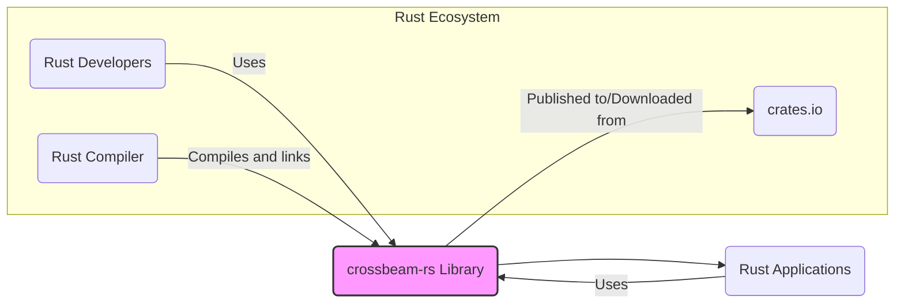
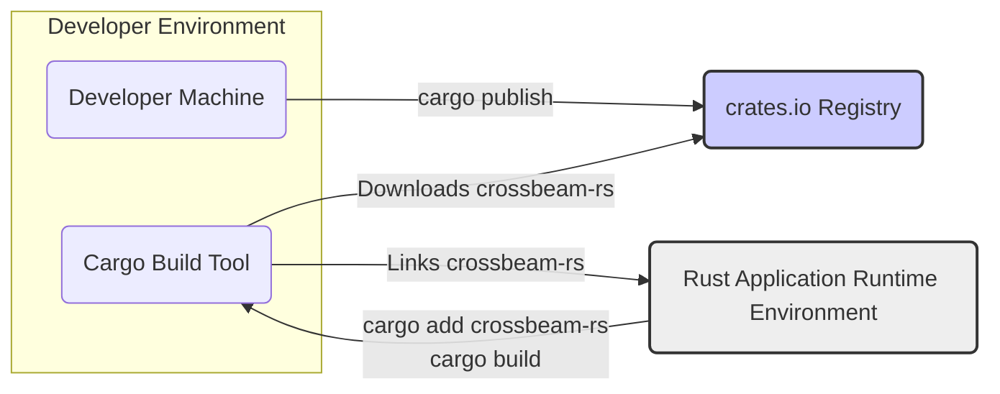

# BUSINESS POSTURE

*   Business Priorities and Goals:
    *   Provide high-quality, efficient, and safe concurrency primitives for Rust developers.
    *   Improve the performance and reliability of concurrent Rust applications by offering well-tested and optimized tools.
    *   Enable developers to write concurrent code more easily and correctly, reducing the risk of common concurrency bugs like race conditions and deadlocks.
    *   Maintain a widely used and respected open-source library within the Rust ecosystem.
*   Business Risks:
    *   Defects or vulnerabilities in the library could lead to crashes, data corruption, or security issues in applications that depend on it.
    *   Poor performance or inefficiency could negatively impact the performance of applications using the library.
    *   Lack of maintenance or community support could lead to the library becoming outdated or unusable.
    *   Adoption risk if the library is not perceived as reliable, efficient, or easy to use by Rust developers.

# SECURITY POSTURE

*   Existing Security Controls:
    *   security control: Code review - Implemented through GitHub pull requests.
    *   security control: Unit and integration testing - Evidenced by the extensive test suite in the repository.
    *   security control: Fuzzing - Potentially used, but not explicitly documented in the repository.
    *   security control: Static analysis - Likely used by Rust compiler and potentially by developers locally, but not explicitly part of the project's CI.
    *   accepted risk: Dependency vulnerabilities - Risk inherent in using third-party dependencies, managed by dependency updates.
    *   accepted risk: Undiscovered vulnerabilities - Risk inherent in any software project, mitigated by testing, review, and community scrutiny.
*   Recommended Security Controls:
    *   security control: Automated static analysis in CI pipeline - Integrate tools like `cargo clippy` and security linters in the CI to automatically detect potential code quality and security issues.
    *   security control: Dependency vulnerability scanning - Implement automated scanning of dependencies for known vulnerabilities as part of the CI process.
    *   security control: Regular security audits - Consider periodic security audits by external experts to identify potential vulnerabilities and weaknesses.
    *   security control: Signed releases - Sign releases of the crate to ensure authenticity and prevent tampering.
*   Security Requirements:
    *   Authentication: Not directly applicable to a library. Authentication is relevant for systems that *use* the library, but not the library itself.
    *   Authorization: Not directly applicable to a library. Authorization is relevant for systems that *use* the library, but not the library itself.
    *   Input Validation: While not directly taking user input, the library's APIs should be designed to handle various input conditions safely and prevent unexpected behavior or crashes due to invalid inputs from the calling code. This is more about API design and robustness.
    *   Cryptography: Not directly required for the core functionality of concurrency primitives. If cryptographic operations are added in the future, standard best practices for cryptography should be followed. Memory safety is paramount, especially when dealing with concurrency primitives. The library must be memory-safe to prevent vulnerabilities like use-after-free, double-free, and buffer overflows, which are common in concurrent programming.

# DESIGN

## C4 CONTEXT



*   Context Diagram Elements:
    *   Element 1:
        *   Name: Rust Developers
        *   Type: Person
        *   Description: Software developers who use the Rust programming language to build applications.
        *   Responsibilities: Use crossbeam-rs library to implement concurrent logic in their applications. Report issues and contribute to the library.
        *   Security controls: Secure development practices on their side, secure handling of dependencies.
    *   Element 2:
        *   Name: crossbeam-rs Library
        *   Type: Software System
        *   Description: A Rust library providing concurrency primitives like channels, queues, and synchronization tools.
        *   Responsibilities: Provide safe, efficient, and reliable concurrency primitives for Rust applications.
        *   Security controls: Code review, testing, static analysis, dependency management, secure build process.
    *   Element 3:
        *   Name: crates.io
        *   Type: Software System
        *   Description: The official package registry for Rust crates (libraries).
        *   Responsibilities: Host and distribute Rust crates, including crossbeam-rs. Provide a platform for discovering and downloading Rust libraries.
        *   Security controls: Package verification, malware scanning, HTTPS for download, access control for publishing.
    *   Element 4:
        *   Name: Rust Compiler
        *   Type: Software System
        *   Description: The Rust compiler (`rustc`) used to compile Rust code, including applications that use crossbeam-rs.
        *   Responsibilities: Compile Rust code into executable binaries or libraries. Perform static analysis and type checking.
        *   Security controls: Compiler hardening, vulnerability management, secure build process for the compiler itself.
    *   Element 5:
        *   Name: Rust Applications
        *   Type: Software System
        *   Description: Applications built using the Rust programming language that utilize the crossbeam-rs library for concurrency.
        *   Responsibilities: Implement specific business logic, utilize concurrency primitives provided by crossbeam-rs to achieve performance and responsiveness.
        *   Security controls: Application-specific security controls, secure coding practices, dependency management.

## C4 CONTAINER

```mermaid
flowchart LR
    subgraph Rust_Ecosystem [Rust Ecosystem]
        direction TB
        RustDevelopers("Rust Developers")
        crates_io("crates.io")
        RustCompiler("Rust Compiler")
    end
    CrossbeamRsContainer("crossbeam-rs Library Container")

    RustDevelopers -->|Uses| CrossbeamRsContainer
    RustCompiler -->|Compiles and links| CrossbeamRsContainer
    CrossbeamRsContainer -->|Published to/Downloaded from| crates_io
    CrossbeamRsContainer --> RustApplications("Rust Applications")
    RustApplications -->|Uses| CrossbeamRsContainer

    subgraph CrossbeamRsContainer [crossbeam-rs Library Internals]
        direction TB
        ConcurrencyPrimitives("Concurrency Primitives Modules")
        SynchronizationPrimitives("Synchronization Primitives Modules")
        DataStructures("Concurrent Data Structures Modules")
        TestingFramework("Testing Framework")
        Documentation("Documentation")
    end
    CrossbeamRsContainer == ConcurrencyPrimitives
    CrossbeamRsContainer == SynchronizationPrimitives
    CrossbeamRsContainer == DataStructures
    CrossbeamRsContainer == TestingFramework
    CrossbeamRsContainer == Documentation


    style CrossbeamRsContainer fill:#f9f,stroke:#333,stroke-width:2px
```

*   Container Diagram Elements:
    *   Element 1:
        *   Name: crossbeam-rs Library Container
        *   Type: Container (Library)
        *   Description: Represents the crossbeam-rs library as a whole, encompassing all its modules and functionalities.
        *   Responsibilities: Provide a cohesive set of concurrency tools. Manage internal dependencies and ensure compatibility between modules.
        *   Security controls:  Code review across modules, integrated testing of modules, consistent application of security best practices across the library.
    *   Element 2:
        *   Name: Concurrency Primitives Modules
        *   Type: Component (Module)
        *   Description: Modules providing basic concurrency primitives like channels and queues.
        *   Responsibilities: Implement efficient and safe channel and queue implementations. Handle inter-thread communication and data transfer.
        *   Security controls: Memory safety checks, bounds checking, protection against race conditions in primitive implementations.
    *   Element 3:
        *   Name: Synchronization Primitives Modules
        *   Type: Component (Module)
        *   Description: Modules offering synchronization primitives like mutexes, semaphores, and condition variables.
        *   Responsibilities: Implement robust and deadlock-free synchronization mechanisms. Ensure correct locking and unlocking behavior.
        *   Security controls:  Careful design to prevent deadlocks and race conditions, rigorous testing of synchronization logic.
    *   Element 4:
        *   Name: Concurrent Data Structures Modules
        *   Type: Component (Module)
        *   Description: Modules providing concurrent data structures like concurrent hash maps or linked lists.
        *   Responsibilities: Implement thread-safe data structures that allow concurrent access and modification. Ensure data consistency and integrity under concurrent operations.
        *   Security controls: Atomicity of operations, protection against data corruption in concurrent access scenarios.
    *   Element 5:
        *   Name: Testing Framework
        *   Type: Component (Module)
        *   Description:  The testing framework within the crossbeam-rs repository, including unit tests, integration tests, and potentially benchmarks.
        *   Responsibilities: Ensure the correctness and reliability of all library components. Detect regressions and verify bug fixes.
        *   Security controls: Test coverage analysis, fuzzing, property-based testing to uncover edge cases and potential vulnerabilities.
    *   Element 6:
        *   Name: Documentation
        *   Type: Component (Module)
        *   Description:  The documentation for the crossbeam-rs library, including API documentation, examples, and usage guides.
        *   Responsibilities: Provide clear and accurate documentation for developers using the library. Explain correct usage and potential pitfalls.
        *   Security controls:  Review documentation for clarity and accuracy, ensure documentation does not encourage insecure usage patterns.

## DEPLOYMENT

*   Deployment Options:
    *   crates.io: The primary deployment method is publishing the library to crates.io, making it available for download and use by Rust developers.
    *   GitHub: The source code is hosted on GitHub, allowing developers to build and use the library directly from source.
    *   Local Build: Developers can build and use the library locally from the source code repository.

*   Detailed Deployment (crates.io):



*   Deployment Diagram Elements:
    *   Element 1:
        *   Name: Developer Machine
        *   Type: Infrastructure (Developer Workstation)
        *   Description: The local computer used by a Rust developer to develop and potentially publish the crossbeam-rs library.
        *   Responsibilities: Development, testing, and publishing of the library. Securely store developer credentials for publishing.
        *   Security controls: Developer workstation security, access control, secure key management for publishing.
    *   Element 2:
        *   Name: Cargo Build Tool
        *   Type: Software (Build Tool)
        *   Description: The Rust build tool `cargo` used by developers to manage dependencies, build, test, and package Rust crates.
        *   Responsibilities: Resolve dependencies, download crates from crates.io, compile Rust code, link libraries.
        *   Security controls: Secure download of dependencies (HTTPS), verification of downloaded packages (checksums), build process security.
    *   Element 3:
        *   Name: crates.io Registry
        *   Type: Infrastructure (Package Registry)
        *   Description: The crates.io registry, a central repository for Rust crates.
        *   Responsibilities: Host and distribute Rust crates. Provide search and download functionality. Ensure availability and integrity of packages.
        *   Security controls: Package verification, malware scanning, access control, infrastructure security, DDoS protection.
    *   Element 4:
        *   Name: Rust Application Runtime Environment
        *   Type: Infrastructure (Application Environment)
        *   Description: The environment where a Rust application using crossbeam-rs is executed. This could be a server, desktop, mobile device, etc.
        *   Responsibilities: Execute Rust applications. Provide resources for the application to run (CPU, memory, etc.).
        *   Security controls: Operating system security, runtime environment security, application-specific security controls.

## BUILD

```mermaid
flowchart LR
    subgraph Developer_Environment [Developer Environment]
        Developer("Developer")
        SourceCodeRepository("Source Code Repository (GitHub)")
    end
    subgraph CI_Environment [CI Environment (GitHub Actions)]
        CI_System("CI System (GitHub Actions)")
        BuildEnvironment("Build Environment")
        TestEnvironment("Test Environment")
        ArtifactRepository("Artifact Repository")
        crates_io("crates.io Registry")
    end

    Developer -->|Code Commit| SourceCodeRepository
    SourceCodeRepository -->|Webhook Trigger| CI_System
    CI_System --> BuildEnvironment
    BuildEnvironment -->|cargo build| ArtifactRepository
    BuildEnvironment -->|Dependency Check\nStatic Analysis\nSecurity Scan| BuildEnvironment
    ArtifactRepository --> TestEnvironment
    TestEnvironment -->|cargo test| ArtifactRepository
    ArtifactRepository -->|Publish Release| crates_io

    style crates_io fill:#ccf,stroke:#333,stroke-width:2px
    style ArtifactRepository fill:#eee,stroke:#333,stroke-width:2px
```

*   Build Process Elements:
    *   Element 1:
        *   Name: Developer
        *   Type: Person
        *   Description: A software developer contributing to the crossbeam-rs project.
        *   Responsibilities: Write code, commit changes, create pull requests, perform code reviews.
        *   Security controls: Secure coding practices, code review participation, access control to the repository.
    *   Element 2:
        *   Name: Source Code Repository (GitHub)
        *   Type: Software (Version Control System)
        *   Description: GitHub repository hosting the crossbeam-rs source code.
        *   Responsibilities: Store source code, manage versions, track changes, facilitate collaboration.
        *   Security controls: Access control, branch protection, audit logging, vulnerability scanning of the platform.
    *   Element 3:
        *   Name: CI System (GitHub Actions)
        *   Type: Software (CI/CD System)
        *   Description: GitHub Actions used for automated building, testing, and publishing of crossbeam-rs.
        *   Responsibilities: Automate build, test, and release processes. Run security checks and static analysis.
        *   Security controls: Secure CI configuration, access control to CI workflows, secret management, isolation of build environments.
    *   Element 4:
        *   Name: Build Environment
        *   Type: Infrastructure (Build Server)
        *   Description: The environment where the library is compiled and built during the CI process.
        *   Responsibilities: Provide necessary tools and dependencies for building the library. Execute build scripts.
        *   Security controls: Secure build environment configuration, minimal toolset, dependency integrity checks, isolation from other environments.
    *   Element 5:
        *   Name: Test Environment
        *   Type: Infrastructure (Test Server)
        *   Description: The environment where automated tests are executed during the CI process.
        *   Responsibilities: Execute unit tests, integration tests, and other automated tests. Report test results.
        *   Security controls: Isolated test environment, secure test data management, test result integrity.
    *   Element 6:
        *   Name: Artifact Repository
        *   Type: Software (Artifact Storage)
        *   Description: Temporary storage for build artifacts (e.g., compiled library files, test results) within the CI pipeline.
        *   Responsibilities: Store intermediate build artifacts. Make artifacts available to subsequent stages in the CI pipeline.
        *   Security controls: Access control, temporary storage, secure artifact handling.
    *   Element 7:
        *   Name: crates.io Registry
        *   Type: Infrastructure (Package Registry)
        *   Description: The crates.io registry where the final library package is published.
        *   Responsibilities: Host and distribute the released library package.
        *   Security controls: Package verification, secure upload process (API keys), access control for publishing.

# RISK ASSESSMENT

*   Critical Business Processes:
    *   The critical business process being protected is the development and distribution of a reliable and secure concurrency library for the Rust ecosystem. This indirectly supports all business processes that rely on Rust applications using this library for performance and correctness in concurrent operations.
*   Data Sensitivity:
    *   The data being protected is primarily the source code of the crossbeam-rs library. The sensitivity is moderately high, as compromising the source code could lead to the introduction of vulnerabilities that would affect a wide range of applications using the library.  There is no direct user data processed or stored by the library itself. The sensitivity of data processed by applications using crossbeam-rs depends entirely on those applications and is outside the scope of this library's risk assessment.

# QUESTIONS & ASSUMPTIONS

*   Questions:
    *   Are there any specific security compliance requirements that the crossbeam-rs project needs to adhere to (e.g., SOC 2, ISO 27001)?
    *   Is there a formal process for handling security vulnerability reports?
    *   Are there any plans for formal security audits or penetration testing of the library?
    *   What is the process for dependency management and vulnerability scanning of dependencies?
*   Assumptions:
    *   The primary goal of the crossbeam-rs project is to provide a high-quality, reliable, and safe concurrency library for the Rust ecosystem.
    *   Security is a significant concern for the project, and the maintainers are committed to addressing security vulnerabilities and following secure development practices.
    *   The project uses GitHub and GitHub Actions for source code hosting, collaboration, and CI/CD.
    *   The library is intended to be distributed primarily through crates.io.
    *   The target users are Rust developers building a variety of applications, with varying levels of security sensitivity.
    *   The project operates with a typical open-source model, relying on community contributions and maintainer efforts.