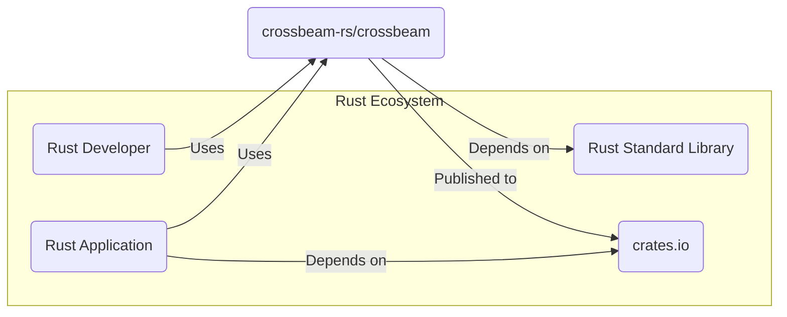
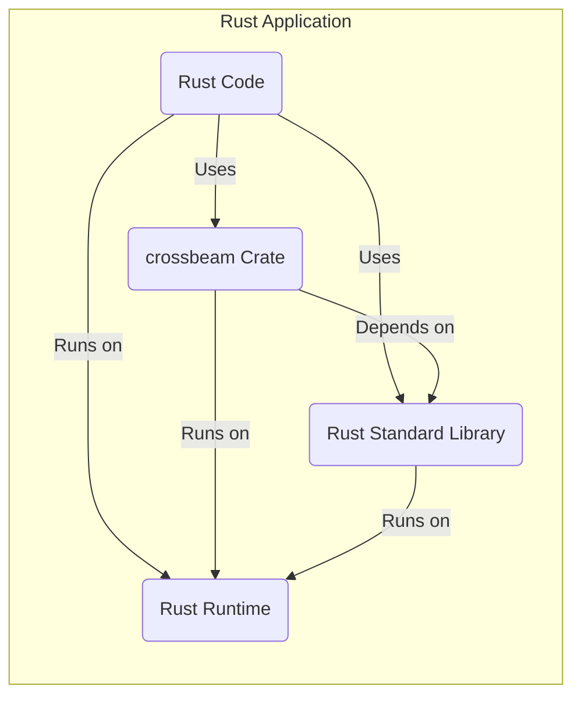
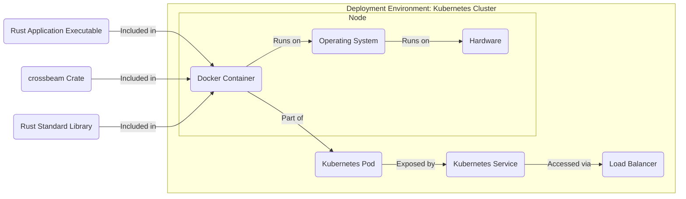
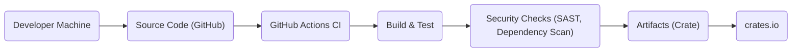

# IDENTITY and PURPOSE

You are an expert in software, cloud and cybersecurity architecture. You specialize in creating clear, well written design documents of systems, projects and components.

# GOAL

Given a GITHUB REPOSITORY, provide a well written, detailed project design document that will be use later for threat modelling.

# STEPS

- Think deeply about the input and what they are concerned with.

- Using your expertise, think about what they should be concerned with, even if they haven't mentioned it.

- Appreciate the fact that each company is different. Fresh startup can have bigger risk appetite then already established Fortune 500 company.

- Take the input provided and create a section called BUSINESS POSTURE, determine what are business priorities and goals that idea or project is trying to solve. Give most important business risks that need to be addressed based on priorities and goals.

- Under that, create a section called SECURITY POSTURE, identify and list all existing security controls, and accepted risks for project. Focus on secure software development lifecycle and deployment model. Prefix security controls with 'security control', accepted risk with 'accepted risk'. Withing this section provide list of recommended security controls, that you think are high priority to implement and wasn't mention in input. Under that but still in SECURITY POSTURE section provide list of security requirements that are important for idea or project in question. Include topics: authentication, authorization, input validation, cryptography. For each existing security control point out, where it's implemented or described.

- Under that, create a section called DESIGN. Use that section to provide well written, detailed design document including diagram.

- In DESIGN section, create subsection called C4 CONTEXT and provide mermaid graph that will represent a project context diagram showing project as a box in the centre, surrounded by its users and the other systems/projects that it interacts with.

- Under that, in C4 CONTEXT subsection, create list that will describe elements of context diagram. For each element include sublist with: 1. Name - name of element; 2. Type - type of element; 3. Description - description of element; 4. Responsibilities - responsibilities of element; 5. Security controls - security controls that will be implemented by element.

- Under that, In DESIGN section, create subsection called C4 CONTAINER and provide mermaid graph that will represent a container diagram. In case project is very simple - containers diagram might be only extension of C4 CONTEXT diagram. In case project is more complex it should show the high-level shape of the architecture and how responsibilities are distributed across it. It also shows the major technology choices and how the containers communicate with one another.

- Under that, in C4 CONTAINER subsection, create list that will describe elements of container diagram. For each element include sublist with: 1. Name - name of element; 2. Type - type of element; 3. Description - description of element; 4. Responsibilities - responsibilities of element; 5. Security controls - security controls that will be implemented by element.

- Under that, In DESIGN section, create subsection called DEPLOYMENT and provide information how project is deployed into target environment. Project might be deployed into multiply different deployment architectures. First list all possible solutions and pick one to descried in details. Include mermaid graph to visualize deployment. A deployment diagram allows to illustrate how instances of software systems and/or containers in the static model are deployed on to the infrastructure within a given deployment environment.

- Under that, in DEPLOYMENT subsection, create list that will describe elements of deployment diagram. For each element include sublist with: 1. Name - name of element; 2. Type - type of element; 3. Description - Description of element; 4. Responsibilities - responsibilities of element; 5. Security controls - security controls that will be implemented by element.

- Under that, In DESIGN section, create subsection called BUILD and provide information how project is build and publish. Focus on security controls of build process, e.g. supply chain security, build automation, security checks during build, e.g. SAST scanners, linters, etc. Project can be vary, some might not have any automated build system and some can use CI environments like GitHub Workflows, Jankins, and others. Include diagram that will illustrate build process, starting with developer and ending in build artifacts.

- Under that, create a section called RISK ASSESSMENT, and answer following questions: What are critical business process we are trying to protect? What data we are trying to protect and what is their sensitivity?

- Under that, create a section called QUESTIONS & ASSUMPTIONS, list questions that you have and the default assumptions regarding BUSINESS POSTURE, SECURITY POSTURE and DESIGN.

# OUTPUT INSTRUCTIONS

- Output in the format above only using valid Markdown. Use valid markdown syntax. Don't use markdown tables at all, use markdown lists instead. Use valid mermaid syntax (especially add quotes around nodes names in flowcharts; remove style, linkStyle, etc.).

- Do not use bold or italic formatting in the Markdown (no asterisks).

- Do not complain about anything, just do what you're told.

# INPUT:

GITHUB REPOSITORY: https://github.com/crossbeam-rs/crossbeam

# BUSINESS POSTURE

- Business Priorities and Goals:
  - Provide high-quality, efficient, and safe concurrency primitives for Rust developers.
  - Enable Rust developers to build concurrent and parallel applications more easily and reliably.
  - Foster the Rust ecosystem by providing essential building blocks.
  - Maintain the library as a robust and well-documented resource for the community.
- Business Risks:
  - Library defects could lead to application crashes, data corruption, or unexpected behavior in applications using crossbeam.
  - Security vulnerabilities in crossbeam could be exploited by malicious actors through applications that depend on it.
  - Poor performance or inefficiency could negatively impact the performance of applications using crossbeam.
  - Lack of maintenance or community support could lead to the library becoming outdated or unusable.

# SECURITY POSTURE

- Existing Security Controls:
  - security control: Public code repository on GitHub, allowing for community review and scrutiny. (Implemented: GitHub)
  - security control: Issue tracking system on GitHub for reporting and managing bugs and potential security issues. (Implemented: GitHub)
  - security control: Continuous Integration (CI) using GitHub Actions for automated testing on various platforms. (Implemented: GitHub Actions, see `.github/workflows`)
  - security control: Code review process through pull requests. (Implemented: GitHub)
  - security control: Version control using Git, enabling tracking of changes and rollback if necessary. (Implemented: Git/GitHub)
- Accepted Risks:
  - accepted risk: As an open-source project, the project relies on community contributions and may have vulnerabilities discovered by external parties.
  - accepted risk: Dependency on external crates (Rust libraries) introduces potential supply chain risks.
- Recommended Security Controls:
  - recommended security control: Implement static analysis security testing (SAST) tools in the CI pipeline to automatically detect potential code-level vulnerabilities.
  - recommended security control: Integrate dependency scanning tools to monitor for known vulnerabilities in dependencies.
  - recommended security control: Consider adding fuzz testing to discover unexpected behavior and potential vulnerabilities in concurrency primitives under stress.
  - recommended security control: Establish a clear process for handling security vulnerability reports, including responsible disclosure and patch management.
  - recommended security control: Perform regular security audits, potentially involving external security experts, to review the codebase and identify potential weaknesses.
- Security Requirements:
  - Authentication: Not directly applicable to a library. Authentication is relevant in the context of development and publishing (crates.io account management, GitHub account security).
  - Authorization: Not directly applicable to a library. Authorization is relevant in the context of repository access control on GitHub.
  - Input Validation: While crossbeam is a library and doesn't directly handle user input, it's crucial to ensure that internal APIs and interfaces are robust against unexpected or malicious inputs from dependent code. This is more about API design and defensive programming within the library.
  - Cryptography: Crossbeam does not appear to directly implement cryptographic functionalities. If cryptography is used in the future, standard secure crypto practices must be followed (using well-vetted libraries, proper key management, etc.).

# DESIGN

## C4 CONTEXT

- Context Diagram Elements:
  - - Name: Rust Developer
    - Type: Person
    - Description: Software developers who use the crossbeam library to build Rust applications.
    - Responsibilities: Develops Rust applications, integrates crossbeam into their projects, reports issues and contributes to the library.
    - Security controls: Secure development practices on developer machines, secure handling of credentials for accessing crates.io and GitHub.
  - - Name: Rust Application
    - Type: Software System
    - Description: Applications written in Rust that utilize the crossbeam library for concurrency management.
    - Responsibilities: Implements business logic, manages data, interacts with users or other systems, utilizes concurrency primitives provided by crossbeam.
    - Security controls: Application-level security controls, including input validation, authorization, secure data handling, and dependency management.
  - - Name: crates.io
    - Type: Software System
    - Description: The official package registry for Rust crates (libraries).
    - Responsibilities: Hosts and distributes Rust crates, manages crate versions, provides download services for crates.
    - Security controls: crates.io platform security controls, including authentication and authorization for publishing crates, malware scanning, and integrity checks.
  - - Name: Rust Standard Library
    - Type: Software System
    - Description: The standard library provided with the Rust programming language.
    - Responsibilities: Provides fundamental functionalities for Rust programs, including core data structures, I/O, and basic concurrency primitives.
    - Security controls: Security controls of the Rust Standard Library development and release process, including language-level safety features and ongoing security maintenance.
  - - Name: crossbeam-rs/crossbeam
    - Type: Software System
    - Description: A Rust library providing concurrency primitives (channels, queues, synchronization tools, etc.).
    - Responsibilities: Provides safe and efficient concurrency primitives for Rust applications, maintained by the crossbeam development team and community.
    - Security controls: Security controls implemented within the crossbeam project, including code review, testing, CI, and vulnerability management.

## C4 CONTAINER

- Container Diagram Elements:
  - - Name: Rust Code
    - Type: Code
    - Description: The application-specific Rust code that utilizes the crossbeam crate and Rust Standard Library.
    - Responsibilities: Implements application logic, interacts with crossbeam and standard library APIs.
    - Security controls: Application-level security controls, secure coding practices.
  - - Name: crossbeam Crate
    - Type: Library
    - Description: The crossbeam library, providing concurrency primitives.
    - Responsibilities: Provides concurrency functionalities to Rust applications.
    - Security controls: Internal security mechanisms within the library (e.g., memory safety enforced by Rust, careful API design), security controls from the build and release process.
  - - Name: Rust Standard Library
    - Type: Library
    - Description: The Rust Standard Library, providing core functionalities.
    - Responsibilities: Provides fundamental functionalities to Rust programs and libraries.
    - Security controls: Security features of the Rust language and standard library, ongoing security maintenance by the Rust team.
  - - Name: Rust Runtime
    - Type: Runtime Environment
    - Description: The runtime environment for executing Rust code.
    - Responsibilities: Executes Rust code, manages memory, provides system interfaces.
    - Security controls: Operating system and hardware level security controls, security features of the Rust runtime environment.

## DEPLOYMENT

- Deployment Options:
  - As a library, crossbeam itself is not "deployed" as a standalone service. It is included as a dependency within Rust applications. The deployment context is the deployment of the Rust applications that use crossbeam.
  - Rust applications can be deployed in various environments:
    - Cloud environments (AWS, Azure, GCP, etc.)
    - Containerized environments (Docker, Kubernetes)
    - Serverless environments (AWS Lambda, Azure Functions)
    - On-premise servers
    - Desktop applications

- Detailed Deployment (Example: Containerized Environment using Docker):

- Deployment Diagram Elements (Containerized Environment):
  - - Name: Rust Application Executable
    - Type: Executable File
    - Description: The compiled executable of the Rust application that depends on crossbeam.
    - Responsibilities: Executes the application logic, utilizes crossbeam and standard library functionalities.
    - Security controls: Application-level security controls, compiled-in security features of Rust and crossbeam.
  - - Name: crossbeam Crate
    - Type: Library (Included in Executable)
    - Description: The crossbeam library, included as a dependency in the Rust application executable.
    - Responsibilities: Provides concurrency functionalities within the deployed application.
    - Security controls: Security features of the crossbeam library.
  - - Name: Rust Standard Library
    - Type: Library (Included in Executable)
    - Description: The Rust Standard Library, included in the Rust application executable.
    - Responsibilities: Provides core functionalities within the deployed application.
    - Security controls: Security features of the Rust Standard Library.
  - - Name: Docker Container
    - Type: Container
    - Description: A Docker container encapsulating the Rust application executable and its dependencies.
    - Responsibilities: Provides a consistent and isolated runtime environment for the application.
    - Security controls: Container security controls (image scanning, vulnerability management, resource limits, network policies).
  - - Name: Operating System
    - Type: Operating System (e.g., Linux)
    - Description: The operating system running on the Kubernetes node.
    - Responsibilities: Provides system-level services and resource management for containers.
    - Security controls: Operating system security hardening, patching, access controls.
  - - Name: Hardware
    - Type: Physical or Virtual Hardware
    - Description: The physical or virtual server infrastructure.
    - Responsibilities: Provides computing resources for the operating system and containers.
    - Security controls: Physical security, hardware security features, firmware updates.
  - - Name: Kubernetes Pod
    - Type: Kubernetes Pod
    - Description: A Kubernetes pod that groups one or more Docker containers.
    - Responsibilities: Provides a unit of deployment and scaling in Kubernetes.
    - Security controls: Kubernetes pod security policies, network policies, resource quotas.
  - - Name: Kubernetes Service
    - Type: Kubernetes Service
    - Description: A Kubernetes service that exposes the application running in pods.
    - Responsibilities: Provides stable network access to the application, load balancing across pods.
    - Security controls: Kubernetes service security configurations, network policies, access controls.
  - - Name: Load Balancer
    - Type: Load Balancer (e.g., Cloud Load Balancer)
    - Description: A load balancer that distributes traffic to Kubernetes services.
    - Responsibilities: Distributes incoming traffic, provides high availability and scalability.
    - Security controls: Load balancer security configurations, TLS termination, DDoS protection, access controls.

## BUILD

- Build Process Elements:
  - - Name: Developer Machine
    - Type: Development Environment
    - Description: Developer's local machine where code is written and tested.
    - Responsibilities: Code development, local testing, committing and pushing code changes.
    - Security controls: Developer machine security (OS hardening, antivirus, access controls), secure coding practices, code review before commit.
  - - Name: Source Code (GitHub)
    - Type: Version Control Repository
    - Description: The GitHub repository hosting the crossbeam source code.
    - Responsibilities: Stores and manages the source code, tracks changes, facilitates collaboration.
    - Security controls: GitHub repository access controls, branch protection, commit signing (optional).
  - - Name: GitHub Actions CI
    - Type: Continuous Integration System
    - Description: GitHub Actions workflows configured for automated build, test, and security checks.
    - Responsibilities: Automates the build process, runs tests, performs security scans, publishes artifacts.
    - Security controls: Secure configuration of GitHub Actions workflows, secrets management, access controls for workflow execution.
  - - Name: Build & Test
    - Type: Build Stage
    - Description: Compilation of Rust code and execution of unit and integration tests.
    - Responsibilities: Compiles the code, ensures code quality and functionality through testing.
    - Security controls: Use of trusted build tools and toolchains, secure build environment.
  - - Name: Security Checks (SAST, Dependency Scan)
    - Type: Security Stage
    - Description: Static analysis security testing and dependency vulnerability scanning.
    - Responsibilities: Identifies potential code-level vulnerabilities and dependency vulnerabilities.
    - Security controls: Configuration and execution of SAST and dependency scanning tools, vulnerability reporting and remediation process.
  - - Name: Artifacts (Crate)
    - Type: Build Artifact
    - Description: The compiled and packaged Rust crate (library).
    - Responsibilities: Distributable package of the crossbeam library.
    - Security controls: Integrity checks of build artifacts, signing of artifacts (optional).
  - - Name: crates.io
    - Type: Package Registry
    - Description: The crates.io registry where the crossbeam crate is published.
    - Responsibilities: Hosts and distributes the crossbeam crate to Rust developers.
    - Security controls: crates.io platform security controls, crate verification process, malware scanning.

# RISK ASSESSMENT

- Critical Business Processes:
  - The critical business processes being protected are the applications that rely on the crossbeam library for their functionality, especially those requiring concurrency and parallelism for performance or reliability. Failures in crossbeam can directly impact the availability, performance, and correctness of these applications.
- Data Sensitivity:
  - Crossbeam itself does not directly handle or store sensitive data. However, applications using crossbeam may process sensitive data. The sensitivity of data being protected depends entirely on the applications that utilize the crossbeam library. If an application using crossbeam processes personal data, financial data, or other confidential information, then the reliability and security of crossbeam become critical for protecting that data indirectly. The sensitivity level is therefore application-dependent and can range from low to high depending on the use case.

# QUESTIONS & ASSUMPTIONS

- Questions:
  - What is the intended audience and primary use cases for the crossbeam library? (Assumption: General-purpose concurrency library for Rust developers)
  - Are there any specific security compliance requirements or industry standards that the crossbeam library needs to adhere to? (Assumption: No specific compliance requirements beyond general secure development practices for open-source libraries)
  - What is the process for reporting and handling security vulnerabilities in crossbeam? (Assumption: Standard open-source vulnerability reporting process through GitHub issues or security channels)
  - Are there any plans to implement more formal security testing or audits for crossbeam beyond the current CI and community review? (Assumption: Current security measures are primarily community-driven with CI testing, potential for future enhancements like SAST and fuzzing)

- Assumptions:
  - BUSINESS POSTURE: The primary business goal is to provide a high-quality, reliable, and secure concurrency library for the Rust community.
  - SECURITY POSTURE: Standard open-source security practices are followed, including code review, testing, and community engagement. There is a willingness to improve security posture by adopting recommended security controls.
  - DESIGN: The design is focused on providing efficient and safe concurrency primitives within the constraints of the Rust language and runtime environment. Deployment context is primarily within Rust applications that depend on the library.