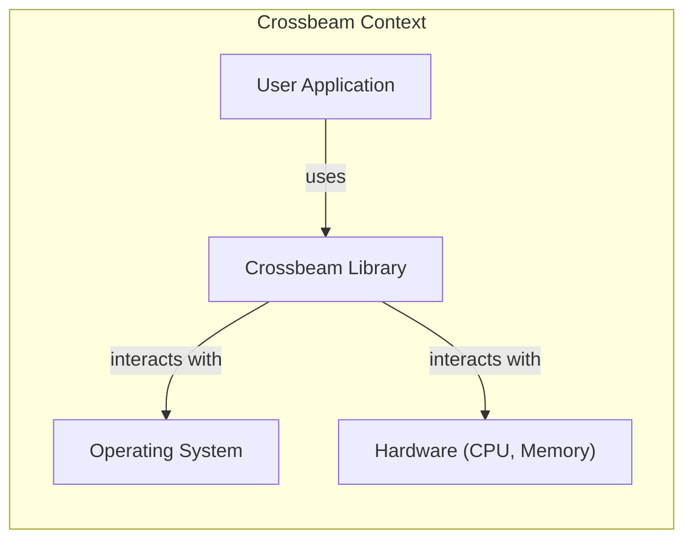
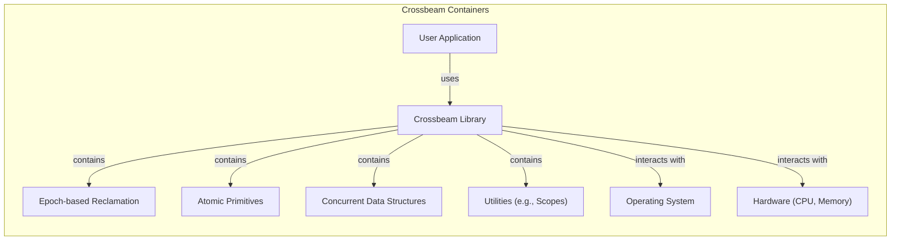
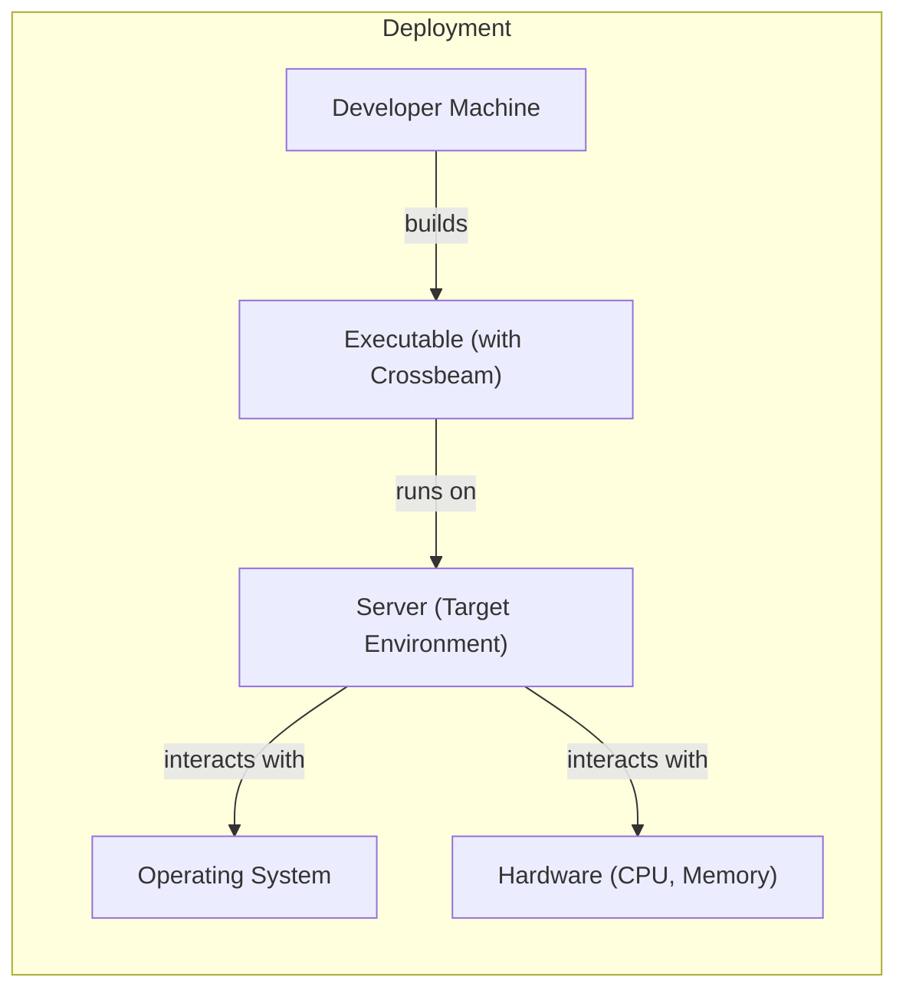
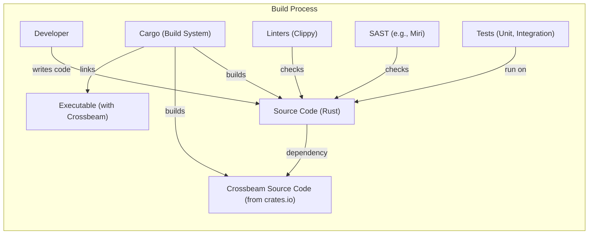

# Project Design Document: Crossbeam

## BUSINESS POSTURE

Crossbeam is a Rust library providing concurrency primitives, including data structures and utilities for lock-free and concurrent programming. It aims to improve the performance and safety of concurrent applications in Rust.

Priorities:

- Provide high-performance concurrency primitives.
- Ensure memory safety and data race freedom.
- Offer a user-friendly API for Rust developers.
- Maintain compatibility with the Rust ecosystem.

Goals:

- Enable efficient parallel processing in Rust applications.
- Reduce the risk of concurrency-related bugs.
- Become a standard library for concurrent programming in Rust.

Business Risks:

- security control: Data corruption or unexpected behavior due to concurrency bugs in Crossbeam itself.
- security control: Performance bottlenecks arising from inefficient implementations of concurrency primitives.
- security control: Compatibility issues with future versions of Rust or other libraries.
- security control: Lack of adoption by the Rust community, hindering its impact.

## SECURITY POSTURE

Existing Security Controls:

- security control: Extensive use of Rust's ownership and borrowing system to prevent data races at compile time. (Implemented throughout the codebase).
- security control: Use of `unsafe` code blocks, carefully audited and minimized, to implement low-level concurrency primitives. (Implemented in specific modules like `crossbeam-epoch` and `crossbeam-utils`).
- security control: Comprehensive test suite, including unit tests, integration tests, and stress tests, to verify the correctness and safety of the library. (Described in the `tests` directory and CI configuration).
- security control: Use of Miri, a Rust interpreter that can detect undefined behavior, including some concurrency bugs. (Mentioned in the documentation and CI configuration).
- security control: Adherence to Rust's secure coding guidelines and best practices. (Implicit in the codebase and development process).
- security control: Regular code reviews and community contributions to identify and address potential security vulnerabilities. (Implicit in the open-source nature of the project).
- security control: Documentation that clearly explains the safety guarantees and potential risks of using each primitive. (Available in the project's documentation).

Accepted Risks:

- accepted risk: Potential for deadlocks if users misuse the provided synchronization primitives. (Addressed through documentation and examples).
- accepted risk: Reliance on the correctness of the underlying hardware and operating system for memory ordering and synchronization. (Implicit assumption).
- accepted risk: The possibility of undiscovered bugs in `unsafe` code blocks, despite careful auditing. (Mitigated by extensive testing and community review).

Recommended Security Controls:

- security control: Formal verification of critical components, such as the epoch-based reclamation mechanism.
- security control: Fuzz testing to explore a wider range of inputs and execution paths.
- security control: Integration with static analysis tools to identify potential vulnerabilities.

Security Requirements:

- Authentication: Not applicable, as Crossbeam is a library, not a service or application.
- Authorization: Not applicable, as Crossbeam does not manage access control.
- Input Validation: Not directly applicable, as Crossbeam operates on memory locations and data provided by the user. However, the library should handle invalid memory addresses gracefully.
- Cryptography: Not directly applicable, as Crossbeam does not handle encryption or cryptographic operations. However, it could be used in conjunction with cryptographic libraries.

## DESIGN

### C4 CONTEXT

Element Descriptions:

- User Application:
    - Name: User Application
    - Type: External System
    - Description: A Rust application that utilizes Crossbeam for concurrent programming.
    - Responsibilities: Implements the application's logic and utilizes Crossbeam's primitives for parallel processing.
    - Security controls: Relies on Crossbeam's safety guarantees and Rust's memory safety features.

- Crossbeam Library:
    - Name: Crossbeam Library
    - Type: System
    - Description: The Crossbeam library, providing concurrency primitives for Rust.
    - Responsibilities: Provides data structures and utilities for lock-free and concurrent programming.
    - Security controls: Rust's ownership and borrowing, `unsafe` code blocks (audited), comprehensive testing, Miri, adherence to secure coding guidelines, code reviews, clear documentation.

- Operating System:
    - Name: Operating System
    - Type: External System
    - Description: The underlying operating system providing system calls and resources.
    - Responsibilities: Provides memory management, thread scheduling, and other system-level services.
    - Security controls: Relies on the OS's security mechanisms.

- Hardware:
    - Name: Hardware (CPU, Memory)
    - Type: External System
    - Description: The physical hardware on which the application runs.
    - Responsibilities: Executes instructions and provides memory for data storage.
    - Security controls: Relies on the hardware's security features (e.g., memory protection).

### C4 CONTAINER

Element Descriptions:

- Crossbeam Library:
    - Name: Crossbeam Library
    - Type: System
    - Description: The Crossbeam library, providing concurrency primitives for Rust.
    - Responsibilities: Provides data structures and utilities for lock-free and concurrent programming.
    - Security controls: Rust's ownership and borrowing, `unsafe` code blocks (audited), comprehensive testing, Miri, adherence to secure coding guidelines, code reviews, clear documentation.

- Epoch-based Reclamation:
    - Name: Epoch-based Reclamation
    - Type: Container
    - Description: A memory reclamation mechanism for lock-free data structures.
    - Responsibilities: Manages the safe deallocation of memory in a concurrent environment.
    - Security controls: Careful implementation using atomic operations and Rust's memory safety features.

- Atomic Primitives:
    - Name: Atomic Primitives
    - Type: Container
    - Description: Low-level atomic operations provided by Rust's standard library and extended by Crossbeam.
    - Responsibilities: Provides atomic operations like compare-and-swap, load, and store.
    - Security controls: Relies on the correctness of the underlying hardware and Rust's implementation.

- Concurrent Data Structures:
    - Name: Concurrent Data Structures
    - Type: Container
    - Description: Lock-free and concurrent data structures like queues, stacks, and deques.
    - Responsibilities: Provides thread-safe data structures for concurrent access.
    - Security controls: Implemented using atomic operations and epoch-based reclamation, rigorously tested.

- Utilities:
    - Name: Utilities (e.g., Scopes)
    - Type: Container
    - Description: Helper functions and utilities for concurrent programming, such as scoped threads.
    - Responsibilities: Simplifies common concurrent programming patterns.
    - Security controls: Designed to prevent common concurrency errors like data races and deadlocks.

- Operating System:
    - Name: Operating System
    - Type: External System
    - Description: The underlying operating system.
    - Responsibilities: Provides system calls and resources.
    - Security controls: Relies on the OS's security mechanisms.

- Hardware:
    - Name: Hardware (CPU, Memory)
    - Type: External System
    - Description: The physical hardware.
    - Responsibilities: Executes instructions and provides memory.
    - Security controls: Relies on the hardware's security features.

### DEPLOYMENT

Crossbeam is a library, so "deployment" in the traditional sense doesn't apply. It's integrated into other Rust projects as a dependency. However, we can describe how it's incorporated and used within a Rust application's deployment.

Possible Deployment Solutions:

1.  Statically linked library: The Crossbeam library code is compiled directly into the final executable. This is the standard and most common approach.
2.  Dynamically linked library (less common for Rust libraries): In theory, Crossbeam could be compiled as a dynamic library (.so, .dll, .dylib) and linked at runtime. This is less common for Rust libraries due to the benefits of static linking (performance, distribution simplicity).

Chosen Solution (Statically Linked):

Element Descriptions:

- Developer Machine:
    - Name: Developer Machine
    - Type: Node
    - Description: The machine where the Rust application is developed and built.
    - Responsibilities: Compiles the code, including Crossbeam, into an executable.
    - Security controls: Relies on the developer's machine security and secure development practices.

- Executable (with Crossbeam):
    - Name: Executable (with Crossbeam)
    - Type: Artifact
    - Description: The compiled Rust application, with Crossbeam statically linked.
    - Responsibilities: Runs the application's logic, utilizing Crossbeam for concurrency.
    - Security controls: Inherits Crossbeam's security controls and Rust's memory safety.

- Server (Target Environment):
    - Name: Server (Target Environment)
    - Type: Node
    - Description: The server or environment where the executable is deployed.
    - Responsibilities: Provides the runtime environment for the application.
    - Security controls: Relies on the server's security configuration and hardening.

- Operating System:
    - Name: Operating System
    - Type: Node
    - Description: The operating system on the server.
    - Responsibilities: Provides system calls and resources.
    - Security controls: Relies on the OS's security mechanisms.

- Hardware:
    - Name: Hardware (CPU, Memory)
    - Type: Node
    - Description: The physical hardware of the server.
    - Responsibilities: Executes instructions and provides memory.
    - Security controls: Relies on the hardware's security features.

### BUILD

The build process for a Rust application using Crossbeam typically involves Cargo, Rust's build system and package manager.

Build Process Description:

1.  Developer writes the application code, declaring Crossbeam as a dependency in `Cargo.toml`.
2.  Cargo fetches Crossbeam's source code from crates.io (Rust's package registry).
3.  Cargo compiles both the application code and Crossbeam's code.
4.  Cargo links the compiled code together, creating a single executable.
5.  During the build process, various checks are performed:
    -   Linters (like Clippy) analyze the code for potential style issues and bugs.
    -   SAST tools (like Miri) can be used to detect undefined behavior, including some concurrency bugs.
    -   Tests (unit and integration tests) are executed to verify the correctness of the code.

Security Controls in Build Process:

- security control: Dependency management through Cargo.toml, ensuring that specific versions of Crossbeam are used.
- security control: Use of crates.io, a trusted package registry for Rust libraries.
- security control: Code analysis with linters (Clippy) to identify potential issues.
- security control: Use of SAST tools (Miri) to detect undefined behavior.
- security control: Automated testing (unit, integration, and potentially stress tests) to verify correctness.
- security control: (Recommended) Use of `cargo-crev` or similar tools to verify the reputation and trustworthiness of dependencies.
- security control: (Recommended) Use of a CI/CD pipeline (e.g., GitHub Actions) to automate the build and testing process, ensuring consistent security checks.

## RISK ASSESSMENT

Critical Business Processes:

- Parallel processing of data: Crossbeam is used to enable efficient parallel processing, which is critical for performance-sensitive applications.
- Concurrent operations: Applications relying on Crossbeam for managing concurrent access to shared resources.

Data to Protect:

- Data processed by the application: The sensitivity of the data depends on the specific application using Crossbeam. Crossbeam itself doesn't handle data persistence or transmission, but it's crucial for ensuring the integrity of data accessed concurrently.
- Data Sensitivity: Varies depending on the application. Could range from non-sensitive to highly sensitive (e.g., financial data, personal information).

## QUESTIONS & ASSUMPTIONS

Questions:

- Are there any specific performance requirements or benchmarks that Crossbeam must meet?
- Are there any specific operating systems or hardware platforms that Crossbeam needs to be optimized for?
- What is the expected level of concurrency (number of threads/processes) that Crossbeam will be used with?
- Are there plans to integrate Crossbeam with other concurrency libraries or frameworks?

Assumptions:

- BUSINESS POSTURE: The primary goal is to provide safe and efficient concurrency primitives for Rust applications.
- BUSINESS POSTURE: Performance is a high priority, but safety is paramount.
- SECURITY POSTURE: Rust's built-in memory safety features provide a strong foundation for security.
- SECURITY POSTURE: Developers using Crossbeam are familiar with concurrent programming concepts and potential risks.
- DESIGN: Crossbeam will be primarily used as a statically linked library.
- DESIGN: The build process will rely on Cargo and standard Rust tooling.
- DESIGN: The target environment will be a typical server or desktop environment with a modern operating system.