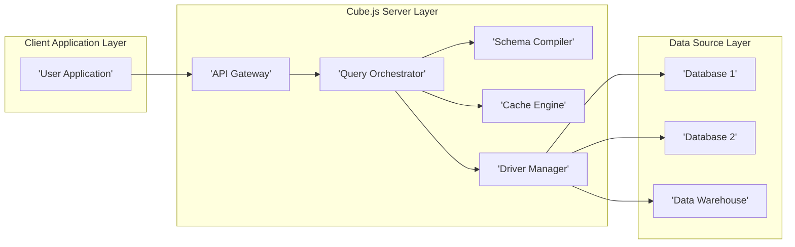

# Project Design Document: Cube.js Data Access Framework

**Version:** 1.1
**Date:** October 26, 2023
**Author:** AI Software Architect

## 1. Introduction

This document provides an enhanced design overview of the Cube.js data access framework, building upon the previous version. It offers a more detailed exploration of the system's architecture, key components, data flow, and security considerations, specifically tailored for threat modeling activities.

Cube.js serves as an open-source analytical API platform, acting as an intermediary between databases and applications. It introduces a semantic layer for streamlined data access and management. This revised design document aims to provide a more granular understanding of Cube.js internals, crucial for a comprehensive security assessment.

## 2. Goals

*   Present a refined and more detailed architectural overview of Cube.js.
*   Elaborate on the responsibilities and interactions of key components.
*   Provide a more granular description of the data flow within the system, including data transformations.
*   Highlight specific potential security threats and vulnerabilities for effective threat modeling.
*   Serve as an updated and more comprehensive reference for development, security analysis, and operational teams.

## 3. System Architecture

The Cube.js architecture is structured across three primary layers:

*   **Client Application Layer:**  Encompasses user-facing applications (e.g., analytical dashboards, custom reporting tools) that consume data via the Cube.js API.
*   **Cube.js Server Layer:** The central processing unit, responsible for query handling, schema management, caching, and data source interactions.
*   **Data Source Layer:** Represents the underlying data repositories, such as relational databases, data warehouses, and potentially other data stores.

### 3.1. High-Level Architecture Diagram

## 4. Key Components

This section provides a more in-depth look at the core components within the Cube.js architecture:

*   **API Gateway:**
    *   Serves as the single entry point for all external requests to the Cube.js server.
    *   Handles user authentication (verifying identity) and authorization (enforcing access permissions).
    *   Routes incoming API requests to the appropriate internal services based on the requested endpoint.
    *   May implement security policies such as rate limiting, request validation, and input sanitization.
    *   Often responsible for request logging and basic monitoring.
*   **Query Orchestrator:**
    *   Receives validated analytical queries from the API Gateway.
    *   Parses the query syntax and semantics to understand the data requirements.
    *   Interacts with the Schema Compiler to retrieve metadata about the data model (cubes, measures, dimensions, relationships).
    *   Optimizes query execution by determining the most efficient way to retrieve the data, considering caching possibilities.
    *   Delegates the actual data retrieval to the Driver Manager.
    *   May perform post-processing on the retrieved data before returning it.
*   **Schema Compiler:**
    *   Reads and compiles the Cube.js schema definitions, typically written in JavaScript or a similar language.
    *   Transforms these definitions into an internal representation that the Query Orchestrator can understand.
    *   Provides metadata about the available data elements, their types, and relationships between them.
    *   Plays a critical role in query validation, ensuring that requested data elements exist and are used correctly.
    *   May involve complex logic for data modeling and relationship management.
*   **Cache Engine:**
    *   Stores the results of previously executed queries to improve performance and reduce load on data sources.
    *   Supports various caching strategies (e.g., time-based expiration, invalidation based on data changes).
    *   May utilize different caching technologies (e.g., in-memory caches like Redis or Memcached).
    *   Manages cache invalidation to ensure data consistency.
    *   Needs to consider security implications of storing potentially sensitive data in the cache.
*   **Driver Manager:**
    *   Acts as an abstraction layer, providing a consistent interface for interacting with diverse data sources.
    *   Contains specific database drivers tailored for different database systems (e.g., PostgreSQL, MySQL, Snowflake, BigQuery).
    *   Translates the abstract queries from the Query Orchestrator into the specific SQL dialect or API calls required by the target data source.
    *   Handles connection management and potential connection pooling to optimize resource utilization.

## 5. Data Flow

A detailed breakdown of the data flow for a typical query within Cube.js:

1. A user application initiates an analytical query via an API call to the Cube.js **API Gateway**. This request typically includes authentication credentials.
2. The **API Gateway** authenticates the user or application, verifying their identity. It then authorizes the request, ensuring the user has the necessary permissions to access the requested data.
3. The **API Gateway** forwards the validated and authorized query to the **Query Orchestrator**.
4. The **Query Orchestrator** parses the query, extracting the requested measures, dimensions, and filters.
5. The **Query Orchestrator** consults the **Schema Compiler** to retrieve metadata about the requested data elements, validating their existence and relationships.
6. The **Query Orchestrator** checks the **Cache Engine** for a matching, valid cached result based on the query parameters.
    *   If a cache hit occurs, the **Cache Engine** returns the cached result directly to the **Query Orchestrator**, bypassing the data source.
    *   If no valid cache hit exists, the process proceeds to the data source interaction.
7. The **Query Orchestrator** selects the appropriate database driver from the **Driver Manager** based on the target data source.
8. The **Query Orchestrator** constructs a native query (e.g., SQL) specific to the data source, using the driver.
9. The **Driver Manager** establishes a connection to the data source using configured credentials.
10. The **Driver Manager** executes the generated query against the **Data Source**.
11. The **Data Source** processes the query and returns the raw data results to the **Driver Manager**.
12. The **Driver Manager** receives the raw data and passes it back to the **Query Orchestrator**.
13. The **Query Orchestrator** may perform data transformations or aggregations on the raw data.
14. The **Query Orchestrator** stores the query results in the **Cache Engine** according to the defined caching policies, potentially associating it with the query parameters for future retrieval.
15. The **Query Orchestrator** sends the processed results back to the **API Gateway**.
16. The **API Gateway** formats the results (e.g., JSON) and returns them to the originating user application.

## 6. Security Considerations

This section provides more specific security considerations for threat modeling:

*   **Authentication and Authorization Vulnerabilities:**
    *   **Broken Authentication:** Weak password policies, lack of multi-factor authentication, insecure session management.
    *   **Broken Authorization:** Privilege escalation vulnerabilities, insecure direct object references, lack of proper access controls on API endpoints.
    *   **API Key Management:** Storing API keys insecurely (e.g., in client-side code), lack of key rotation, overly permissive key scopes.
*   **Input Validation and Injection Attacks:**
    *   **SQL Injection:** Maliciously crafted queries injected through API parameters, potentially allowing unauthorized data access or modification.
    *   **NoSQL Injection:** Similar to SQL injection but targeting NoSQL databases.
    *   **Cross-Site Scripting (XSS):** If Cube.js exposes any user interface components, vulnerabilities could allow injection of malicious scripts.
    *   **Schema Poisoning:** Malicious actors with schema modification privileges could alter the data model to gain unauthorized access or disrupt operations.
*   **Data Security Risks:**
    *   **Data Breach in Transit:** Lack of HTTPS encryption for API communication, exposing sensitive data.
    *   **Data Breach at Rest (Cache):** Unencrypted cached data, making it vulnerable if the cache system is compromised.
    *   **Exposure of Database Credentials:** Storing database credentials insecurely in configuration files or environment variables.
    *   **Insufficient Data Masking/Redaction:** Exposing sensitive data to unauthorized users even with access controls.
*   **Denial of Service (DoS) Attacks:**
    *   **API Rate Limiting Bypass:** Vulnerabilities in rate limiting implementation allowing attackers to overwhelm the server.
    *   **Resource Exhaustion:** Maliciously crafted queries that consume excessive resources on the Cube.js server or the underlying data sources.
*   **Dependency Vulnerabilities:**
    *   Using outdated or vulnerable third-party libraries with known security flaws.
    *   Lack of proper dependency scanning and management.
*   **Logging and Monitoring Deficiencies:**
    *   Insufficient logging of security-related events, hindering incident detection and response.
    *   Lack of real-time monitoring and alerting for suspicious activity.
*   **Data Source Access Control Issues:**
    *   Cube.js server having overly broad access permissions to the underlying data sources.
    *   Using shared database credentials across multiple applications, increasing the impact of a compromise.
*   **Cache Poisoning Attacks:**
    *   Exploiting vulnerabilities to inject false or misleading data into the cache, leading to incorrect analytics and potentially impacting business decisions.

## 7. Deployment Considerations and Security Implications

The chosen deployment model significantly impacts the security landscape of Cube.js:

*   **Self-Hosted Deployments:**
    *   **Responsibility:** The organization is fully responsible for securing the infrastructure, including network security, server hardening, and access controls.
    *   **Considerations:** Requires robust security practices, including regular patching, firewall configurations, and intrusion detection systems. Vulnerabilities in the underlying operating system or containerization platform can be exploited.
*   **Cloud-Based Deployments (e.g., AWS, Azure, GCP):**
    *   **Shared Responsibility:** Security is a shared responsibility between the cloud provider and the organization. The provider secures the underlying infrastructure, while the organization is responsible for securing the Cube.js application and its configurations.
    *   **Considerations:** Leverage cloud-native security services (e.g., security groups, IAM roles, encryption services). Misconfigurations of cloud resources can lead to security breaches.
*   **Serverless Deployments:**
    *   **Provider Managed Security:** The cloud provider handles much of the underlying infrastructure security.
    *   **Considerations:** Focus on securing the function code and its dependencies. Pay close attention to IAM roles and permissions to control access to data sources and other cloud services. Cold starts and function timeouts can introduce unique security challenges.

## 8. Future Considerations

*   **Enhanced Fine-grained Access Control:** Implementing attribute-based access control (ABAC) or role-based access control (RBAC) for more granular control over data access.
*   **Advanced Data Masking and Redaction Capabilities:** Providing dynamic data masking and redaction based on user roles and data sensitivity.
*   **Comprehensive Audit Logging:** Implementing detailed audit logs for all data access and modification attempts, including user identity, timestamps, and affected data.
*   **Integration with Security Information and Event Management (SIEM) Systems:** Providing seamless integration with SIEM platforms for centralized security monitoring, alerting, and incident response.
*   **Regular Security Audits and Penetration Testing:** Conducting periodic security assessments to identify and address potential vulnerabilities.
*   **Secure Configuration Management:** Implementing secure practices for managing Cube.js configuration files and environment variables, avoiding hardcoding sensitive information.

This enhanced design document provides a more detailed and security-focused overview of the Cube.js architecture. It serves as a valuable resource for conducting thorough threat modeling exercises and implementing appropriate security measures. Continuous review and updates are essential to address evolving threats and maintain a strong security posture.
