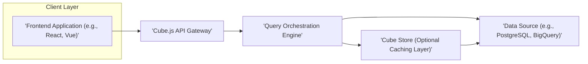
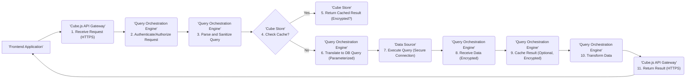

# Project Design Document: Cube.js

**Version:** 1.1
**Date:** October 26, 2023
**Author:** AI Software Architect

## 1. Introduction

This document provides a detailed architectural design for the Cube.js project, an open-source modular framework designed for building analytical web applications. Cube.js excels at providing a semantic layer over diverse data sources, enabling efficient and secure data fetching and manipulation for various frontend visualizations, business intelligence tools, and custom analytical applications. This document meticulously outlines the system's core components, their interactions, the flow of data, and typical deployment considerations. This detailed architectural understanding is paramount for subsequent threat modeling activities, allowing for a comprehensive assessment of potential security vulnerabilities.

## 2. Goals and Objectives

* **Provide a precise and comprehensive architectural overview of Cube.js.** This includes clearly identifying all key components, their specific responsibilities, and their interdependencies.
* **Illustrate the complete data flow within the Cube.js ecosystem, emphasizing security touchpoints.**  A thorough understanding of how data is processed, transformed, and transmitted is critical for identifying potential security risks.
* **Outline common and advanced deployment scenarios, highlighting security implications for each.** This helps in understanding the varying attack surfaces presented by different deployment environments.
* **Serve as a robust and detailed foundation for threat modeling exercises.** The granular level of detail within this design will enable the precise identification and analysis of potential vulnerabilities and associated risks.

## 3. High-Level Architecture

The following diagram illustrates the high-level architecture of a typical Cube.js deployment.

**Description of Components:**

* **Frontend Application:** This represents the user-facing interface where analytical queries are initiated and their results are visualized. It interacts with the Cube.js API Gateway to request data. Examples include custom-built React or Vue applications, or integrated business intelligence tools.
* **Cube.js API Gateway:** This component serves as the central entry point for all client requests targeting the Cube.js system. It is responsible for handling authentication, authorization, request validation, and routing validated queries to the Query Orchestration Engine.
* **Query Orchestration Engine:** This is the core processing unit of Cube.js. It receives validated queries, translates them into the appropriate query language for the underlying Data Source (e.g., SQL), manages the optional caching layer (Cube Store), orchestrates data retrieval, and performs necessary data transformations.
* **Cube Store (Optional Caching Layer):** This optional component provides a caching mechanism to enhance query performance and reduce the load on the Data Source. It stores frequently accessed or pre-aggregated data, serving it directly to the Query Orchestration Engine when available.
* **Data Source:** This represents the underlying database, data warehouse, or data lake where the raw data resides. Cube.js connects to this source to retrieve the necessary data for fulfilling analytical queries.

## 4. Component Details

This section provides a more detailed description of each component, outlining its key responsibilities, underlying technologies, and crucial security considerations.

### 4.1. Frontend Application

* **Responsibilities:**
    * Providing a user interface for constructing and executing analytical queries, often through visual tools or code.
    * Displaying query results in various formats, including charts, tables, and dashboards.
    * Managing user authentication and authorization, potentially delegating these tasks to the Cube.js API Gateway via secure tokens or sessions.
    * Communicating with the Cube.js API Gateway using standard web protocols like HTTP/HTTPS, often employing RESTful APIs or GraphQL.
* **Technology:** Typically built using modern JavaScript frameworks like React, Vue.js, or Angular. Can also be represented by established BI tools that integrate with Cube.js.
* **Security Considerations:**
    * **Input Validation:** Rigorous validation of user inputs to prevent client-side injection attacks (e.g., cross-site scripting).
    * **Secure Storage:** Secure handling and storage of any API keys, tokens, or session information used to authenticate with the API Gateway. Avoid storing sensitive information directly in client-side code.
    * **Secure Communication:** Ensuring all communication with the API Gateway occurs over HTTPS to protect data in transit.
    * **Content Security Policy (CSP):** Implementing a strong CSP to mitigate the risk of XSS attacks.
    * **Regular Security Audits:** Periodic security reviews and penetration testing of the frontend application.

### 4.2. Cube.js API Gateway

* **Responsibilities:**
    * **Request Reception and Validation:** Receiving and validating all incoming API requests from frontend applications, ensuring they conform to expected formats and schemas.
    * **Authentication:** Verifying the identity of the requesting user or application, often through mechanisms like JWT (JSON Web Tokens), API keys, or OAuth 2.0.
    * **Authorization:** Enforcing access control policies to determine if the authenticated user or application has the necessary permissions to execute the requested query or access specific data.
    * **Rate Limiting and Throttling:** Implementing mechanisms to prevent abuse and denial-of-service attacks by limiting the number of requests from a single source within a given timeframe.
    * **Query Parsing and Sanitization:** Parsing and sanitizing incoming queries to prevent injection attacks and ensure they are well-formed.
    * **Request Routing:** Directing validated and authorized queries to the appropriate instance of the Query Orchestration Engine.
    * **Response Handling:** Receiving query results from the Query Orchestration Engine and formatting them for delivery back to the client.
    * **Logging and Monitoring:** Logging all API requests, authentication attempts, and errors for auditing and security monitoring purposes.
* **Technology:** Commonly implemented using Node.js with frameworks like Express.js or NestJS. May also leverage API gateway services provided by cloud providers.
* **Security Considerations:**
    * **Strong Authentication Mechanisms:** Implementing robust authentication methods and enforcing strong password policies where applicable.
    * **Fine-Grained Authorization:** Defining and enforcing granular authorization policies based on roles, permissions, and data access controls.
    * **Protection Against Web Attacks:** Implementing security measures to prevent common web application vulnerabilities such as CSRF (Cross-Site Request Forgery), XSS (Cross-Site Scripting), and injection attacks.
    * **Secure Secret Management:** Securely storing and managing API keys, secrets, and database credentials, potentially using dedicated secret management services.
    * **Input Sanitization:** Thoroughly sanitizing all incoming request data to prevent injection vulnerabilities.
    * **Regular Security Updates:** Keeping the API Gateway software and its dependencies up-to-date with the latest security patches.

### 4.3. Query Orchestration Engine

* **Responsibilities:**
    * **Query Reception and Validation:** Receiving validated queries from the API Gateway and performing further validation.
    * **Query Translation:** Translating abstract, Cube.js-specific queries into the native query language of the underlying Data Source (e.g., SQL for relational databases, specific query syntax for data warehouses).
    * **Query Optimization and Planning:** Optimizing the translated queries for efficient execution on the Data Source, potentially leveraging query planning techniques.
    * **Cache Management:** Interacting with the Cube Store (if enabled) to check for cached results and store new results.
    * **Data Source Connection Management:** Establishing and managing secure connections to the Data Source using provided credentials.
    * **Query Execution:** Executing the translated queries against the Data Source.
    * **Data Transformation and Aggregation:** Performing necessary data transformations, aggregations, and calculations as defined in the query.
    * **Result Formatting:** Formatting the retrieved and transformed data into a standardized response format for the API Gateway.
    * **Resource Management:** Managing resources effectively to prevent denial-of-service or performance degradation.
* **Technology:** Primarily implemented in Node.js.
* **Security Considerations:**
    * **Secure Data Source Connections:** Establishing secure and encrypted connections to the Data Source (e.g., using TLS/SSL).
    * **Parameterized Queries:** Utilizing parameterized queries or prepared statements to prevent SQL injection attacks.
    * **Secure Credential Handling:** Securely managing and storing database credentials, avoiding hardcoding them in the application.
    * **Data Model Access Control:** Implementing access controls to restrict which users or roles can access specific data models and cubes.
    * **Resource Limits:** Implementing resource limits (e.g., query execution time, memory usage) to prevent malicious or poorly written queries from impacting system performance.
    * **Code Review and Security Testing:** Regularly reviewing the codebase and performing security testing to identify potential vulnerabilities.

### 4.4. Cube Store (Optional Caching Layer)

* **Responsibilities:**
    * **Data Storage:** Storing pre-aggregated or frequently accessed query results in a fast and accessible manner.
    * **Cache Retrieval:** Efficiently retrieving cached results when requested by the Query Orchestration Engine.
    * **Cache Invalidation:** Implementing mechanisms for invalidating and updating cached data based on predefined policies or events (e.g., data updates in the Data Source).
    * **Cache Management:** Managing the lifecycle of cached data, including eviction policies and storage optimization.
* **Technology:** Can utilize various in-memory data stores or caching services such as Redis, Memcached, or cloud-managed caching solutions (e.g., AWS ElastiCache, Google Cloud Memorystore).
* **Security Considerations:**
    * **Access Control:** Implementing strict access controls to the cache store to prevent unauthorized access or modification of cached data.
    * **Data Encryption:** Encrypting cached data both at rest and in transit to protect sensitive information.
    * **Protection Against Cache Poisoning:** Implementing measures to prevent attackers from injecting malicious data into the cache.
    * **Secure Configuration:** Properly configuring the caching infrastructure according to security best practices.
    * **Network Segmentation:** Isolating the cache store within a secure network segment.

### 4.5. Data Source

* **Responsibilities:**
    * **Data Storage and Management:** Persistently storing and managing the raw data.
    * **Query Processing:** Receiving and processing queries from the Query Orchestration Engine.
    * **Data Retrieval:** Retrieving the requested data and returning it to the Query Orchestration Engine.
    * **Data Integrity and Consistency:** Ensuring the integrity and consistency of the stored data.
* **Technology:**  A wide range of database systems, data warehouses, and data lakes, including PostgreSQL, MySQL, BigQuery, Snowflake, Amazon Redshift, etc.
* **Security Considerations:**
    * **Strong Authentication and Authorization:** Implementing robust authentication and authorization mechanisms to control access to the data.
    * **Data Encryption:** Encrypting data at rest and in transit to protect confidentiality.
    * **Network Security:** Implementing network security measures (e.g., firewalls, network segmentation) to restrict access to the database server.
    * **Regular Security Patching:** Applying regular security patches and updates to the database software.
    * **Auditing:** Enabling auditing of database access and modifications to track activity and detect potential security breaches.
    * **Data Loss Prevention (DLP):** Implementing measures to prevent sensitive data from leaving the organization's control.

## 5. Data Flow

The following diagram illustrates the typical data flow for a query request within the Cube.js ecosystem, highlighting key security considerations at each step.

**Detailed Steps with Security Highlights:**

1. **Receive Request (HTTPS):** The Frontend Application sends a query request to the Cube.js API Gateway over a secure HTTPS connection, ensuring data in transit is encrypted.
2. **Authenticate/Authorize Request:** The API Gateway authenticates the user or application and authorizes the request based on predefined policies, preventing unauthorized access.
3. **Parse and Sanitize Query:** The Query Orchestration Engine parses and sanitizes the incoming query to prevent injection attacks and ensure its validity.
4. **Check Cache?:** The Query Orchestration Engine checks if the result for the query exists in the Cube Store.
5. **Return Cached Result (Encrypted?):** If the result is found in the cache, it is returned to the API Gateway. The connection to the Cube Store and the data stored within should ideally be encrypted.
6. **Translate to DB Query (Parameterized):** If the result is not in the cache, the Query Orchestration Engine translates the abstract query into a database-specific query, using parameterized queries to prevent SQL injection.
7. **Execute Query (Secure Connection):** The Query Orchestration Engine sends the translated query to the Data Source over a secure and encrypted connection.
8. **Receive Data (Encrypted):** The Data Source executes the query and returns the raw data to the Query Orchestration Engine over the secure connection.
9. **Cache Result (Optional, Encrypted):** The Query Orchestration Engine may cache the result in the Cube Store. The data stored in the cache should be encrypted.
10. **Transform Data:** The Query Orchestration Engine transforms and aggregates the raw data as needed.
11. **Return Result (HTTPS):** The Query Orchestration Engine sends the processed result back to the API Gateway.
12. **Return Result (HTTPS):** The API Gateway sends the result back to the Frontend Application over a secure HTTPS connection.

## 6. Deployment Architecture

Cube.js offers flexibility in deployment. Understanding the security implications of each scenario is crucial.

* **Cloud-Based Deployment:**
    * **Components:** Frontend Application (e.g., deployed on serverless platforms like Vercel or Netlify, or cloud storage like AWS S3), Cube.js API Gateway and Query Orchestration Engine (e.g., containerized on Kubernetes services like AWS EKS, Google GKE, Azure AKS, or serverless functions like AWS Lambda or Google Cloud Functions), Cube Store (e.g., managed caching services like AWS ElastiCache for Redis, Google Cloud Memorystore, Azure Cache for Redis), Data Source (e.g., cloud-managed databases like AWS RDS, Google Cloud SQL, Azure SQL Database, or data warehouses like Snowflake, BigQuery, AWS Redshift).
    * **Security Considerations:** Leveraging cloud provider security features (e.g., IAM for access control, VPCs for network isolation, security groups for firewall rules), ensuring secure configuration of cloud services, implementing encryption at rest and in transit for all components, regularly auditing cloud configurations, and adhering to cloud security best practices.
* **On-Premise Deployment:**
    * **Components:** Frontend Application (deployed on internal web servers), Cube.js API Gateway and Query Orchestration Engine (deployed on physical or virtual machines within the organization's network), Cube Store (deployed on internal servers), Data Source (on-premise database systems).
    * **Security Considerations:** Implementing robust network security measures (e.g., firewalls, intrusion detection/prevention systems), ensuring physical security of servers, implementing strong access controls and authentication mechanisms for all components, regularly patching and updating software, and establishing comprehensive logging and monitoring.
* **Hybrid Deployment:**
    * A combination of cloud and on-premise components, often with the Data Source residing on-premise for compliance or data sovereignty reasons, while Cube.js components are in the cloud.
    * **Security Considerations:** Establishing secure and encrypted connections between on-premise and cloud environments (e.g., VPN, Direct Connect), carefully managing network segmentation and access control across environments, addressing potential latency and bandwidth limitations, and ensuring consistent security policies across the hybrid infrastructure.

## 7. Assumptions and Constraints

* **Secure Development Lifecycle:** It is assumed that Cube.js itself and any custom extensions are developed following a secure development lifecycle, incorporating security considerations throughout the development process.
* **Secure Infrastructure Configuration:** It is assumed that all infrastructure components (servers, networks, cloud services) are configured securely according to best practices and security guidelines.
* **Regular Security Audits and Penetration Testing:** It is assumed that regular security audits and penetration testing are conducted on the Cube.js deployment to identify and address potential vulnerabilities.
* **Up-to-Date Dependencies:** It is assumed that all dependencies and libraries used by Cube.js and its components are kept up-to-date with the latest security patches.
* **This document provides a general architectural overview.** Specific implementation details, configurations, and security measures may vary depending on the specific deployment environment, data sensitivity, and organizational security policies.

This enhanced design document provides a more granular and security-focused perspective on the Cube.js architecture. This level of detail is essential for effective threat modeling, enabling security professionals to identify potential attack vectors and vulnerabilities across the entire system.