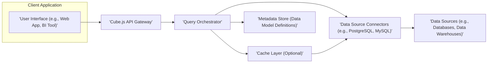
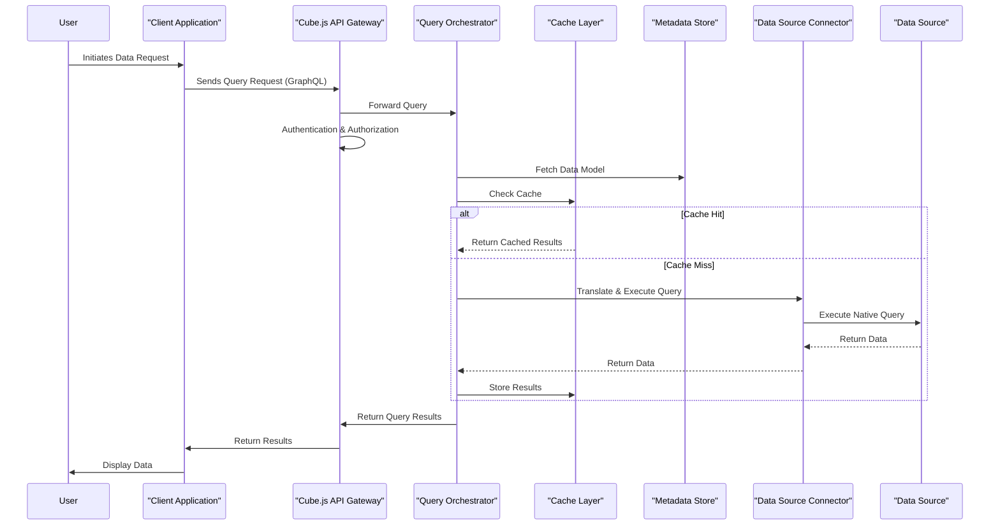

# Project Design Document: Cube.js

**Version:** 1.1
**Date:** October 26, 2023
**Author:** AI Software Architect

## 1. Introduction

This document provides a detailed architectural design for the Cube.js project (as found on GitHub: https://github.com/cube-js/cube). This document aims to clearly outline the system's components, their interactions, data flow, and deployment considerations. It will serve as a robust foundation for subsequent threat modeling activities by providing a comprehensive understanding of the system's architecture and potential attack surfaces.

## 2. Goals and Non-Goals

**Goals:**

*   Clearly define the major components of the Cube.js architecture and their responsibilities.
*   Describe the interactions and data flow between these components in detail.
*   Outline different deployment options for Cube.js and their architectural implications.
*   Identify key technologies, dependencies, and communication protocols.
*   Provide a well-defined basis for understanding the system's attack surface and potential vulnerabilities.

**Non-Goals:**

*   Provide a detailed implementation guide or code-level specifics.
*   Cover every single configuration option or edge case.
*   Perform a security assessment or threat model within this document (that will be a separate, focused activity).
*   Describe the internal workings of specific database connectors beyond their core function within the Cube.js ecosystem.

## 3. High-Level Architecture

Cube.js acts as a semantic layer and API gateway for analytics data. It sits between data sources and client applications, providing a unified and performant way to access and query data.

**Key Actors:**

*   **User:** The individual interacting with the analytics through the Client Application.
*   **Client Application:** The software application (e.g., a dashboard, a BI tool, a custom application) that consumes data exposed by Cube.js.

**Key Components:**

*   **Cube.js API Gateway:** The primary entry point for all client requests. It handles authentication, authorization, request routing, and potentially rate limiting.
*   **Query Orchestrator:** The central processing unit of Cube.js. It receives queries, interacts with the Metadata Store to understand the data model, optimizes query execution, coordinates data retrieval from Data Source Connectors, and manages the Cache Layer.
*   **Data Source Connectors:**  Pluggable modules responsible for establishing connections to and querying specific types of Data Sources. They translate Cube.js's abstract queries into the native query language of the underlying data store.
*   **Data Sources:** The underlying databases, data warehouses, or other data storage systems where the raw data resides.
*   **Cache Layer (Optional):** An optional component that stores the results of frequently executed queries to improve performance and reduce load on Data Sources.
*   **Metadata Store (Data Model Definitions):**  Stores the semantic data model defined by users, including definitions of cubes, measures, dimensions, joins, and pre-aggregations.

## 4. Detailed Component Description

### 4.1. Cube.js API Gateway

*   **Functionality:**
    *   Receives and processes API requests from Client Applications, typically using GraphQL.
    *   Authenticates and authorizes incoming requests, ensuring only authorized users can access specific data.
    *   Routes validated requests to the Query Orchestrator.
    *   May implement security policies such as rate limiting, request filtering, and input sanitization.
    *   Handles API versioning and potentially API key management.
*   **Technology:** Commonly built using Node.js with frameworks like Express.js or Koa.js, leveraging libraries for GraphQL implementation.
*   **Security Considerations:** A critical component for securing access to the data. Vulnerabilities here can expose the entire system. Consider risks related to authentication bypass, authorization flaws, and injection attacks.

### 4.2. Query Orchestrator

*   **Functionality:**
    *   Parses and validates incoming queries against the defined data model.
    *   Interacts with the Metadata Store to retrieve data model definitions and understand relationships between data elements.
    *   Optimizes query execution plans, considering pre-aggregations and caching strategies.
    *   Delegates data retrieval tasks to the appropriate Data Source Connectors.
    *   Manages the interaction with the Cache Layer, checking for cached results and storing new results.
    *   Aggregates, transforms, and combines data retrieved from various sources before returning it to the API Gateway.
*   **Technology:** Primarily implemented in Node.js.
*   **Security Considerations:** Responsible for enforcing data access policies defined in the data model. Consider risks related to query injection, logical flaws in query planning, and unauthorized access to underlying data sources.

### 4.3. Data Source Connectors

*   **Functionality:**
    *   Establish and manage connections to specific Data Sources using appropriate drivers and connection parameters.
    *   Translate Cube.js's abstract query representation into the native query language of the connected Data Source (e.g., SQL for relational databases, specific API calls for other data stores).
    *   Execute queries against the Data Source and retrieve the results.
    *   Handle data type conversions and potential data transformations required by Cube.js.
*   **Examples:** Connectors for PostgreSQL, MySQL, Snowflake, BigQuery, MongoDB, and various other data sources.
*   **Technology:** Varies depending on the Data Source. Often involves database-specific client libraries and SDKs.
*   **Security Considerations:** Secure storage and handling of database credentials are paramount. Vulnerabilities in connectors could lead to data breaches or unauthorized data manipulation. Consider risks related to credential leakage, injection vulnerabilities in query translation, and insecure communication protocols.

### 4.4. Data Sources

*   **Functionality:** Store and manage the raw data that Cube.js queries.
*   **Examples:** Relational databases (PostgreSQL, MySQL), data warehouses (Snowflake, BigQuery), NoSQL databases, SaaS platforms with APIs.
*   **Security Considerations:** Security of the Data Sources themselves is crucial and often outside the direct control of Cube.js. However, Cube.js's interaction with them needs to be secure, respecting the security policies and access controls of the Data Sources.

### 4.5. Cache Layer (Optional)

*   **Functionality:** Stores the results of frequently executed queries to improve performance and reduce load on Data Sources. Improves response times for repeated queries.
*   **Examples:** Redis, Memcached, or in-memory caching mechanisms.
*   **Security Considerations:** Sensitive data may be stored in the cache. Secure configuration, access control, and potential encryption of cached data are necessary. Consider risks related to unauthorized access to cached data and cache poisoning.

### 4.6. Metadata Store (Data Model Definitions)

*   **Functionality:** Stores the semantic data model defined by users. This includes definitions of cubes, measures, dimensions, relationships (joins), pre-aggregations, and potentially access control rules.
*   **Technology:** Can be a file system (for simpler setups), a relational database, or a dedicated configuration store.
*   **Security Considerations:** Protecting the integrity and confidentiality of the data model is important, as it dictates how data is accessed and interpreted. Unauthorized modifications to the metadata can lead to incorrect data being served or security bypasses. Consider risks related to unauthorized modification of the data model and exposure of sensitive metadata.

## 5. Data Flow

The typical data flow for a query in Cube.js involves the following steps:

1. The **User** initiates a data request through the **Client Application**.
2. The **Client Application** constructs and sends a query request (typically GraphQL) to the **Cube.js API Gateway**.
3. The **API Gateway** authenticates and authorizes the incoming request, verifying the user's identity and permissions.
4. The **API Gateway** routes the validated query to the **Query Orchestrator**.
5. The **Query Orchestrator** parses the query and consults the **Metadata Store** to understand the data model, including available cubes, measures, and dimensions.
6. The **Query Orchestrator** checks the **Cache Layer** to see if the results for the query are already available and valid.
    *   **Cache Hit:** If the results are found and considered fresh, the **Cache Layer** returns the cached results to the **Query Orchestrator**.
    *   **Cache Miss:** If the results are not found or are expired, the process continues to fetch data from the Data Sources.
7. The **Query Orchestrator** identifies the necessary **Data Source(s)** based on the query and the data model.
8. The **Query Orchestrator** utilizes the appropriate **Data Source Connector(s)** to translate the abstract query into the native query language of the target **Data Source(s)**.
9. The **Data Source Connector(s)** execute the translated query against the **Data Source(s)**.
10. The **Data Source(s)** return the requested data to the corresponding **Data Source Connector(s)**.
11. The **Data Source Connector(s)** pass the retrieved data back to the **Query Orchestrator**.
12. The **Query Orchestrator** may perform further aggregation, transformation, or combination of data received from different sources.
13. If configured, the **Query Orchestrator** stores the query results in the **Cache Layer** for future requests.
14. The **Query Orchestrator** sends the processed query results back to the **API Gateway**.
15. The **API Gateway** formats the results and returns them to the **Client Application**.
16. The **Client Application** presents the data to the **User**.

## 6. Deployment Options

Cube.js offers flexibility in deployment, each with distinct security and operational considerations:

*   **Self-Hosted:**
    *   Cube.js components are deployed and managed on your own infrastructure (e.g., virtual machines, containers, on-premise servers).
    *   Provides maximum control over the environment and security configurations.
    *   Requires managing all aspects of the infrastructure, including security, scaling, and maintenance.
    *   All components (API Gateway, Query Orchestrator, potentially Cache Layer) are deployed and managed by the user.
*   **Cube Cloud:**
    *   A fully managed cloud offering provided by the creators of Cube.js.
    *   Offloads infrastructure management, scaling, and maintenance to the cloud provider.
    *   Security responsibilities are shared between the user and the cloud provider (shared responsibility model).
    *   The underlying infrastructure and component deployment details are managed by the Cube Cloud service. Users typically interact with configuration and data model definitions.
*   **Hybrid:**
    *   Combines self-hosted and cloud components. For example, self-hosting the core Cube.js API within a private network while connecting to cloud-based Data Sources.
    *   Allows for tailored deployments based on specific security, compliance, or performance requirements.

## 7. Key Technologies and Dependencies

*   **Core Language:** Primarily Node.js.
*   **API Interface:** GraphQL.
*   **Data Source Connectivity:** Utilizes various database drivers and SDKs specific to each supported Data Source (e.g., `pg` for PostgreSQL, `mysql2` for MySQL, official SDKs for cloud data warehouses).
*   **Caching (Optional):**  Integration with caching systems like Redis, Memcached, or in-memory caching libraries.
*   **Build and Package Management:** Typically `npm` or `yarn`.
*   **Containerization (Optional):** Docker for containerizing Cube.js components for easier deployment and management.
*   **Orchestration (Optional):** Kubernetes for managing and scaling containerized deployments, especially in self-hosted environments.
*   **Authentication/Authorization:**  May leverage libraries like Passport.js or custom implementations for handling user authentication and authorization.

## 8. Security Considerations (Detailed)

This section expands on the preliminary security considerations, providing more specific examples relevant for threat modeling.

*   **Authentication and Authorization:**
    *   **Threats:** Brute-force attacks, credential stuffing, session hijacking, privilege escalation, unauthorized access to data.
    *   **Considerations:** Strength of authentication mechanisms (passwords, API keys, OAuth), secure session management, role-based access control (RBAC) implementation, protection of API keys.
*   **Data Source Credentials Management:**
    *   **Threats:** Exposure of database credentials leading to unauthorized data access or modification.
    *   **Considerations:** Secure storage of credentials (e.g., using environment variables, secrets management systems), encryption of credentials at rest, least privilege principle for database access.
*   **Input Validation:**
    *   **Threats:** SQL injection, GraphQL injection, cross-site scripting (XSS) if user-provided data is rendered in client applications without proper sanitization.
    *   **Considerations:**  Strict input validation on the API Gateway and within the Query Orchestrator, parameterized queries for database interactions, sanitization of user-generated content.
*   **Data Encryption:**
    *   **Threats:** Data breaches if data is intercepted in transit or accessed from storage without encryption.
    *   **Considerations:**  Enforcing HTTPS for all communication, encryption at rest for sensitive data in Data Sources and the Cache Layer, considering encryption of the Metadata Store.
*   **Rate Limiting:**
    *   **Threats:** Denial-of-service (DoS) attacks by overwhelming the API with requests.
    *   **Considerations:** Implementing rate limiting on the API Gateway to restrict the number of requests from a single source within a given timeframe.
*   **Dependency Management:**
    *   **Threats:** Exploiting known vulnerabilities in third-party libraries and dependencies.
    *   **Considerations:** Regularly scanning dependencies for vulnerabilities, keeping dependencies up-to-date, using software composition analysis (SCA) tools.
*   **Logging and Monitoring:**
    *   **Threats:** Difficulty in detecting and responding to security incidents without adequate logging.
    *   **Considerations:** Comprehensive logging of API requests, authentication attempts, query execution, and errors. Implementing monitoring and alerting for suspicious activity.
*   **Secure Configuration:**
    *   **Threats:** Misconfigurations leading to security vulnerabilities (e.g., default passwords, open ports).
    *   **Considerations:** Following security best practices for configuring all components, disabling unnecessary features, regularly reviewing configurations.
*   **Metadata Store Security:**
    *   **Threats:** Unauthorized modification or access to the data model leading to incorrect data or security bypasses.
    *   **Considerations:** Access control mechanisms for the Metadata Store, integrity checks to prevent tampering.
*   **Cache Layer Security:**
    *   **Threats:** Unauthorized access to cached data, cache poisoning.
    *   **Considerations:** Secure access controls for the Cache Layer, potentially encrypting cached data, implementing cache invalidation strategies.

## 9. Future Considerations

*   **Fine-grained Access Control:** Implementing more granular control over data access based on user attributes, data sensitivity, or other criteria.
*   **Data Masking and Anonymization:** Providing built-in mechanisms to mask or anonymize sensitive data before it is returned to client applications.
*   **Audit Logging:**  Detailed logging of data access, modifications, and administrative actions for compliance and security auditing purposes.
*   **Enhanced Security Integrations:**  Providing easier integration with security tools and services for vulnerability scanning, threat detection, and security information and event management (SIEM).

This improved design document provides a more detailed and security-focused overview of the Cube.js architecture. The enhanced component descriptions, data flow diagrams, and detailed security considerations will be valuable for conducting a thorough threat modeling exercise.