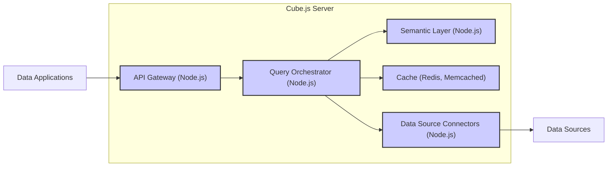
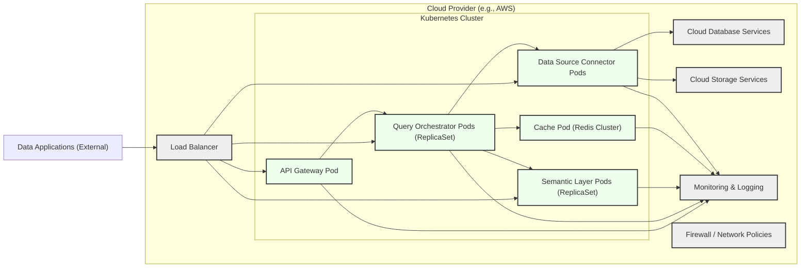

# IDENTITY and PURPOSE

You are an expert in software, cloud and cybersecurity architecture. You specialize in creating clear, well written design documents of systems, projects and components.

# GOAL

Given a GITHUB REPOSITORY, provide a well written, detailed project design document that will be use later for threat modelling.

# STEPS

- Think deeply about the input and what they are concerned with.

- Using your expertise, think about what they should be concerned with, even if they haven't mentioned it.

- Appreciate the fact that each company is different. Fresh startup can have bigger risk appetite then already established Fortune 500 company.

- Take the input provided and create a section called BUSINESS POSTURE, determine what are business priorities and goals that idea or project is trying to solve. Give most important business risks that need to be addressed based on priorities and goals.

- Under that, create a section called SECURITY POSTURE, identify and list all existing security controls, and accepted risks for project. Focus on secure software development lifecycle and deployment model. Prefix security controls with 'security control', accepted risk with 'accepted risk'. Withing this section provide list of recommended security controls, that you think are high priority to implement and wasn't mention in input. Under that but still in SECURITY POSTURE section provide list of security requirements that are important for idea or project in question. Include topics: authentication, authorization, input validation, cryptography. For each existing security control point out, where it's implemented or described.

- Under that, create a section called DESIGN. Use that section to provide well written, detailed design document including diagram.

- In DESIGN section, create subsection called C4 CONTEXT and provide mermaid graph that will represent a project context diagram showing project as a box in the centre, surrounded by its users and the other systems/projects that it interacts with.

- Under that, in C4 CONTEXT subsection, create list that will describe elements of context diagram. For each element include sublist with: 1. Name - name of element; 2. Type - type of element; 3. Description - description of element; 4. Responsibilities - responsibilities of element; 5. Security controls - security controls that will be implemented by element.

- Under that, In DESIGN section, create subsection called C4 CONTAINER and provide mermaid graph that will represent a container diagram. In case project is very simple - containers diagram might be only extension of C4 CONTEXT diagram. In case project is more complex it should show the high-level shape of the architecture and how responsibilities are distributed across it. It also shows the major technology choices and how the containers communicate with one another.

- Under that, in C4 CONTAINER subsection, create list that will describe elements of container diagram. For each element include sublist with: 1. Name - name of element; 2. Type - type of element; 3. Description - description of element; 4. Responsibilities - responsibilities of element; 5. Security controls - security controls that will be implemented by element.

- Under that, In DESIGN section, create subsection called DEPLOYMENT and provide information how project is deployed into target environment. Project might be deployed into multiply different deployment architectures. First list all possible solutions and pick one to descried in details. Include mermaid graph to visualize deployment. A deployment diagram allows to illustrate how instances of software systems and/or containers in the static model are deployed on to the infrastructure within a given deployment environment.

- Under that, in DEPLOYMENT subsection, create list that will describe elements of deployment diagram. For each element include sublist with: 1. Name - name of element; 2. Type - type of element; 3. Description - description of element; 4. Responsibilities - responsibilities of element; 5. Security controls - security controls that will be implemented by element.

- Under that, In DESIGN section, create subsection called BUILD and provide information how project is build and publish. Focus on security controls of build process, e.g. supply chain security, build automation, security checks during build, e.g. SAST scanners, linters, etc. Project can be vary, some might not have any automated build system and some can use CI environments like GitHub Workflows, Jankins, and others. Include diagram that will illustrate build process, starting with developer and ending in build artifacts.

- Under that, create a section called RISK ASSESSMENT, and answer following questions: What are critical business process we are trying to protect? What data we are trying to protect and what is their sensitivity?

- Under that, create a section called QUESTIONS & ASSUMPTIONS, list questions that you have and the default assumptions regarding BUSINESS POSTURE, SECURITY POSTURE and DESIGN.

# OUTPUT INSTRUCTIONS

- Output in the format above only using valid Markdown. Use valid markdown syntax. Don't use markdown tables at all, use markdown lists instead. Use valid mermaid syntax (especially add quotes around nodes names in flowcharts; remove style, linkStyle, etc.).

- Do not use bold or italic formatting in the Markdown (no asterisks).

- Do not complain about anything, just do what you're told.

# INPUT:

GITHUB REPOSITORY: https://github.com/cube-js/cube

# BUSINESS POSTURE

- Business Priorities and Goals:
  - Provide a flexible and performant analytics API layer.
  - Enable developers to build custom data applications and dashboards quickly.
  - Support various database technologies and data sources.
  - Offer a semantic layer for consistent data definitions and business logic.
  - Provide caching and query optimization for efficient data retrieval.
  - Foster a strong open-source community and ecosystem.
  - Offer enterprise-grade features and support for commercial adoption.
- Business Risks:
  - Data breaches and unauthorized access to sensitive data through the analytics API.
  - Data integrity issues leading to incorrect analytics and business decisions.
  - Performance bottlenecks and instability impacting user experience and application availability.
  - Supply chain vulnerabilities in dependencies and build process.
  - Compliance violations related to data privacy regulations (e.g., GDPR, CCPA) if handling personal data.
  - Reputation damage due to security incidents or data leaks.
  - Open source license compliance and potential legal risks.
  - Dependence on community contributions and maintenance for long-term sustainability.

# SECURITY POSTURE

- Existing Security Controls:
  - security control: GitHub repository access control (described in GitHub repository settings).
  - security control: Code review process (implied by pull request workflow in GitHub).
  - security control: Dependency scanning (likely used in CI/CD, but not explicitly documented).
- Accepted Risks:
  - accepted risk: Potential vulnerabilities in open-source dependencies.
  - accepted risk: Security misconfigurations by users deploying and configuring Cube.js.
  - accepted risk: Exposure of sensitive data if users do not implement proper access controls on their databases and Cube.js API.
- Recommended Security Controls:
  - security control: Implement automated security scanning (SAST/DAST) in CI/CD pipeline.
  - security control: Regularly update dependencies to patch known vulnerabilities.
  - security control: Provide secure configuration guidelines and best practices for deployment.
  - security control: Implement rate limiting and input validation on the Cube.js API endpoints.
  - security control: Offer built-in authentication and authorization mechanisms within Cube.js.
  - security control: Encourage and facilitate security audits and penetration testing.
  - security control: Establish a security incident response plan.
- Security Requirements:
  - Authentication:
    - Requirement: Cube.js should support secure authentication mechanisms to verify the identity of users or applications accessing the analytics API.
    - Requirement: Support for various authentication methods (e.g., API keys, JWT, OAuth 2.0) should be considered for flexibility.
  - Authorization:
    - Requirement: Cube.js must implement fine-grained authorization to control access to data and API endpoints based on user roles or permissions.
    - Requirement: Authorization policies should be configurable and easily manageable.
  - Input Validation:
    - Requirement: All inputs to the Cube.js API, including queries and configuration parameters, must be thoroughly validated to prevent injection attacks (e.g., SQL injection, NoSQL injection).
    - Requirement: Input validation should be applied on both client-side and server-side.
  - Cryptography:
    - Requirement: Sensitive data at rest (e.g., configuration files, cached data if applicable) should be encrypted.
    - Requirement: Communication channels, especially for API access and database connections, must be encrypted using TLS/HTTPS.
    - Requirement: Securely manage and store cryptographic keys.

# DESIGN

## C4 CONTEXT

```mermaid
flowchart LR
    subgraph "Data Users"
        A[Data Analysts]
        B[Data Scientists]
        C[Application Developers]
        D[Business Users]
    end
    subgraph "Data Sources"
        E[Databases (SQL, NoSQL)]
        F[Data Warehouses]
        G[Data Lakes]
        H[Cloud Storage]
    end
    I("Cube.js Server")
    J[Data Applications]

    A --> J
    B --> J
    C --> J
    D --> J
    J --> I
    I --> E
    I --> F
    I --> G
    I --> H
    style I fill:#f9f,stroke:#333,stroke-width:2px
```

- Context Diagram Elements:
  - - Name: Data Users
    - Type: Actor Group
    - Description: Various users who need to access and analyze data. Includes data analysts, data scientists, application developers, and business users.
    - Responsibilities: Define data requirements, consume data insights, build data applications.
    - Security controls: User authentication at the Data Applications level, access control within Data Applications.
  - - Name: Data Sources
    - Type: External System Group
    - Description: Underlying data storage systems where raw data resides. Includes databases (SQL, NoSQL), data warehouses, data lakes, and cloud storage.
    - Responsibilities: Store and manage raw data, provide data access to Cube.js.
    - Security controls: Database access controls, encryption at rest, network security, data masking/anonymization.
  - - Name: Cube.js Server
    - Type: Software System
    - Description: The core Cube.js application server. It acts as an analytics API layer, connecting data sources to data applications. It includes a semantic layer, query engine, and caching mechanisms.
    - Responsibilities: Define data models, connect to data sources, process queries, manage caching, provide analytics API.
    - Security controls: Authentication and authorization for API access, input validation, secure configuration, logging and monitoring, dependency management, secure build process.
  - - Name: Data Applications
    - Type: Software System
    - Description: Applications built by developers that consume data from Cube.js API. These can be dashboards, internal tools, customer-facing applications, etc.
    - Responsibilities: Visualize data, provide user interface for data interaction, consume Cube.js API.
    - Security controls: Application-level authentication and authorization, secure coding practices, input validation, protection against client-side vulnerabilities.

## C4 CONTAINER



- Container Diagram Elements:
  - - Name: API Gateway (Node.js)
    - Type: Container - Application
    - Description: Entry point for all API requests from Data Applications. Handles authentication, authorization, rate limiting, and request routing. Built using Node.js.
    - Responsibilities: API request handling, authentication, authorization, rate limiting, request routing, input validation.
    - Security controls: API authentication and authorization mechanisms, input validation, rate limiting, TLS/HTTPS termination, security logging.
  - - Name: Query Orchestrator (Node.js)
    - Type: Container - Application
    - Description: Responsible for parsing, validating, and optimizing incoming queries. Interacts with the Semantic Layer and Data Source Connectors to retrieve data. Manages caching. Built using Node.js.
    - Responsibilities: Query parsing and validation, query optimization, cache management, data retrieval orchestration, interaction with Semantic Layer and Data Source Connectors.
    - Security controls: Query validation to prevent injection attacks, secure cache management, secure communication with Data Source Connectors, logging of queries.
  - - Name: Semantic Layer (Node.js)
    - Type: Container - Application
    - Description: Defines the data model, business logic, and relationships between data elements. Provides a consistent interface for querying data, abstracting away the complexities of underlying data sources. Built using Node.js.
    - Responsibilities: Data model definition, business logic implementation, data abstraction, query translation to data source specific queries.
    - Security controls: Access control to data model definitions, secure handling of business logic, protection against data model manipulation.
  - - Name: Cache (Redis, Memcached)
    - Type: Container - Data Store
    - Description: Caching layer to improve query performance and reduce load on data sources. Can use Redis or Memcached.
    - Responsibilities: Caching query results, providing fast data retrieval for frequently accessed data.
    - Security controls: Secure cache configuration, access control to cache, data encryption at rest (if sensitive data is cached), cache invalidation mechanisms.
  - - Name: Data Source Connectors (Node.js)
    - Type: Container - Application
    - Description: Modules responsible for connecting to various data sources (databases, data warehouses, etc.) and retrieving data. Built using Node.js.
    - Responsibilities: Data source connection management, query execution on data sources, data retrieval and transformation.
    - Security controls: Secure connection to data sources (e.g., using TLS, secure credentials management), secure query construction to prevent injection attacks, data sanitization.

## DEPLOYMENT

Deployment Solution: Cloud-based Deployment (e.g., AWS, GCP, Azure) using container orchestration (e.g., Kubernetes).



- Deployment Diagram Elements:
  - - Name: Kubernetes Cluster
    - Type: Infrastructure - Container Orchestration
    - Description: Kubernetes cluster deployed in a cloud provider environment. Manages the deployment, scaling, and orchestration of Cube.js containers.
    - Responsibilities: Container orchestration, service discovery, load balancing within the cluster, resource management, health monitoring.
    - Security controls: Kubernetes RBAC, network policies, pod security policies, secrets management, vulnerability scanning of container images, regular security updates of Kubernetes cluster.
  - - Name: API Gateway Pod
    - Type: Deployment - Pod (Container)
    - Description: Instance of the API Gateway container running as a pod in Kubernetes.
    - Responsibilities: Handle API requests, authentication, authorization, routing.
    - Security controls: Same as API Gateway Container + Kubernetes network policies, resource limits.
  - - Name: Query Orchestrator Pods (ReplicaSet)
    - Type: Deployment - Pods (Containers)
    - Description: Multiple instances of the Query Orchestrator container running as pods in a ReplicaSet for scalability and high availability.
    - Responsibilities: Query processing, orchestration, caching.
    - Security controls: Same as Query Orchestrator Container + Kubernetes network policies, resource limits.
  - - Name: Semantic Layer Pods (ReplicaSet)
    - Type: Deployment - Pods (Containers)
    - Description: Multiple instances of the Semantic Layer container running as pods in a ReplicaSet for scalability and high availability.
    - Responsibilities: Semantic layer logic, data model management.
    - Security controls: Same as Semantic Layer Container + Kubernetes network policies, resource limits.
  - - Name: Cache Pod (Redis Cluster)
    - Type: Deployment - Pods (Containers)
    - Description: Redis cluster deployed as pods in Kubernetes for distributed caching.
    - Responsibilities: Distributed caching of query results.
    - Security controls: Same as Cache Container + Redis cluster security features (authentication, access control), network policies, data encryption in transit and at rest (if applicable).
  - - Name: Data Source Connector Pods
    - Type: Deployment - Pods (Containers)
    - Description: Instances of Data Source Connector containers running as pods in Kubernetes. Number and type of connectors depend on the data sources being used.
    - Responsibilities: Connect to data sources, retrieve data.
    - Security controls: Same as Data Source Connector Container + secure credentials management within Kubernetes secrets, network policies to restrict outbound access to data sources.
  - - Name: Load Balancer
    - Type: Infrastructure - Load Balancer
    - Description: Cloud provider's load balancer to distribute incoming traffic to API Gateway pods.
    - Responsibilities: Load balancing, traffic routing, TLS termination.
    - Security controls: TLS/HTTPS configuration, security groups/firewall rules to restrict access, DDoS protection.
  - - Name: Cloud Database Services
    - Type: Infrastructure - Managed Database Services
    - Description: Managed database services provided by the cloud provider (e.g., AWS RDS, GCP Cloud SQL, Azure SQL Database).
    - Responsibilities: Data storage and management.
    - Security controls: Cloud provider's security controls for managed databases (encryption at rest, access control, backups, patching), database-level security controls.
  - - Name: Cloud Storage Services
    - Type: Infrastructure - Cloud Storage
    - Description: Cloud storage services (e.g., AWS S3, GCP Cloud Storage, Azure Blob Storage) for storing data lakes or other unstructured data.
    - Responsibilities: Storage of unstructured data.
    - Security controls: Cloud provider's security controls for cloud storage (access control, encryption at rest and in transit, versioning, backups).
  - - Name: Monitoring & Logging
    - Type: Infrastructure - Monitoring and Logging Services
    - Description: Cloud provider's monitoring and logging services (e.g., AWS CloudWatch, GCP Cloud Logging, Azure Monitor) for collecting logs and metrics from Cube.js components.
    - Responsibilities: Monitoring application performance, security monitoring, audit logging, alerting.
    - Security controls: Secure access to monitoring and logging data, log retention policies, security alerts configuration.
  - - Name: Firewall / Network Policies
    - Type: Infrastructure - Network Security
    - Description: Cloud provider's firewall and Kubernetes network policies to control network traffic flow and isolate components.
    - Responsibilities: Network security, traffic filtering, isolation of Kubernetes namespaces and pods.
    - Security controls: Network segmentation, firewall rules, Kubernetes network policies, micro-segmentation.

## BUILD

```mermaid
flowchart LR
    A[Developer] --> B{Code Changes};
    B --> C[GitHub Repository];
    C --> D[GitHub Actions CI/CD];
    D --> E{Build Process\n(Linting, Testing,\nSAST, Dependency Scan,\nBuild Artifacts)};
    E --> F[Container Registry\n(e.g., Docker Hub,\nAWS ECR, GCR)];
    F --> G[Deployment Environment];

    style D fill:#eef,stroke:#333,stroke-width:2px
    style F fill:#eef,stroke:#333,stroke-width:2px
```

- Build Process Description:
  - Developers commit code changes to the GitHub repository.
  - GitHub Actions CI/CD pipeline is triggered on code changes (e.g., push, pull request).
  - Build process in CI/CD includes:
    - Linting and code formatting checks.
    - Unit and integration tests.
    - Static Application Security Testing (SAST) to identify potential vulnerabilities in code.
    - Dependency scanning to identify vulnerabilities in dependencies.
    - Building container images and other build artifacts.
  - Build artifacts, including container images, are pushed to a container registry (e.g., Docker Hub, AWS ECR, GCR).
  - Deployment process pulls container images from the registry to deploy Cube.js to the target environment.
- Build Process Security Controls:
  - security control: Secure code repository (GitHub) with access controls and audit logging.
  - security control: Automated CI/CD pipeline (GitHub Actions) to ensure consistent and repeatable builds.
  - security control: Code linting and formatting to enforce code quality and reduce potential errors.
  - security control: Automated unit and integration tests to verify code functionality and prevent regressions.
  - security control: Static Application Security Testing (SAST) integrated into CI/CD to identify vulnerabilities early in the development lifecycle.
  - security control: Dependency scanning integrated into CI/CD to detect vulnerable dependencies.
  - security control: Container image scanning for vulnerabilities before pushing to registry.
  - security control: Secure container registry with access controls and vulnerability scanning.
  - security control: Immutable build process to ensure build reproducibility and prevent tampering.
  - security control: Code signing and artifact signing to verify integrity and authenticity of build artifacts.
  - security control: Regular security audits of the build pipeline and build scripts.

# RISK ASSESSMENT

- Critical Business Processes:
  - Providing access to business-critical data for analysis and reporting.
  - Enabling data-driven decision-making across the organization.
  - Powering data applications that are essential for business operations.
  - Maintaining data integrity and accuracy for reliable analytics.
  - Ensuring availability and performance of the analytics platform for users.
- Data Sensitivity:
  - The sensitivity of data handled by Cube.js depends on the connected data sources.
  - Data can range from low sensitivity (public data) to high sensitivity (personally identifiable information (PII), financial data, health records, confidential business data).
  - Cube.js itself might not store the data persistently, but it processes and caches data, which can include sensitive information.
  - Metadata about data models and queries can also be considered sensitive in some contexts.
  - Configuration data, including database connection strings and API keys, is highly sensitive.

# QUESTIONS & ASSUMPTIONS

- Questions:
  - What type of data will be accessed and analyzed through Cube.js? What is the sensitivity level of this data?
  - What are the specific compliance requirements (e.g., GDPR, HIPAA, PCI DSS) that need to be met?
  - What are the expected user roles and access control requirements for the Cube.js API?
  - What are the performance and scalability requirements for the Cube.js deployment?
  - What is the organization's risk appetite regarding open-source software and cloud deployments?
  - Are there any existing security policies or standards that Cube.js deployment must adhere to?
  - What is the planned monitoring and logging strategy for Cube.js?
  - What is the incident response plan in case of a security breach or vulnerability?
- Assumptions:
  - Cube.js will be deployed in a cloud environment using Kubernetes.
  - Data sources connected to Cube.js may contain sensitive data.
  - Security is a high priority for the deployment of Cube.js.
  - The organization has some existing security controls in place, but needs guidance on specific security measures for Cube.js.
  - The target audience for this document is technical staff responsible for deploying and securing Cube.js.