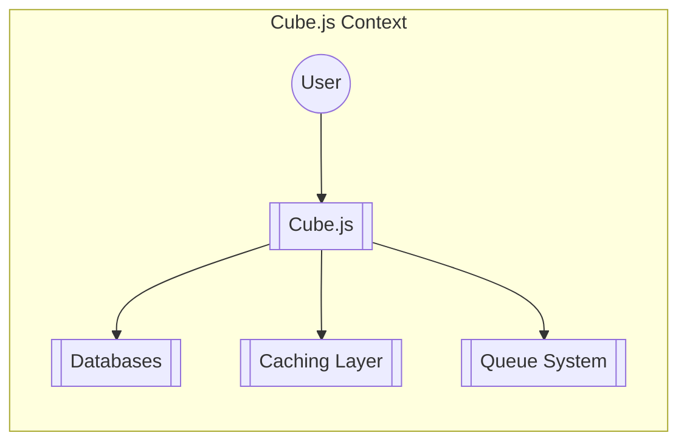
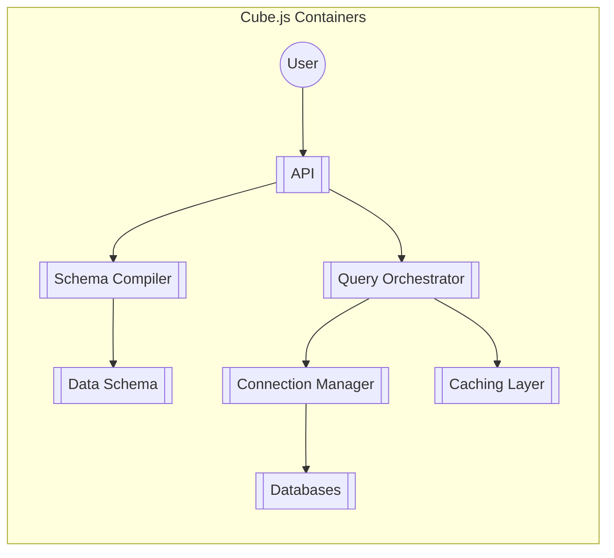
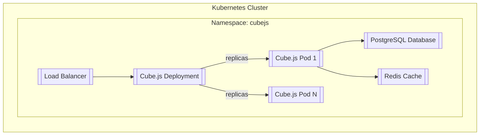
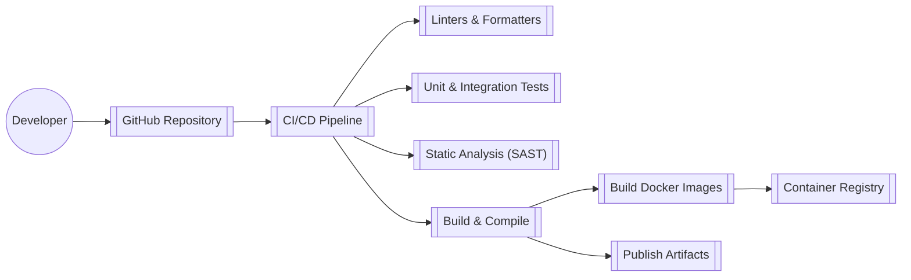

Okay, let's create a design document for Cube.js based on the provided GitHub repository.

# BUSINESS POSTURE

Cube.js is an open-source analytical data platform. It's designed to build data applications, dashboards, and analytical features. The business priorities seem to revolve around:

*   Providing a flexible and performant backend for building analytical applications.
*   Supporting a wide range of data sources and visualization libraries.
*   Enabling developers to quickly build and iterate on data-driven features.
*   Offering a scalable solution that can handle growing data volumes and user concurrency.
*   Maintaining an active open-source community and ecosystem.

Business Goals:

*   Become the go-to solution for building analytical applications.
*   Attract a large and engaged user base.
*   Offer commercial versions or services built on top of the open-source core.
*   Ensure the long-term sustainability and development of the project.

Most Important Business Risks:

*   Data breaches or unauthorized access to sensitive data exposed through Cube.js deployments.
*   Performance bottlenecks or scalability issues that impact the user experience of applications built with Cube.js.
*   Lack of adoption or competition from alternative solutions.
*   Vulnerabilities in Cube.js or its dependencies that could be exploited by attackers.
*   Inability to support new data sources or visualization libraries as the ecosystem evolves.
*   Insufficient security features to meet the requirements of enterprise customers.

# SECURITY POSTURE

Existing Security Controls (based on the GitHub repository and documentation):

*   security control: Authentication: Cube.js supports JWT (JSON Web Token) authentication and allows custom authentication implementations. Described in documentation.
*   security control: Authorization: Cube.js provides a data schema-based authorization mechanism, allowing fine-grained access control to data. Described in documentation.
*   security control: API Key Management: Cube.js uses API keys to control access to its API. Described in documentation.
*   security control: SQL Injection Prevention: Cube.js uses parameterized queries and prepared statements to prevent SQL injection vulnerabilities when interacting with databases. Implemented in the codebase.
*   security control: Cross-Origin Resource Sharing (CORS): Cube.js allows configuring CORS settings to control which origins can access its API. Described in documentation.
*   security control: Rate Limiting: Cube.js Cloud offers built-in rate limiting. For self-hosted deployments, users are encouraged to implement rate limiting at the infrastructure level (e.g., using a reverse proxy). Described in documentation.
*   security control: Input Validation: Cube.js performs some input validation, particularly on schema definitions. Implemented in the codebase.
*   security control: Dependency Management: Cube.js uses package managers (npm/yarn) to manage dependencies, and security advisories should be monitored. Implemented in the codebase.

Accepted Risks:

*   accepted risk: Self-hosted deployments are responsible for securing their infrastructure and network.
*   accepted risk: Users are responsible for securely managing their API keys and JWT secrets.
*   accepted risk: Users are responsible for implementing appropriate security measures in their client applications that consume the Cube.js API.
*   accepted risk: The effectiveness of authorization controls depends on the correct configuration of the data schema.

Recommended Security Controls:

*   Implement robust auditing and logging to track API requests, data access, and configuration changes.
*   Provide detailed security documentation and best practices for deploying and configuring Cube.js securely.
*   Offer options for encrypting data at rest and in transit, especially for sensitive data.
*   Implement regular security assessments and penetration testing.
*   Establish a clear vulnerability disclosure and response process.
*   Consider offering features like multi-factor authentication (MFA) and single sign-on (SSO) integration.

Security Requirements:

*   Authentication:
    *   Support for strong authentication mechanisms (e.g., JWT, OAuth 2.0).
    *   Ability to integrate with existing identity providers.
    *   Secure storage and management of API keys and secrets.
*   Authorization:
    *   Fine-grained access control based on roles and permissions.
    *   Ability to define data access policies at the schema level.
    *   Support for dynamic authorization rules based on user attributes or context.
*   Input Validation:
    *   Strict validation of all user inputs to prevent injection attacks and other vulnerabilities.
    *   Validation of schema definitions to prevent misconfigurations.
    *   Protection against common web vulnerabilities (e.g., XSS, CSRF).
*   Cryptography:
    *   Use of strong cryptographic algorithms and protocols for data encryption and secure communication.
    *   Secure key management practices.
    *   Support for HTTPS and TLS.

# DESIGN

## C4 CONTEXT

Element Descriptions:

*   Element:
    *   Name: User
    *   Type: Person
    *   Description: Represents a user interacting with a data application built on Cube.js.
    *   Responsibilities: Accessing data visualizations, dashboards, and reports.
    *   Security controls: Authentication and authorization mechanisms in the client application.

*   Element:
    *   Name: Cube.js
    *   Type: Software System
    *   Description: The core Cube.js analytical platform.
    *   Responsibilities: Processing queries, managing data schemas, interacting with data sources, and serving API requests.
    *   Security controls: Authentication, authorization, input validation, SQL injection prevention, CORS configuration.

*   Element:
    *   Name: Databases
    *   Type: Software System
    *   Description: Represents the various data sources that Cube.js connects to (e.g., PostgreSQL, MySQL, BigQuery).
    *   Responsibilities: Storing and retrieving data.
    *   Security controls: Database-level security controls (e.g., access control, encryption).

*   Element:
    *   Name: Caching Layer
    *   Type: Software System
    *   Description: An optional caching layer (e.g., Redis) to improve performance.
    *   Responsibilities: Caching query results and metadata.
    *   Security controls: Access control to the caching layer.

*   Element:
    *   Name: Queue System
    *   Type: Software System
    *   Description: An optional queue system (e.g., Redis, RabbitMQ) for asynchronous query processing.
    *   Responsibilities: Managing and processing background tasks.
    *   Security controls: Access control to the queue system.

## C4 CONTAINER

Element Descriptions:

*   Element:
    *   Name: User
    *   Type: Person
    *   Description: Represents a user interacting with a data application built on Cube.js.
    *   Responsibilities: Accessing data visualizations, dashboards, and reports.
    *   Security controls: Authentication and authorization mechanisms in the client application.

*   Element:
    *   Name: API
    *   Type: Container (API)
    *   Description: The main entry point for client applications to interact with Cube.js.
    *   Responsibilities: Handling API requests, authentication, authorization, and routing.
    *   Security controls: Authentication, authorization, input validation, CORS configuration, rate limiting.

*   Element:
    *   Name: Schema Compiler
    *   Type: Container (Component)
    *   Description: Responsible for compiling and validating data schemas.
    *   Responsibilities: Parsing schema definitions, checking for errors, and generating metadata.
    *   Security controls: Input validation of schema definitions.

*   Element:
    *   Name: Query Orchestrator
    *   Type: Container (Component)
    *   Description: Manages the execution of queries against data sources.
    *   Responsibilities: Planning query execution, coordinating with the Connection Manager and Caching Layer.
    *   Security controls: Authorization checks based on the data schema.

*   Element:
    *   Name: Connection Manager
    *   Type: Container (Component)
    *   Description: Handles connections to various data sources.
    *   Responsibilities: Establishing and managing database connections, executing queries.
    *   Security controls: SQL injection prevention (parameterized queries).

*   Element:
    *   Name: Data Schema
    *   Type: Data
    *   Description: Defines the structure of the data and access control rules.
    *   Responsibilities: Providing metadata for query planning and authorization.
    *   Security controls: Data schema-based authorization.

*   Element:
    *   Name: Databases
    *   Type: Software System
    *   Description: Represents the various data sources that Cube.js connects to.
    *   Responsibilities: Storing and retrieving data.
    *   Security controls: Database-level security controls.

*   Element:
    *   Name: Caching Layer
    *   Type: Software System/Container
    *   Description: An optional caching layer to improve performance.
    *   Responsibilities: Caching query results and metadata.
    *   Security controls: Access control to the caching layer.

## DEPLOYMENT

Possible Deployment Solutions:

1.  Self-hosted on a virtual machine (e.g., AWS EC2, Google Compute Engine).
2.  Self-hosted on Kubernetes.
3.  Cube.js Cloud (managed service).

Chosen Solution (for detailed description): Self-hosted on Kubernetes.

Element Descriptions:

*   Element:
    *   Name: Kubernetes Cluster
    *   Type: Infrastructure Node
    *   Description: The Kubernetes cluster where Cube.js is deployed.
    *   Responsibilities: Orchestrating and managing containers.
    *   Security controls: Kubernetes RBAC, network policies, pod security policies.

*   Element:
    *   Name: Namespace: cubejs
    *   Type: Logical Boundary
    *   Description: A Kubernetes namespace for isolating Cube.js resources.
    *   Responsibilities: Providing a scope for names and access control.
    *   Security controls: Kubernetes RBAC, network policies.

*   Element:
    *   Name: Load Balancer
    *   Type: Infrastructure Node
    *   Description: A Kubernetes service of type LoadBalancer that exposes Cube.js to external traffic.
    *   Responsibilities: Distributing traffic across Cube.js pods.
    *   Security controls: TLS termination (if configured), network-level access control.

*   Element:
    *   Name: Cube.js Deployment
    *   Type: Kubernetes Deployment
    *   Description: A Kubernetes Deployment that manages the Cube.js pods.
    *   Responsibilities: Ensuring the desired number of Cube.js pods are running.
    *   Security controls: Pod security policies, resource limits.

*   Element:
    *   Name: Cube.js Pod 1, Cube.js Pod N
    *   Type: Container
    *   Description: Instances of the Cube.js container running within Kubernetes pods.
    *   Responsibilities: Handling API requests, processing queries, etc.
    *   Security controls: All security controls listed in the C4 Container diagram.

*   Element:
    *   Name: PostgreSQL Database
    *   Type: Database
    *   Description: An example database used by Cube.js.
    *   Responsibilities: Storing and retrieving data.
    *   Security controls: Database-level security controls (access control, encryption).

*   Element:
    *   Name: Redis Cache
    *   Type: Cache
    *   Description: An example caching layer used by Cube.js.
    *   Responsibilities: Caching query results.
    *   Security controls: Access control to the Redis instance.

## BUILD

The Cube.js project uses a monorepo structure and npm/yarn for package management. The build process likely involves the following steps:

1.  Developer commits code changes to the GitHub repository.
2.  A CI/CD pipeline (e.g., GitHub Actions, CircleCI) is triggered.
3.  The pipeline checks out the code.
4.  Dependencies are installed using npm or yarn.
5.  Linters and code formatters (e.g., ESLint, Prettier) are run to enforce code style and identify potential issues.
6.  Unit tests and integration tests are executed.
7.  Static analysis tools (e.g., SonarQube) may be used to scan for code quality and security vulnerabilities.
8.  The code is compiled/transpiled (e.g., using Babel, Webpack).
9.  Docker images are built for different components of Cube.js.
10. Docker images are pushed to a container registry (e.g., Docker Hub, AWS ECR).
11. Release artifacts (e.g., npm packages) are published.

Security Controls in the Build Process:

*   security control: Code review: All code changes should be reviewed by at least one other developer.
*   security control: Linting and formatting: Enforce code style and identify potential errors.
*   security control: Automated testing: Unit and integration tests to catch bugs and regressions.
*   security control: Static analysis (SAST): Scan for code quality and security vulnerabilities.
*   security control: Dependency management: Regularly update dependencies and monitor for security advisories.
*   security control: Secure container builds: Use minimal base images, avoid including unnecessary tools, and scan images for vulnerabilities.
*   security control: Signed commits: Developers should sign their commits to ensure authenticity.

# RISK ASSESSMENT

Critical Business Processes:

*   Data ingestion and processing: Ensuring data is correctly ingested, transformed, and made available for analysis.
*   Query execution: Providing fast and reliable query responses to users.
*   API availability and performance: Maintaining a highly available and performant API for client applications.
*   Data security and privacy: Protecting sensitive data from unauthorized access and breaches.

Data Sensitivity:

The sensitivity of data handled by Cube.js depends on the specific use case and the data sources connected to it. It can range from non-sensitive public data to highly sensitive personal or financial information. Therefore, a data classification policy is crucial. Examples:

*   Public data: Open datasets, publicly available information.
*   Internal data: Business metrics, operational data.
*   Confidential data: Financial reports, customer data, intellectual property.
*   Restricted data: Personally identifiable information (PII), protected health information (PHI).

# QUESTIONS & ASSUMPTIONS

Questions:

*   What are the specific compliance requirements (e.g., GDPR, HIPAA, SOC 2) that Cube.js deployments need to meet?
*   What are the expected data volumes and user concurrency levels for typical Cube.js deployments?
*   What are the preferred methods for monitoring and logging Cube.js deployments?
*   Are there any specific security certifications or audits that Cube.js has undergone or plans to undergo?
*   What level of support is provided for integrating with existing security infrastructure (e.g., SIEM, IAM)?

Assumptions:

*   BUSINESS POSTURE: The primary goal is to provide a robust and secure analytical platform, balancing open-source flexibility with enterprise-grade security.
*   SECURITY POSTURE: Users are responsible for securing their infrastructure and data sources, but Cube.js should provide the necessary tools and guidance to do so effectively.
*   DESIGN: The design should be modular and extensible, allowing for easy integration with different data sources, caching layers, and deployment environments. The architecture prioritizes security at each layer, from the API to the database connections.