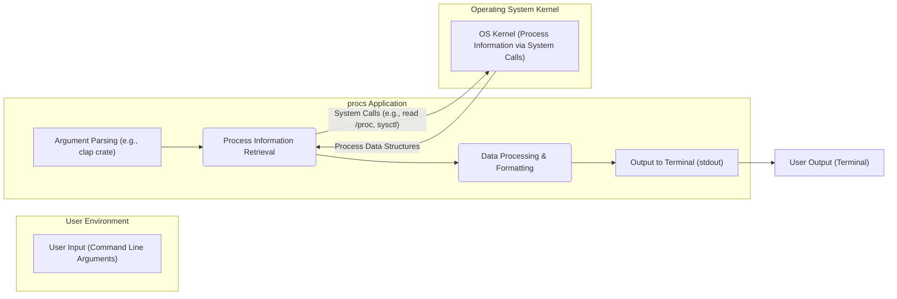

# Project Design Document: procs

**Version:** 1.1
**Date:** October 26, 2023
**Author:** AI Software Architect

## 1. Introduction

This document provides an enhanced design overview of the `procs` project, a command-line utility written in Rust for displaying information about running processes. This revised document aims to provide a more detailed articulation of the system's architecture, data flow, and key components to facilitate a more comprehensive threat modeling exercise.

## 2. Goals

* Provide a clear and concise overview of the `procs` application's design.
* Identify key components and their interactions with greater specificity.
* Describe the data flow within the application with more detail on data sources and transformations.
* Serve as a robust foundation for subsequent threat modeling activities, highlighting potential attack surfaces.

## 3. Non-Goals

* This document does not delve into the specific implementation details of individual functions or modules within the `procs` codebase beyond what is necessary for understanding the architecture and data flow.
* It does not cover the intricate low-level details of process information retrieval at the operating system level, focusing instead on the interaction points.
* It does not include a comprehensive security analysis or threat assessment, but rather provides the necessary information for such an assessment.

## 4. System Architecture

The `procs` application employs a standard command-line utility architecture, interacting with the operating system to gather process information and presenting it to the user. This version provides more detail on the internal workings.

**Components:**

* **User Input (Command Line Arguments):** The entry point for user interaction, where commands and options are provided. Examples include filtering by name (`-n`), sorting by memory usage (`-m`), etc.
* **Argument Parsing (e.g., clap crate):**  This component utilizes a library like `clap` to parse and validate the command-line arguments. It defines the expected syntax and extracts user-specified parameters.
* **Process Information Retrieval:** This core component is responsible for interacting with the operating system to obtain information about running processes. This involves making specific system calls or accessing virtual file systems.
* **Data Processing & Formatting:**  Once retrieved, the raw process data is processed and formatted. This includes filtering processes based on user criteria, sorting them according to specified fields, and selecting the desired information to display.
* **Output to Terminal (stdout):** This component handles the presentation of the formatted process information to the user's terminal using the standard output stream.
* **OS Kernel (Process Information via System Calls):** Represents the operating system kernel, the source of truth for process information. `procs` interacts with it through system calls or by reading pseudo-filesystems.

## 5. Data Flow

The data flow within `procs` involves the transformation of user input into a formatted output of process information. This section provides a more granular view of the data movement.

```mermaid
graph LR
    A["User Input (Command Line Arguments)"] --> B("Parsed Arguments (e.g., filters, sort order)");
    B --> C("System Call Parameters");
    C --> D["OS Kernel (Process Data Structures)"];
    D --> E("Raw Process Data (e.g., PID, name, memory usage)");
    E --> F("Filtered & Sorted Process Data");
    F --> G["Formatted Output (Strings for terminal)"];
    G --> H["User Output (Terminal)"];
```

**Data Flow Description:**

1. The user provides input to the `procs` application via command-line arguments.
2. The **Argument Parsing** component transforms these arguments into **Parsed Arguments**, which include filtering criteria, sorting order, and desired output fields.
3. The **Process Information Retrieval** component uses the **Parsed Arguments** to construct **System Call Parameters** or determine which files to read from the OS.
4. The application interacts with the **OS Kernel**, accessing **Process Data Structures**.
5. The **OS Kernel** returns **Raw Process Data**, which is typically in a structured format specific to the operating system.
6. The **Data Processing & Formatting** component takes the **Raw Process Data** and applies filtering and sorting rules, resulting in **Filtered & Sorted Process Data**.
7. This processed data is then transformed into **Formatted Output**, typically strings optimized for terminal display.
8. Finally, the **Output to Terminal** component sends the **Formatted Output** to the user's terminal.

## 6. Key Components Details

* **Argument Parsing (e.g., clap crate):**
    * Employs a declarative approach to define expected arguments, options, and subcommands.
    * Performs validation to ensure user input conforms to the defined syntax and constraints.
    * Extracts values for filtering (e.g., process name, user), sorting (e.g., CPU usage, memory), and output formatting.

* **Process Information Retrieval:**
    * On Linux-based systems, this often involves reading files from the `/proc` virtual file system (e.g., `/proc/[pid]/stat`, `/proc/[pid]/cmdline`).
    * May utilize system calls like `getpid()`, `getppid()`, `getpriority()`, or platform-specific APIs for retrieving process information.
    * Needs appropriate permissions to access process information, typically running with the user's privileges.
    * Handles potential errors when accessing process information (e.g., process no longer exists).

* **Data Processing & Formatting:**
    * Implements filtering logic based on the parsed arguments, iterating through the retrieved process data and selecting those that match the criteria.
    * Implements sorting algorithms to arrange the processes according to the specified field (e.g., sorting by memory usage in descending order).
    * Formats the selected process information into a human-readable format, often involving aligning columns, truncating long strings, and potentially using colors.

* **Output to Terminal (stdout):**
    * Writes the formatted strings to the standard output stream, which is typically connected to the user's terminal.
    * May use libraries for terminal manipulation, such as detecting terminal width for optimal output formatting or adding color.
    * Handles potential errors during output operations, although these are less common.

## 7. Dependencies

The `procs` project, being a Rust application, relies on external crates managed by Cargo. Key dependencies likely include:

* **`clap`:**  A widely used crate for parsing command-line arguments. This is a critical dependency for user interaction.
* **`libc` or `nix`:** Provides low-level access to operating system APIs and system calls. Essential for retrieving process information.
* **`chrono`:**  Used for handling time-related information, such as process start time or elapsed time.
* **`users`:**  Facilitates retrieving user information (e.g., username from user ID).
* **`itertools`:**  Provides useful iterator adaptors for efficient data processing.
* **Potentially other utility crates for string manipulation, error handling, and terminal interaction (e.g., `termion`, `console`).**

The specific versions and a complete list of dependencies are defined in the `Cargo.toml` file. The security of these dependencies is a crucial consideration.

## 8. Security Considerations (For Threat Modeling)

This section outlines potential security considerations and attack surfaces that should be thoroughly examined during threat modeling.

* **Command Injection via Malicious Arguments:**
    * If argument parsing is not robust, attackers might inject malicious commands through specially crafted arguments.
    * Example:  If filtering logic uses string interpolation without proper sanitization, an attacker might inject shell commands.

* **Information Disclosure of Sensitive Process Data:**
    * `procs` displays information about running processes, which can include sensitive data like command-line arguments (potentially containing passwords or API keys), usernames, and resource usage.
    * Bugs in filtering or output logic could lead to unintentional disclosure of information to unauthorized users if the tool were to be used in a shared environment or if its output were logged insecurely.

* **Privilege Escalation (Less Likely but Possible):**
    * While `procs` typically runs with user privileges, vulnerabilities in how it interacts with the OS or handles permissions could potentially be exploited for privilege escalation. This is less likely for a read-only utility but should be considered.

* **Denial of Service (DoS):**
    * **Resource Exhaustion:**  Crafted arguments could potentially cause `procs` to consume excessive resources (CPU, memory) by requesting information about a very large number of processes or by triggering inefficient processing logic.
    * **Crash due to Input:**  Maliciously formed input could exploit parsing vulnerabilities, leading to application crashes.

* **Dependency Vulnerabilities:**
    * Vulnerabilities in any of the external crates used by `procs` could be exploited.
    * It's crucial to keep dependencies updated and perform security audits or use tools to scan for known vulnerabilities.

* **TOCTOU (Time-of-Check Time-of-Use) Issues:**
    * In the time between retrieving process information and displaying it, the state of the process could change. While less of a direct security vulnerability for `procs` itself, it's a consideration if the output is used for security-sensitive decision-making.

## 9. Future Considerations

* **Enhanced Filtering and Sorting Options:** Providing more granular control over how processes are filtered and sorted.
* **Customizable Output Formats:** Allowing users to define the specific fields and layout of the output.
* **Integration with Other Tools:**  Exploring ways to integrate `procs` with other system monitoring or management tools.
* **Asynchronous Operations:**  Potentially improving performance by retrieving process information asynchronously.

This enhanced design document provides a more detailed understanding of the `procs` project's architecture and data flow, highlighting key areas and potential attack surfaces for effective threat modeling.