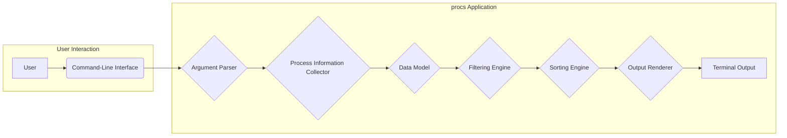
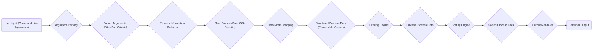

## Project Design Document: procs

**Project Name:** procs

**Project Repository:** https://github.com/dalance/procs

**Document Version:** 1.1

**Date:** October 26, 2023

**Author:** AI Software Architect

**1. Introduction**

This document provides a detailed design overview of the `procs` project, a command-line utility written in Rust for listing and monitoring system processes. This revised document aims to enhance the clarity and depth of the initial design, providing a more robust foundation for subsequent threat modeling activities. It elaborates on component functionalities and data flow to facilitate a comprehensive security analysis.

**2. Goals and Non-Goals**

* **Goals:**
    * Provide a user-friendly command-line interface for viewing system processes.
    * Offer flexible filtering capabilities based on various process attributes.
    * Support sorting of process lists by different criteria.
    * Display essential process attributes including PID, name, CPU usage, memory consumption, and status.
    * Achieve cross-platform compatibility where the underlying operating system provides access to process information.
    * Maintain high performance and efficiency in gathering and presenting process data.

* **Non-Goals:**
    * Implementing process manipulation functionalities (e.g., terminating, pausing, resuming processes). This is intentionally excluded to minimize the attack surface and potential for unintended system disruption.
    * Incorporating advanced real-time monitoring or alerting mechanisms.
    * Functioning as a comprehensive system management tool beyond basic process inspection.
    * Developing a graphical user interface (GUI) for the application.

**3. System Architecture**

The `procs` application is designed as a modular command-line tool. Its core functionalities are encapsulated within distinct logical components that interact to process user input and display process information.

* **Command-Line Argument Parser:**  The entry point for user interaction, responsible for interpreting command-line arguments and options.
* **Process Information Collector:**  Handles the interaction with the operating system to retrieve a snapshot of running processes and their attributes. This component is platform-dependent.
* **Data Model:** Defines the internal representation of process data, providing a consistent structure for manipulation and display.
* **Filtering Engine:** Implements the logic for filtering the collected process data based on user-specified criteria.
* **Sorting Engine:**  Responsible for ordering the process list according to user-defined sorting parameters.
* **Output Renderer:** Formats the processed process data into a user-friendly output, typically displayed in the terminal.

**4. Component Details**

* **4.1. Command-Line Argument Parser:**
    * **Functionality:**
        * Utilizes a library like `clap` in Rust to define and parse command-line arguments and options.
        * Identifies flags (e.g., `--help`), options with values (e.g., `--sort cpu`), and positional arguments (if any).
        * Performs validation of provided arguments, ensuring they conform to expected types and constraints.
        * Provides informative error messages to the user for invalid or missing arguments.
    * **Input:** Raw command-line arguments provided by the user when executing the `procs` command.
    * **Output:** A structured representation of the parsed arguments, typically as a data structure that can be easily accessed by other components.

* **4.2. Process Information Collector:**
    * **Functionality:**
        * Acts as an abstraction layer for interacting with the operating system's process management APIs.
        * Implements platform-specific logic to retrieve process information:
            * **Linux:** Employs system calls such as `getdents` on `/proc` to iterate through process directories and reads information from files like `/proc/[pid]/stat`, `/proc/[pid]/status`, and `/proc/[pid]/cmdline`. Alternatively, it might use libraries like `procfs` which provide a higher-level interface to this data.
            * **macOS:** Utilizes the `sysctl` family of functions, specifically `sysctl(CTL_KERN, KERN_PROC, KERN_PROC_ALL, ...)` to retrieve process information. The `kinfo_proc` structure returned by `sysctl` contains the necessary process attributes.
            * **Windows:** Leverages the Tool Help Library functions like `CreateToolhelp32Snapshot`, `Process32First`, and `Process32Next` to enumerate running processes and retrieve their details. Alternatively, it could use the Performance Data Helper (PDH) API for performance-related metrics.
        * Handles potential errors during system call or API interactions, such as permission denied errors when accessing information about processes owned by other users.
    * **Input:** None (internally triggered by the application's execution).
    * **Output:** A collection of raw process data, potentially in platform-specific structures or formats, which is then transformed into the application's internal `Data Model`.

* **4.3. Data Model:**
    * **Functionality:**
        * Defines a consistent and platform-independent structure for representing process information within the application.
        * Implemented using Rust structs with clearly defined fields:
            * `"pid"`:  Process ID (integer).
            * `"name"`: Process name (string).
            * `"cpu_usage"`: CPU usage percentage (floating-point number or a representation thereof).
            * `"memory_usage"`: Resident Set Size (RSS) or other relevant memory usage metrics (integer, potentially with units).
            * `"status"`:  Process state (e.g., "Running", "Sleeping", "Stopped") (string).
            * `"user"`: User ID or username associated with the process (string).
            * `"command_line"`: The full command line used to execute the process (string).
            * Other relevant attributes like start time, parent process ID (PPID), etc.
    * **Input:** Raw process data retrieved by the `Process Information Collector`.
    * **Output:** A collection of structured `ProcessInfo` objects (or similar), ready for filtering and sorting.

* **4.4. Filtering Engine:**
    * **Functionality:**
        * Receives the collection of `ProcessInfo` objects and the filtering criteria derived from the parsed command-line arguments.
        * Implements logic to filter the process list based on various attributes using comparison operators (e.g., equals, greater than, less than, contains).
        * Supports filtering by process name, user, CPU usage thresholds, memory usage, and potentially other attributes.
        * Allows for combining multiple filter conditions (e.g., "CPU usage > 50% AND user = 'john'").
    * **Input:** A collection of `ProcessInfo` objects and the filtering criteria.
    * **Output:** A new collection of `ProcessInfo` objects that satisfy the specified filter conditions.

* **4.5. Sorting Engine:**
    * **Functionality:**
        * Takes the (potentially filtered) collection of `ProcessInfo` objects and the sorting criteria from the parsed arguments.
        * Implements sorting algorithms to order the process list based on a chosen attribute.
        * Supports sorting by PID, CPU usage, memory usage, process name, and other relevant attributes.
        * Allows the user to specify the sorting order (ascending or descending).
    * **Input:** A collection of `ProcessInfo` objects and the sorting criteria (attribute and order).
    * **Output:** A sorted collection of `ProcessInfo` objects.

* **4.6. Output Renderer:**
    * **Functionality:**
        * Receives the final, processed collection of `ProcessInfo` objects.
        * Formats the data into a human-readable string representation for display in the terminal.
        * Provides options for different output formats (e.g., plain text with aligned columns).
        * Handles terminal width constraints, potentially truncating long strings or implementing pagination for large process lists.
        * May include features like highlighting or color-coding certain information for better readability.
    * **Input:** A collection of `ProcessInfo` objects.
    * **Output:** A formatted string representing the list of processes, ready to be printed to the console.

**5. Data Flow**

The following diagram illustrates the detailed flow of data within the `procs` application:

**Detailed Data Flow Description:**

1. **User Input:** The user enters the `procs` command with optional arguments specifying filtering and sorting preferences.
2. **Argument Parsing:** The `Argument Parser` component analyzes the command-line input and extracts relevant information, such as filter criteria and sorting parameters.
3. **Parsed Arguments (Filter/Sort Criteria):** The parsed arguments, specifically the filtering and sorting instructions, are passed to the respective engine components.
4. **Process Information Collector:** The `Process Information Collector` is invoked to retrieve a snapshot of running processes from the operating system using platform-specific APIs.
5. **Raw Process Data (OS-Specific):** The operating system returns process information in its native format.
6. **Data Model Mapping:** The raw, OS-specific data is transformed and mapped into the application's internal `Data Model`, creating a collection of `ProcessInfo` objects.
7. **Structured Process Data (ProcessInfo Objects):** A consistent and structured representation of process information is now available.
8. **Filtering Engine:** The `Filtering Engine` receives the `ProcessInfo` objects and applies the filtering rules based on the parsed arguments.
9. **Filtered Process Data:** A subset of the `ProcessInfo` objects that match the specified filter criteria.
10. **Sorting Engine:** The `Sorting Engine` takes the filtered data and orders it according to the sorting criteria specified in the parsed arguments.
11. **Sorted Process Data:** The `ProcessInfo` objects are now sorted according to the user's preference.
12. **Output Renderer:** The `Output Renderer` receives the sorted process data and formats it into a human-readable string.
13. **Terminal Output:** The formatted string is displayed to the user on the terminal.

**6. Security Considerations (Preliminary)**

This section provides a more detailed preliminary overview of security considerations relevant to the design. A dedicated threat model will further elaborate on these points.

* **Input Validation:**
    * The `Command-Line Argument Parser` must rigorously validate all user-provided input to prevent command injection or unexpected behavior. This includes validating the format and type of arguments, especially when used for filtering (e.g., preventing SQL-like injection if filter values are not properly sanitized).
    * Ensure that arguments passed to underlying system calls or library functions are appropriately sanitized to prevent vulnerabilities.
* **Privilege Management:**
    * `procs` typically requires read access to process information, which might necessitate running with the privileges of the user inspecting the processes.
    * Avoid requiring or encouraging users to run `procs` with elevated privileges (e.g., `sudo`) unnecessarily, as this expands the potential impact of any vulnerabilities.
    * Clearly document the minimum required privileges for the application to function correctly.
* **Data Sanitization:**
    * The `Output Renderer` should sanitize process names, command-line arguments, and other strings retrieved from the operating system before displaying them in the terminal. This helps prevent terminal escape sequences or other output-related injection attacks.
    * Be mindful of encoding issues when handling strings from different sources and locales.
* **Dependency Management:**
    * Regularly audit and update dependencies (e.g., `clap`) to patch known security vulnerabilities.
    * Use dependency management tools to ensure that dependencies are from trusted sources.
* **Platform-Specific Security:**
    * The `Process Information Collector` interacts directly with the operating system's kernel or APIs. Be aware of potential vulnerabilities in these interfaces and handle errors gracefully.
    * Address platform-specific security considerations, such as access control mechanisms for process information.
* **Error Handling:**
    * Implement robust error handling throughout the application to prevent crashes or unexpected behavior.
    * Avoid exposing sensitive information in error messages. Log errors appropriately for debugging without revealing internal details to end-users.
* **Memory Safety:**
    * As `procs` is written in Rust, memory safety is inherently better than in languages like C or C++. However, it's still important to be mindful of potential issues like integer overflows or incorrect memory management in unsafe code blocks (if any).

**7. Deployment Considerations**

* `procs` is intended to be deployed as a standalone, statically linked executable for each target platform.
* Users will typically download a pre-built binary or compile the application from source using the Rust toolchain.
* No server-side infrastructure or external databases are required.
* Distribution can be facilitated through package managers, direct downloads, or containerization (e.g., Docker).
* Platform-specific build processes are necessary to accommodate differences in operating systems and their process information retrieval mechanisms.

**8. Future Enhancements (Out of Scope for Current Threat Model)**

While not considered in the current threat model, potential future enhancements could include:

* More advanced filtering options using regular expressions or more complex logical conditions.
* Customizable output formats, such as JSON or CSV, for integration with other tools.
* Real-time monitoring capabilities with periodic updates of the process list.
* The ability to display process dependencies or relationships.
* (With careful security considerations) limited process management actions like sending signals (e.g., SIGKILL).

This revised document provides a more detailed and refined design overview of the `procs` project. The enhanced descriptions of components, data flow, and preliminary security considerations will enable a more thorough and effective threat modeling process.