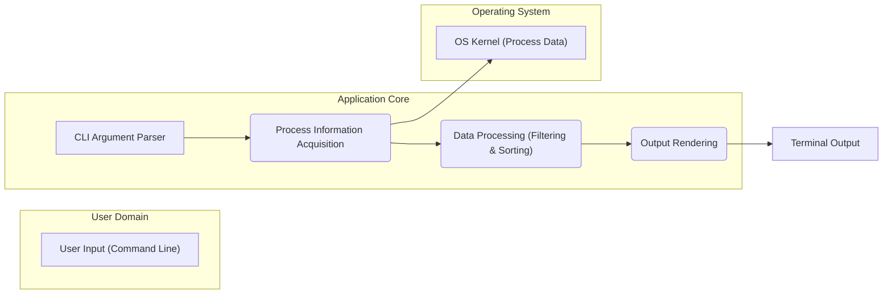
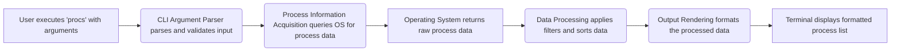

## Project Design Document: procs

**Project Repository:** https://github.com/dalance/procs

**Version:** 1.1

**Date:** October 26, 2023

**Author:** Gemini (AI Language Model)

### 1. Project Overview

`procs` is a command-line utility, developed in Rust, designed to provide users with a detailed and filterable view of running processes on a system. It aims to offer enhanced functionality and a more user-friendly experience compared to standard process listing tools. The utility allows users to inspect various attributes of processes, including their ID, name, resource consumption (CPU, memory), and more, with the ability to filter and sort based on these attributes.

### 2. Goals and Objectives

* Provide a comprehensive and easily understandable view of active processes.
* Offer robust and flexible filtering mechanisms based on a wide range of process attributes.
* Enable users to sort the process list according to different criteria for better analysis.
* Present process information in a clear, well-formatted, and customizable manner.
* Maintain high performance and efficiency in retrieving and displaying process data, even with a large number of processes.
* Achieve cross-platform compatibility where the underlying operating system APIs allow for consistent process information retrieval.

### 3. Target Audience

* System administrators responsible for monitoring system health and resource usage.
* Software developers debugging applications and understanding process behavior.
* DevOps engineers managing application deployments and performance.
* Security analysts investigating system activity and potential threats.
* General users who want a more informative and controllable way to view running processes.

### 4. Architecture Overview

`procs` is structured as a self-contained command-line application. The core architectural components are:

* **Command-Line Interface (CLI) Parsing:**  Responsible for interpreting user commands and options.
* **Process Information Acquisition:**  Handles the interaction with the operating system to retrieve process data.
* **Data Processing (Filtering and Sorting):**  Applies user-specified filters and sorting rules to the acquired data.
* **Output Rendering:**  Formats and displays the processed process information to the user.

### 5. Detailed Design

#### 5.1. Command-Line Interface (CLI) Parsing

* **Responsibility:** To parse and validate the arguments and options provided by the user when executing the `procs` command.
* **Functionality:**
    * Defines the syntax and semantics of available commands and options (e.g., specifying filter conditions, sorting columns, output format).
    * Validates the user-provided input to ensure it conforms to the expected format and constraints.
    * Provides informative help messages and usage instructions when invalid input is detected or when the user requests help.
    * Passes the parsed and validated arguments to the subsequent components for processing.
* **Implementation Details:**
    * Likely implemented using the `clap` crate in Rust, which provides a declarative way to define command-line interfaces.
    * Defines flags and options such as:
        * `--filter <expression>`:  Specifies criteria for filtering processes (e.g., `name=firefox`, `cpu>50`).
        * `--sort <column>`:  Specifies the column to sort the process list by (e.g., `pid`, `cpu`, `mem`).
        * `--reverse`:  Reverses the sorting order.
        * `--limit <number>`:  Limits the number of processes displayed.
        * `--format <type>`:  Specifies the output format (e.g., `table`, `json` - potential future feature).
    * Includes error handling for invalid or missing arguments, providing clear error messages to the user.

#### 5.2. Process Information Acquisition

* **Responsibility:** To interact with the underlying operating system to retrieve a snapshot of currently running processes and their attributes.
* **Functionality:**
    * Makes system calls or utilizes platform-specific APIs to obtain a list of active processes.
    * Collects relevant attributes for each process, including but not limited to:
        * `pid`: Process ID (integer).
        * `name`: Process name (string).
        * `user`: User ID or username the process is running under (string or integer).
        * `cpu`: CPU usage percentage (floating-point number).
        * `mem`: Memory usage (e.g., Resident Set Size - RSS) in bytes or a human-readable format (integer).
        * `status`: Current process state (e.g., running, sleeping, stopped) (string).
        * `start_time`: Time the process started (timestamp).
        * `command`: Full command line used to execute the process (string).
        * `parent_pid`: Parent process ID (integer).
    * Handles platform-specific differences in how process information is accessed and structured.
* **Implementation Details:**
    * Employs platform-specific methods for retrieving process information:
        * **Linux:**  Primarily interacts with the `/proc` filesystem, reading information from files within `/proc/<pid>/`. May also use system calls like `getdents` to iterate through process directories.
        * **macOS:**  Utilizes the `kinfo_proc` family of functions (e.g., `proc_listallpids`, `proc_pidinfo`) or the `sysctl` interface with appropriate parameters.
        * **Windows:**  Leverages the Windows API, specifically functions like `CreateToolhelp32Snapshot`, `Process32First`, and `Process32Next` to enumerate processes, and `QueryFullProcessImageNameW` to get the full path.
    * Includes robust error handling to manage scenarios where process information cannot be accessed (e.g., due to permissions).

#### 5.3. Data Processing (Filtering and Sorting)

* **Responsibility:** To filter and sort the retrieved process data based on the criteria specified by the user through command-line arguments.
* **Functionality:**
    * Receives the raw list of process information and the filtering and sorting parameters from the CLI Argument Parser.
    * Implements filtering logic that allows users to select processes based on various attributes and conditions (e.g., `name` equals a specific string, `cpu` usage is above a certain threshold).
    * Implements sorting logic that allows users to order the process list based on a chosen attribute, either in ascending or descending order.
    * Supports combining multiple filter conditions (potentially with logical AND/OR operations).
* **Implementation Details:**
    * Uses data structures like vectors or lists to hold the process information.
    * Filtering is likely implemented by iterating through the list of processes and applying the filter conditions to each process's attributes.
    * Sorting is implemented using standard sorting algorithms provided by the Rust standard library (e.g., `sort_by` or `sort_by_key`), using closures to define the sorting criteria based on the selected column.
    * The filtering logic needs to handle different data types and comparison operators appropriately.

#### 5.4. Output Rendering

* **Responsibility:** To format the filtered and sorted process information for display in the terminal in a user-friendly manner.
* **Functionality:**
    * Receives the processed list of processes from the Data Processing component.
    * Presents the information in a tabular format by default, with clear column headers for each process attribute.
    * Handles different output formats if specified by the user (e.g., JSON output for scripting).
    * May include features like:
        * Column alignment for readability.
        * Handling of terminal width to prevent wrapping or truncation.
        * Optional color-coding or highlighting for specific information.
    * Provides options for customizing the displayed columns (potential future feature).
* **Implementation Details:**
    * May utilize crates like `prettytable-rs` or `console` in Rust to facilitate formatted terminal output.
    * Defines the default set of columns to display and their order.
    * Implements logic to format different data types (numbers, strings, timestamps) appropriately for display.
    * For JSON output (if implemented), uses a serialization library like `serde_json`.

### 6. Data Flow

**Detailed Data Flow Description:**

1. The user initiates the `procs` command in the terminal, potentially including various arguments and options.
2. The **CLI Argument Parser** component receives the command string and parses it to extract the intended actions, filters, sorting preferences, and output format. It also validates the input for correctness.
3. The **Process Information Acquisition** component is invoked. Based on the operating system, it uses the appropriate system calls or APIs to request a snapshot of the currently running processes and their attributes.
4. The **Operating System** responds with a structured dataset containing information about each running process.
5. The **Data Processing** component receives this raw process data and applies the filtering rules specified by the user. It then sorts the filtered data according to the user's sorting preferences.
6. The **Output Rendering** component takes the processed (filtered and sorted) process data and formats it into a user-friendly output, typically a table displayed in the terminal. If a different output format is specified (e.g., JSON), it formats the data accordingly.
7. The **Terminal** displays the formatted list of processes to the user.

### 7. Technology Stack

* **Programming Language:** Rust
* **CLI Argument Parsing:** `clap` crate
* **Terminal Output Formatting:** Potentially `prettytable-rs`, `console`, or similar crates
* **JSON Serialization (for future output format):** `serde` and `serde_json` crates
* **Operating System Interaction:** Standard library functionalities and platform-specific system call wrappers (e.g., within the `libc` crate on Unix-like systems, `windows-rs` crate on Windows).

### 8. Deployment Model

`procs` is intended to be distributed as a statically linked, standalone executable. Users can typically:

* Download pre-compiled binaries for their specific operating system and architecture from release pages or package managers.
* Build the application from source code using the Rust toolchain (`cargo build --release`).
* Place the executable in a directory that is included in their system's `PATH` environment variable to make it easily accessible from the command line.

### 9. Security Considerations (For Threat Modeling)

This section outlines potential security considerations and threat vectors relevant to the `procs` utility, which should be thoroughly examined during threat modeling activities.

* **Input Validation Vulnerabilities:**
    * **Malicious Filter Expressions:**  Improperly sanitized or validated filter expressions provided by the user could potentially lead to unexpected behavior, errors, or even code injection if the filtering logic is not carefully implemented. For example, if the filter logic allows for arbitrary code execution based on the input.
    * **Injection through Sorting Columns:** While less likely, if the sorting mechanism is flawed, specially crafted input for the sorting column could cause errors or unexpected behavior.
* **Privilege Escalation Risks:**
    * **Accessing Sensitive Process Information:** If `procs` requires elevated privileges (e.g., using `sudo`) to access information about processes owned by other users, vulnerabilities in the application could be exploited to gain unauthorized access to this sensitive data.
    * **Exploiting OS API Interactions:**  Bugs or vulnerabilities in how `procs` interacts with operating system APIs for process information retrieval could potentially be exploited to escalate privileges.
* **Information Disclosure:**
    * **Verbose Error Messages:**  Overly detailed error messages could inadvertently reveal sensitive information about the system's internal state or other processes.
    * **Leaking Process Arguments:** Displaying the full command line of processes might expose sensitive information contained within those arguments (e.g., passwords, API keys). Consider options to redact or truncate such information.
* **Denial of Service (DoS) Potential:**
    * **Resource Exhaustion:**  Maliciously crafted filter criteria that result in the retrieval and processing of an extremely large number of processes could potentially exhaust system resources (CPU, memory), leading to a denial of service.
    * **Inefficient Filtering/Sorting Algorithms:**  If the filtering or sorting algorithms are not efficient, processing a large number of processes could take an excessive amount of time and resources.
* **Dependency Chain Vulnerabilities:**
    * **Third-Party Crates:** `procs` relies on external Rust crates. Vulnerabilities in these dependencies could be exploited to compromise the security of `procs`. Regular dependency audits and updates are crucial.
* **Platform-Specific Security Issues:**
    * **OS API Vulnerabilities:**  Security flaws in the underlying operating system APIs used for process information retrieval could be indirectly exploitable through `procs`.
    * **Permissions and Access Control:**  Incorrect handling of file system permissions (e.g., when accessing `/proc` on Linux) could lead to security issues.
* **Code Injection (Mitigation is Key):**
    * While the current design likely doesn't involve executing arbitrary code based on user input, careful attention should be paid to avoid any potential scenarios where user-provided data could be interpreted as code.

### 10. Future Considerations

* **Customizable Output Columns:** Allow users to select which process attributes are displayed and their order.
* **Real-time Process Monitoring:** Implement an option to continuously update the process list, providing a dynamic view of system activity.
* **Process Management Features:**  Potentially add capabilities to signal or terminate processes (with appropriate security safeguards and user confirmation).
* **Remote Process Monitoring:** Explore the possibility of monitoring processes on remote systems, which would introduce significant security complexities.
* **Enhanced Filtering Capabilities:**  Support more complex filtering logic, including regular expressions and logical operators.

This revised design document provides a more detailed and refined overview of the `procs` project, with a stronger emphasis on aspects relevant to security and threat modeling. The expanded descriptions of components, data flow, and security considerations aim to provide a solid foundation for identifying and mitigating potential vulnerabilities.