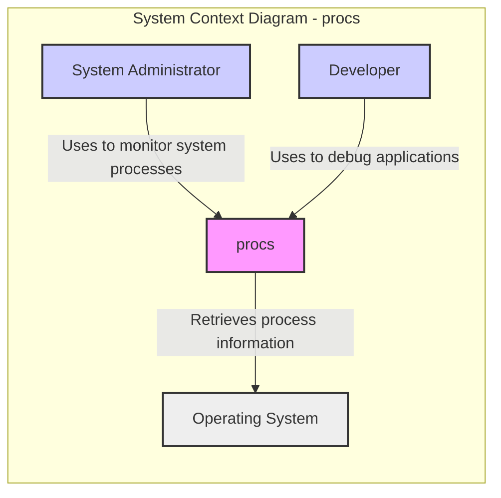
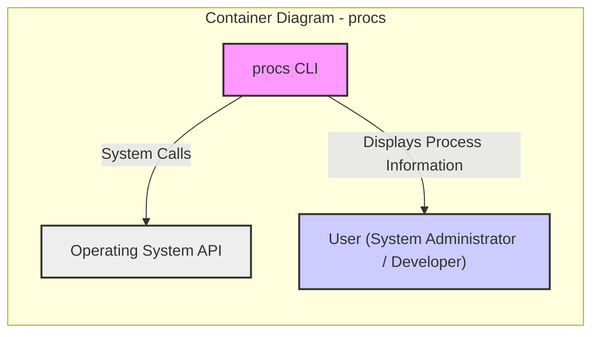
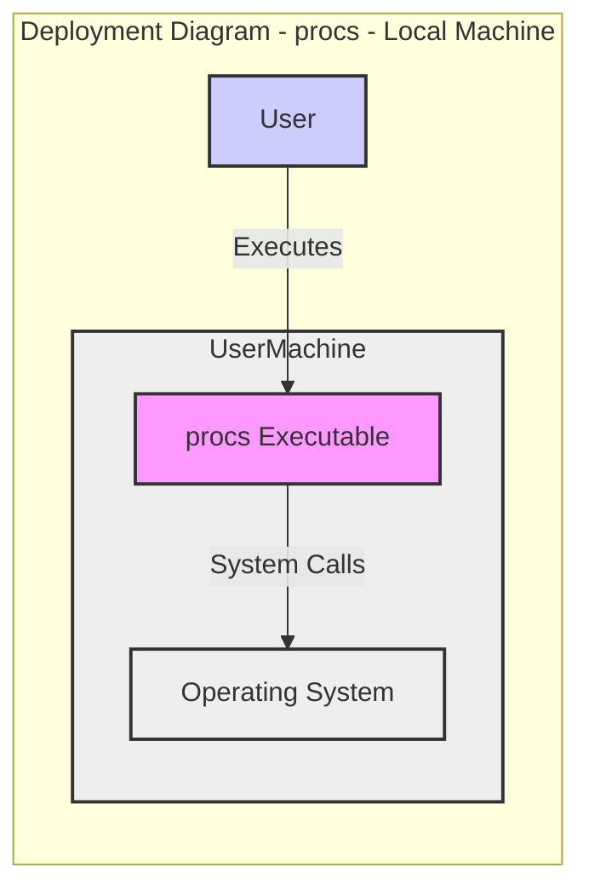
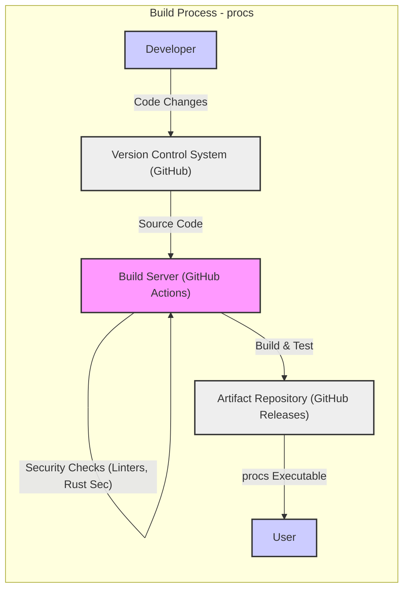

# BUSINESS POSTURE

The `procs` project is a command-line utility designed to enhance system observability by providing a user-friendly way to list and monitor system processes.

- Business Priorities and Goals:
  - Improve system administration efficiency by providing a more intuitive and informative process monitoring tool compared to standard utilities like `ps` or `top`.
  - Enhance system observability for developers and system administrators, enabling quicker identification of resource utilization and potential issues.
  - Offer a cross-platform solution for process monitoring, simplifying workflows across different operating systems.

- Business Risks:
  - Information Disclosure: If the tool is misused or compromised, it could expose sensitive process information to unauthorized users.
  - Availability: While a command-line tool, its unavailability could slightly hinder system monitoring capabilities, especially if it becomes a critical part of a system administrator's workflow.
  - Data Integrity:  Incorrect or misleading process information displayed by the tool could lead to incorrect system administration decisions.
  - Supply Chain Risk:  Dependencies used in the project could introduce vulnerabilities if not properly managed.

# SECURITY POSTURE

- Security Controls:
  - security control: Source code is publicly available on GitHub (https://github.com/dalance/procs), allowing for community review. Implemented: GitHub Repository.
  - security control: Project is written in Rust, a memory-safe language, which reduces the risk of certain classes of vulnerabilities like buffer overflows. Implemented: Language Choice.

- Accepted Risks:
  - accepted risk: Lack of formal security testing or penetration testing.
  - accepted risk: No built-in authentication or authorization mechanisms as it's designed to be a local command-line tool.
  - accepted risk: Reliance on the security of the underlying operating system for access control to process information.

- Recommended Security Controls:
  - security control: Implement automated security scanning (SAST/DAST) in the CI/CD pipeline.
  - security control: Dependency scanning to identify and manage vulnerabilities in third-party libraries.
  - security control: Consider code signing of binaries to ensure integrity and authenticity.
  - security control: Follow secure coding practices, including input validation and output encoding, even for a command-line tool.

- Security Requirements:
  - Authentication: Not applicable as a local command-line tool. Access control is managed by the underlying operating system's user permissions.
  - Authorization: Relies on the operating system's user permissions. The tool should operate with the least privileges necessary to collect process information.
  - Input Validation: The tool should validate command-line arguments and user inputs to prevent unexpected behavior or vulnerabilities. This is especially important if the tool were to be extended to accept more complex inputs in the future.
  - Cryptography: Not explicitly required for the core functionality of process listing and monitoring. However, if features like remote monitoring or data export are added in the future, cryptography might become relevant for secure communication and data protection.

# DESIGN

## C4 CONTEXT

- Context Diagram Elements:
  - - Name: System Administrator
    - Type: Person
    - Description: Individuals responsible for maintaining and monitoring systems.
    - Responsibilities: System monitoring, performance analysis, troubleshooting.
    - Security controls: Operating system user account management, access control lists on systems.
  - - Name: Developer
    - Type: Person
    - Description: Software developers who use the tool to understand application behavior and resource usage during development and debugging.
    - Responsibilities: Application debugging, performance profiling, resource usage analysis.
    - Security controls: Operating system user account management, access control to development environments.
  - - Name: procs
    - Type: Software System
    - Description: Command-line utility to list and monitor system processes in a user-friendly way.
    - Responsibilities: Collect and display process information, filter and sort processes based on user criteria.
    - Security controls: Input validation of command-line arguments, adherence to operating system security policies.
  - - Name: Operating System
    - Type: Software System
    - Description: The underlying operating system (Linux, macOS, Windows) on which `procs` runs.
    - Responsibilities: Manage system resources, provide process information to applications, enforce security policies.
    - Security controls: User authentication, process isolation, file system permissions, system call access control.

## C4 CONTAINER

- Container Diagram Elements:
  - - Name: procs CLI
    - Type: Container (Application)
    - Description: The command-line executable of the `procs` utility, written in Rust. It's responsible for parsing command-line arguments, interacting with the operating system to retrieve process information, and formatting the output for the user.
    - Responsibilities:
      - Command-line argument parsing.
      - Interacting with the Operating System API to get process data.
      - Formatting and displaying process information to the user.
    - Security controls:
      - Input validation of command-line arguments.
      - Least privilege execution (runs with the permissions of the user executing it).
      - Memory safety provided by Rust.
  - - Name: Operating System API
    - Type: Container (System API)
    - Description: The operating system's application programming interface that `procs` uses to retrieve process information. This includes system calls specific to each operating system (e.g., `procfs` on Linux, `kinfo_proc` on macOS, Windows API).
    - Responsibilities:
      - Providing access to process information.
      - Enforcing operating system security policies and access controls.
    - Security controls:
      - System call access control enforced by the kernel.
      - User authentication and authorization managed by the operating system.

## DEPLOYMENT

Deployment Scenario: Local execution on user's machine.

- Deployment Diagram Elements:
  - - Name: User's Machine
    - Type: Deployment Node (Physical or Virtual Machine)
    - Description: The local computer (laptop, desktop, server) where a system administrator or developer executes the `procs` utility.
    - Responsibilities: Provides the execution environment for `procs`, including the operating system and hardware resources.
    - Security controls: Operating system security controls, physical security of the machine, user account security.
  - - Name: Operating System
    - Type: OS (Software)
    - Description: The operating system installed on the user's machine (e.g., Linux, macOS, Windows).
    - Responsibilities: Manages system resources, provides APIs for applications, enforces security policies.
    - Security controls: User authentication, access control lists, kernel-level security mechanisms, security updates.
  - - Name: procs Executable
    - Type: Software
    - Description: The compiled binary executable file of the `procs` utility.
    - Responsibilities: Executing the `procs` application logic, interacting with the operating system, displaying output to the user.
    - Security controls: File system permissions to control access to the executable, code signing (optional).
  - - Name: User
    - Type: Person
    - Description: The system administrator or developer who runs the `procs` executable.
    - Responsibilities: Executing the tool, interpreting the output, making system administration decisions.
    - Security controls: User authentication to access the machine, authorization to run executables.

## BUILD

- Build Process Description:
  - Developer writes code and commits changes to the Version Control System (GitHub).
  - A Build Server (likely GitHub Actions, based on common practices for GitHub repositories) is triggered by code changes.
  - The Build Server retrieves the source code from the VCS.
  - The Build Server performs the build process, which includes:
    - Compiling the Rust code using `cargo build`.
    - Running automated tests (`cargo test`).
    - Performing security checks, such as:
      - Running linters (e.g., `cargo clippy`) to identify code style and potential issues.
      - Running vulnerability scanners (e.g., `cargo audit` or `rustsec`) to check for dependencies with known vulnerabilities.
  - Upon successful build and security checks, the Build Server publishes the build artifacts (e.g., executables for different platforms) to an Artifact Repository (e.g., GitHub Releases).
  - Users can download pre-built executables from the Artifact Repository.

- Build Process Security Controls:
  - security control: Version Control System (GitHub) is used to track code changes and provide auditability. Implemented: GitHub.
  - security control: Automated build process using a Build Server (GitHub Actions) ensures consistent and repeatable builds. Implemented: GitHub Actions.
  - security control: Automated tests are run during the build process to verify code functionality. Implemented: GitHub Actions, `cargo test`.
  - security control: Static analysis tools (linters) are used to identify potential code quality and security issues. Implemented: GitHub Actions, `cargo clippy`.
  - security control: Dependency vulnerability scanning is performed to detect vulnerable dependencies. Implemented: GitHub Actions, `cargo audit` or `rustsec`.
  - security control: Artifacts are published to GitHub Releases, which provides a centralized and versioned distribution point. Implemented: GitHub Releases.

# RISK ASSESSMENT

- Critical Business Processes Protected:
  - System monitoring and observability, which are essential for maintaining system health, performance, and security.
  - Incident response and troubleshooting, as `procs` can help quickly identify resource bottlenecks or misbehaving processes.

- Data to Protect and Sensitivity:
  - Process information: This includes process names, IDs, user IDs, CPU and memory usage, command-line arguments, and other process-related details.
  - Sensitivity: Process information can be considered moderately sensitive. It can reveal running applications, system configurations, and potentially user activities. Exposure of this information to unauthorized parties could aid in reconnaissance for attacks or reveal confidential operational details. Command-line arguments might sometimes contain sensitive data.

# QUESTIONS & ASSUMPTIONS

- Questions:
  - What is the intended deployment environment for `procs`? Is it primarily for personal use, or is it intended for wider deployment within organizations?
  - Are there any specific regulatory compliance requirements that `procs` needs to adhere to?
  - Are there plans to extend `procs` with features that might introduce new security considerations, such as remote monitoring, data export, or user configuration persistence?
  - What is the process for reporting and addressing security vulnerabilities in `procs`?

- Assumptions:
  - Assumption: `procs` is primarily intended to be used as a local command-line tool by system administrators and developers for system monitoring and debugging.
  - Assumption: The current version of `procs` does not handle highly sensitive data directly, but process information itself can have moderate sensitivity.
  - Assumption: Security is currently addressed through basic secure development practices and reliance on the underlying operating system's security mechanisms.
  - Assumption: The risk appetite for this project is moderate, typical for open-source command-line utilities.
  - Assumption: The build process utilizes GitHub Actions for CI/CD and GitHub Releases for artifact distribution, which are common and reasonably secure platforms.