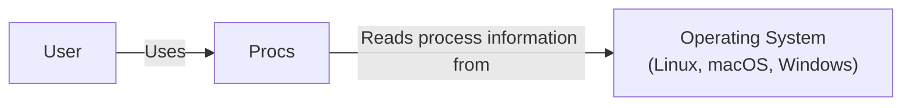
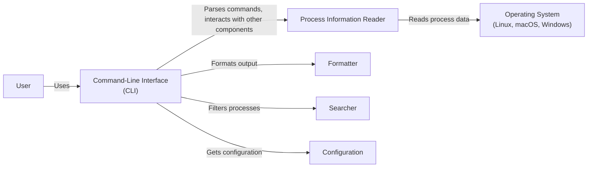
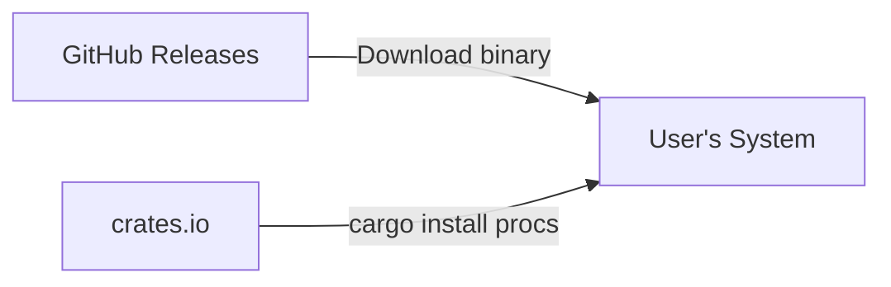
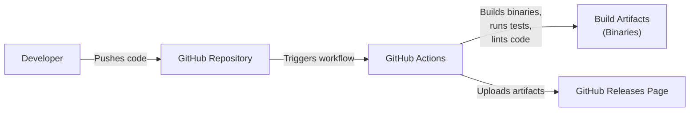

Okay, let's create a design document for the `procs` project.

# BUSINESS POSTURE

Business Priorities and Goals:

*   Provide a user-friendly command-line tool to enhance developer productivity by offering a modern, colorful, and feature-rich alternative to the standard `ps` command.
*   Improve the visibility and understanding of running processes on a system, making it easier to identify and manage them.
*   Offer cross-platform compatibility (Linux, macOS, Windows) to cater to a wider range of users.
*   Provide easy way to search and filter processes.
*   Provide additional information about processes, that are not available in standard `ps` command.

Business Risks:

*   User Adoption: The success of the project hinges on user adoption. If developers don't find it significantly better than existing tools, it won't be widely used.
*   Maintenance Overhead: Maintaining a cross-platform command-line tool can be resource-intensive, requiring ongoing updates and bug fixes to ensure compatibility and address user issues.
*   Competition: There are numerous existing process monitoring tools. `procs` needs to offer compelling advantages to stand out.
*   Security Vulnerabilities: While not directly handling sensitive data, vulnerabilities in the tool could potentially be exploited to gain information about the system or running processes, although the risk is relatively low.
*   Incorrect or Misleading Information: If the tool provides incorrect process information, it could lead to incorrect decisions by users, potentially impacting system stability or security.

# SECURITY POSTURE

Existing Security Controls:

*   security control: Code Review: The project is open-source and hosted on GitHub, allowing for community code review and contributions. (Described in GitHub repository)
*   security control: Static Analysis: The project uses Rust, a memory-safe language, which inherently prevents many common security vulnerabilities like buffer overflows. (Described in GitHub repository)
*   security control: Dependency Management: The project uses Cargo, Rust's package manager, which helps manage dependencies and track potential vulnerabilities. (Described in `Cargo.toml` file)
*   security control: Linter: Project use rust clippy linter to enforce code style and catch common mistakes. (Described in GitHub repository)

Accepted Risks:

*   accepted risk: Limited Input Validation: As a command-line tool primarily displaying system information, the attack surface related to user input is relatively small. The tool does accept search terms and configuration options, but these are unlikely to be vectors for significant exploits.
*   accepted risk: No Direct Network Interaction: The tool primarily interacts with the local operating system's process information APIs and does not directly communicate over the network, reducing the risk of network-based attacks.

Recommended Security Controls:

*   security control: Regular Dependency Audits: Implement automated dependency scanning (e.g., `cargo-audit` or GitHub's Dependabot) to identify and address known vulnerabilities in dependencies.
*   security control: Fuzz Testing: Consider incorporating fuzz testing to identify potential edge cases and vulnerabilities that might not be caught by standard testing.
*   security control: Code Signing: Code signing binaries can help users verify the authenticity of the software.

Security Requirements:

*   Authentication: Not applicable, as the tool operates locally and doesn't require user authentication.
*   Authorization: The tool inherits the permissions of the user executing it. No additional authorization mechanisms are needed within the tool itself.
*   Input Validation: While the attack surface is small, validate user-provided search terms and configuration options to prevent unexpected behavior or potential injection vulnerabilities (though unlikely in this context).
*   Cryptography: Not directly applicable, as the tool doesn't handle sensitive data requiring encryption. If configuration files are used, consider encrypting them if they contain sensitive information (though this is unlikely to be necessary).

# DESIGN

## C4 CONTEXT

Element Description:

*   Element:
    *   Name: User
    *   Type: Person
    *   Description: A developer or system administrator who wants to view and manage running processes.
    *   Responsibilities: Interacts with the `procs` command-line tool.
    *   Security controls: None (relies on the user's existing system permissions).

*   Element:
    *   Name: Procs
    *   Type: Software System
    *   Description: The `procs` command-line tool.
    *   Responsibilities: Reads process information from the operating system, formats and displays it to the user, and provides filtering/searching capabilities.
    *   Security controls: Inherits user permissions, limited input validation.

*   Element:
    *   Name: Operating System (Linux, macOS, Windows)
    *   Type: Software System
    *   Description: The underlying operating system (Linux, macOS, or Windows).
    *   Responsibilities: Provides the process information APIs that `procs` uses.
    *   Security controls: Standard operating system security mechanisms (process isolation, user permissions, etc.).

## C4 CONTAINER

Element Description:

*   Element:
    *   Name: User
    *   Type: Person
    *   Description: A developer or system administrator.
    *   Responsibilities: Interacts with the `procs` command-line tool.
    *   Security controls: None (relies on the user's existing system permissions).

*   Element:
    *   Name: Command-Line Interface (CLI)
    *   Type: Container
    *   Description: The entry point for user interaction. Parses command-line arguments and options.
    *   Responsibilities: Handles user input, coordinates other components, displays output.
    *   Security controls: Input validation (for command-line arguments and options).

*   Element:
    *   Name: Process Information Reader
    *   Type: Container
    *   Description: Reads process information from the operating system.
    *   Responsibilities: Interacts with OS-specific APIs to retrieve process data.
    *   Security controls: Relies on OS security mechanisms.

*   Element:
    *   Name: Formatter
    *   Type: Container
    *   Description: Formats the process information for display.
    *   Responsibilities: Formats data, applies colorization, and handles output presentation.
    *   Security controls: None.

*   Element:
    *   Name: Searcher
    *   Type: Container
    *   Description: Filters processes based on user-provided search criteria.
    *   Responsibilities: Implements search logic.
    *   Security controls: Input validation (for search terms).

*   Element:
    *   Name: Configuration
    *   Type: Container
    *   Description: Manages application configuration.
    *   Responsibilities: Reads and applies configuration settings (e.g., from a configuration file or environment variables).
    *   Security controls: If sensitive data is stored in configuration, consider encryption.

*   Element:
    *   Name: Operating System (Linux, macOS, Windows)
    *   Type: Software System
    *   Description: The underlying operating system.
    *   Responsibilities: Provides process information APIs.
    *   Security controls: Standard operating system security mechanisms.

## DEPLOYMENT

Possible Deployment Solutions:

1.  Manual Installation: Users download pre-built binaries for their operating system from the GitHub releases page and place them in a directory within their PATH.
2.  Package Managers: `procs` could be packaged for various package managers (e.g., apt, yum, brew, choco) to simplify installation and updates.
3.  Cargo Install: Rust users can install directly from crates.io using `cargo install procs`.
4.  Containerization (less likely, but possible): `procs` could be containerized, although this is less common for command-line tools that interact directly with the host system.

Chosen Solution (Detailed Description): Manual Installation & Cargo Install

The primary deployment method is manual installation from pre-built binaries and installation via `cargo install`.

Element Description:

*   Element:
    *   Name: GitHub Releases
    *   Type: Infrastructure
    *   Description: The GitHub releases page for the `procs` project.
    *   Responsibilities: Hosts pre-built binaries for various operating systems.
    *   Security controls: GitHub's built-in security features, code signing (recommended).

*   Element:
    *   Name: User's System
    *   Type: Infrastructure
    *   Description: The user's computer (Linux, macOS, or Windows).
    *   Responsibilities: Runs the `procs` binary.
    *   Security controls: Operating system security mechanisms.

*   Element:
    *   Name: crates.io
    *   Type: Infrastructure
    *   Description: The Rust package registry.
    *   Responsibilities: Hosts the `procs` crate for installation via `cargo install`.
    *   Security controls: crates.io security features.

## BUILD

The build process is automated using GitHub Actions.

Build Process Description:

1.  Developer pushes code changes to the GitHub repository.
2.  GitHub Actions workflow is triggered.
3.  The workflow performs the following steps:
    *   Checks out the code.
    *   Sets up the Rust toolchain.
    *   Runs linters (clippy).
    *   Runs tests (`cargo test`).
    *   Builds the project for multiple target platforms (cross-compilation).
    *   Creates release artifacts (e.g., compressed archives containing the binaries).
    *   Uploads the artifacts to the GitHub Releases page.

Security Controls:

*   security control: Automated Build: GitHub Actions provides a consistent and reproducible build environment.
*   security control: Linting: `clippy` is used to enforce code style and catch potential errors.
*   security control: Automated Testing: `cargo test` is used to run unit and integration tests.
*   security control: Cross-Compilation: Builds are performed for multiple target platforms to ensure broad compatibility.
*   security control: Dependency Management: Cargo manages dependencies and helps track vulnerabilities.  Regular `cargo audit` runs (recommended) would further enhance this.

# RISK ASSESSMENT

Critical Business Processes:

*   Providing accurate and reliable process information to users.
*   Maintaining a user-friendly and efficient command-line interface.
*   Ensuring cross-platform compatibility.

Data Protection:

*   `procs` does not directly handle or store sensitive user data. It primarily reads and displays process information already available to the user through other means (e.g., the standard `ps` command).
*   Data Sensitivity: The process information itself could be considered sensitive in certain contexts (e.g., revealing running applications, usernames, command-line arguments). However, this information is already accessible to the user with appropriate permissions. `procs` does not elevate privileges or expose information that wouldn't otherwise be available.

# QUESTIONS & ASSUMPTIONS

Questions:

*   Are there any specific performance requirements for the tool (e.g., maximum startup time, memory usage)?
*   Are there any plans to support remote process monitoring in the future?
*   Are there any specific regulatory or compliance requirements that need to be considered?
*   What level of user support and documentation is expected?
*   Is there a specific budget for security tools or services (e.g., for code signing or vulnerability scanning)?

Assumptions:

*   BUSINESS POSTURE: The primary goal is to provide a better user experience than existing tools like `ps`, focusing on usability and features.
*   BUSINESS POSTURE: The project has a moderate risk appetite, typical of an open-source project aiming for broad adoption.
*   SECURITY POSTURE: The tool is not expected to handle highly sensitive data directly.
*   SECURITY POSTURE: The user running the tool has the necessary permissions to view process information on their system.
*   DESIGN: The tool will primarily interact with local operating system APIs.
*   DESIGN: The tool will be distributed as pre-built binaries and via `cargo install`.
*   DESIGN: GitHub Actions will be used for automated builds and testing.