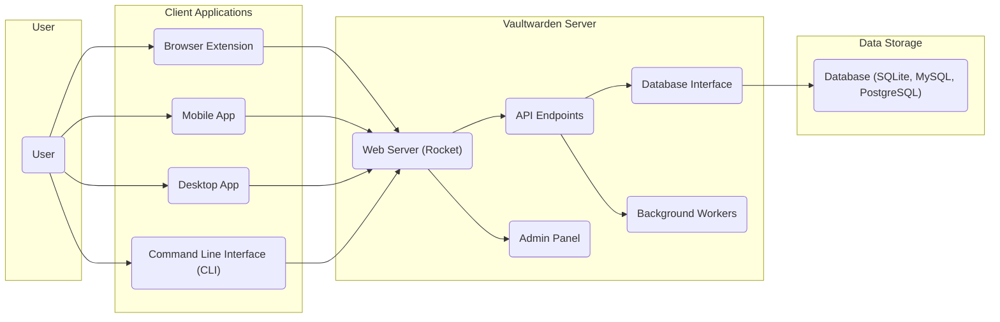
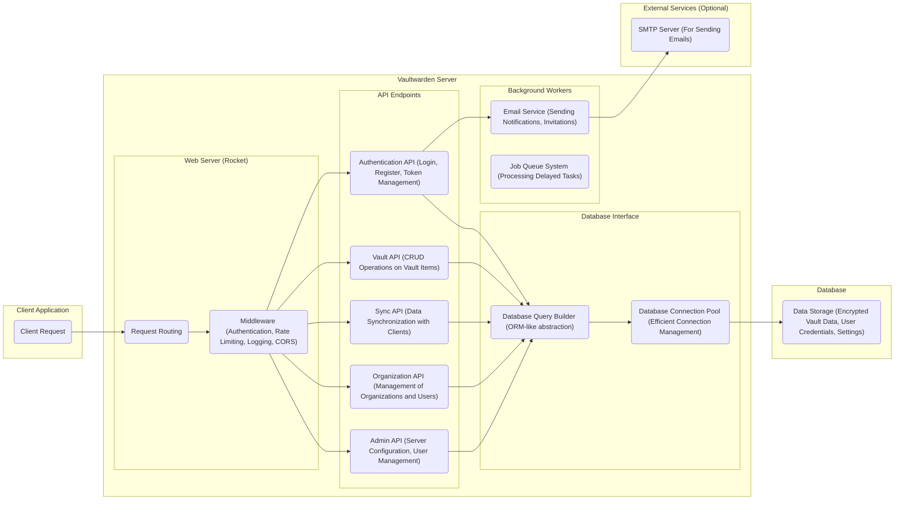

# Project Design Document: Vaultwarden

**Version:** 1.1
**Date:** October 26, 2023
**Author:** AI Software Architect

## 1. Introduction

This document provides an enhanced and more detailed design overview of the Vaultwarden project, an unofficial open-source Bitwarden-compatible server written in Rust. This document aims to provide a clear and comprehensive understanding of the system's architecture, components, data flow, and key security considerations, specifically tailored for subsequent threat modeling activities.

## 2. Goals and Objectives

*   Provide a comprehensive and detailed architectural overview of the Vaultwarden server.
*   Clearly identify and describe the responsibilities and functionalities of key components and their interactions.
*   Illustrate the data flow within the system for various common and critical operations.
*   Highlight important security considerations, categorized for clarity, that are highly relevant for threat modeling.
*   Serve as a definitive and easily understandable reference point for understanding the system's design and security posture.

## 3. System Architecture

Vaultwarden is designed as a self-hosted password management server, prioritizing compatibility with official Bitwarden clients. It primarily consists of a robust backend server application that interacts with a database for persistent storage and serves client requests through a well-defined API.

### 3.1. High-Level Architecture

### 3.2. Detailed Architecture

## 4. Components

This section provides a more detailed description of the key components of the Vaultwarden system, outlining their specific responsibilities and functionalities.

*   **Client Applications:** These are the user-facing applications that provide the interface for interacting with the password manager.
    *   **Browser Extension:** Seamlessly integrates with web browsers to offer features like auto-fill, password generation, and vault access directly within the browsing experience.
    *   **Mobile App:** Native applications for iOS and Android platforms, providing on-the-go access to the user's vault and offering features like biometric unlock.
    *   **Desktop App:** Standalone applications for desktop operating systems, offering a dedicated interface for managing passwords and other secure information.
    *   **Command Line Interface (CLI):** Provides a text-based interface for advanced users and automation scripts to interact with the server, enabling tasks like importing/exporting data or managing the server.

*   **Vaultwarden Server:** The central backend application, built with Rust and the Rocket framework, responsible for handling all core functionalities, including authentication, data management, and security enforcement.
    *   **Web Server (Rocket):** A fast and reliable asynchronous web framework in Rust that handles incoming HTTP requests and routes them appropriately.
        *   **Request Routing:** Directs incoming requests based on their path and method to the corresponding API endpoint handlers.
        *   **Middleware:** Intercepts requests to handle cross-cutting concerns:
            *   **Authentication:** Verifies user credentials and manages session tokens.
            *   **Rate Limiting:** Protects against brute-force attacks by limiting the number of requests from a single IP address.
            *   **Logging:** Records important events for auditing and debugging purposes.
            *   **CORS (Cross-Origin Resource Sharing):**  Manages which domains are allowed to make requests to the API.
    *   **API Endpoints:** Define the interface through which client applications interact with the server, providing specific functionalities via HTTP requests.
        *   **Authentication API (Login, Register, Token Management):** Handles user registration, login procedures, password reset requests, and the generation and management of authentication tokens (e.g., JWTs).
        *   **Vault API (CRUD Operations on Vault Items):** Provides endpoints for creating, reading, updating, and deleting password entries, notes, and other secure items within a user's vault.
        *   **Sync API (Data Synchronization with Clients):** Manages the synchronization of vault data between the server and client applications, ensuring data consistency across devices. This includes handling conflicts and updates.
        *   **Organization API (Management of Organizations and Users):**  Allows for the creation and management of organizations, inviting and managing users within organizations, and sharing vault items securely among organization members.
        *   **Admin API (Server Configuration, User Management):** Provides administrative functionalities for managing the server itself, including configuring settings, managing users (creating, deleting, modifying), and potentially viewing server statistics. Access to this API is typically restricted to administrative users.
    *   **Database Interface:** Provides an abstraction layer for interacting with the underlying database system, isolating the application logic from specific database implementations.
        *   **Database Query Builder (ORM-like abstraction):** Simplifies database interactions by providing a higher-level interface for constructing and executing queries, reducing the need to write raw SQL.
        *   **Database Connection Pool (Efficient Connection Management):** Manages a pool of database connections, improving performance by reusing connections and reducing the overhead of establishing new connections for each request.
    *   **Background Workers:**  Handles asynchronous and deferred tasks that do not need to be executed immediately within the request-response cycle.
        *   **Email Service (Sending Notifications, Invitations):** Responsible for sending emails for various purposes, such as password reset requests, new user invitations to organizations, and other notifications.
        *   **Job Queue System (Processing Delayed Tasks):** Manages a queue of tasks that need to be executed asynchronously, such as sending bulk emails or performing periodic maintenance tasks.

*   **Data Storage:** The persistent storage mechanism for all application data.
    *   **Database (SQLite, MySQL, PostgreSQL):** Supports various relational database systems for storing:
        *   **Encrypted Vault Data:**  User's password entries, notes, and other secure information, encrypted using the user's master password.
        *   **User Credentials:** Hashed and salted master passwords, along with other user-related information.
        *   **Settings:** Server-wide and user-specific configuration settings.

*   **External Services (Optional):** Services that Vaultwarden may optionally interact with to extend its functionality.
    *   **SMTP Server (For Sending Emails):** An external Simple Mail Transfer Protocol server used by the Email Service to relay outgoing emails.

## 5. Data Flow

This section provides more detailed examples of data flow for critical operations within the Vaultwarden system.

### 5.1. User Registration

1. The user initiates the registration process through a client application.
2. The client application sends a registration request containing the user's email and chosen master password to the **Authentication API** endpoint.
3. The **Web Server** routes the request, and **Middleware** may perform checks like rate limiting.
4. The **Authentication API** receives the request.
5. A strong salt is generated.
6. The user's master password is cryptographically hashed using a robust key derivation function (e.g., PBKDF2) along with the generated salt.
7. The hashed master password and salt are stored securely in the database via the **Database Interface**.
8. An authentication token might be generated and returned to the client, or the user might be prompted to log in.

### 5.2. Synchronizing Vault Data

1. A client application initiates a synchronization request with the **Sync API** endpoint, including the user's authentication token.
2. The **Web Server** routes the request, and **Middleware** verifies the token.
3. The **Sync API** retrieves the latest encrypted vault data for the user from the database via the **Database Interface**.
4. The server may also retrieve metadata about changes to determine what needs to be synchronized.
5. The encrypted data is sent back to the client application.
6. The client application decrypts the data locally.
7. If the client has local changes, it encrypts them and sends them back to the **Sync API**.
8. The **Sync API** processes these changes, potentially resolving conflicts, and updates the database.

### 5.3. Sharing a Vault Item within an Organization

1. A user within an organization initiates the sharing process in a client application.
2. The client application sends a request to the **Organization API** endpoint, including details of the item to be shared and the target user(s) or group(s).
3. The **Web Server** routes the request, and **Middleware** verifies the user's authentication and authorization to perform this action.
4. The **Organization API** creates a shared item record in the database, linking the original item with the target user(s) or group(s), potentially with specific permissions.
5. Notifications might be sent to the recipients via the **Email Service** (if configured).
6. When the recipient synchronizes their data, the shared item will be included in the data retrieved from the **Sync API**.

## 6. Security Considerations

This section provides a more structured and detailed overview of security considerations, categorized for better understanding and threat modeling.

*   **Authentication and Authorization:**
    *   **Threats:** Brute-force attacks, credential stuffing, session hijacking, privilege escalation.
    *   **Considerations:**
        *   Strong hashing algorithms (e.g., Argon2) for master passwords with unique salts.
        *   Implementation of robust authentication mechanisms, including token-based authentication (e.g., JWT with short expiry times).
        *   Strict authorization checks at each API endpoint to ensure users can only access resources they are permitted to.
        *   Support for and encouragement of multi-factor authentication (MFA).
        *   Protection against common authentication bypass vulnerabilities.
*   **Encryption (Data at Rest and in Transit):**
    *   **Threats:** Data breaches, eavesdropping, man-in-the-middle attacks.
    *   **Considerations:**
        *   End-to-end encryption of vault data using strong symmetric encryption algorithms (e.g., AES-256 in GCM mode).
        *   Secure key derivation from the master password to encrypt vault data.
        *   Enforcement of HTTPS (TLS/SSL) for all communication between clients and the server to protect data in transit.
        *   Consideration of database encryption at rest for an additional layer of security.
*   **Input Validation and Output Encoding:**
    *   **Threats:** SQL injection, cross-site scripting (XSS), command injection.
    *   **Considerations:**
        *   Thorough validation of all user inputs on the server-side to prevent injection attacks.
        *   Proper output encoding to prevent XSS vulnerabilities.
        *   Use of parameterized queries or ORM features to mitigate SQL injection risks.
*   **Rate Limiting and Denial of Service (DoS) Prevention:**
    *   **Threats:** Brute-force attacks, resource exhaustion.
    *   **Considerations:**
        *   Implementation of rate limiting on authentication endpoints and other critical APIs.
        *   Protection against common web application DoS attacks.
*   **Secure Configuration and Deployment:**
    *   **Threats:** Exposure of sensitive information, misconfiguration vulnerabilities.
    *   **Considerations:**
        *   Secure default configurations and clear guidance for secure deployment practices.
        *   Proper handling of environment variables and secrets, avoiding hardcoding sensitive information.
        *   Regular security audits of the deployment environment.
*   **Dependency Management:**
    *   **Threats:** Exploitation of vulnerabilities in third-party libraries.
    *   **Considerations:**
        *   Regularly updating dependencies to patch known security vulnerabilities.
        *   Using dependency scanning tools to identify potential vulnerabilities.
*   **Logging and Auditing:**
    *   **Threats:** Lack of visibility into security incidents, difficulty in forensic analysis.
    *   **Considerations:**
        *   Comprehensive logging of important security-related events, including authentication attempts, API access, and administrative actions.
        *   Secure storage and management of log data.
*   **Admin Panel Security:**
    *   **Threats:** Unauthorized access to administrative functionalities, leading to full system compromise.
    *   **Considerations:**
        *   Strong authentication and authorization mechanisms for the admin panel, potentially separate from regular user authentication.
        *   Protection against common web application vulnerabilities in the admin panel.
        *   Restricting access to the admin panel to authorized personnel only.
*   **Database Security:**
    *   **Threats:** Unauthorized access to sensitive data stored in the database.
    *   **Considerations:**
        *   Secure database configurations, including strong passwords for database users.
        *   Restricting database access to the Vaultwarden server only.
        *   Consideration of database encryption at rest.
*   **Background Worker Security:**
    *   **Threats:** Unauthorized access to background tasks, potential for information leakage or manipulation.
    *   **Considerations:**
        *   Secure handling of sensitive information within background tasks.
        *   Protection against unauthorized access or manipulation of the job queue system.

## 7. Deployment

Vaultwarden is frequently deployed using containerization technologies like Docker, which simplifies deployment and management. Secure deployment practices are crucial.

*   **Containerization (Docker):**
    *   Use official or trusted base images.
    *   Follow Docker security best practices (e.g., running containers as non-root users, using security profiles).
    *   Regularly update container images to patch vulnerabilities.
*   **Reverse Proxy (Nginx, Apache):**
    *   Configure TLS termination at the reverse proxy level.
    *   Implement security headers (e.g., HSTS, Content-Security-Policy).
    *   Configure appropriate timeouts and request limits.
*   **Database Considerations:**
    *   Secure the database instance with strong passwords and access controls.
    *   Consider running the database in a separate container or on a dedicated server.
    *   Implement database backups and recovery procedures.
*   **Environment Variables and Secrets Management:**
    *   Avoid hardcoding sensitive information in configuration files.
    *   Use secure methods for managing environment variables and secrets (e.g., Docker Secrets, HashiCorp Vault).
*   **Network Security:**
    *   Restrict network access to the Vaultwarden server and database.
    *   Use firewalls to control inbound and outbound traffic.
*   **Updates and Maintenance:**
    *   Establish a process for regularly updating Vaultwarden and its dependencies.
    *   Monitor for security advisories and apply patches promptly.

## 8. Future Considerations

*   Enhanced security features, such as more granular access controls, advanced threat detection mechanisms, and integration with security information and event management (SIEM) systems.
*   Improved admin panel functionalities, including more comprehensive monitoring and auditing capabilities.
*   Scalability and performance optimizations to handle a larger number of users and requests.
*   Exploration of alternative authentication methods, such as WebAuthn, for passwordless login.
*   Further enhancements to the organization management features.

This enhanced design document provides a more detailed and structured understanding of the Vaultwarden project, specifically focusing on aspects relevant to threat modeling. By elaborating on component functionalities, data flows, and security considerations, this document serves as a more robust foundation for identifying and mitigating potential security risks.
