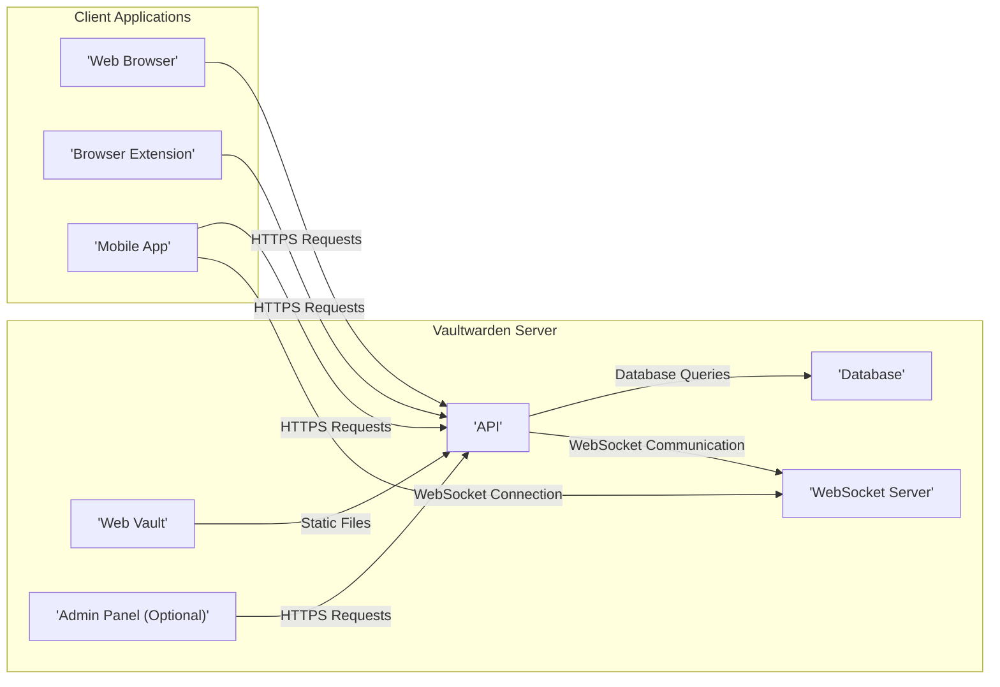
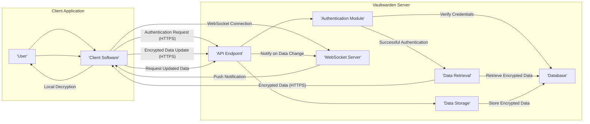

# Project Design Document: Vaultwarden (Improved)

**Project Name:** Vaultwarden Analysis and Threat Modeling Preparation

**Document Version:** 2.0

**Date:** October 26, 2023

**Author:** AI Cloud & Security Architect

## 1. Introduction

This document provides an enhanced design overview of the Vaultwarden project, the open-source, lightweight Bitwarden server implementation written in Rust. It is intended to serve as a robust foundation for comprehensive threat modeling activities, offering detailed insights into the system's architecture, data handling, and deployment considerations.

## 2. Project Overview

Vaultwarden offers a secure and cost-effective solution for individuals and small teams seeking to self-host a password management server compatible with Bitwarden clients. By providing a lightweight alternative to the official Bitwarden server, it empowers users with greater control over their sensitive data while maintaining compatibility with familiar and trusted client applications.

## 3. System Architecture

The Vaultwarden system comprises several key components that work together to provide password management functionality:

*   **Web Vault:** The front-end user interface, a static web application built with technologies like HTML, CSS, and JavaScript, providing users with a visual means to interact with their vault.
*   **API (Application Programming Interface):** The core logic engine of Vaultwarden, implemented in Rust. It handles authentication, authorization, data encryption/decryption, and synchronization requests from client applications.
*   **Database:** The persistent storage layer for all user data, including encrypted vault items, user credentials (hashed), organization details, and server configurations. Vaultwarden supports various database backends for flexibility.
*   **Admin Panel (Optional Feature):** A separate, password-protected web interface designed for server administrators to manage users, configure server settings, and monitor system status. Its availability is controlled via configuration.
*   **WebSocket Server (for Real-time Sync):**  Facilitates real-time synchronization of vault data across multiple client applications logged into the same account.

## 4. Data Flow (Detailed Scenarios)

To better understand the system's dynamics, let's examine specific data flow scenarios:

*   **User Authentication:**
    *   The client application sends login credentials (username/email and master password) via HTTPS to the API.
    *   The API retrieves the user's salt and hashed master password from the database.
    *   The API hashes the provided master password with the retrieved salt and compares it to the stored hash.
    *   Upon successful verification, the API generates a session token and sends it back to the client.

*   **Vault Data Retrieval:**
    *   The client application sends a request for vault data to the API, including the session token for authentication.
    *   The API verifies the session token.
    *   The API retrieves the user's encrypted vault data from the database.
    *   The API sends the encrypted data back to the client.
    *   The client decrypts the data locally using the user's master password (which is never transmitted to the server in plaintext after authentication).

*   **Vault Data Update:**
    *   The user makes changes to their vault within the client application.
    *   The client encrypts the modified data locally using the user's master password.
    *   The client sends the encrypted data to the API via HTTPS, including the session token.
    *   The API verifies the session token.
    *   The API stores the received encrypted data in the database, overwriting the previous version.

*   **Real-time Synchronization:**
    *   When a user logs in from multiple devices, the client applications establish WebSocket connections with the WebSocket server.
    *   When changes are made to the vault on one client, that client sends the encrypted changes to the API.
    *   The API updates the database and notifies the WebSocket server.
    *   The WebSocket server pushes a notification to other connected clients, prompting them to synchronize and fetch the latest encrypted data from the API.

## 5. Key Components in Detail

### 5.1. Web Vault

*   **Description:** A client-side rendered application providing the primary user interface for managing passwords and other secure information. It interacts with the Vaultwarden API for all data operations.
*   **Functionality:** User authentication, vault item management (creation, reading, updating, deletion), password generation, organization management (if enabled), settings configuration, and potentially browser extension management.
*   **Technology:** Typically built using JavaScript frameworks and served as static files by the Vaultwarden server or a reverse proxy.

### 5.2. API

*   **Description:** The core backend service responsible for handling all business logic, security enforcement, and data access. It adheres to a RESTful API design, largely compatible with the official Bitwarden server API.
*   **Functionality:** User authentication (session-based), authorization, handling vault data requests, managing organizations and user memberships, API key generation and management, server-side event processing, and interaction with the database.
*   **Technology:** Implemented in Rust using the Rocket web framework, known for its speed, safety, and efficiency.

### 5.3. Database

*   **Description:** The persistent storage mechanism for all Vaultwarden data. The choice of database backend can impact performance and scalability.
*   **Functionality:** Storage of user accounts (including hashed and salted master passwords and salts), encrypted vault items (logins, notes, cards, identities), organization data, user memberships within organizations, server settings, and potentially audit logs.
*   **Technology:** Supports SQLite (default, suitable for single-user or small deployments), MySQL/MariaDB, and PostgreSQL, offering flexibility based on deployment needs.

### 5.4. Admin Panel (Optional)

*   **Description:** A separate web application providing administrative capabilities for managing the Vaultwarden server instance. Access is typically restricted and requires separate authentication.
*   **Functionality:** User management (creation, deletion, enabling/disabling), server configuration (e.g., enabling/disabling features, setting limits), viewing server statistics and logs, and potentially managing background tasks.
*   **Technology:**  Often built with similar web technologies as the Web Vault but with enhanced security measures to protect administrative functions.

### 5.5. WebSocket Server

*   **Description:** A server component responsible for facilitating real-time, bidirectional communication between the Vaultwarden server and connected client applications.
*   **Functionality:**  Broadcasting notifications of data changes to connected clients, enabling near-instantaneous synchronization of vault data across multiple devices.
*   **Technology:**  Likely implemented using Rust libraries suitable for WebSocket communication, integrated within the main Vaultwarden application or as a separate process.

## 6. Security Considerations (Expanded)

Vaultwarden incorporates several security measures, and understanding their nuances is critical for threat modeling:

*   **End-to-End Encryption (Client-Side):** Vault items are encrypted and decrypted exclusively on the client-side using the user's master password. The server stores only the ciphertext, ensuring that even if the server is compromised, the vault data remains protected. The encryption uses robust algorithms like AES-CBC or AES-GCM.
*   **Master Password Hashing and Salting:** User master passwords are never stored in plaintext. A strong, computationally expensive hashing algorithm (like Argon2) is used along with a unique, randomly generated salt for each user to protect against rainbow table attacks.
*   **Two-Factor Authentication (2FA):** Supports various 2FA methods (TOTP, U2F/WebAuthn) to add an extra layer of security beyond the master password. The server verifies the 2FA token during login.
*   **Rate Limiting and Brute-Force Protection:** Implemented to limit the number of failed login attempts from a single IP address within a specific timeframe, mitigating brute-force attacks.
*   **HTTPS Enforcement:**  Strongly recommended and essential for securing communication between clients and the server, protecting data in transit from eavesdropping and man-in-the-middle attacks. Proper SSL/TLS configuration is crucial.
*   **Content Security Policy (CSP):** Employed in the Web Vault to restrict the sources from which the application can load resources, mitigating the risk of cross-site scripting (XSS) attacks.
*   **Regular Dependency Updates:**  Keeping dependencies up-to-date is crucial to patch known security vulnerabilities in underlying libraries.
*   **Secure Configuration Practices:**  Proper configuration of the server, database, and reverse proxy is essential to prevent security misconfigurations. This includes setting strong passwords, disabling unnecessary features, and following security best practices for each component.

## 7. Deployment Considerations (Detailed)

Vaultwarden's deployment significantly impacts its security posture. Common deployment methods include:

*   **Docker Containerization:** The most recommended approach, providing isolation, simplified deployment, and easier management. Security considerations include using minimal base images, regularly updating the container image, and properly configuring Docker security settings.
*   **Bare Metal Installation:** Installing Vaultwarden directly on a server requires careful management of dependencies and system security. This approach offers more control but also increases the administrative burden.
*   **Cloud Platform Deployment:** Deploying on cloud platforms like AWS, Azure, or Google Cloud offers scalability and infrastructure management benefits. Security considerations involve properly configuring network security groups, access controls, and utilizing cloud-specific security services.

Using a reverse proxy (e.g., Nginx, Apache) is highly recommended for:

*   **SSL/TLS Termination:** Offloading SSL/TLS encryption and decryption from the Vaultwarden application.
*   **Load Balancing:** Distributing traffic across multiple Vaultwarden instances for improved availability and performance.
*   **Security Hardening:** Implementing security headers, request filtering, and other security measures at the proxy level.

## 8. External Dependencies (Specific Roles)

Vaultwarden relies on several external components, each playing a specific role:

*   **Rust Standard Library:** Provides fundamental functionalities for the application.
*   **Rocket Web Framework:** Handles HTTP request routing, processing, and response generation for the API.
*   **Database Driver (e.g., `rusqlite`, `diesel`):**  Enables communication and interaction with the chosen database backend (SQLite, MySQL/MariaDB, PostgreSQL).
*   **Cryptographic Libraries (e.g., `ring`, `RustCrypto`):**  Provides cryptographic primitives for hashing, encryption, and decryption.
*   **WebSocket Libraries (e.g., `tokio-tungstenite`):**  Facilitates WebSocket communication for real-time synchronization.
*   **Operating System Libraries:** Provides low-level system functionalities.
*   **Docker (if containerized):** Provides the containerization environment.
*   **Reverse Proxy Software (e.g., Nginx, Apache):**  Handles incoming requests and forwards them to Vaultwarden.

## 9. Threat Modeling Focus Areas (Categorized)

For a structured threat modeling approach, consider these categories:

*   **Authentication and Session Management:**
    *   Brute-force attacks against login.
    *   Session hijacking and fixation.
    *   Weaknesses in password reset mechanisms.
    *   Bypassing two-factor authentication.
*   **Data Security and Cryptography:**
    *   Cryptographic vulnerabilities in encryption algorithms or implementation.
    *   Exposure of encryption keys or master passwords.
    *   Attacks targeting data at rest in the database.
*   **API Security:**
    *   Injection attacks (e.g., SQL injection, command injection).
    *   Cross-site scripting (XSS) in API responses (less common but possible).
    *   Cross-site request forgery (CSRF).
    *   Authorization flaws and privilege escalation.
    *   API abuse and denial-of-service attacks.
*   **Web Vault Security:**
    *   Cross-site scripting (XSS) vulnerabilities.
    *   Cross-site request forgery (CSRF).
    *   Client-side vulnerabilities and dependency issues.
*   **Deployment and Infrastructure Security:**
    *   Misconfiguration of the reverse proxy or web server.
    *   Insecure database configurations and access controls.
    *   Vulnerabilities in the underlying operating system or container image.
    *   Exposure of sensitive ports or services.
*   **Admin Panel Security:**
    *   Unauthorized access to the admin panel.
    *   Vulnerabilities in the admin panel interface allowing for malicious actions.
*   **WebSocket Security:**
    *   Man-in-the-middle attacks on WebSocket connections.
    *   Unauthorized access to WebSocket communication.
    *   Denial-of-service attacks targeting the WebSocket server.
*   **Dependency Management:**
    *   Vulnerabilities in third-party libraries and dependencies.
    *   Supply chain attacks targeting dependencies.

## 10. Conclusion

This enhanced design document provides a more in-depth understanding of the Vaultwarden project's architecture, data flows, security mechanisms, and deployment considerations. The detailed information presented here is crucial for effective threat modeling, enabling security professionals to identify potential vulnerabilities and recommend appropriate mitigations to ensure the security and integrity of self-hosted password management solutions. The categorized threat modeling focus areas offer a structured approach to systematically analyze potential risks.