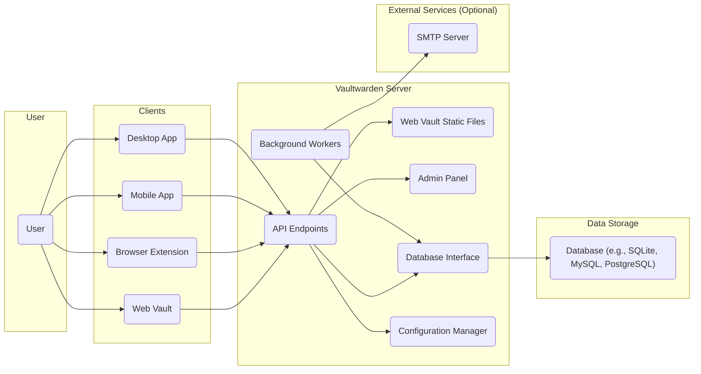
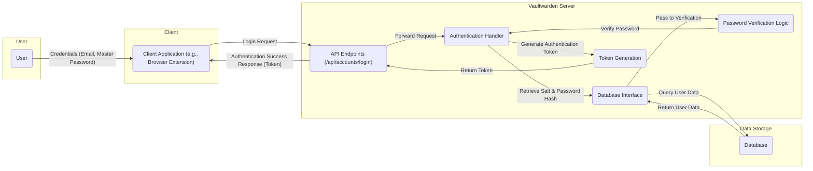
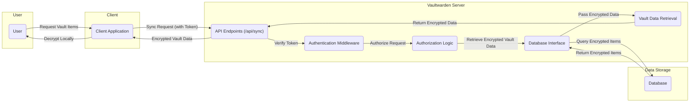
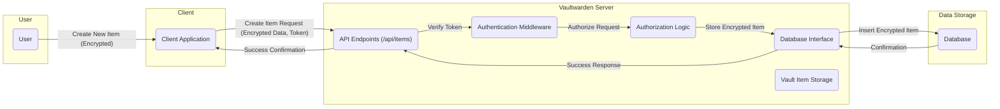

# Project Design Document: Vaultwarden

**Version:** 1.1
**Date:** October 26, 2023
**Author:** AI Architecture Expert

## 1. Introduction

This document provides an enhanced architectural design of the Vaultwarden project, an open-source Bitwarden-compatible password manager server implemented in Rust. This iteration builds upon the previous version, offering greater detail and clarity regarding the system's components, interactions, and data flow. The primary objective remains to provide a robust foundation for subsequent threat modeling activities.

## 2. Goals and Objectives

*   Provide a clear and comprehensive architectural description of the Vaultwarden application.
*   Elaborate on the responsibilities and interactions of key components.
*   Detail the data flow within the system for critical operations with enhanced clarity.
*   Emphasize security-relevant aspects of the design, providing more specific examples.
*   Serve as a refined and more detailed basis for identifying potential security vulnerabilities through threat modeling.

## 3. Target Audience

This document is intended for a technical audience, including:

*   Security engineers and architects responsible for threat modeling and security assessments.
*   Software developers contributing to the Vaultwarden project, requiring a deep understanding of its architecture.
*   System administrators involved in deploying, configuring, and maintaining Vaultwarden instances.
*   Technical individuals seeking an in-depth understanding of Vaultwarden's internal workings.

## 4. System Overview

Vaultwarden is a resource-efficient, alternative implementation of the Bitwarden server API. Built with Rust and the Rocket web framework, it aims to provide essential password management functionalities while minimizing resource consumption. Users interact with Vaultwarden through official Bitwarden clients (web vault, browser extensions, mobile apps, desktop apps) to securely store, manage, and access their sensitive credentials. The server acts as a central repository and synchronization point for this data.

## 5. Architectural Design

### 5.1. High-Level Architecture

### 5.2. Detailed Component Description

*   **User:** The individual who utilizes the Vaultwarden system to manage their digital credentials and secure notes.
*   **Clients:** The applications through which users interact with the Vaultwarden server. These are the official Bitwarden clients:
    *   **Web Vault:** A client-side web application served by Vaultwarden for managing passwords through a browser.
    *   **Browser Extension:** Integrates directly into web browsers, offering features like auto-fill and password generation.
    *   **Mobile App:** Native applications for iOS and Android platforms, providing access to vaults on mobile devices.
    *   **Desktop App:** Native applications for desktop operating systems, offering similar functionality to the mobile apps.
*   **Vaultwarden Server:** The core application, responsible for processing client requests, managing user data, and enforcing security policies. It comprises several key sub-components:
    *   **API Endpoints:** Exposes a RESTful API that closely mirrors the official Bitwarden server API. This handles authentication, authorization, data synchronization, and other client requests. Examples include endpoints for login (`/api/accounts/login`), item retrieval (`/api/sync`), and item creation (`/api/items`).
    *   **Web Vault Static Files:** Serves the static assets (HTML, CSS, JavaScript) required for the web vault interface. These files are typically pre-built and served directly.
    *   **Admin Panel:** A web-based interface accessible to administrators for managing the Vaultwarden instance. This includes user management, server settings, and potentially viewing logs.
    *   **Database Interface:** Provides an abstraction layer for interacting with the underlying database system. This allows Vaultwarden to support different database backends (SQLite, MySQL, PostgreSQL) without significant code changes.
    *   **Background Workers:**  Handles asynchronous tasks that don't need immediate processing. Examples include sending emails for password resets, invitations to organizations, and potentially scheduled maintenance tasks.
    *   **Configuration Manager:** Responsible for loading and managing the server's configuration settings, which can be sourced from environment variables, configuration files, or command-line arguments.
*   **Data Storage:** The persistent storage mechanism for user data. This includes encrypted vault items, user accounts, organization data, and server settings. Supported database systems offer different characteristics in terms of scalability and performance:
    *   **SQLite:** A file-based database, suitable for single-user or small deployments due to its simplicity.
    *   **MySQL:** A more robust relational database management system (RDBMS), suitable for larger deployments.
    *   **PostgreSQL:** Another powerful open-source RDBMS, often preferred for its advanced features and reliability.
*   **External Services (Optional):** Services that Vaultwarden may interact with:
    *   **SMTP Server:** Used by background workers to send emails, such as password reset links and invitation notifications. This is an optional dependency, and Vaultwarden can be configured to use an external SMTP server.

## 6. Data Flow

### 6.1. User Login Process

**Detailed Steps:**

*   The user enters their registered email address and master password into the client application.
*   The client application sends a login request to the `/api/accounts/login` endpoint on the Vaultwarden server via an HTTPS POST request.
*   The API endpoint routes the request to the `Authentication Handler`.
*   The `Authentication Handler` uses the `Database Interface` to query the `Database` for the user's record based on the provided email address.
*   The `Database` returns the stored salt and the hashed and encrypted master password.
*   The `Database Interface` passes this information to the `Password Verification Logic`.
*   The `Password Verification Logic` hashes the provided master password with the retrieved salt and compares it to the stored hash.
*   If the hashes match, the `Authentication Handler` instructs the `Token Generation` component to create a secure authentication token (e.g., a JWT).
*   The `Token Generation` component creates the token and returns it to the `Authentication Handler`.
*   The `Authentication Handler` sends an authentication success response back to the client, including the generated token.

### 6.2. Retrieving and Decrypting Vault Items

**Detailed Steps:**

*   The user initiates a request to retrieve their vault items through the client application.
*   The client application sends a sync request to the `/api/sync` endpoint on the Vaultwarden server, including the previously obtained authentication token in the request headers.
*   The `Authentication Middleware` intercepts the request and validates the provided authentication token.
*   The `Authorization Logic` verifies that the token is valid and has the necessary permissions to access the requested resources.
*   Upon successful authorization, the `Database Interface` is used by the `Vault Data Retrieval` component to query the `Database` for the user's encrypted vault items.
*   The `Database` returns the encrypted vault data.
*   The `Vault Data Retrieval` component passes the encrypted data back to the API endpoint.
*   The API endpoint sends the encrypted vault data back to the client application.
*   The client application, using the user's master password (available only on the client-side), decrypts the received vault data locally.

### 6.3. Storing and Encrypting a New Vault Item

**Detailed Steps:**

*   The user creates a new vault item within the client application. The item is encrypted locally on the client-side using the user's master password.
*   The client application sends a request to the `/api/items` endpoint on the Vaultwarden server, including the encrypted item data and the authentication token.
*   The `Authentication Middleware` verifies the provided authentication token.
*   The `Authorization Logic` confirms that the token is valid and has the necessary permissions to create new items.
*   The `Vault Item Storage` component receives the encrypted item data and uses the `Database Interface` to interact with the `Database`.
*   The `Database Interface` inserts the encrypted vault item into the `Database`.
*   The `Database` confirms the successful insertion.
*   The `Vault Item Storage` component sends a success response back to the API endpoint.
*   The API endpoint relays the success confirmation to the client application.

## 7. Security Considerations

This section details key security considerations for the Vaultwarden project, categorized for clarity:

*   **Authentication and Authorization:**
    *   **Master Password Hashing:** User master passwords are never stored in plaintext. They are salted and hashed using a strong cryptographic hash function before being stored in the database.
    *   **Authentication Tokens:**  After successful login, the server issues authentication tokens (e.g., JWTs) to clients. These tokens are used for subsequent requests, avoiding the need to repeatedly transmit master credentials.
    *   **Token Security:**  Tokens should be transmitted securely (HTTPS) and have a reasonable expiration time to limit the window of opportunity for misuse if intercepted.
    *   **Authorization Enforcement:**  The server enforces authorization checks on all API endpoints to ensure that users can only access and modify data they are permitted to.
*   **Data Security:**
    *   **End-to-End Encryption:** Vaultwarden leverages the client-side encryption provided by Bitwarden clients. Sensitive data (passwords, notes, etc.) is encrypted on the client's device before being transmitted to the server and remains encrypted at rest in the database. The server itself does not have access to the unencrypted data.
    *   **HTTPS Enforcement:** Deploying Vaultwarden with HTTPS is critical to encrypt communication between clients and the server, protecting against eavesdropping and man-in-the-middle attacks.
    *   **Database Encryption at Rest (Optional):** While Vaultwarden encrypts data at the application level, further securing the underlying database with encryption at rest provides an additional layer of protection.
*   **Operational Security:**
    *   **Input Validation:**  The server must implement robust input validation on all API endpoints to prevent injection attacks (e.g., SQL injection, cross-site scripting).
    *   **Rate Limiting:** Implementing rate limiting on authentication and other critical API endpoints can help mitigate brute-force attacks and denial-of-service attempts.
    *   **Admin Panel Protection:** Access to the admin panel should be strictly controlled and secured, potentially with separate authentication mechanisms or IP address restrictions.
    *   **Regular Security Audits and Penetration Testing:** Periodic security assessments are crucial for identifying potential vulnerabilities in the code and infrastructure.
    *   **Dependency Management:** Keeping dependencies up-to-date is essential to patch known security vulnerabilities in third-party libraries.
    *   **Secure Configuration Practices:**  Properly configuring the server and its dependencies (e.g., database) according to security best practices is vital. This includes using strong passwords, disabling unnecessary features, and applying security patches.
*   **Resilience and Availability:**
    *   **Regular Backups:** Implementing a robust backup strategy for the database is crucial for disaster recovery.
    *   **Consideration for High Availability:** For critical deployments, consider implementing strategies for high availability, such as database replication and load balancing.

## 8. Deployment Considerations

*   **Containerization (Docker):**  Utilizing Docker for deployment is highly recommended due to its ease of setup, portability, and isolation. Official Docker images are available.
*   **Reverse Proxy Configuration:** Employing a reverse proxy (e.g., Nginx, Apache) in front of Vaultwarden is best practice for handling SSL termination, load balancing, request routing, and adding security headers.
*   **Database Selection and Configuration:** The choice of database (SQLite, MySQL, PostgreSQL) should be based on the anticipated load and scalability requirements. Proper database configuration, including strong credentials and access controls, is essential.
*   **Resource Allocation:**  Appropriate allocation of CPU, memory, and storage resources is necessary for optimal performance and stability. Resource requirements will vary depending on the number of users and the volume of data.
*   **Backup and Recovery Procedures:**  Establish and regularly test backup and recovery procedures for the database to ensure data can be restored in case of failure.
*   **Monitoring and Logging:** Implement monitoring and logging solutions to track server performance, identify potential issues, and aid in security investigations.

## 9. Future Considerations

*   **Enhanced Admin Panel Functionality:** Expanding the admin panel with more advanced features for user management, auditing, and server configuration.
*   **Improved Logging and Auditing Capabilities:** Implementing more detailed and configurable logging and auditing mechanisms for enhanced security monitoring and compliance.
*   **Support for Additional Authentication Factors:** Exploring server-side integration with multi-factor authentication methods beyond client-side implementations.
*   **Performance Optimization and Scalability Enhancements:** Continuously optimizing the server's performance and exploring strategies for improved scalability to handle larger user bases.
*   **Integration with Hardware Security Modules (HSMs):** Investigating the potential for integrating with HSMs for enhanced key management and security.

## 10. Conclusion

This enhanced design document provides a more detailed and comprehensive understanding of the Vaultwarden project's architecture. By elaborating on the components, data flow, and security considerations, this document serves as a valuable and improved resource for security professionals conducting threat modeling and for anyone involved in the development, deployment, and maintenance of Vaultwarden. The added detail and categorization of security aspects aim to facilitate a more thorough and effective security analysis.