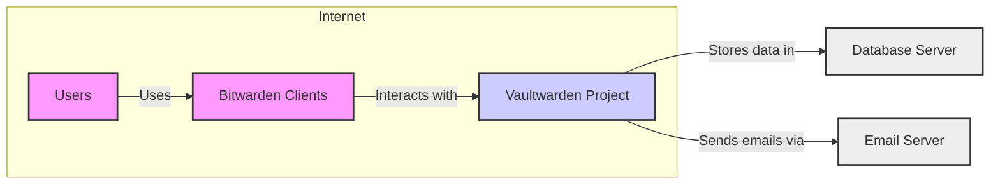
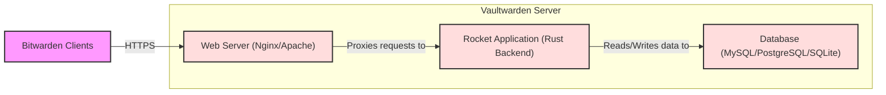

# BUSINESS POSTURE

This project, Vaultwarden, aims to provide a lightweight, self-hosted password management solution compatible with the Bitwarden ecosystem. It targets individuals and organizations who prefer to host their password management infrastructure on their own servers, offering greater control over their sensitive data and potentially reducing costs compared to using the official Bitwarden cloud service.

Business Priorities and Goals:
- Provide a functional and reliable password management solution.
- Ensure compatibility with Bitwarden clients (browsers, mobile apps, desktop apps).
- Offer a resource-efficient alternative to the official Bitwarden server.
- Maintain an active open-source project with community support.

Business Risks:
- Data breaches due to vulnerabilities in the Vaultwarden software or its deployment environment.
- Loss of user trust if security incidents occur.
- Availability issues impacting users' access to their passwords.
- Difficulty in keeping up with security updates and changes in the Bitwarden ecosystem.
- Potential for misconfiguration by self-hosting users leading to security weaknesses.

# SECURITY POSTURE

Existing Security Controls:
- security control: HTTPS encryption for communication between clients and the Vaultwarden server. Implemented at the web server level (e.g., Nginx, Apache) and expected to be configured by the user during deployment.
- security control: Database encryption for storing sensitive data at rest. Implemented using database-level encryption features (e.g., AES-256 encryption in MySQL/MariaDB or similar in other supported databases). Configuration is part of the Vaultwarden setup process.
- security control: Argon2id key derivation function for hashing master passwords. Implemented within the Vaultwarden backend to securely store user master passwords.
- security control: Regular security updates and patches are released by the Vaultwarden maintainers. Described in release notes and community communication channels.
- security control: Open source codebase allows for community security audits and vulnerability reporting. Publicly available on GitHub.

Accepted Risks:
- accepted risk: Self-hosting introduces variability in deployment environments, potentially leading to insecure configurations by users. Mitigation relies on documentation and community support.
- accepted risk: Reliance on third-party components (database, web server, operating system) for security. Mitigation involves recommending secure configurations and staying up-to-date with security advisories for these components.
- accepted risk: Vulnerabilities might be discovered in the Vaultwarden codebase. Mitigation relies on proactive security practices, community vulnerability reporting, and timely patching.

Recommended Security Controls:
- security control: Implement automated security scanning (SAST/DAST) in the CI/CD pipeline to identify potential vulnerabilities early in the development process.
- security control: Conduct regular penetration testing or security audits by external security experts to identify and address security weaknesses.
- security control: Provide and promote hardened deployment configurations and best practices for self-hosting users.
- security control: Implement rate limiting and brute-force protection mechanisms to mitigate password guessing attacks.
- security control: Implement Content Security Policy (CSP) and other security headers to protect against client-side vulnerabilities.

Security Requirements:
- Authentication:
    - requirement: Secure authentication mechanism to verify user identity using master password and optional two-factor authentication (2FA).
    - requirement: Support for various 2FA methods (TOTP, U2F/WebAuthn).
    - requirement: Protection against brute-force attacks on login attempts.
- Authorization:
    - requirement: Role-based access control to manage organizational users and access to shared vaults (if organizational features are implemented).
    - requirement: Proper authorization checks to ensure users can only access data they are permitted to view or modify.
- Input Validation:
    - requirement: Strict input validation on all user-provided data to prevent injection attacks (SQL injection, cross-site scripting, etc.).
    - requirement: Input sanitization and encoding to mitigate cross-site scripting vulnerabilities.
- Cryptography:
    - requirement: Use strong cryptographic algorithms and libraries for all cryptographic operations (encryption, hashing, signing).
    - requirement: Secure key management practices for encryption keys.
    - requirement: Protect sensitive data in transit and at rest using encryption.

# DESIGN

## C4 CONTEXT



Context Diagram Elements:

- Element:
    - Name: Users
    - Type: Person
    - Description: Individuals or organizations who use Vaultwarden to manage their passwords and other sensitive information.
    - Responsibilities: Securely manage their master password, use strong passwords, enable 2FA, and keep their client applications updated.
    - Security controls: Strong master password, 2FA enabled, secure devices, up-to-date client applications.

- Element:
    - Name: Vaultwarden Project
    - Type: Software System
    - Description: The self-hosted password management server, compatible with Bitwarden clients. It stores encrypted user data and provides API for clients to access and manage passwords.
    - Responsibilities: Securely store user data, authenticate users, authorize access, provide API endpoints for clients, and send emails for password resets and notifications.
    - Security controls: HTTPS encryption, database encryption, Argon2id password hashing, input validation, secure coding practices, regular security updates.

- Element:
    - Name: Bitwarden Clients
    - Type: Software System
    - Description: Official Bitwarden client applications (browser extensions, mobile apps, desktop apps) that users use to interact with the Vaultwarden server.
    - Responsibilities: Securely communicate with the Vaultwarden server, encrypt and decrypt data locally, provide user interface for password management.
    - Security controls: End-to-end encryption, secure storage of local data, regular updates from Bitwarden.

- Element:
    - Name: Email Server
    - Type: External System
    - Description: An external email server used by Vaultwarden to send emails, such as password reset emails and notification emails.
    - Responsibilities: Reliably deliver emails sent by Vaultwarden.
    - Security controls: SPF, DKIM, DMARC email security protocols (configured by the email server provider and Vaultwarden administrator).

- Element:
    - Name: Database Server
    - Type: External System
    - Description: A database server (e.g., MySQL, PostgreSQL, SQLite) used by Vaultwarden to store persistent data, including encrypted user vaults, settings, and user accounts.
    - Responsibilities: Securely store and manage data, ensure data integrity and availability.
    - Security controls: Database access controls, database encryption, regular backups, security updates for the database server.

## C4 CONTAINER



Container Diagram Elements:

- Element:
    - Name: Web Server (Nginx/Apache)
    - Type: Web Server
    - Description: A reverse proxy and web server that handles HTTPS termination, static content serving, and request routing to the Rocket application.
    - Responsibilities: HTTPS encryption and decryption, serving static files, load balancing (optional), request routing, basic security features (e.g., rate limiting, security headers).
    - Security controls: HTTPS configuration, TLS certificate management, security headers (HSTS, CSP, X-Frame-Options, etc.), rate limiting, web server access logs, regular security updates.

- Element:
    - Name: Rocket Application (Rust Backend)
    - Type: Application
    - Description: The core Vaultwarden application written in Rust using the Rocket framework. It handles API requests, authentication, authorization, data encryption/decryption, and business logic.
    - Responsibilities: User authentication and authorization, API endpoint handling, data validation, data encryption and decryption, interaction with the database, business logic for password management features.
    - Security controls: Input validation, secure coding practices, Argon2id password hashing, database encryption integration, access control within the application, application-level logging, regular security updates and vulnerability patching.

- Element:
    - Name: Database (MySQL/PostgreSQL/SQLite)
    - Type: Database
    - Description: A relational database system used to persistently store Vaultwarden data, including encrypted vaults, user accounts, and settings.
    - Responsibilities: Data persistence, data integrity, data retrieval, database access control.
    - Security controls: Database access controls (user permissions), database encryption at rest, regular database backups, database audit logs, security updates for the database system, secure database configuration.

- Element:
    - Name: Bitwarden Clients
    - Type: Client Application
    - Description: Official Bitwarden client applications that communicate with the Vaultwarden server via HTTPS API.
    - Responsibilities: User interface for password management, local data encryption/decryption, secure communication with the server.
    - Security controls: End-to-end encryption, secure local storage, client-side input validation, regular updates from Bitwarden.

## DEPLOYMENT

Deployment Architecture: Docker Container on Linux Server

```mermaid
flowchart LR
  subgraph Linux Server
    A[Docker Host]
    subgraph Docker Container
      B[Vaultwarden Container]
      C[Web Server (Nginx)]
      D[Rocket App]
    end
    E[Database Server (External or Docker)]
  end
  F[Internet]

  F -- HTTPS --> A
  A -- Routes to --> B
  B -- Contains --> C
  B -- Contains --> D
  D -- Connects to --> E

  style A fill:#eee,stroke:#333,stroke-width:2px
  style B fill:#fdd,stroke:#333,stroke-width:2px
  style C fill:#fdd,stroke:#333,stroke-width:2px
  style D fill:#fdd,stroke:#333,stroke-width:2px
  style E fill:#eee,stroke:#333,stroke-width:2px
  style F fill:#f9f,stroke:#333,stroke-width:2px
```

Deployment Diagram Elements:

- Element:
    - Name: Linux Server
    - Type: Infrastructure
    - Description: A physical or virtual Linux server that hosts the Vaultwarden Docker container and potentially the database server.
    - Responsibilities: Provide the underlying infrastructure for running Vaultwarden, including compute resources, network connectivity, and storage.
    - Security controls: Operating system hardening, firewall configuration, intrusion detection/prevention systems, regular security updates, physical security of the server (if applicable).

- Element:
    - Name: Docker Host
    - Type: Container Runtime Environment
    - Description: The Docker runtime environment installed on the Linux server, responsible for managing and running Docker containers.
    - Responsibilities: Container orchestration, resource management for containers, container isolation.
    - Security controls: Docker security best practices, container image security scanning, resource limits for containers, regular Docker updates.

- Element:
    - Name: Vaultwarden Container
    - Type: Docker Container
    - Description: A Docker container encapsulating the Vaultwarden application, including the web server (Nginx) and the Rocket backend application.
    - Responsibilities: Run the Vaultwarden application in an isolated environment, manage dependencies, provide a consistent deployment unit.
    - Security controls: Container image built from trusted base images, minimal container image size, security scanning of container image, principle of least privilege for container processes.

- Element:
    - Name: Web Server (Nginx)
    - Type: Software Component (within Container)
    - Description: Nginx web server running inside the Docker container, acting as a reverse proxy and serving static content.
    - Responsibilities: HTTPS termination, request routing, static content serving within the container.
    - Security controls: Nginx security configuration within the container, minimal modules enabled, regular updates of Nginx within the container image.

- Element:
    - Name: Rocket App
    - Type: Software Component (within Container)
    - Description: The Rocket application (Rust backend) running inside the Docker container, handling the core Vaultwarden logic.
    - Responsibilities: Application logic, API handling, data processing within the container.
    - Security controls: Application-level security controls as described in the Container Diagram section, secure coding practices, dependency management within the container.

- Element:
    - Name: Database Server (External or Docker)
    - Type: Infrastructure/Software
    - Description: The database server (MySQL, PostgreSQL, or SQLite) can be deployed either externally to the Docker host or as another Docker container.
    - Responsibilities: Data persistence and management for Vaultwarden.
    - Security controls: Database security controls as described in the Container Diagram section, network security if database is external, secure communication between Vaultwarden container and database server.

## BUILD

Build Process Diagram:

```mermaid
flowchart LR
    A[Developer] --> B{Code Changes};
    B --> C[GitHub Repository];
    C --> D[GitHub Actions CI];
    D --> E{Build & Test};
    E -- Success --> F{Security Scans (SAST, Linters)};
    F -- No Issues --> G[Docker Image Build];
    G --> H[Docker Registry];

    style A fill:#f9f,stroke:#333,stroke-width:2px
    style C fill:#eee,stroke:#333,stroke-width:2px
    style D fill:#eee,stroke:#333,stroke-width:2px
    style H fill:#eee,stroke:#333,stroke-width:2px
```

Build Process Description:

1. Developer: Developers write code changes and commit them to the GitHub repository.
2. Code Changes: Code modifications are pushed to the GitHub repository.
3. GitHub Repository: The central repository hosting the Vaultwarden source code.
4. GitHub Actions CI: GitHub Actions is used as the CI/CD system to automate the build, test, and security scanning process.
5. Build & Test: The CI pipeline automatically builds the Vaultwarden application and runs automated tests (unit tests, integration tests).
6. Security Scans (SAST, Linters): After successful build and tests, automated security scans are performed, including Static Application Security Testing (SAST) and code linters to identify potential vulnerabilities and code quality issues.
7. Docker Image Build: If security scans pass without critical issues, a Docker image of Vaultwarden is built.
8. Docker Registry: The built Docker image is pushed to a Docker registry (e.g., Docker Hub, GitHub Container Registry) for distribution.

Build Process Security Controls:
- security control: Automated build process using GitHub Actions CI to ensure consistency and repeatability.
- security control: Source code hosted on GitHub, providing version control and transparency.
- security control: Automated testing (unit tests, integration tests) to verify code functionality and prevent regressions.
- security control: Static Application Security Testing (SAST) tools integrated into the CI pipeline to detect potential code-level vulnerabilities.
- security control: Code linters to enforce code quality and coding standards, reducing the likelihood of introducing vulnerabilities.
- security control: Docker image built from minimal and trusted base images to reduce the attack surface.
- security control: Docker image signing (optional) to ensure image integrity and authenticity.
- security control: Access control to the Docker registry to prevent unauthorized image modifications or distribution.

# RISK ASSESSMENT

Critical Business Processes:
- Secure storage and retrieval of user credentials and sensitive information.
- User authentication and authorization to access their vaults.
- Password generation and management features.
- Secure sharing of credentials (if implemented).

Data Sensitivity:
- Highly Sensitive: User master passwords (hashed and salted), encrypted user vaults containing passwords, notes, and other sensitive data.
- Sensitive: User email addresses, usernames, server configuration settings, audit logs.

Data to Protect:
- Confidentiality: Protecting user credentials and sensitive data from unauthorized access and disclosure.
- Integrity: Ensuring the accuracy and completeness of user data and preventing unauthorized modifications.
- Availability: Maintaining access to user data and the Vaultwarden service when needed.

# QUESTIONS & ASSUMPTIONS

Questions:
- What specific SAST and DAST tools are currently used or planned to be used in the CI/CD pipeline?
- Are there regular penetration tests or security audits conducted for the Vaultwarden project?
- What is the process for handling and disclosing security vulnerabilities reported by the community or found internally?
- What are the recommended hardened deployment configurations for different environments (e.g., Docker, bare metal)?
- Is there a formal security incident response plan in place for the Vaultwarden project?

Assumptions:
- The primary deployment model is self-hosting by individuals and organizations.
- Users are responsible for securing their deployment environment (server, network, database).
- Bitwarden clients are considered secure and trusted.
- The open-source nature of the project allows for community security reviews and contributions.
- The development team is committed to addressing security vulnerabilities and releasing timely updates.