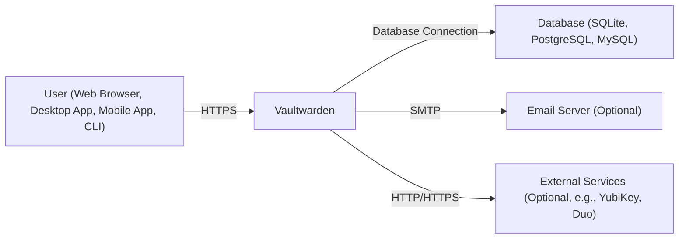
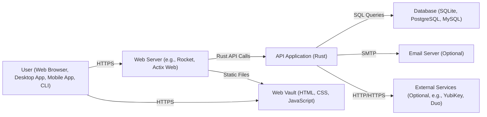
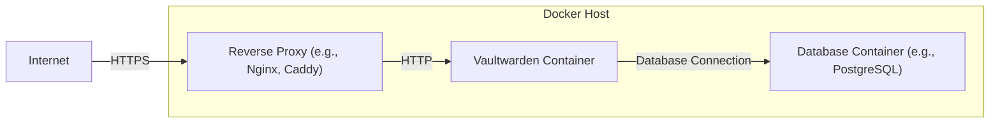

# BUSINESS POSTURE

Business Priorities and Goals:

*   Provide a lightweight, easy-to-deploy, and self-hostable alternative to the official Bitwarden password manager server.
*   Minimize resource consumption (CPU, RAM) compared to the official implementation.
*   Maintain compatibility with official Bitwarden clients across all platforms (web, desktop, mobile, browser extensions).
*   Offer a simplified setup and maintenance experience for self-hosters.
*   Enable users to securely store and manage their passwords and other sensitive data.
*   Provide a secure and private password management solution, giving users full control over their data.

Most Important Business Risks:

*   Data Breach: Unauthorized access to the user's password database, potentially exposing all stored credentials. This is the most critical risk.
*   Data Loss: Loss of the user's password database due to server failure, data corruption, or other unforeseen events.
*   Service Unavailability: Inability for users to access their passwords when needed, potentially disrupting their workflow or locking them out of critical accounts.
*   Compromised Client Compatibility: Breaking changes that render official Bitwarden clients incompatible, forcing users to migrate or lose access.
*   Reputational Damage: Security vulnerabilities or data breaches could severely damage the project's reputation and erode user trust.
*   Legal and Compliance Issues: Failure to comply with relevant data privacy regulations (e.g., GDPR) could lead to legal penalties.

# SECURITY POSTURE

Existing Security Controls:

*   security control: Uses Rust's memory safety features to prevent common vulnerabilities like buffer overflows and dangling pointers. (Implemented in the source code.)
*   security control: Supports HTTPS to encrypt communication between clients and the server. (Described in the documentation and configuration options.)
*   security control: Offers optional two-factor authentication (2FA) support, compatible with Bitwarden clients. (Described in the documentation and configuration options.)
*   security control: Implements rate limiting to mitigate brute-force attacks. (Implemented in the source code and configurable.)
*   security control: Provides options for data backup and restore. (Described in the documentation.)
*   security control: Uses Argon2id for password hashing, a memory-hard and computationally expensive algorithm. (Implemented in the source code.)
*   security control: Supports database encryption at rest, depending on the database backend used (e.g., SQLite with WAL mode or a separate database server like PostgreSQL). (Described in documentation and depends on configuration.)
*   security control: Web Vault can be disabled. (Described in the documentation and configuration options.)
*   security control: Admin interface can be protected with a strong password. (Described in the documentation and configuration options.)

Accepted Risks:

*   accepted risk: Relies on the security of third-party dependencies (Rust libraries, database drivers, etc.). While the project aims to use well-vetted dependencies, vulnerabilities in these components could still pose a risk.
*   accepted risk: The default configuration may not be fully secure for all deployment scenarios. Users are responsible for reviewing and adjusting the configuration to meet their specific security needs.
*   accepted risk: Self-hosting inherently carries risks. Users are responsible for securing their server infrastructure and keeping the software up-to-date.
*   accepted risk: While the project strives for compatibility with Bitwarden clients, subtle differences or bugs could exist that impact security or functionality.

Recommended Security Controls:

*   security control: Implement a Content Security Policy (CSP) to mitigate cross-site scripting (XSS) attacks.
*   security control: Implement HTTP Strict Transport Security (HSTS) to enforce HTTPS connections.
*   security control: Regularly conduct security audits and penetration testing to identify and address potential vulnerabilities.
*   security control: Implement a robust logging and monitoring system to detect and respond to suspicious activity.
*   security control: Provide clear and concise security documentation to guide users in securely deploying and configuring Vaultwarden.
*   security control: Implement a vulnerability disclosure program to encourage responsible reporting of security issues.

Security Requirements:

*   Authentication:
    *   Support strong password policies (length, complexity).
    *   Enforce 2FA when enabled by the user.
    *   Protect against brute-force attacks with rate limiting and account lockout.
    *   Securely store and manage user authentication tokens.
    *   Provide a secure password reset mechanism.

*   Authorization:
    *   Implement role-based access control (RBAC) for administrative functions.
    *   Ensure users can only access their own data.
    *   Prevent unauthorized access to sensitive configuration settings.

*   Input Validation:
    *   Validate all user inputs to prevent injection attacks (SQL injection, XSS, etc.).
    *   Sanitize data before displaying it in the web interface.
    *   Reject invalid or malicious requests.

*   Cryptography:
    *   Use strong, industry-standard cryptographic algorithms for password hashing (Argon2id), encryption (AES), and key derivation.
    *   Securely manage cryptographic keys.
    *   Protect against known cryptographic attacks (e.g., timing attacks).
    *   Use HTTPS for all communication.

# DESIGN

## C4 CONTEXT

C4 Context Element List:

*   Element:
    *   Name: User
    *   Type: Person
    *   Description: A person who uses Vaultwarden to store and manage their passwords.
    *   Responsibilities: Authenticates with Vaultwarden, manages their password vault, interacts with the web interface, desktop app, mobile app, or CLI.
    *   Security controls: Strong passwords, 2FA (optional), client-side encryption (handled by Bitwarden clients).

*   Element:
    *   Name: Vaultwarden
    *   Type: Software System
    *   Description: The core Vaultwarden application, providing the API and web interface.
    *   Responsibilities: Handles user authentication, manages password data, provides API endpoints for Bitwarden clients, serves the web interface.
    *   Security controls: Rate limiting, password hashing (Argon2id), input validation, HTTPS, optional 2FA support.

*   Element:
    *   Name: Database
    *   Type: Software System
    *   Description: Stores user data, including encrypted password vaults.
    *   Responsibilities: Persistently stores user data, provides data access to Vaultwarden.
    *   Security controls: Database encryption at rest (depending on configuration), access control (database user credentials), regular backups.

*   Element:
    *   Name: Email Server
    *   Type: Software System
    *   Description: Used for sending emails, such as password reset requests (optional).
    *   Responsibilities: Sends emails on behalf of Vaultwarden.
    *   Security controls: Secure SMTP configuration (TLS), sender authentication (SPF, DKIM, DMARC).

*   Element:
    *   Name: External Services
    *   Type: Software System
    *   Description: External services used for 2FA or other integrations (optional).
    *   Responsibilities: Provides specific functionality (e.g., YubiKey authentication, Duo push notifications).
    *   Security controls: Secure communication (HTTPS), API keys or other authentication mechanisms.

## C4 CONTAINER

C4 Container Element List:

*   Element:
    *   Name: User
    *   Type: Person
    *   Description: A person who uses Vaultwarden to store and manage their passwords.
    *   Responsibilities: Authenticates with Vaultwarden, manages their password vault, interacts with the web interface, desktop app, mobile app, or CLI.
    *   Security controls: Strong passwords, 2FA (optional), client-side encryption (handled by Bitwarden clients).

*   Element:
    *   Name: Web Server
    *   Type: Container: Web Server
    *   Description: Handles incoming HTTP requests and routes them to the appropriate component.
    *   Responsibilities: Serves static files (Web Vault), proxies API requests to the API Application.
    *   Security controls: HTTPS configuration, request filtering, potentially a reverse proxy (e.g., Nginx, Caddy) for additional security features.

*   Element:
    *   Name: API Application
    *   Type: Container: Application
    *   Description: The core Vaultwarden application logic, written in Rust.
    *   Responsibilities: Handles user authentication, manages password data, provides API endpoints for Bitwarden clients.
    *   Security controls: Rate limiting, password hashing (Argon2id), input validation, secure coding practices (Rust's memory safety).

*   Element:
    *   Name: Database
    *   Type: Container: Database
    *   Description: Stores user data, including encrypted password vaults.
    *   Responsibilities: Persistently stores user data, provides data access to the API Application.
    *   Security controls: Database encryption at rest (depending on configuration), access control (database user credentials), regular backups.

*   Element:
    *   Name: Email Server
    *   Type: Container: Email Server
    *   Description: Used for sending emails, such as password reset requests (optional).
    *   Responsibilities: Sends emails on behalf of Vaultwarden.
    *   Security controls: Secure SMTP configuration (TLS), sender authentication (SPF, DKIM, DMARC).

*   Element:
    *   Name: External Services
    *   Type: Container: External Service
    *   Description: External services used for 2FA or other integrations (optional).
    *   Responsibilities: Provides specific functionality (e.g., YubiKey authentication, Duo push notifications).
    *   Security controls: Secure communication (HTTPS), API keys or other authentication mechanisms.

*   Element:
    *   Name: Web Vault
    *   Type: Container: Web Application
    *   Description: The static files for the web interface, served by the Web Server.
    *   Responsibilities: Provides a user interface for interacting with Vaultwarden.
    *   Security controls: CSP, HSTS, secure cookie attributes.

## DEPLOYMENT

Possible Deployment Solutions:

1.  Bare Metal/Virtual Machine: Deploying directly onto a physical or virtual server.
2.  Docker Container: Packaging Vaultwarden and its dependencies into a Docker container.
3.  Docker Compose: Using Docker Compose to define and manage multi-container deployments (e.g., Vaultwarden, database, web server).
4.  Kubernetes: Deploying Vaultwarden to a Kubernetes cluster for scalability and resilience.
5.  Cloud-Specific Services: Using managed services like AWS ECS, Azure Container Instances, or Google Cloud Run.

Chosen Deployment Solution (Docker Compose):

Deployment Element List:

*   Element:
    *   Name: Internet
    *   Type: External Entity
    *   Description: The public internet.
    *   Responsibilities: Provides access to the Vaultwarden instance.
    *   Security controls: Firewall, intrusion detection/prevention systems.

*   Element:
    *   Name: Reverse Proxy
    *   Type: Node: Software
    *   Description: A reverse proxy server (e.g., Nginx, Caddy) that handles HTTPS termination and forwards requests to the Vaultwarden container.
    *   Responsibilities: Handles HTTPS encryption, provides load balancing (optional), protects the Vaultwarden container from direct exposure to the internet.
    *   Security controls: HTTPS configuration, rate limiting, web application firewall (WAF) (optional).

*   Element:
    *   Name: Vaultwarden Container
    *   Type: Node: Docker Container
    *   Description: A Docker container running the Vaultwarden application.
    *   Responsibilities: Runs the Vaultwarden application, handles user requests, interacts with the database.
    *   Security controls: Container security best practices (e.g., running as a non-root user, using a minimal base image).

*   Element:
    *   Name: Database Container
    *   Type: Node: Docker Container
    *   Description: A Docker container running the database server (e.g., PostgreSQL).
    *   Responsibilities: Stores user data, provides data access to the Vaultwarden container.
    *   Security controls: Database security best practices (e.g., strong passwords, access control, encryption at rest).

*   Element:
    *   Name: Docker Host
    *   Type: Node: Server
    *   Description: The physical or virtual server that hosts the Docker containers.
    *   Responsibilities: Provides the runtime environment for the Docker containers.
    *   Security controls: Operating system security best practices (e.g., regular updates, firewall, intrusion detection/prevention systems).

## BUILD

```mermaid
graph LR
    Developer["Developer"] -- "Git Push" --> GitRepository["Git Repository (e.g., GitHub)"]
    GitRepository -- "Webhook Trigger" --> CIEnvironment["CI Environment (e.g., GitHub Actions)"]
    CIEnvironment -- "Cargo Build" --> BuildStep1["Build (Rust Compilation)"]
    BuildStep1 -- "Cargo Test" --> BuildStep2["Tests (Unit, Integration)"]
    BuildStep2 -- "Security Checks" --> BuildStep3["Security Checks (SAST, Dependency Scanning)"]
    BuildStep3 -- "Docker Build" --> BuildStep4["Docker Image Build"]
    BuildStep4 -- "Docker Push" --> ImageRegistry["Image Registry (e.g., Docker Hub)"]

```

Build Process Description:

1.  Developer commits and pushes code changes to a Git repository (e.g., GitHub).
2.  A webhook triggers a build in a CI environment (e.g., GitHub Actions).
3.  The CI environment checks out the code.
4.  The Rust code is compiled using `cargo build`.
5.  Unit and integration tests are run using `cargo test`.
6.  Security checks are performed:
    *   SAST (Static Application Security Testing): Tools like Clippy and RustSec are used to analyze the code for potential vulnerabilities.
    *   Dependency Scanning: Tools like `cargo audit` are used to identify known vulnerabilities in project dependencies.
7.  If all checks pass, a Docker image is built using a Dockerfile.
8.  The Docker image is pushed to an image registry (e.g., Docker Hub, GitHub Container Registry).

Security Controls in Build Process:

*   security control: Use of a CI environment (e.g., GitHub Actions) to automate the build process and ensure consistency.
*   security control: SAST (Static Application Security Testing) to identify potential vulnerabilities in the code.
*   security control: Dependency scanning to identify known vulnerabilities in project dependencies.
*   security control: Use of a Dockerfile to create reproducible builds and minimize the attack surface of the container image.
*   security control: Pushing the Docker image to a trusted image registry.
*   security control: Code review before merging changes into the main branch.

# RISK ASSESSMENT

Critical Business Processes to Protect:

*   User authentication and authorization.
*   Secure storage and retrieval of user password data.
*   Availability of the service for users to access their passwords.
*   Maintaining compatibility with official Bitwarden clients.

Data to Protect and Sensitivity:

*   User password vaults (encrypted): Highest sensitivity. This is the core data that Vaultwarden is designed to protect. A breach would expose users' credentials for all their accounts.
*   User account information (email address, 2FA settings, etc.): High sensitivity. This data could be used for phishing attacks or to compromise user accounts.
*   API keys and other secrets used for integrations: High sensitivity. These secrets could be used to access external services.
*   Server configuration files: Medium sensitivity. These files could contain sensitive information about the server setup.
*   Logs: Low to medium sensitivity, depending on the content. Logs could contain sensitive information about user activity or system errors.

# QUESTIONS & ASSUMPTIONS

Questions:

*   What is the expected user base size and growth rate? This will impact scalability requirements.
*   What are the specific compliance requirements (e.g., GDPR, HIPAA)?
*   What is the budget for security tools and services?
*   What is the level of expertise of the team responsible for deploying and maintaining Vaultwarden?
*   Are there any specific security certifications or standards that need to be met?
*   What is the process for handling security incidents and vulnerabilities?
*   What level of logging and monitoring is required?
*   What are the backup and disaster recovery requirements?
*   Is there a preference for specific database technologies (SQLite, PostgreSQL, MySQL)?
*   Are there any existing infrastructure or security tools that should be integrated with Vaultwarden?

Assumptions:

*   BUSINESS POSTURE: The primary goal is to provide a secure and reliable self-hosted password management solution. Cost-effectiveness and ease of use are also important considerations.
*   SECURITY POSTURE: The project follows secure coding practices and uses appropriate security controls. Users are responsible for securing their own infrastructure.
*   DESIGN: The system will be deployed using Docker Compose. A reverse proxy will be used for HTTPS termination. The database will be PostgreSQL. The CI environment will be GitHub Actions.