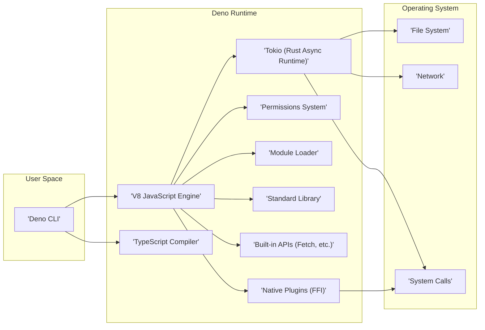
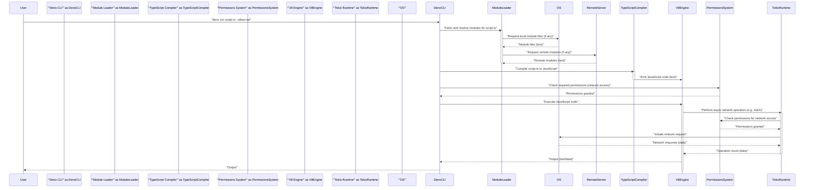

# Project Design Document: Deno Runtime Environment

**Version:** 1.1
**Date:** October 26, 2023
**Author:** AI Software Architect

## 1. Introduction

This document provides an enhanced and detailed design overview of the Deno runtime environment, as represented by the project hosted at [https://github.com/denoland/deno](https://github.com/denoland/deno). This document aims to provide a comprehensive understanding of Deno's architecture, components, and key functionalities, with a specific focus on aspects relevant to threat modeling. It will serve as a robust foundation for subsequent threat modeling activities.

## 2. Goals and Objectives

The primary goals of the Deno project, as reflected in its design, are:

*   **Security by Default:**  To create a secure runtime environment where code execution is inherently restricted, requiring explicit permission grants for access to sensitive resources. This minimizes the attack surface for untrusted code.
*   **Browser Compatibility:** To align closely with web standards and provide familiar APIs, enabling developers to reuse knowledge and potentially share code between browser and server-side environments.
*   **Developer Experience:** To offer a streamlined and modern development experience, incorporating built-in tooling for tasks like formatting, linting, and testing, reducing the need for external dependencies.
*   **TypeScript Support:** To provide first-class, seamless support for TypeScript, enhancing code maintainability and developer productivity.
*   **Decentralized Modules:** To enable direct importing of modules from URLs, fostering a more open and flexible ecosystem while addressing challenges related to centralized package registries.
*   **Single Executable:** To distribute Deno as a single, self-contained executable, simplifying installation and deployment across different platforms.

## 3. High-Level Architecture

Deno's architecture is designed with a clear separation of concerns, promoting modularity and maintainability. The following diagram illustrates the key components and their interactions:

**Key Components:**

*   **Deno CLI:** The primary interface for users to interact with the Deno runtime. It handles command parsing, script execution, and various development-related tasks.
*   **V8 JavaScript Engine:** The core execution environment for JavaScript and TypeScript code. It provides just-in-time compilation and manages the execution context.
*   **Tokio (Rust Async Runtime):**  The foundation for Deno's non-blocking I/O operations. It manages asynchronous tasks, network connections, and file system interactions.
*   **TypeScript Compiler:** Integrated directly into Deno, enabling the runtime to compile and execute TypeScript code without requiring a separate build step.
*   **Permissions System:** A crucial security component that controls access to sensitive system resources. It acts as a gatekeeper, enforcing restrictions based on user-provided flags.
*   **Module Loader:** Responsible for fetching, caching, resolving, and managing module dependencies, whether they are local files or remote URLs.
*   **Standard Library:** A collection of curated, high-quality modules providing common functionalities, aiming to reduce reliance on external, potentially untrusted dependencies.
*   **Built-in APIs:** Implementations of web-standard APIs, such as `fetch`, `WebSocket`, and `Web Storage`, providing a familiar development environment and enhancing browser compatibility.
*   **Native Plugins (FFI):**  A mechanism allowing Deno code to interact with native libraries written in languages like C or Rust, providing access to system-level functionalities.

## 4. Component Details

This section provides a more in-depth look at the key components, outlining their functionalities and security considerations.

### 4.1. Deno CLI

*   **Functionality:**
    *   **Script Execution:**  Initiates the execution of Deno scripts (`deno run`).
    *   **Dependency Management:**  Handles caching and information retrieval for dependencies (`deno cache`, `deno info`).
    *   **Code Formatting and Linting:** Provides built-in tools for code style enforcement and static analysis (`deno fmt`, `deno lint`).
    *   **Bundling:**  Packages Deno applications into single executable files (`deno bundle`).
    *   **Testing:**  Executes unit tests within the Deno environment (`deno test`).
    *   **Documentation Generation:** Creates API documentation from code comments (`deno doc`).
    *   **REPL:** Offers an interactive environment for evaluating Deno code (`deno`).
*   **Security Considerations:**
    *   **Command Injection:**  The CLI must be designed to prevent the injection of malicious commands through user-supplied input or arguments.
    *   **Path Traversal:**  Care must be taken to prevent path traversal vulnerabilities when handling file paths provided to CLI commands.
    *   **Configuration Security:**  If configuration files are used, they should be parsed securely to avoid manipulation.

### 4.2. V8 JavaScript Engine

*   **Functionality:**
    *   **Code Execution:** Parses, compiles (using just-in-time compilation), and executes JavaScript and TypeScript code.
    *   **Memory Management:**  Handles memory allocation and garbage collection for the JavaScript heap.
    *   **API Exposure:** Provides the underlying APIs that Deno uses to interact with the runtime environment.
    *   **Isolate Management:**  Deno utilizes V8 isolates to provide sandboxing and isolation between different contexts.
*   **Security Considerations:**
    *   **V8 Vulnerabilities:** Deno's security is heavily reliant on the security of the V8 engine. Staying up-to-date with V8 releases and security patches is critical.
    *   **Sandbox Escapes:**  Any vulnerabilities that allow escaping the V8 sandbox would have severe security implications for Deno.
    *   **Resource Exhaustion:**  Malicious code could potentially exploit V8 to consume excessive resources, leading to denial-of-service.

### 4.3. Tokio (Rust Async Runtime)

*   **Functionality:**
    *   **Asynchronous I/O:** Provides an event loop and abstractions for performing non-blocking I/O operations, crucial for Deno's performance.
    *   **Networking:**  Manages network connections, including TCP and UDP sockets.
    *   **File System Operations:**  Provides asynchronous APIs for interacting with the file system.
    *   **Timers and Signals:**  Offers mechanisms for scheduling tasks and handling system signals.
*   **Security Considerations:**
    *   **Tokio Vulnerabilities:**  Similar to V8, vulnerabilities in Tokio could impact Deno's core functionalities.
    *   **Resource Management:**  Improper handling of resources within Tokio could lead to leaks or denial-of-service.
    *   **Concurrency Issues:**  Bugs in Tokio's concurrency primitives could lead to race conditions or other unexpected behavior.

### 4.4. TypeScript Compiler

*   **Functionality:**
    *   **Type Checking:**  Performs static analysis of TypeScript code to identify type errors.
    *   **Code Transformation:**  Converts TypeScript code into JavaScript that can be executed by V8.
    *   **Language Service:** Provides features like autocompletion and code navigation for developers.
*   **Security Considerations:**
    *   **Compiler Bugs:**  Vulnerabilities in the TypeScript compiler could potentially be exploited through specially crafted TypeScript code.
    *   **Type System Exploits:**  While less common, theoretical vulnerabilities could exist in the type system itself.

### 4.5. Permissions System

*   **Functionality:**
    *   **Permission Granting:**  Allows users to explicitly grant specific permissions to Deno scripts via command-line flags (e.g., `--allow-net`, `--allow-read`).
    *   **Permission Enforcement:**  Intercepts attempts to access protected resources and checks if the necessary permission has been granted.
    *   **Granular Control:** Offers fine-grained control over access to different types of resources (network, file system, environment variables, etc.).
*   **Security Considerations:**
    *   **Bypass Vulnerabilities:**  Any flaws in the permission checking logic could allow malicious code to bypass restrictions.
    *   **Permission Scope:**  Ensuring that permissions are applied correctly and do not grant broader access than intended is crucial.
    *   **Default Deny:**  The "secure by default" principle relies on the permission system to deny access unless explicitly allowed.

### 4.6. Module Loader

*   **Functionality:**
    *   **Module Resolution:**  Determines the location of imported modules based on specifiers (URLs or file paths).
    *   **Fetching:**  Downloads remote modules from specified URLs.
    *   **Caching:**  Stores downloaded modules locally to improve performance and reduce network traffic.
    *   **Integrity Checking:**  Can verify the integrity of downloaded modules using lockfiles or other mechanisms.
*   **Security Considerations:**
    *   **Dependency Confusion Attacks:**  Preventing the substitution of legitimate dependencies with malicious ones.
    *   **Supply Chain Security:**  Mitigating the risk of using compromised or malicious modules hosted on remote servers.
    *   **Code Injection during Loading:**  Ensuring that the module loading process itself does not introduce vulnerabilities.
    *   **Cache Poisoning:**  Protecting the module cache from being corrupted with malicious code.

### 4.7. Standard Library

*   **Functionality:** Provides a set of core modules for common tasks, such as file system operations, HTTP handling, and data manipulation.
*   **Security Considerations:**
    *   **Vulnerabilities in Standard Modules:**  Bugs or security flaws in standard library modules could be exploited by applications using them.
    *   **Maintenance and Updates:**  Ensuring that standard library modules are actively maintained and updated to address security issues.

### 4.8. Built-in APIs

*   **Functionality:** Implements web-standard APIs, allowing developers to write code that is portable between browser and Deno environments. Examples include `fetch`, `WebSocket`, `TextEncoder`, and `TextDecoder`.
*   **Security Considerations:**
    *   **Implementation Vulnerabilities:**  Bugs in the implementation of these APIs could introduce security flaws.
    *   **Web API Security Best Practices:**  Adhering to security best practices for web APIs is crucial to prevent common web vulnerabilities.

### 4.9. Native Plugins (FFI)

*   **Functionality:** Enables Deno code to call functions in dynamically linked libraries (`.dll`, `.so`, `.dylib`). This allows interaction with system-level functionalities or libraries written in other languages.
*   **Security Considerations:**
    *   **Increased Attack Surface:**  Native plugins bypass Deno's sandboxing and introduce significant security risks.
    *   **Memory Safety Issues:**  Interacting with native code can introduce memory safety vulnerabilities if not handled carefully.
    *   **Permission Requirements:**  The `--allow-plugin` permission is required to use native plugins, highlighting the inherent risk.

## 5. Data Flow

A typical Deno application execution flow involves the following steps, highlighting the movement and transformation of data:

1. **User Input:** The user provides input to the Deno CLI, typically a command like `deno run <script_url_or_path>`. This input includes the script to be executed and potentially permission flags.
2. **CLI Processing:** The Deno CLI parses the command and identifies the script to be executed.
3. **Module Resolution and Fetching:** The Module Loader resolves the dependencies of the script. If remote modules are involved, network requests are made to fetch the module code. The fetched code is typically text-based (JavaScript or TypeScript).
4. **Compilation (TypeScript):** If the script is TypeScript, the TypeScript Compiler parses and type-checks the code, transforming it into JavaScript. The output is JavaScript code.
5. **Permission Checks:** Before executing code that interacts with protected resources, the Permissions System checks if the necessary permissions have been granted based on the flags provided during CLI invocation.
6. **V8 Execution:** The V8 engine executes the JavaScript code. This involves interpreting and compiling the code into machine code.
7. **API Interactions:** The executed code interacts with the Deno runtime through built-in APIs or the standard library. These interactions often involve data exchange, such as reading files (returning file contents), making network requests (sending and receiving data), or accessing environment variables (returning string values).
8. **Native Plugin Calls (if applicable):** If the code uses native plugins, data is marshaled between the V8 environment and the native library. This can involve various data types depending on the plugin's API.
9. **Output:** The script produces output, which can be text, binary data, or other formats, directed to the console or other output streams.

## 6. Security Considerations

This section expands on the initial security considerations, providing more specific examples of potential threats and vulnerabilities.

*   **Permission Model Weaknesses:**
    *   **Time-of-Check Time-of-Use (TOCTOU) vulnerabilities:**  A permission check might pass, but the state of the system could change before the resource is actually accessed.
    *   **Permission Escalation:**  Exploiting vulnerabilities to gain more permissions than initially granted.
    *   **Confused Deputy Problem:**  A privileged Deno process might be tricked into performing actions on behalf of an unprivileged caller.
*   **Module Integrity Compromises:**
    *   **Typosquatting:**  Attackers registering module names similar to popular ones to trick users into downloading malicious code.
    *   **Left-Pad Attacks:**  Attackers unpublishing or compromising widely used modules, breaking dependent applications.
    *   **Malicious Code Injection:**  Attackers injecting malicious code into legitimate modules through compromised developer accounts or build pipelines.
*   **V8 Security Vulnerabilities:**
    *   **Remote Code Execution (RCE):**  Exploiting vulnerabilities in V8 to execute arbitrary code on the host system.
    *   **Sandbox Escapes:**  Bypassing V8's security sandbox to gain access to the underlying operating system.
    *   **Memory Corruption:**  Exploiting memory management issues in V8 to cause crashes or potentially execute arbitrary code.
*   **Native Plugin Risks:**
    *   **Memory Leaks and Corruption:**  Native plugins written in languages like C/C++ are susceptible to memory management errors.
    *   **Direct System Access:**  Plugins can bypass Deno's security measures and directly interact with the operating system, potentially performing malicious actions.
    *   **Unsafe Libraries:**  Using vulnerable or outdated native libraries within plugins.
*   **Standard Library Vulnerabilities:**
    *   **Cross-Site Scripting (XSS) in HTTP handling modules:**  If the standard library includes HTTP server functionalities, it could be vulnerable to XSS attacks.
    *   **Path Traversal in file system modules:**  Vulnerabilities allowing access to files outside the intended scope.
    *   **Denial-of-Service vulnerabilities:**  Bugs that could allow attackers to crash or overload the application.
*   **Denial of Service Attacks:**
    *   **Resource Exhaustion:**  Exploiting Deno's features to consume excessive CPU, memory, or network resources.
    *   **Asynchronous Bomb:**  Creating a large number of pending asynchronous operations to overwhelm the runtime.
*   **Code Injection Vulnerabilities:**
    *   **Improper input sanitization:**  Failing to sanitize user input before using it in commands or API calls.
    *   **Template injection:**  Exploiting vulnerabilities in template engines to execute arbitrary code.

## 7. Deployment Considerations

The deployment environment significantly impacts the security posture of Deno applications.

*   **Standalone Executables:**
    *   **Protection against tampering:**  Ensuring the integrity of the bundled executable.
    *   **Permissions at runtime:**  How permissions are managed when the application is deployed as a standalone executable.
*   **Serverless Platforms:**
    *   **Platform security:**  Reliance on the security of the serverless platform provider.
    *   **Isolation:**  Ensuring proper isolation between different Deno instances running on the platform.
    *   **Secrets management:**  Securely managing API keys and other sensitive information.
*   **Web Servers:**
    *   **Web application security best practices:**  Implementing standard security measures for web applications (e.g., input validation, output encoding, protection against common web attacks).
    *   **TLS configuration:**  Properly configuring TLS for secure communication.
*   **Containerized Environments:**
    *   **Container image security:**  Ensuring the base image and dependencies are secure.
    *   **Container runtime security:**  Utilizing secure container runtime configurations.
    *   **Network policies:**  Implementing network policies to restrict communication between containers.

## 8. Future Considerations

Future developments in Deno could introduce new security challenges and require adjustments to the design.

*   **WebAssembly System Interface (WASI) Integration:**  While offering potential benefits, WASI could introduce new attack vectors related to interacting with the underlying operating system.
*   **Improved Plugin System:**  Efforts to create a safer plugin system will require careful design to balance functionality with security.
*   **Enhanced Security Features:**  Continuous improvements to the permission system and the introduction of new security mechanisms will be crucial for maintaining a secure runtime environment.
*   **Standardization Efforts:**  As Deno evolves, alignment with web standards and security best practices will remain important.

This enhanced design document provides a more detailed and comprehensive overview of the Deno runtime environment, specifically tailored for threat modeling activities. It highlights key components, data flows, and potential security considerations, serving as a valuable resource for identifying and mitigating potential vulnerabilities.